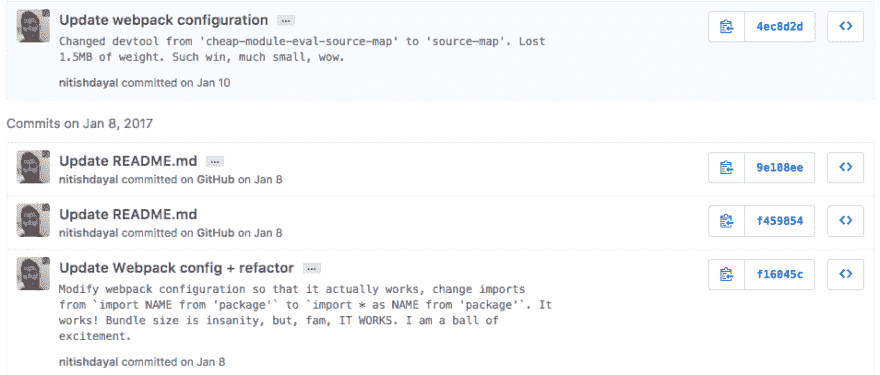

# 学习 Webpack 的阶段

> 原文：<https://dev.to/nitishdayal/stages-of-learning-webpack>

*免责声明*:本帖不提供任何有价值的信息。这主要是为了好玩，分享奋斗和‘啊哈！’我们中的一些人可能共同经历过的时刻。

* * *

这篇文章的目的:

1.  Webpack 值得学习。它比一个模块捆绑器要多得多。

2.  几个月前，我在这里写了一篇文章，讲述了我第一次配置 TypeScript + React 和 Webpack 的经历。这种配置显然很糟糕。糟糕到我决定删除那个帖子，因为我发布了很多错误的信息(而且我看起来真的很傻，ðÿðÿ)。从那以后，我对 Webpack 有了更多的了解，我想在这篇文章中再尝试一下。最好是，做得正确。但首先，我想分享一下我学习 Webpack 的经验总结(因为轻松幽默和谦逊是好东西)。

* * *

**学习 Webpack 的阶段***(1-4 月)*:

1.  我写(复制/粘贴)了我的第一个配置。我不知道我到底在做什么，但是根据推特上的消息，我需要一个网络包。我运行 Webpack，最后得到了一个 2MB 的“Hello World”包，现在这个包出现了错误信息，我敢肯定这些错误信息是用某种外星语言写的。困惑，我开始改变事情，仍然不知道我到底在做什么。仅仅...惊慌失措，试图找出为什么这个本该让我的应用程序变小的东西却让它变大了 500 倍。*我是怎么把这个弄坏的这么严重的？我整晚都在埋头苦干。*

2.  啊哈！我做了一件事！我的应用程序正在运行，而且小了很多！200kb？！Daaaaaaaaang boi！我火了！我仍然不知道到底发生了什么，但我非常兴奋，我决定把它变成一个[的开始/样板](https://github.com/nitishdayal/react_from_scratch)，并写一篇关于它的博客。已经两个月了。*不管出于什么原因，没有人费心让我知道...嘿，你做错了，它应该**比**小。我一直在埋头工作。
    *

3.  我现在对自己到底在做什么有了一个基本的概念。Webpack 是个东西。它接受一个带有键/值的对象。它使用键/值来检查我的应用程序，并根据提供的键/值，创建我的应用程序的捆绑版本。它可能很大；它可能很小。重点是捆绑了。之后的事情由我决定。“我的召唤”已经从*随意改变事物和希望最好的*到*医生>找到事物>安装事物，如果必要的话>使用事物*。显然这个对象实际上可以是一个函数，*返回*一个对象？随便啦。尴尬的是，我曾经写过/发表过那篇原创文章，我找到了它，并立即删除了它。我想重做，我想把它做好。我继续往前走。

4.  Webpack docs 和我关系很好。我知道去哪里找到我需要的，但我已经打破/重新制作这些配置这么多月了，在这一点上，文档是一个后备。Webpack 是官方的 homie。我大概可以在短时间内为开发/生产/暂存设置一个具有单独 webpack 配置的开发环境。我对何时/为什么使用什么加载器和插件有自己的看法。我曾经讨论过单独的 webpack 配置文件和单一的 web pack 配置文件；通常以任何一方“翻白眼”和“同意不同意”结束的谈话。*意见，对吧？*我是专业的吗？绝不可能。我对这个工具、它试图解决的问题、我可能从中获得的好处以及为什么我**显然需要**这个东西有一个大致的了解吗？绝对的。

明天我会再发一篇帖子，详细内容如下:

*   什么是 Webpack？我真的需要它吗？(剧透:可能不会，但你可能会从中受益)
*   自从上一篇文章以来，我对[样板文件](https://github.com/nitishdayal/react_from_scratch)所做的改动，为什么
*   浏览文档的建议和提示
*   我遇到的一些更典型的前端开发设置的模板

如果您看到样板配置有改进的机会，请联系我/提交一份 PR。感谢阅读！✌ðŸ

编辑:[第二部](https://dev.to/nitishdayal/stages-of-learning-webpack-pt-2---the-config)到了！