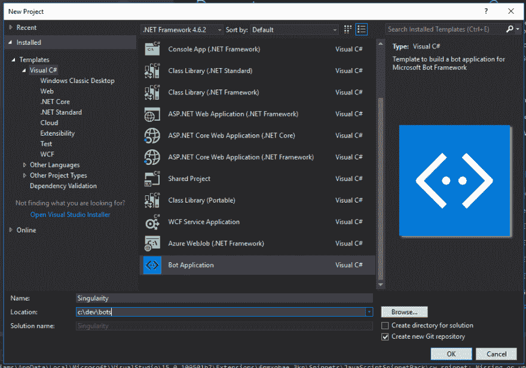
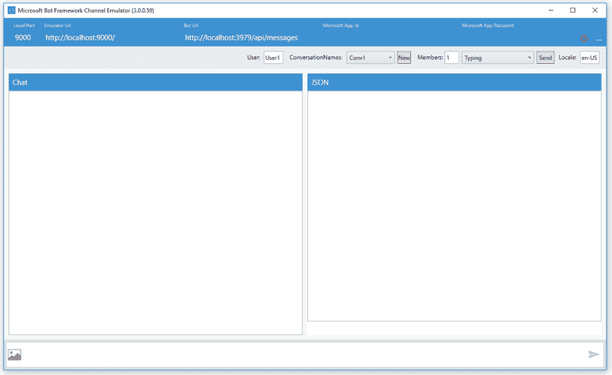
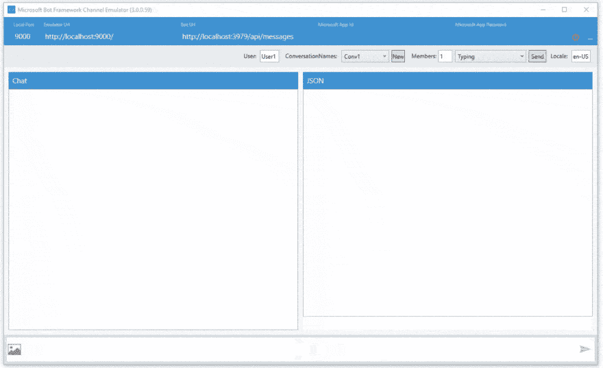
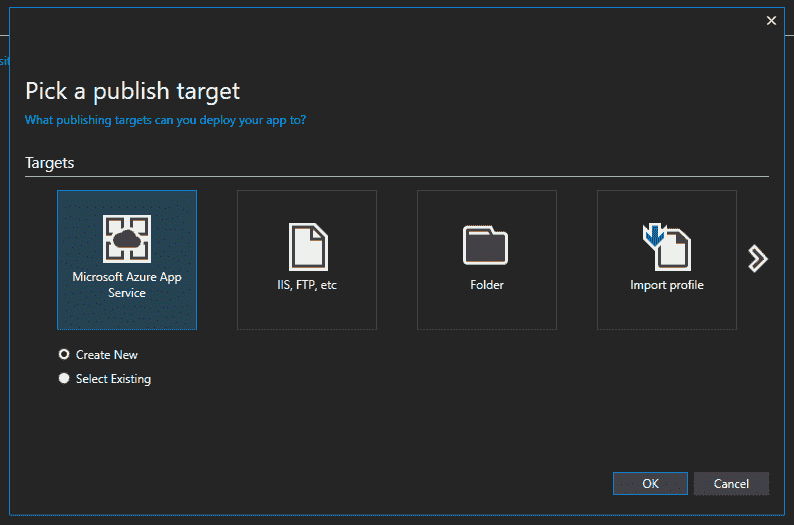
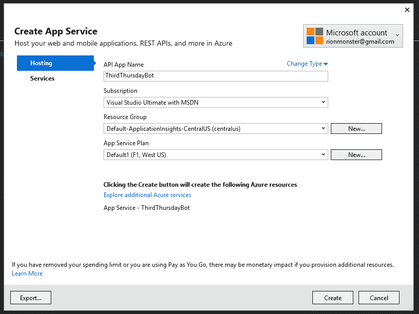
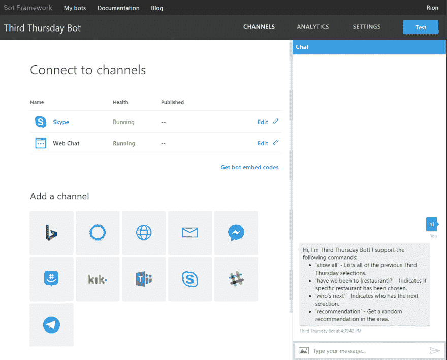
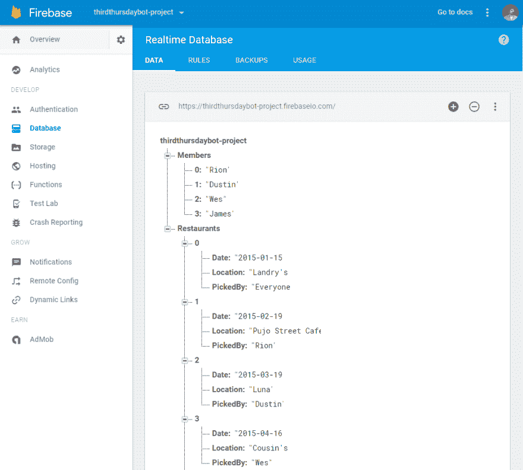
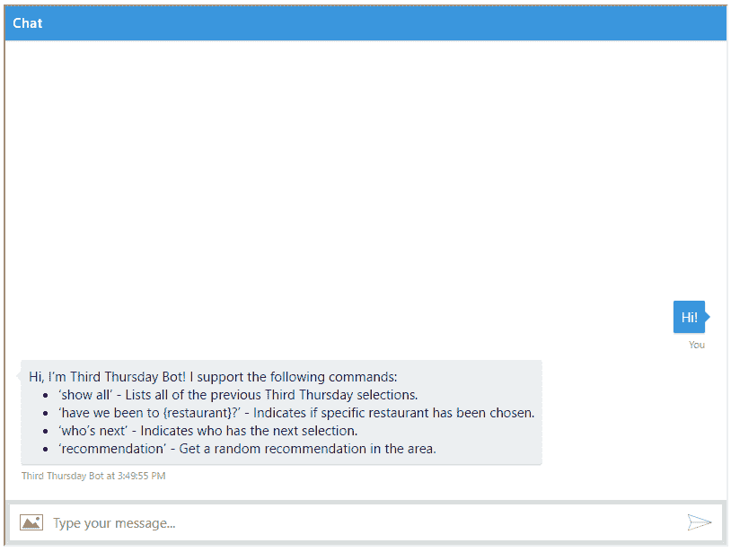
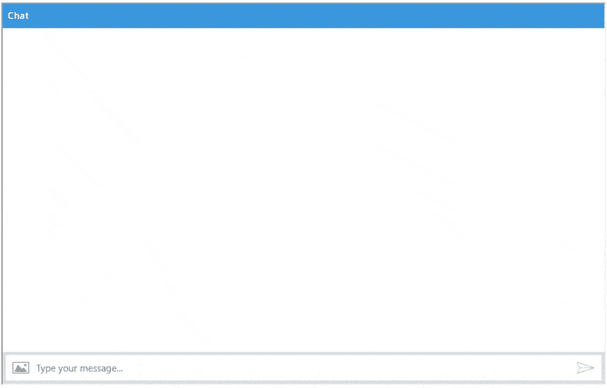

# 微软机器人框架如何改变我和我的朋友吃饭的地方:第 1 部分

> 原文:[https://dev . to/rion monster/how-the-Microsoft-bot-framework-changed-where-my-friends-and-I-eat-part-1](https://dev.to/rionmonster/how-the-microsoft-bot-framework-changed-where-my-friends-and-i-eat-part-1)

*这篇文章最初发表在[我的博客](http://rion.io)上。*

如今，机器人无处不在，我们无时无刻不在与它们互动。从我们的手机互动、聊天室、GitHub 讨论和 Slack 频道来看，这些家伙无处不在，而且似乎不会很快去任何地方。

在意识到这一点后，我很快意识到一个简单的用例，我可以使用一个机器人来帮助我解决我面临的现实世界的问题。这篇文章将涵盖这一冒险，并详细介绍微软机器人框架如何帮助我找出我应该去哪里和我的朋友吃饭。

## 机器人入门

我不完全确定从哪里开始构建机器人，所以我开始与 Slack 上的[保罗·希尔](https://twitter.com/prjseal)交谈，他最近[刚刚为他正在创建的一个简单的刽子手游戏](http://www.codeshare.co.uk/blog/how-to-create-a-hangman-chat-bot-game-in-nodejs-using-microsoft-bot-framework/)构建了一个机器人，他让我去[微软机器人框架](https://dev.botframework.com/)网站。

该网站本身有[神奇的文档](https://docs.microsoft.com/en-us/bot-framework/)用于构建机器人。NET、Node.js 和其他一些技术，所以根据您的喜好，您可以按照您选择的教程进行操作。因为我主要是一个. NET 的家伙，这篇文章将会更多地涉及这方面，但是我假设节点方法也一样简单。

要准备好您的环境，您需要安装以下软件:

*   **[Visual Studio 2017](https://www.visualstudio.com/downloads/)**——既然我们要用 C#和。NET，Visual Studio 将是一条出路。
*   **[机器人应用程序模板](http://aka.ms/bf-bc-vstemplate)**——这提供了构建机器人的基本模板/起点。
*   这个应用程序将允许你在一个虚拟的聊天环境中本地调试/测试你的机器人。

安装 Visual Studio 后，您需要获取 Bot 应用程序模板，并将其放在计算机上的以下目录中:

```
%USERPROFILE%\Documents\Visual Studio 2017\Templates\ProjectTemplates\Visual C#\ 
```

完成后，您应该会看到在 Visual Studio 中创建新的 Bot 应用程序的可用选项:

[T2】](https://res.cloudinary.com/practicaldev/image/fetch/s--MMILVBKQ--/c_limit%2Cf_auto%2Cfl_progressive%2Cq_auto%2Cw_880/https://thepracticaldev.s3.amazonaws.com/i/f4f89ci85txrrw0sr8mw.PNG)

生成的项目模板应该非常类似于 MVC / Web API 风格的项目，只有一个控制器来处理消息和其他一些区域。此外，这个默认模板已经包含了一些基本功能，可以帮助您找到正确的方向。

## 初次接触

在恢复必要的 NuGet 包之后，您应该准备好运行项目，并与您的 bot 进行第一次交互。启动后，您应该会看到以下页面，表明您的 bot 正在运行并监听特定端口:

[T2】](https://res.cloudinary.com/practicaldev/image/fetch/s--48q1KOl1--/c_limit%2Cf_auto%2Cfl_progressive%2Cq_auto%2Cw_880/https://thepracticaldev.s3.amazonaws.com/i/4rz31ypwf9utu2plyfzn.PNG)

这个页面没有太多的事情要做，所以你需要启动之前下载的机器人框架模拟器。一旦它启动并运行，你需要**设置 Bot Url 来匹配你的应用程序运行的当前端口(例如`http://localhost:{your-port}/api/messages`)，如下图**:

[T2】](https://res.cloudinary.com/practicaldev/image/fetch/s--s7T-uE6w--/c_limit%2Cf_auto%2Cfl_progressive%2Cq_auto%2Cw_880/https://thepracticaldev.s3.amazonaws.com/i/fm5fp8arkjgy7ac18qat.PNG)

默认的项目非常简单，它将简单地计算消息中的字符数，并将消息和计数一起返回。您可以通过查看来自`MessagesController`的`Post()`方法来了解这一点:

```
/// <summary>
/// POST: api/Messages
/// Receive a message from a user and reply to it
/// </summary>
public async Task<HttpResponseMessage> Post([FromBody]Activity activity)
{
    if (activity.Type == ActivityTypes.Message)
    {
        await Conversation.SendAsync(activity, () => new Dialogs.RootDialog());
    }
    else
    {
        HandleSystemMessage(activity);
    }
    var response = Request.CreateResponse(HttpStatusCode.OK);
    return response;
} 
```

如您所见，当控制器接收到消息时，它实际上会将该活动传递给另一个类，该类异步处理消息:

```
[Serializable]
public class RootDialog : IDialog<object>
{
    public Task StartAsync(IDialogContext context)
    {
        context.Wait(MessageReceivedAsync);

        return Task.CompletedTask;
    }

    private async Task MessageReceivedAsync(IDialogContext context, IAwaitable<object> result)
    {
        var activity = await result as Activity;

        // calculate something for us to return
        int length = (activity.Text ?? string.Empty).Length;

        // return our reply to the user
        await context.PostAsync($"You sent {activity.Text} which was {length} characters");

        context.Wait(MessageReceivedAsync);
    }
} 
```

澄清一下，当你发送信息时，会发生以下情况:

*   消息由`MessagesController`中的`Post()`方法接收。
*   消息的内容(即活动)作为上下文传递给`RootDialog`。
*   该对话框使用上下文处理消息，并在完成后返回一个任务。
*   然后，这个结果通过`Conversation.SendAsync()`方法传回给用户。

根据您的场景(例如，定义一个特定的对话框或对话框链),这个*可能会大大简化或复杂，但我们现在将把它留在这里。因此，让我们向机器人发送一条消息，以确保它按预期工作:*

[T2】](https://res.cloudinary.com/practicaldev/image/fetch/s--xHaAhwa9--/c_limit%2Cf_auto%2Cfl_progressive%2Cq_66%2Cw_880/https://thepracticaldev.s3.amazonaws.com/i/9emge6wls5ylqox86r7h.gif)

如你所见，一切似乎都如你所料。

> 我们所做的就是>问机器人“最终问题的答案是什么”,它的回答显然是“42”。没什么奇怪的，这里没有奇点，没有异常。

让我们继续把这个东西放在野外，因为像这样的智能实体可以被公众访问会带来什么伤害。

## 部署机器人(又名进入天网)

为了避免任何天网式的问题，我们需要在微软机器人框架中正确注册机器人，以便他们可以监控它，并确保它不会接管世界。

为此，请按照下列步骤操作:

1.  **在[微软机器人框架网站](https://dev.botframework.com)** 上注册，以设置您的帐户并获得使用框架/工具所需的 API 密钥。
2.  **访问“我的机器人”选项卡并注册您的机器人** -在这里您将实际注册您的机器人并提供任何详细信息，如它将托管在哪里、描述等。

在这个过程中，你会得到两个键:`MicrosoftAppId`和`MicrosoftAppPassword`，这两个键都很重要，需要在运行时被你的 bot 访问，这样你就可以在你的托管环境中把它们配置成一个环境变量，或者简单地把它们包含在一个`web.config`文件中，如下所示:

```
<appSettings>
    <add key="BotId" value="ThirdThursdayBot" />
    <add key="MicrosoftAppId" value="foo" />
    <add key="MicrosoftAppPassword" value="bar" />
</appSettings> 
```

接下来，您需要将现有的 bot 发布到您的目标位置。在本例中，我们将托管在一个免费的 Azure 网站上，因此您可以在 Visual Studio 中选择**发布>创建新配置文件(如有必要)> Microsoft Azure 应用服务**:

[T2】](https://res.cloudinary.com/practicaldev/image/fetch/s--W-Hhv-CH--/c_limit%2Cf_auto%2Cfl_progressive%2Cq_auto%2Cw_880/https://thepracticaldev.s3.amazonaws.com/i/gwa6j4iq95kfskytaq5a.PNG)

从那里，您可以配置您的资源并分配您希望您的 bot 托管在的 URL(例如`https://{your-api-app-name}.azurewebsites.net`):

[T2】](https://res.cloudinary.com/practicaldev/image/fetch/s--cyV-fFk_--/c_limit%2Cf_auto%2Cfl_progressive%2Cq_auto%2Cw_880/https://thepracticaldev.s3.amazonaws.com/i/x4lq24cv3xnxhpj2vu4w.PNG)

成功创建后，你应该可以点击发布，你的机器人将被释放到野外。

> **注意:**在 Microsoft bot 框架上注册您的 Bot 时，您需要分配一个消息传递端点，之前您可能将它留空了。如果是这种情况，您将希望返回并确保使用如下所示的`https://{your-api-app-name}.azurewebsites.net/api/messages`格式将其设置为您的 bot 现在所在的 URL:

[T2】](https://res.cloudinary.com/practicaldev/image/fetch/s--YvG47ulo--/c_limit%2Cf_auto%2Cfl_progressive%2Cq_auto%2Cw_880/https://thepracticaldev.s3.amazonaws.com/i/6g5pz5d75e9q66emqv44.PNG)

这应该完成了注册过程，这将允许您现在使用框架门户与您的 bot 进行交互:

[T2】](https://res.cloudinary.com/practicaldev/image/fetch/s--aOFIc1OD--/c_limit%2Cf_auto%2Cfl_progressive%2Cq_auto%2Cw_880/https://thepracticaldev.s3.amazonaws.com/i/7912g9rq5f47e2y3z9gy.PNG)

我们稍后将访问这一部分来解决一些问题，比如设置其他访问通道来与 bot 交互。

## 问题:处理第三个星期四

现在我对这个机器人的整个推理围绕着一个事件，我和我的朋友们已经做了几年了，我们称之为“第三个星期四”。第三个星期四是每月一次的聚会，正如你可能期望的那样，在每个月的第三个星期四，它的工作方式如下:

*   每个月都有不同的成员来选择我们在哪里吃饭。
*   没有餐厅可以重复(直到当地所有区域都用完)。
*   餐厅*必须*供应酒类(显然还有食物)。

相当简单，对吗？嗯，在做了两年多之后，可能很难记住我们以前在哪里吃过，这个月是谁的选择，第二天是什么时候，所以我想我可以建立一个机器人来为我们处理这个问题。

所以我对机器人的目标如下:

*   **琐碎的设置** -由于这是一个小项目，我不想在基础设施或扩展问题上投入大量时间/精力。
*   基本的问题/回答支持——虽然 Azure 有相当多令人难以置信的认知服务功能，但我只是想让这个机器人显示一个命令列表，用户可以输入并接收快速响应。
*   Web / Skype / Text 支持 -我希望我的朋友和这个群组的成员能够在任何地方方便地访问这个机器人。在电脑上，查看某个网站，在手机上，给它发短信，等等。

这些看起来都很可行，所以让我们深入研究每一个。

## 设置第三个星期四机器人

最初，我有两个问题需要解决，一个比另一个更重要:

*   **托管** -机器人实际上需要*住在某个地方*。
*   持续 -机器人需要知道(并记住)群体成员所做的事情。

由于这是一个附带项目，我的主要任务是**完成**。

我认为一个免费的 Azure 网站是快速部署并发布这个机器人的简单方法。事实上，它是免费的，这显然很有吸引力，而且能够设置我所有的环境配置也很不错。关于持久性，我选择了谷歌的 [Firebase](https://firebase.google.com/) 平台，这是一个非常基本的免费数据库，你可以使用，它公开了一个 API，使数据访问变得轻而易举。

设置 Firebase 非常简单，只需要一个谷歌账户。您只需进入，创建一个新项目，就大功告成了。Firebase 项目有各种各样的功能，比如分析、通知、文件存储、测试等等。但是在这个场景中，我们只关心一件事:数据。

在筛选了一个又一个月的银行账户账单和短信之后，我设法编制了一份清单，列出了我们在过去 28 个月里到底在哪里吃过饭，所以我需要实际着手在我的数据库中植入两样我知道我会需要的东西:

*   **成员** -我需要知道团队中*的每个人，这样我才能决定该轮到谁。*
*   最重要的是，我需要知道这个团队在哪里吃过饭，我们什么时候在一个给定的地点吃饭，是谁选择的。

我认为将成员存储为一个字符串数组就足够了(因为我真的只需要名称)，但是餐馆会有更多的属性，这可能会导致 C#类如下所示:

```
public class Restaurant
{
    public string Location { get; private set; }
    public string PickedBy { get; private set; }
    public DateTime Date { get; private set; }
} 
```

使用这些信息，我知道我可以简单地手动填充我的 Firebase 数据库的成员，并通过使用[数据转换器先生](https://shancarter.github.io/mr-data-converter/)转换我现有的 Excel 电子表格，从 JSON 导入我现有的餐馆数据。将数据导入后，我拥有了我需要的一切:

[T2】](https://res.cloudinary.com/practicaldev/image/fetch/s--LENZlIgA--/c_limit%2Cf_auto%2Cfl_progressive%2Cq_auto%2Cw_880/https://thepracticaldev.s3.amazonaws.com/i/i275mq5sewsso1bz3gzj.PNG)

太好了！现在我有了我的数据，让我们跳回机器人，开始一个对话。

## 搭讪

正如我之前提到的，在意图和文本分析方面，你可以做很多非常非常强大的事情来弄清楚用户想要说什么。但是这个项目都是关于快速和肮脏的，所以你不会在这里找到任何深入的讨论，但是你会发现:如果语句。

我希望机器人做的第一件事实际上是用它支持的命令列表来回复响应，所以在实际创建这些命令之前，我想创建一个我支持的所有消息和模板的集合，我构建了以下内容来将它们分离到一个`Messages.cs`文件中:

```
public class Messages
{
    public readonly static string DefaultResponseMessage =
        $"Hi, I'm Third Thursday Bot! I support the following commands: {Environment.NewLine}" +
        $"- 'show all' - Lists all of the previous Third Thursday selections. {Environment.NewLine}" +
        $"- 'have we been to {{restaurant}}?' - Indicates if specific restaurant has been chosen. {Environment.NewLine}" +
        $"- 'who's next' - Indicates who has the next selection. {Environment.NewLine}" +
        $"- 'recommendation' - Get a random recommendation in the area. {Environment.NewLine}";
} 
```

现在，我们可以更新`Post()`方法，通过创建另一个方法来处理将字符串格式化为机器人可使用的内容，然后返回它，从而简单地将任何未识别的响应返回给用户:

```
private async Task<ResourceResponse> ReplyWithDefaultMessageAsync(Activity activity, ConnectorClient connector)
{
    var reply = activity.CreateReply(Messages.DefaultResponseMessage);
    return await connector.Conversations.ReplyToActivityAsync(reply);
} 
```

现在，通过允许我们简单地调用`ReplyWithDefaultMessageAsync()`方法，事情变得简单了一些:

```
public async Task<HttpResponseMessage> Post([FromBody]Activity activity)
{
    var connector = new ConnectorClient(new Uri(activity.ServiceUrl));
    if (activity.Type == ActivityTypes.Message)
    {
         await ReplyWithDefaultMessageAsync(activity, connector);
    }

    return Request.CreateResponse(HttpStatusCode.OK);
} 
```

现在如果我们去告诉机器人“嗨！”，或者真的任何东西，它都会像预期的那样做出反应:

[T2】](https://res.cloudinary.com/practicaldev/image/fetch/s--BoDW8k8H--/c_limit%2Cf_auto%2Cfl_progressive%2Cq_auto%2Cw_880/https://thepracticaldev.s3.amazonaws.com/i/5bn8390s34z1z71q6zwu.PNG)

下一步将是实际开始与我们的 Firebase 数据库交互，并拉入一些数据。为此，我们将做两件事:

*   **配置 Firebase 来接受读请求**——默认情况下，只读访问只允许经过认证的用户，但是对于这个，我们想要禁用它。
*   **配置一个客户端来发出我们的 Web 请求**——这实际上只是指向我们的端点并读取 JSON 内容。

让我们从 Firebase 开始，它只需要我们在界面中的**数据库>规则**选项卡下进行配置，如下所示:

```
{
  "rules": {
    ".read": "true",
    ".write": "auth != null"
  }
} 
```

> 注意:这通常不是一个好主意，如果你打算公开发布一个你甚至有点担心的 API，考虑要求某种认证。

接下来，我们可以连接一个基本的`HttpClient`类来处理我们的请求。由于我将在 Azure 中托管它，我将把我的数据库端点存储为一个环境变量，但是出于示例目的，您可以很容易地使用硬编码的字符串。现在，我将在我的`MessagesController`构造函数中新建它:

```
public class MessagesController : ApiController
{
    private HttpClient _client;

    public MessagesController()
    {
        _client = new HttpClient()
        {
                BaseAddress = new Uri(Environment.GetEnvironmentVariable("DatabaseEndpoint"))
        };
    }

    // Omitted for brevity
} 
```

现在，我们可以通过连接一个方法来处理调用这个 API 端点和获取我们的数据，从而将所有这些放在一起。我们将开始收集到目前为止这个团队吃过的所有地方的清单。

## 我们在哪里吃过？

让我们构建一些方法，这些方法将使用指向我们基本端点的客户机，并提取我们已经定义的餐馆数据。我们可以将此分为三种不同的方法来构建我们的消息:一种是提取原始数据，另一种是格式化数据:

```
private async Task<string> GetPreviouslyVisitedRestaurantsMessageAsync()
{
    try
    {
         var restaurants = await GetAllVisitedRestaurantsAsync();

         var message = new StringBuilder(Messages.RestaurantListingMessage);
         foreach (var restaurant in restaurants)
         {
             message.AppendLine($"- '{restaurant.Location}' on {restaurant.Date.ToString("M/d/yyyy")} ({restaurant.PickedBy})");
         }

         return message.ToString();
    }
    catch
    {
         return Messages.DatabaseAccessIssuesMessage;
    }
}

private async Task<Restaurant[]> GetAllVisitedRestaurantsAsync()
{
    var restaurants = await _client.GetStringAsync("/Restaurants/.json");
    return JsonConvert.DeserializeObject<Restaurant[]>(restaurants);
} 
```

您会注意到附加在 URL 后面的`/{table}/.json`格式的使用。这明确地告诉 Firebase，我们希望以 JSON 的形式接收我们的响应，这将允许我们轻松地消费它并将其序列化为我们定义的早期的`Restaurant`类。

在我们定义了这些之后，我们将需要着手向机器人公开它们，以便它知道如何响应:

```
public async Task<HttpResponseMessage> Post([FromBody]Activity activity)
{
    var connector = new ConnectorClient(new Uri(activity.ServiceUrl));
    if (activity.Type == ActivityTypes.Message)
    {
        var message = activity.Text;

        // If the user mentions anything related to the list, give it to them
        if (Regex.IsMatch(message, "show|all|list all", RegexOptions.IgnoreCase))
        {
            await ReplyWithRestaurantListingAsync(activity, connector);
        }
        else
        {
            await ReplyWithDefaultMessageAsync(activity, connector);
        }
    }

    return Request.CreateResponse(HttpStatusCode.OK);
} 
```

在这一点上，我们可以重新访问机器人，我们应该能够要求它告诉我们以前在哪里吃过东西:

[T2】](https://res.cloudinary.com/practicaldev/image/fetch/s--zyeUUl8O--/c_limit%2Cf_auto%2Cfl_progressive%2Cq_66%2Cw_880/https://thepracticaldev.s3.amazonaws.com/i/q7e70328jhpsf7p1b7he.gif)

我们现在可以更进一步，让这个机器人在网上公开，这样小组成员(或任何人)都可以去和它交谈。我们将通过重新访问 Bot 框架门户并设置 Web 聊天通道来实现这一点。

## 让机器人见见大家

通过重新访问 bot 框架门户，您应该可以看到几个可用的集成渠道，它们可以用来将您的 Bot 扩展到其他平台和环境中。在这种情况下，我们将把重点放在网络聊天通道上，这将允许机器人嵌入到网页中。

从机器人框架门户内的机器人主页，**选择屏幕上出现的网络聊天频道**:

[T2】](https://res.cloudinary.com/practicaldev/image/fetch/s--aQJgXX9w--/c_limit%2Cf_auto%2Cfl_progressive%2Cq_auto%2Cw_880/https://thepracticaldev.s3.amazonaws.com/i/63r4setc09ipjiqb7vbg.PNG)

在这里，系统会提示您提供前面提到的两个键:`MicrosoftAppId`和`MicrosoftAppPassword`。输入这些内容后，您将获得一个嵌入代码，该代码可以在任何网页中使用，如下所示:

```
<iframe src='https://webchat.botframework.com/embed/ThirdThursdayBot?s=YOUR_SECRET_HERE'></iframe> 
```

现在，您可以带着这些代码在 Visual Studio 中重新访问您的解决方案。从那里，您可以考虑将机器人本身嵌入到托管的主页中(例如`default.htm`)，这样任何访问您的机器人页面的人现在都可以与它交互:

```
<h1><-- Bot Name --></h1>
<p><!-- Description --></p>
<iframe src='https://webchat.botframework.com/embed/ThirdThursdayBot?s=YOUR_SECRET_HERE'></iframe> 
```

## 试试看

> 通常情况下，机器人会被嵌入在这里，但这个网站似乎不喜欢它。

如果你想和这个机器人互动，你可以去 http://thirdthursdaybot.azurewebsites.net 访问它，看看会有什么样的结果(以及一些未来的博客帖子)。

## 即将到来

你会注意到被托管的机器人本身有一些其他的特性，这些特性在这篇文章中没有提到(但是会在后面的文章中提到)。即这些:

*   决定轮到谁。
*   回答关于餐馆的问题(例如，我们去过{x}吗？)
*   接收关于还没有去过的餐馆的推荐。
*   与 Twilio 集成以支持短信/文本

此外，我将研究开源这个项目，希望更多的人可以开始和他们的朋友一起参加第三个星期四的活动。