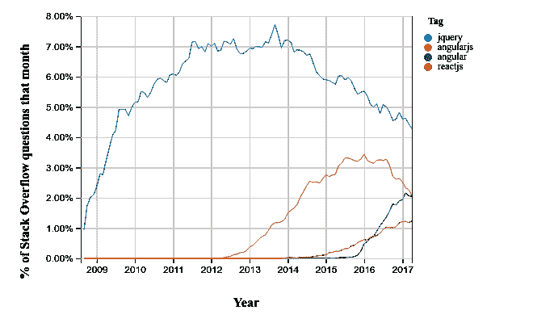
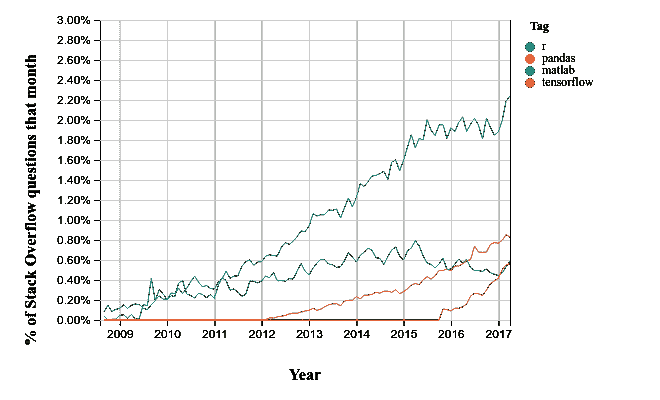
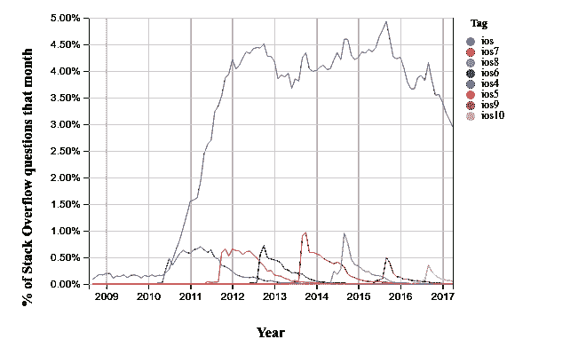

# Stack Overflow 刚刚发布了一个名为“Trends”的工具，它可以随着时间的推移跟踪编程术语的流行程度。

> 原文:[https://dev . to/walker/stack-overflow-just-released-a-tool-called-trends-that-tracks-the-popularity-of-programming-terms-overtime](https://dev.to/walker/stack-overflow-just-released-a-tool-called-trends-which-tracks-the-popularity-of-programming-terms-over-time)

如果你在 Stack Overflow 上发布了一个问题，同时又担心你所询问的库或语言是否足够流行，以至于不能得到你想要的高质量的响应，那将是一件令人沮丧的事情。而且，对广泛使用的工具提出一个问题，而且这个问题很可能会得到答案，这也可以让人放心。

现在，您可以使用[堆栈溢出趋势](https://insights.stackoverflow.com/trends)工具以图形方式捕捉这些情绪，给定一组标签，该工具将生成一个图表，显示自 2009 年以来它们的受欢迎程度。这是他们推荐的搜索之一，显示了 Javascript 框架的趋势:

[T2】](https://res.cloudinary.com/practicaldev/image/fetch/s--Ns6aRT8W--/c_limit%2Cf_auto%2Cfl_progressive%2Cq_auto%2Cw_880/https://thepracticaldev.s3.amazonaws.com/i/kne4gu5rmqxl1sqhy6o7.svg)

正如你所看到的，自 2015 年以来，Angular 和 React 越来越多地被问到堆栈溢出问题，而 jQuery 的相关性在同一时期稳步下降。

另一个预先制作的图表显示了数据科学领域技术的出现:

统计编程语言 R 在堆栈溢出方面变得更加流行，Python 包 pandas 也是如此，而 MATLAB 一直在努力避免溢出。最近，围绕机器学习库 TensorFlow 的问题升温了。

当然，提出自己的查询更有趣。这里有一个展示了自 iOS 7 以来的每一个 iOS 版本，以及一个通用的 iOS 标签:

[T2】](https://res.cloudinary.com/practicaldev/image/fetch/s--8j2weG3M--/c_limit%2Cf_auto%2Cfl_progressive%2Cq_auto%2Cw_880/https://thepracticaldev.s3.amazonaws.com/i/6pjtrbvilnr2ju91nbf8.svg)

每一次迭代在秋季发布时都有一个个人高峰，只有在下一个日历年才会被取代。同时，一般 iOS 标签相对稳定。

关注新兴技术是开发人员的一个重要部分，不管你用什么语言工作。这也是一个值得思考的问题，为什么某些工具会衰落，而其他工具会取而代之。所以，试试堆栈溢出趋势工具，让我们知道你能挖掘出什么——我肯定有值得写博客的发现！