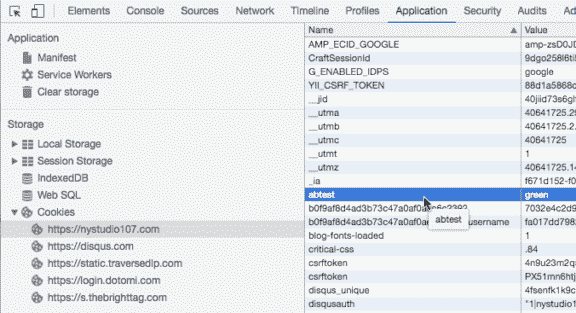
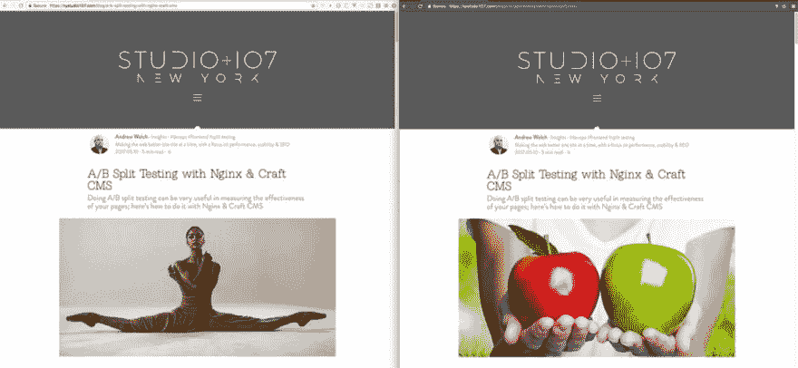
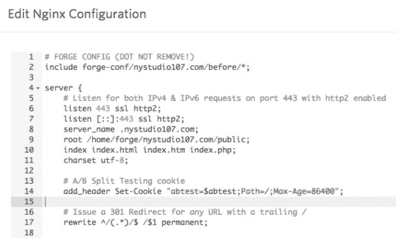
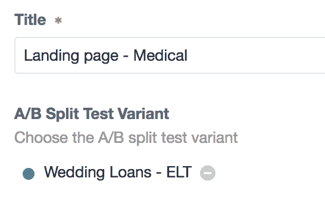
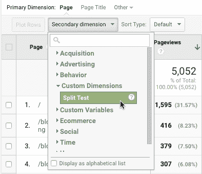

# 使用 Nginx & Craft CMS 进行 A/B 分割测试

> 原文:[https://dev . to/gaijinity/a-b-split-testing-with-nginx-craft-CMS-429 o](https://dev.to/gaijinity/a-b-split-testing-with-nginx-craft-cms-429o)

# 使用 Nginx & Craft CMS 进行 A/B 分割测试

### 做 A/B 分割测试对衡量你的网页的有效性非常有用；以下是如何用 Nginx & Craft CMS 实现的

安德鲁·韦尔奇

[T2】](https://res.cloudinary.com/practicaldev/image/fetch/s--El8xlJEz--/c_limit%2Cf_auto%2Cfl_progressive%2Cq_auto%2Cw_880/https://nystudio107-ems2qegf7x6qiqq.netdna-ssl.com/img/blog/_1200x675_crop_center-center_82_line/ab-split-testing-first-image.jpg)

如今做 A/B 分割测试非常流行。它允许你向用户呈现一个单独的页面，但是改变内容，使组`A`看到一些与组`B`不同的东西。

然后你可以确定哪个变量有更高的信念或目标实现，并从那里取得进展。

所以这是一件非常有用的事情，一个完整的行业已经围绕着它兴起，有各种各样的服务，例如 [Opti mize ly](https://www.optimizely.com/) (还有几十种其他的服务)旨在让你更容易地进行这种 A/B 测试。

他们做他们声称的；唯一的问题是，他们通常通过在`<head>`中注入一些 JavaScript 来工作，然后根据 A/B 分割测试重写用户看到的内容。

<aside>Why is this a prob­lem? Per­for­mance and UX.</aside>

显而易见，在网页加载完毕并且 JavaScript 执行完毕之前，JavaScript 无法完成它的任务并传递 A/B 内容。这会导致非 per for mant 页面，并在加载页面时出现 UX 毛刺，然后 A/B 内容被换入。

另外，它们要花钱。

根据文章[一个公正的网站是不够的](https://dev.to/gaijinity/a-pretty-website-isn-8217-t-enough-1nbj-temp-slug-3932740)我们已经煞费苦心地为 mant 网站打造了一个平台，现在我们不会搞砸了。

另外，就像 Google Tag Man ag er“Tags”一样，我们不希望测试的技术实现影响结果！如果我们的页面加载比正常情况慢，或者有奇怪的加载故障，这可能会影响人们如何接收页面和信息。

看看疯狂的[标签！更多关于观察行为如何影响结果的文章。](https://dev.to/gaijinity/tags-gone-wild-managing-tag-managers-1np1-temp-slug-2370979)

那么，我们如何以一种适合 mant 的、非侵入性的方式做到这一点呢？

## 先告白

我要承认一件事。取决于你是谁，当你进入这个博客页面时，你会看到不同的内容。

[T2】](https://res.cloudinary.com/practicaldev/image/fetch/s--u0EU1DYm--/c_limit%2Cf_auto%2Cfl_progressive%2Cq_auto%2Cw_880/https://nystudio107-ems2qegf7x6qiqq.netdna-ssl.com/img/blog/_1200x675_crop_center-center_82_line/ab-split-test-confession.jpg)

我已经修改了这一页的内容，所以不是每个人都看到同样的事情。

你们中的一些人会在页面顶部看到这张图片:

[T2】](https://res.cloudinary.com/practicaldev/image/fetch/s--El8xlJEz--/c_limit%2Cf_auto%2Cfl_progressive%2Cq_auto%2Cw_880/https://nystudio107-ems2qegf7x6qiqq.netdna-ssl.com/img/blog/_1200x675_crop_center-center_82_line/ab-split-testing-first-image.jpg)

…你们中的一些人会在页面顶部看到这张图片:

[T2】](https://res.cloudinary.com/practicaldev/image/fetch/s---PXRe1u8--/c_limit%2Cf_auto%2Cfl_progressive%2Cq_auto%2Cw_880/https://nystudio107-ems2qegf7x6qiqq.netdna-ssl.com/img/blog/_992x558_crop_center-center_82_line/ab-split-testing-second-image-deux.jpg)

你所看到的将取决于你的 IP 地址、尤尔使用的浏览器以及你浏览博客页面的时间。然后，我将这些信息存储在一个`abtest` cook ie 中，也就是说，在过去 24 小时内，无论你加载页面多少次，你都会看到相同的图像。

<aside>I know, you were just start­ing to trust me. It’s in the name of sci­ence, though.</aside>

然后，我把你看到的 A/B 分割测试的数据发送到谷歌，作为一个定制尺寸，这样以后我就可以查看分析结果，看看哪张图片导致了更好的转换。

不相信我？在 Chrome 中打开你的开发工具，看看这个页面上的烹饪设置:

[T2】](https://res.cloudinary.com/practicaldev/image/fetch/s--Nck5fepE--/c_limit%2Cf_auto%2Cfl_progressive%2Cq_auto%2Cw_880/https://nystudio107-ems2qegf7x6qiqq.netdna-ssl.com/img/blog/_576x313_crop_center-center_100_line/ab-split-test-cookie.png)

你可以删除这个 cook ie，并重新加载页面，你会得到一个不同的图像(可能需要尝试几次，因为无论哪种方式都有 50%的机会)。

[T2】](https://res.cloudinary.com/practicaldev/image/fetch/s--Wy0dP3Na--/c_limit%2Cf_auto%2Cfl_progressive%2Cq_auto%2Cw_880/https://nystudio107-ems2qegf7x6qiqq.netdna-ssl.com/img/blog/_1200x553_crop_center-center_100_line/side-by-side-split-test-deux.jpg)

浏览器缓存食物的方式有时很有趣，所以最简单的测试方法是通过一个新的私人/匿名浏览器窗口。

这太酷了。我们怎么做呢？

## Nginx &飞船 CMS 来救援了！

事实证明，完成这项工作是相对简单的，但是你将不得不动手编辑`nginx.conf`文件。如果你使用的是 Apache，你可以通过 Google 找到关于这个主题的类似文章。

我们需要做的第一件事是编辑基本的`nginx.conf`文件(通常在`/etc/nginx/nginx.conf`处)将它添加到`http`块中:

```
 ##
        # A/B Split Testing
        ##

        split_clients "${remote_addr}${http_user_agent}${date_gmt}" $abtest_split {
            50% "blue";
            50% "green";
        }

        map $cookie_abtest $abtest {
            default $cookie_abtest;
            "" $abtest_split;
        } 
```

它使用 [split_ clients](http://nginx.org/en/docs/http/ngx_http_split_clients_module.html) 指令对我们传入的字符串(由`remote_addr`、`http_user_agent`和`date_gmt`组合而成)进行哈希运算，并设置变量`$abtest_split`，使其 50%的时间为`green`，50%的时间为`blue`。

但是我们不希望每次页面重新加载时都有这种变化(通常不会，因为组合中有`date_gmt`)，所以我们使用[映射](http://nginx.org/en/docs/http/ngx_http_map_module.html)来直接设置这个 comp`$abtest_split`的变量`$abtest`，只有在没有设置 cook ie `abtest`的情况下。

否则，我们只使用 cook ie `abtest`值。

然后在我们的`virtualhost.conf`中，我们只需要在服务器块中添加一行来基于这个`$abtest`值:
设置 cook ie

```
 # A/B Split Testing cookie
    add_header Set-Cookie "abtest=$abtest;Path=/;Max-Age=86400"; 
```

这是在 [Forge](https://forge.laravel.com) 中的样子:

[T2】](https://res.cloudinary.com/practicaldev/image/fetch/s--4WtfVnxS--/c_limit%2Cf_auto%2Cfl_progressive%2Cq_auto%2Cw_880/https://nystudio107-ems2qegf7x6qiqq.netdna-ssl.com/img/blog/_576x347_crop_center-center_100_line/ab-split-test-forge.png)

这只是添加了一个名为`abtest`的 cook ie，其 comp`$abtest`的值是可变的，路径`/`持续 24 小时(即 86，400 秒)。

太好了。

## 厨师 ies &工艺 CMS

所以现在我们有了这个 cook ie `abtest`，它将被设置为`green`或者`blue`。我们可以使用[工艺 CMS](https://craftcms.com/) 和[厨师 plu g in](https://github.com/nystudio107/cookies) 来显示不同的内容，这取决于如何设置！

如果你用的是 CMS 或者后端而不是 Craft CMS，那很好。同样的原则也适用，我们根据`abtest` cookie 改变我们显示的内容。

[T2】](https://res.cloudinary.com/practicaldev/image/fetch/s--RW0c2H3H--/c_limit%2Cf_auto%2Cfl_progressive%2Cq_auto%2Cw_880/https://nystudio107-ems2qegf7x6qiqq.netdna-ssl.com/img/blog/_1200x675_crop_center-center_82_line/yummy-cookies.jpg)

我们只需在主`layout.twig`模板
的顶部添加这样一行

```
  
```

这只是将分支变量`abtestVariant`设置为`abtest` cook ie 设置的值，而默认设置为`blue`，以防由于任何原因没有 cook ie 出现。

然后对于这个例子，我们只需改变我们的图像显示代码，这样，如果`abtest` cook ie 设置为`green` :
，它将选择一个不同的资产

```
 

    
 
```

如果有人不得不在 assets 字段中添加一个以上的图像，我们就回到第一个图像。

然后，因为我们正在按照[工艺``标签深入](https://dev.to/gaijinity/the-craft-cache-tag-in-depth-207b-temp-slug-8529389)文章在我们的网站上进行整页缓存，我们还想分别缓存每个 A/B 页面的内容，所以我们只是:

```
  
```

我们也不需要进行简单的 50%/50%流量分割，我们可以有四个变量，每个变量得到 25%的流量。或者我们可以选择如何衡量它。

这为营销人员和分析师们打开了一个充满机遇的世界，因为我们可以完全改变我们向观众展示的内容，并衡量结果。

## A/B 拆分测试分录

请记住，我们可以做一些更有趣的事情，而不仅仅是改变标题行图像，比如根据`abtest` cookie 的值来决定是否获取一个完全不同的条目。

例如，我们可以按照 Craft CMS 文章中的[创建一个内容构建器来创建一个“内容构建器”部分，它允许标记自由空间来创建他们喜欢的布局。](https://dev.to/gaijinity/creating-a-content-builder-in-craft-cms-29ap-temp-slug-2753628)

然后我们可以添加一个 Craft [Entries](https://craftcms.com/docs/entries-fields) 字段，让他们为该页面选择 A/B 测试:

[T2】](https://res.cloudinary.com/practicaldev/image/fetch/s--cpxin24u--/c_limit%2Cf_auto%2Cfl_progressive%2Cq_auto%2Cw_880/https://nystudio107-ems2qegf7x6qiqq.netdna-ssl.com/img/blog/_546x346_crop_center-center_line/a-b-split-test-entry.png)

这可能就在“内容构建器”条目的顶部，也可能隐藏在“搜索引擎优化”标签中。然后我们添加一小段代码到我们的模板:

```
 
  
  
      
          
              
              
                  
                  
              
              
                  
              
              
          
      
   
```

因此，如果`abtest` cook ie 不是`blue`(默认)，我们交换一个全新的条目，并将`abtest` cook ie 设置为该条目的 slug。

在后端，这允许客户使用我们的内容构建器构建尽可能多的 a/ b 测试变量。对于那些属于分割测试变量的条目，他们会关闭 **Enabled** ，这样它们就不会出现在现场。

这保持了 URL 不变，但是内容不同，并且提供了一个非常强大的方法来进行分割测试。

## 谷歌连接

所有这一切的最后一步是将数据发送到 Google，这样我们就可以将这个 A/B 测试与我们的信念或目标联系起来。毕竟，如果我们所做的只是向人们展示不同的内容，那就没什么用了，我们需要确定结果！

这就是客户尺寸发挥作用的地方。登录您的 Google Ana lyt ics 账户，进入**管理** → **属性** → **客户定义**，点击**新客户维度**为您的维度命名:

[](https://res.cloudinary.com/practicaldev/image/fetch/s--xo9kFPU5--/c_limit%2Cf_auto%2Cfl_progressive%2Cq_auto%2Cw_880/https://nystudio107-ems2qegf7x6qiqq.netdna-ssl.com/img/blog/_576x152_crop_center-center_100_line/google-custom-dimension.png)

然后我们只需要在我们的`ga('send', 'pageview')`之前添加一点 JavaScript 来发送我们的客户维度:

```
 ga('set', 'dimension1', '{{ abtestVariant }}'); 
```

如果你在使用[即时分析工具通过](https://github.com/nystudio107/instantanalytics)[谷歌分析工具向](https://developers.google.com/analytics/devguides/collection/protocol/v1/)发送服务器端分析工具，你只需要在```` :
之前完成

```
  
```

然后在我们的谷歌分析中，我们可以将这个客户维度添加到我们的视图中:

[T2】](https://res.cloudinary.com/practicaldev/image/fetch/s--cmAZxZe7--/c_limit%2Cf_auto%2Cfl_progressive%2Cq_auto%2Cw_880/https://nystudio107-ems2qegf7x6qiqq.netdna-ssl.com/img/blog/_394x338_crop_center-center_line/google-custom-dimension-secondary-dimension.png)

然后你可以在你的家庭谷歌分析报告中评估你的 A/B 分裂测试的结果。

这些都是在服务器端完成的，因此完全符合 mant 的标准，从而带来干净的用户体验。因为这些都是基于烹饪的，所以我们在呈现给用户的内容上有很大的灵活性。

很好。

## 进一步阅读

如果你想获得新文章的通知，请在 Twitter 上关注[纽约时报 107](https://twitter.com/nystudio107) 。

版权所有 2020 nystudio107。由 nystudio107 设计