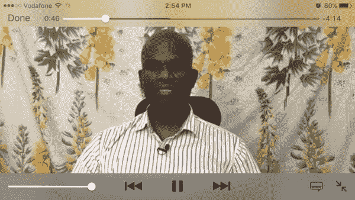

# 从马云和德里克·西弗斯身上我们能学到什么

> 原文：<https://dev.to/jjude/what-we-can-learn-from-jack-ma-and-derek-sivers-about-building-our-career>

如今，我要么是最老的，要么是任何聚会中年纪最大的成员之一。所以大三的学生总是走过来问我职业建议。在这个视频中，我回答了这样一个问题。

[T2】](https://www.youtube.com/watch?v=dcpLmoXnSUI)

*观看视频或阅读下面的文字记录*

在我职业生涯的早期，有一个问题占据了我的头脑。这个问题是:我应该专攻单一技术还是尽可能多地学习业务功能？毕竟，我的朋友们选择在 SAP 或 Oracle Forms 或 Java 上建立他们的职业生涯。

我要对你说实话。我不容易找到答案。我通过大量实验找到了它。

在过去的几年里，我听过一些受欢迎的企业家回答这个问题。我惊喜地发现，他们的建议证实了我通过反复试验发现的东西。

首先是阿里巴巴的所有者马云。他在这段视频中说，在你职业生涯的早期，尽可能多的学习一些东西。然后随着年龄的增长，关注你的优势，并以此为基础。

让我给你读一读另一位成功的企业家对此有什么看法。他是德里克·西弗斯。我是通过德里克的 TED 演讲了解他的。他是 CD 宝贝的创始人。他以 2200 万美元的价格卖掉了它，并将所有的钱捐给了慈善机构。

在蒂姆·费里斯的播客采访中，他谈到了他是如何开始自己的职业生涯的。他那时没有任何崇高的目标。他只是想成为一名职业音乐家，他开始是在一场猪表演中演奏。他说[这是关于开始职业生涯的](https://sivers.org/2015-12-ferriss):

> 当你在职业生涯的早期，我认为最好的策略是你对每件事，每件微不足道的小事都答应，你永远不知道彩票是什么。

我发现有效的方法，以及这两位企业家所说的方法是:在你职业生涯的早期尽可能多地学习。如果你有机会在市场部工作，就去做吧。如果你的公司要求你开发一个服务器应用程序，那就开发吧。如果你遇到一个出售的机会，就出售。这样做 10 年左右。通过这样做，您将会学到很多关于大多数业务功能的知识。你也会知道你最喜欢什么，什么对你来说很容易。

一旦你找到了你喜欢的东西和你天生就有的东西，那就投入进去吧。成为这些技能的主人。这样你会有一个丰富的生活。我说的有钱，不一定是指钱，而是满足的生活。

对我来说，我发现我热爱技术和教学。这正是我通过这个博客和我的新博客所做的。

祝你好运，找到你喜欢的东西，找到对你来说自然而然的东西。

*发布于我的[博客](https://www.jjude.com/specialize-or-generalize/)* 。