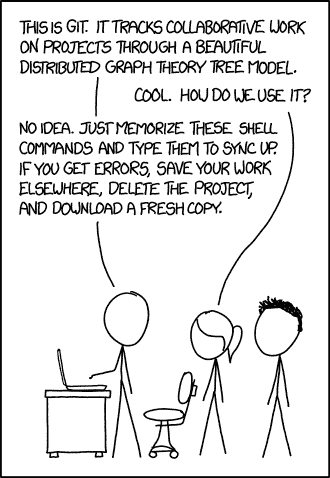

# 控制事实的来源——更好的提交消息的价值

> 原文:[https://dev.to/pavsaund/controlling-the-source-of-truth 更好承诺的价值消息](https://dev.to/pavsaund/controlling-the-source-of-truth---the-value-of-better-commit-messages)

*帖子原载于[codingwithempathy.com](http://codingwithempathy.com/2016/06/28/controlling-the-source-of-truth/)T3】*

作为一名开发人员，需要多层面的沟通。我们需要用特定领域的语言与业务涉众交流，抽象出许多技术术语。另一方面，团队沟通更具技术性，更接近我们的代码现实。

但是我们的很多交流是无声的。这是通过电子邮件、Skype 或 Slack 等异步工具实现的。我敢肯定，任何试图以这种方式沟通的人都经历过沟通不足是多么容易，导致在传达意图和理解之前就出现信息的乒乓效应。

所有这些交流的最终目标是为用户提供价值的软件。

软件交付后并没有结束。它随着时间的推移而改变，失去了它的初衷。这会导致更多的异步通信，这可能会持续数月或数年。我说的是通过我们写的代码发生的交流。

## 用代码分解交流

所有写好的代码都解释了**做什么**。通过编译器执行正确最终结果的功能正确的代码。

有些人解释了**是如何完成的**。代码必须是可读和可理解的。干净的代码和专注于像 BDD / DDD 这样的模式和实践都是将问题领域无处不在的语言引入代码库的方法。使理解逻辑业务组件如何工作变得更加容易。所涉及的规则以及它们如何与其他有界上下文交互。

**为什么——**传达**为什么**代码就是这样。编写软件的意图。通常使用代码注释、单独的文档或者甚至好的测试/规范。

## 作为上下文的源代码管理

[T2】](https://xkcd.com/1597/)

随着时间的推移，代码面临的一个挑战是，它会根据需求和需要而发展和变化。如果一个团队有很强的纪律性，那么测试/规范/文档也会随之发展，但是总有一种趋势是会腐烂、变得陈旧甚至是明显错误的。

这是我们可以求助于源代码控制的地方。存储库中任何给定的提交都是一个快照代码库，显示我们代码的变更和存储库的整体状态。更重要的是，它显示了代码被修改的上下文。

上下文为我们提供了一些信息，比如什么时候做了更改，谁做了更改，涉及了哪些其他文件，以及它在存储库历史中的位置。这些都有助于我们理解代码是如何发展到现在这个位置的。

## 打点 I

源代码控制的真正魔术是提交消息。这条消息有能力传达上下文感知信息，即**不会随时间而改变**(是的，你有时可以重写源历史，但不要做得太过)。但是它可以传达一种改变的意图，这种改变对开发人员来说是有意义的。

写一条解释**为什么**要做一个改变的消息会让下一个开发者(通常是你自己)更容易理解改变背后的原因。

## 信息

[T2】](http://xkcd.com/1296/)

这对许多开发者来说是一个挑战。要么他们并不真正关心好的提交和提交消息的价值，要么他们过于关注微提交的技术细节和技术变化或消息格式。

编写好的提交消息是一项需要练习的技能。关注传达思想和意图的逻辑提交是价值所在。

对于给定的代码库和团队来说，消息是如何形成的是一个观点、品味和偏好的问题，但是这里有一些资源可以帮助您开始。

*   [如何编写 Git 提交消息](http://chris.beams.io/posts/git-commit/)
*   [抢先提交注释](https://arialdomartini.wordpress.com/2012/09/03/pre-emptive-commit-comments/)

## 关于问题跟踪器的说明

当连接到我们的源代码控制时，问题跟踪器是非常棒的。通过明确地将我们的承诺与问题联系起来，我们可以进行适当的讨论，并捕获更多的上述意图。但是，如果您曾经在没有移动历史的可能性的情况下更改问题跟踪程序，那么所有有价值的交流都在阅读代码的上下文中“丢失”了。

## “写好消息很难”

写好的消息很难，就像写好的代码很难一样。你需要理解“为什么”。不要只看告诉你该做什么的用户故事，而要关注为什么一开始就需要改变。

## 致力于此

为什么通过上下文、交流和写作技巧来关注可理解的代码？除非你还不相信沟通和上下文对你和你的团队每天都有价值，否则事实是开发人员花了 [**大部分时间去理解代码**](https://blog.codinghorror.com/when-understanding-means-rewriting/) 。

忽略消息长度和如何格式化提交消息的技术细节，而是关注以简明易懂的方式传达为什么要进行更改的意图的价值。

在一天结束的时候，当所有最初的开发者都离开了，文档也过时了，我们的源代码控制是我们可以寻找“真相”的地方。

*封面-图片:经由[visual hunt/](https://visualhunt.com/)[CC BY-NC-ND](http://creativecommons.org/licenses/by-nc-nd/2.0/)*的[元奎](https://www.flickr.com/photos/please/180892741/)