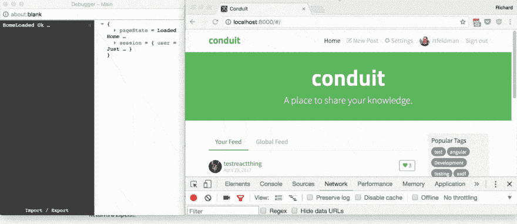
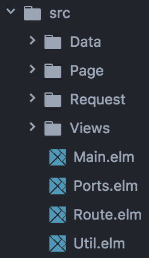

# 开放源代码榆树温泉之旅

> 原文：<https://dev.to/rtfeldman/tour-of-an-open-source-elm-spa>

人们经常问我是否可以向他们介绍一个开源的 Elm 单页应用程序，这样他们就可以仔细阅读它的代码。

伊利亚斯·范·皮尔把我和[现实世界](https://github.com/gothinkster/realworld)项目联系了起来，这个项目看起来非常适合我。他们提供了后端 API、静态标记、样式和规范，您可以使用您选择的[技术](https://www.youtube.com/watch?v=3FNKaGm3gk0)为其构建一个 SPA 前端。

这是结果。我有一吨的乐趣建立它！

[4000 行好吃榆树单页申请良](https://github.com/rtfeldman/elm-spa-example)

**公平警告:**这不是对 Elm 的温柔介绍。我把它建成了我想要维护的东西，并没有退缩。这就是我如何利用 Elm 的全部功能来构建这个应用程序的。

我在 Elm Europe 做了一个关于我用来建立这个的原则的演讲，我强烈推荐观看！叫做 [**缩放榆树应用**](https://www.youtube.com/watch?v=DoA4Txr4GUs) 。

如果你正在寻找一个不那么无聊的关于榆树的介绍，我可以推荐一本[书](https://manning.com/books/elm-in-action?a_aid=elm_in_action&a_bid=b15edc5c)，一个[视频教程](https://frontendmasters.com/courses/elm/?u=ea0ec073ea98046a6a26ccd9a0adede4d5458676)，当然还有[官方指南](https://guide.elm-lang.org)。

## 用户体验路由

我选择了优化用户体验的路由设计。我考虑了三个使用案例，如图所示:

[T2】](https://res.cloudinary.com/practicaldev/image/fetch/s--rqIv8ccI--/c_limit%2Cf_auto%2Cfl_progressive%2Cq_66%2Cw_880/https://thepracticaldev.s3.amazonaws.com/i/y83ipoiyg8p97uwubbhl.gif)

使用案例:

1.  用户拥有快速连接
2.  用户的连接速度很慢
3.  用户处于脱机状态

### 快速连接

在快速连接上，我希望用户能够无缝地从一个页面过渡到另一个页面，而不会看到中间部分加载的页面的闪烁。

为了做到这一点，我让每一页都曝光`init : Task PageLoadError Model`。当路由器收到转换到新页面的请求时，它不会立即转换；相反，它首先在这个`init`任务上调用`Task.attempt`来获取新页面需要的数据。

如果任务失败，产生的`PageLoadError`告诉路由器向用户显示什么错误消息。如果任务成功，产生的`Model`将作为立即呈现 100%新页面所需的初始模型。

不需要刷新部分加载的页面！

### 慢速连接

在慢速连接上，我希望用户看到一个加载微调器，让他们放心，虽然要花一点时间，但还是有事情发生。

为此，只要用户试图转换到新页面，我就会在标题中呈现一个 loading spinner。当`Task`正在运行时，它停留在那里，然后一旦它解决(或者到新页面或者到错误页面)，旋转器就离开。

为了润色，我通过给旋转器的动画添加 CSS [`animation-delay`](https://developer.mozilla.org/en-US/docs/Web/CSS/animation-delay) 来防止旋转器在快速连接时闪烁。这意味着，只要用户单击链接进行转换，我就可以将它添加到 DOM 中(并且一旦呈现了目标页面，就可以再次删除它)，但是微调器不会对用户可见，除非其间经过了几百毫秒的延迟。

### 离线

我希望至少有一些东西在用户离线时还能工作。

我没有使用服务人员(或者应用程序缓存，对于我们这些走上那条崎岖道路的人来说)，但是我确实希望用户能够访问像 T2 新帖这样的页面，这些页面可以在不从网络获取数据的情况下加载。

对他们来说，`init`返回了一个`Model`而不是一个`Task PageLoadError Model`。这就是全部了。

## 模块结构

[T2】](https://res.cloudinary.com/practicaldev/image/fetch/s--y0Ihwm-g--/c_limit%2Cf_auto%2Cfl_progressive%2Cq_auto%2Cw_880/https://thepracticaldev.s3.amazonaws.com/i/761w5ctnh56ph29zh0v6.png)

在 nore dink 的生产过程中，我们有超过 100，000 行的 Elm 代码，在这个过程中我们学到了很多！(我们没有 SPA，所以我们的路由逻辑住在服务器上，但其余的都是一样的。)当然，每个应用程序都是不同的，但我对我们的代码库的扩展非常满意，所以在构建这个应用程序时，我借鉴了我们的组织方案。

请记住，虽然使用`exposing`到[通过限制哪些模块暴露](https://youtu.be/IcgmSRJHu_8)来创建保证是一项重要的技术(我在这里经常使用)，但实际的文件结构并不那么重要。记住，如果你改变主意，想要重命名一些文件或者移动目录，Elm 的编译器会支持你。会没事的！

下面是我如何组织这个应用程序的模块。

### `Page.*`模块

*例子:*`Page.Home``Page.Article``Page.Article.Editor`

这些模块保存了应用程序中各个页面的逻辑。

需要来自服务器的数据的页面公开一个`init`函数，该函数返回一个负责加载数据的`Task`。这让路由系统在切换到页面之前等待页面数据完成加载。

### `Views.*`模块

*例子:*`Views.Form``Views.Errors``Views.User.Follow`

这些模块持有多个`Page`模块导入的可重用视图。

有些，像`Views.User`，很简单。其他的，像`Views.Article.Feed`，都很复杂。每一个都为其特定的需求公开了适当的 API。

`Views.Page`模块公开了一个`frame`函数，它将每一页包装在页眉和页脚中。

### `Data.*`模块

*例子:*`Data.User``Data.Article``Data.Article.Comment`

这些模块描述了常见的数据结构，并揭示了将它们转换成其他数据结构的方法。`Data.User`描述了一个`User`，以及在 JSON 之间序列化和反序列化一个`User`的编码器和解码器。

像`CommentId`、`Username`和`Slug`这样的标识符——分别用来惟一地标识评论、用户和文章——被实现为联合类型。例如，如果我们使用`type alias Username = String`，我们可能会错误地将`Username`传递给一个期待`Slug`的 API 调用，而它仍然可以编译。我们可以通过将标识符实现为联合类型来排除这样的错误。

### `Request.*`模块

*例子:*`Request.User``Request.Article``Request.Article.Comments`

这些模块公开了向应用服务器发出 HTTP 请求的函数。它们公开了`Http.Request`值，以便调用者可以将它们组合在一起，例如在需要点击多个端点来加载所有数据的页面上。

我不在这些模块之外的任何地方使用原始 API 端点 URL 字符串。只有`Request.*`模块应该知道实际的端点 URL。

### `Route`模块

这暴露了将浏览器地址栏中的 URL 翻译成应用程序中的逻辑“页面”的函数，以及影响地址栏改变的函数。

类似于`Request`模块从不公开原始 API URL 字符串，这个模块也从不公开原始地址栏 URL 字符串。相反，它公开了一个名为`Route`的联合类型，调用者用它来指定他们想要的页面。

### `Ports`模块

将所有端口集中在一个`port module`中可以更容易地跟踪它们。大多数大型应用程序都不止有两个端口，但是在这个应用程序中，我只需要两个端口。请参见`index.html`了解它们所连接的 10 行 JavaScript 代码。

在 NoRedInk，我们对端口和标志的策略是使用`Value`来键入来自 JavaScript 的任何值，并在 Elm 中解码它们。这样，我们可以完全控制如何处理数据中的任何意外。我遵循了这里的政策。

### `Main`模块

这将启动一切，并调用各个`Page`模块上的`Cmd.map`和`Html.map`在它们之间切换。

基于对资产管理特性(如代码分割和延迟加载)如何形成的讨论，我认为这个文件的大部分在 Elm 的未来版本中是不必要的。

### `Util`模块

这些是在其他几个模块中使用的杂项助手。

把这个叫做`Misc.elm`可能更诚实一些。

## 其他注意事项

*   在服务器端呈现中，通过使用基于 cookie 的身份验证，可以在第一页加载时提供更好的用户体验。然而，这条道路存在安全风险。
*   如果我从头开始做这个，我会用 [`elm-css`](http://package.elm-lang.org/packages/rtfeldman/elm-css/latest) 来设计它。然而，由于 Realworld 提供了如此多的标记，我最终使用了 [`html-to-elm`](https://mbylstra.github.io/html-to-elm/) 来节省自己的大量时间。
*   有一个`elm-test`的测试版正在开发中，我想用最新最好的来测试。我考虑过等到新的`elm-test`发布，但是决定即使是未经测试的形式，这也是一个有用的资源。

希望这对你有用！

现在，回到写另一章的行动中的榆树。