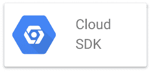
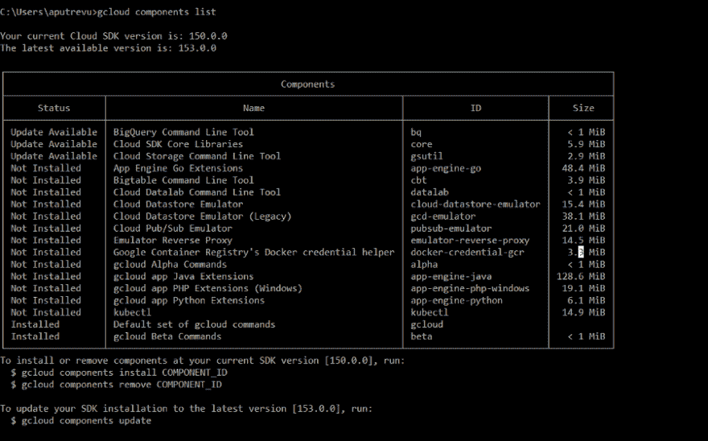

# Google Cloud SDK 入门

> 原文:[https://dev . to/ara vind/getting-started-with-Google-cloud-SDK](https://dev.to/aravind/getting-started-with-google-cloud-sdk)

你好，伙计们！

最近，我在班加罗尔的 Google Cloud NEXT 扩展活动中谈到了 Google Cloud SDK。我想我应该写一篇关于它的文章，让你对 Google Cloud SDK 有一个基本的了解。

[T2】](https://res.cloudinary.com/practicaldev/image/fetch/s--Y-iIr6pE--/c_limit%2Cf_auto%2Cfl_progressive%2Cq_auto%2Cw_880/https://thepracticaldev.s3.amazonaws.com/i/3wqmf5ohm4jt0k33306u.png)

## **什么？**

Google Cloud SDK 是一套以安全的方式访问 Google 公共云平台的工具。它包含用于维护、管理和监控[谷歌云平台(GCP)](https://cloud.google.com/) 的基本工具。

它相当于[亚马逊网络服务 CLI](https://aws.amazon.com/cli/) 。

## **为什么？**

实际上，许多企业会自动执行单调乏味的任务来管理他们的基础设施。像这样的工具有助于这一过程。

## **如何？**

### **安装**

要开始使用 Cloud SDK，您需要根据您的操作系统平台从这里安装工具。一个先决条件是拥有 Python 2.7 . x 或更低版本
我建议你安装安装程序附带的 Python 包。因为安装程序与 Python 版本 3.x 及以上不兼容，你可以在 [Google Issue tracker](https://issuetracker.google.com/issues?q=cloud%20sdk) 里查一下差不多。

### **配置您的账户**

成功安装后要做的第一件事就是打开你的命令行，键入`gcloud`检查 Cloud SDK 是否已经完美安装。
运行`gcloud init`，它会打开一个新的浏览器窗口，要求登录你的谷歌云账户。回到命令行，选择你的选项，如项目，地区/区域等。

### **工具和命令**

Cloud SDK 附带了一组命令工具

*[gcloud](https://cloud.google.com/sdk/gcloud/reference/) :配合谷歌计算引擎(相当于 AWS EC2)*
*[bq](https://cloud.google.com/bigquery/bq-command-line-tool) :配合云端 Bigquery(可比照亚马逊红移)*
*[gsutil](https://cloud.google.com/storage/docs/gsutil) :配合云存储(相当于 AWS S3/AWS EBS)*

您可以使用以下命令列出/安装/更新这些工具

`gcloud components list`

[T2】](https://res.cloudinary.com/practicaldev/image/fetch/s--bQC1tNzG--/c_limit%2Cf_auto%2Cfl_progressive%2Cq_auto%2Cw_880/https://cdn-images-1.medium.com/max/900/1%2AoqzYDOVVHHGxmxxveXOp4Q.png)

## 使用 gcloud 命令编写脚本

用例:在云计算引擎中启动一个虚拟机，并运行一个启动脚本将一个映像复制到一个云存储桶中。

使用 gcloud 和 gsutil 命令，您可以编写一个 Python 脚本。我按照谷歌云教程尝试了一个特殊的用例。我找不到相同的教程，我把代码上传到了 Github 上。

*list-instance.py:将列出实例*
*create-instance.py:创建实例*
*startup-script.sh:在虚拟机启动后运行*

## 云 API 客户端库

如果你是一名程序员，并且喜欢使用某种编程语言，谷歌云提供了另一种使用 GCP 的方式。

谷歌云自带 [7 个客户端 API 库](http://googlecloudplatform.github.io/google-cloud-java/0.10.0/index.html)。您可以为您的 AWS 和 GCP 云工作负载构建一个漂亮的仪表盘。

每种语言都有详尽的 API 客户端库文档和代码示例。这里是 Java 示例的[链接](https://github.com/GoogleCloudPlatform/google-cloud-java)。

如果提供的示例都没有特定 API 的服务实现，您可以使用 Google APIs 编写自己的实现

## 安全和隐私考虑

最后但同样重要的是，在您的本地机器上使用 Google Cloud SDK 可能会从安全角度给你带来一些疑问。`gsutil`确保所有数据通过 TLS 协议传输，防止任何数据泄露。

在本地/dev 机器上运行这些命令时，采取了大量措施来确保安全性。然而，在[中，GCP 解释的这篇](https://cloud.google.com/storage/docs/gsutil/addlhelp/SecurityandPrivacyConsiderations)文章将处理安全风险。

如果您仍然不满意，无需安装任何命令行工具，您可以通过 [GCP 控制台](https://console.cloud.google.com/)打开一个云开发外壳。

[T2】](https://res.cloudinary.com/practicaldev/image/fetch/s--gVJocffO--/c_limit%2Cf_auto%2Cfl_progressive%2Cq_auto%2Cw_880/https://cdn-images-1.medium.com/max/900/1%2AHdNhAOFqO1T6BeCSyPBklg.png)

希望给了云 SDK 的入门。但是如果你还需要更多的细节，请点击这个[链接](https://cloud.google.com/sdk/docs/)或者发表评论。

谢谢大家！