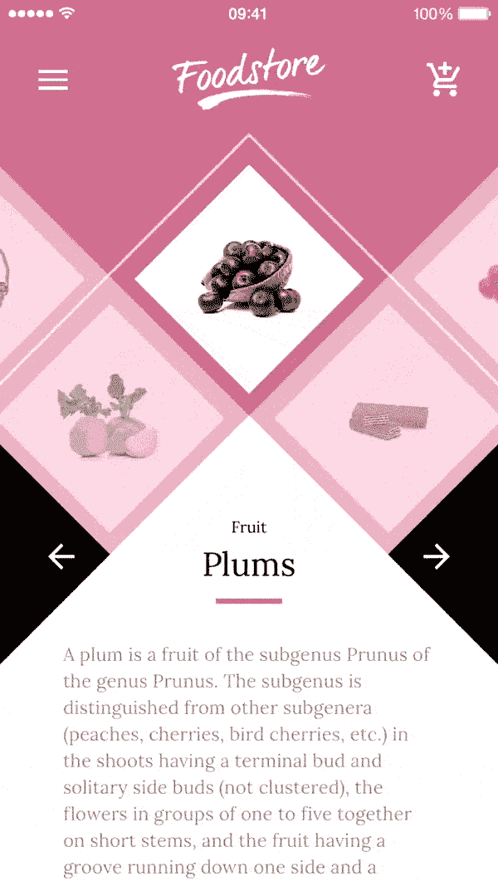

# 带有导航的用户界面的关键帧动画

> 原文:[https://dev . to/mortoray/key frame-animation-for-ui-with navigation](https://dev.to/mortoray/keyframe-animation-for-ui-with-navigation)

当我看到下面的演示时，我想“太棒了，他们是怎么做到的”？如果您知道我为此编写了 API，这听起来可能会令人惊讶。在这篇文章中，我将描述三个[正交特征](https://mortoray.com/2017/03/27/what-is-orthogonality/)、通用导航、事件触发器和关键帧轨迹是如何结合在一起产生这个令人愉悦的动画的。

[T2】](https://res.cloudinary.com/practicaldev/image/fetch/s--3SwwjqgD--/c_limit%2Cf_auto%2Cfl_progressive%2Cq_66%2Cw_880/https://thepracticaldev.s3.amazonaws.com/i/z9yv5vqieox9zs4s4nhh.gif)

<center>[Video](https://videopress.com/v/ziEUG5qo) - [The Fuse Example](https://www.fusetools.com/examples/angled-navigation)</center>

## 关键帧动画

创建锯齿状路径可能是最容易的部分。关键帧动画是我很久以前添加到 API 中的东西——我们的用户感到仅仅被简单的季节所限制，这是可以理解的。

让我们来看看动画的一半，移动到中心的左边。

```
<Move RelativeTo="Size">
    <Keyframe Time="0.25" X="-0.7" Y="0.7"/>
    <Keyframe Time="0.5" X="-1.4" Y="0"/>
    <Keyframe Time="0.75" X="-2.1" Y="-0.7"/>
    <Keyframe Time="1" X="-3.8" Y="-1.4"/>
</Move> 
```

<svg width="20px" height="20px" viewBox="0 0 24 24" class="highlight-action crayons-icon highlight-action--fullscreen-on"><title>Enter fullscreen mode</title></svg> <svg width="20px" height="20px" viewBox="0 0 24 24" class="highlight-action crayons-icon highlight-action--fullscreen-off"><title>Exit fullscreen mode</title></svg>

我们的动画引擎是围绕着将事物从它们正常的位置移开而构建的。在这种情况下，每张卡片在屏幕上都有一个由布局引擎确定的位置。这个`Move`说的是如何把它从那个位置移开。`RelativeTo="Size"`也使用布局大小:`X`和`Y`的小数值是元素大小的倍数。你可以在脑海中想象这条路，或者再看一遍动画。

### 样条轨迹

在这个例子中，锯齿状的路径工作得很好，但是并不总是想要的。我们可以用`<Move KeyframeInterpolation="Smooth">`来创建一个圆角路径——它从这些值中创建一条样条曲线。

> 动画师使用动态合成来实现路径。如果使用了`Keyframe`，则使用`SplineTrack`提供者，否则使用`EasingTrack`提供者。还有一些用于处理离散值的方法。

它是如何创建平滑曲线的？简而言之，我使用 Kochanek-Bartels 方程来获得切线，这些切线被转换成三次 Hermite 样条。我最终使用完全相同的方法(甚至相同的代码)在我们的矢量图中创建了一条平滑的曲线。你可以在我的 [spline 文章](https://mortoray.com/2017/02/02/the-smooth-sexy-curves-of-a-bezier-spline/)中读到更多。

## 动画无意识导航

`Move`指定完整的路径，但是卡片在每次过渡时只移动一部分距离。这就是线性导航的用武之地。

Fuse 中棘手的部分是定义一个没有预烘焙动画的导航系统。我们想让设计师自由支配导航在屏幕上的外观。获得这种“正确”需要代码中的多次迭代。这种历史在导航界面中仍然很明显——我有一个突出的问题要解决。好吧，但是它是如何工作的？

每张卡片都是一个`LinearNavigation`中的一页，在导航中给它们一个特定的顺序(你可以在演示中看到左右顺序)。活动页面的导航进度为 0。“前面”的页面的进度为 1，而“后面”的页面的进度为-1。所有页面都根据它们到活动页面的距离给出一个进度。活动页面后面的第二页有-2，后面的第三页有-3 等等。

这些值是连续的。当导航切换页面时，它逐渐改变这些值；例如，对于向前移动的页面，从 0 到 1。在此特定示例中，导航被配置为使用“圆形”缓和来过渡。

这里的关键点是导航只处理这些进度值。它幸福地意识不到页面的视觉表现。那么动画是如何实现的呢？

### 缩放动画

我上面展示的`Move`设置在一个`EnteringAnimation`触发器中。

```
<EnteringAnimation Scale="0.25">
    <Move RelativeTo="Size"> 
```

<svg width="20px" height="20px" viewBox="0 0 24 24" class="highlight-action crayons-icon highlight-action--fullscreen-on"><title>Enter fullscreen mode</title></svg> <svg width="20px" height="20px" viewBox="0 0 24 24" class="highlight-action crayons-icon highlight-action--fullscreen-off"><title>Exit fullscreen mode</title></svg>

`EnteringAnimation`订阅页面上的进度更新事件(这使用了 C#/Uno `event`)。它将页面进度值转换为`Move`时间线的进度值——它寻找这个新值。默认情况下，它将进度从 0 映射到 0%，将进度从 1 映射到 100%。

> `Keyframe`项指定一个`Time`参数，以秒为单位。当被类似于`EnteringAnimation`的东西驱动时，实际的秒部分被忽略——时间线从 0%到 100%的进度被标准化，并由页面的进度值驱动。

我们不想在整个`Move`时间线上制作动画。我们只想走一段路。这就是`Scale="0.25"`的作用。页面进度值乘以此数量。进度为 1 的页面将只搜索动画的 25%。进度 2 中的页面，与活动页面相距两个页面，将在时间线中搜索到 50%。这些换算值与`Keyframe`中给出的`Time`值相匹配。

与`EnteringAnimation`相对应的是`ExitingAnimation`。我们看到页面进度值可以是正值也可以是负值。`EnteringAnimation`只处理位置值。`ExitingAnimation`处理负值-将-1 转换为 100%。这就是我们如何为活动页面“前面”和“后面”的页面提供不同的动画。

> “进入”和“退出”这两个名称是根据早期的用例选择的，在这些用例中，页面以可视方式进入和离开屏幕。这实际上是在页面进度机制出现之前完成的。我们经常争论这些名字，但从来没有想出更清楚的东西。似乎没有人喜欢我的建议。

## 其他触发器

这个演示很好地展示了[正交 API](https://mortoray.com/2017/03/27/what-is-orthogonality/) 的价值:

*   导航系统只关心修改页面进度值。无论是定时过渡，还是用户在屏幕上滑动，都映射回这个简单的进度值。
*   触发系统和`EnteringAnimation`一样，只关心将这个值转换成动画进度。这使得创建其他触发器变得容易，比如`ExitingAnimation`，或者`ActivatingAnimation`和`DeactivatingAnimation`，如果方向不相关的话。它还考虑到了`WhileActive`或`WhileInactive`，这两者都可以指定一个`Treshhold`来表示它们需要多活跃。
*   时间轴只是一个普通的动画师，并不关心是什么在驱动它。一个`Rotate`或`Scale`可以很容易地插在这里。`Keyframe`同样适用于这些动画师。

很高兴看到它在这个演示中表现得如此之好。