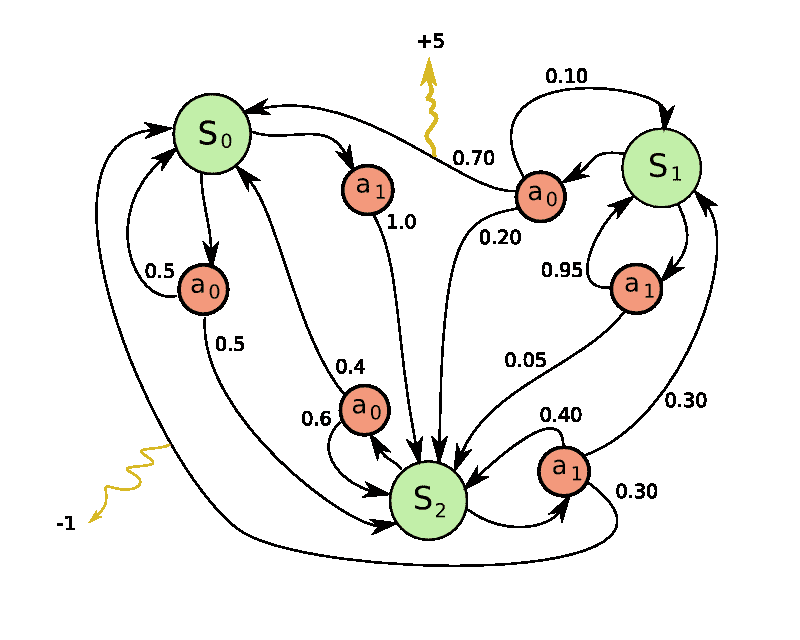

# 体验强化学习

> 原文:[https://dev.to/amreis/a-taste-of-reinforcement-learning](https://dev.to/amreis/a-taste-of-reinforcement-learning)

在过去的几个月里，我听到越来越多关于强化学习的说法。你可能也是。你可能已经看过 DeepMind 在玩 Atari 游戏时的[神奇结果](https://youtu.be/V1eYniJ0Rnk)，或者你可能只是偶然发现了一个视频，视频中的[一架直升机](https://www.youtube.com/watch?v=VCdxqn0fcnE)学会了如何最好地驾驶自己并做杂技。

所有这些演示都激发了我对这一领域的兴趣，所以我继续深入了解这到底是怎么回事。以下是我的一些印象，以及为什么我现在热爱这个领域。

这篇文章将是我解释(希望是以好的方式)这个领域相关概念的系列文章的一部分。感谢所有的反馈，因为我对它真的很陌生，并希望加深我在这方面的知识。

但是少讲我，多讲强化学习！开始吧！

## 为什么它有一个可爱的、特别的名字？

你可能会认为这只是进行机器学习的另一种方式，那么为什么还要给它一个特殊的名字呢？事实证明，强化学习旨在解决的问题类型和解决问题的方式并不符合“传统”机器学习的范畴。

我的意思是，称之为*监督学习*，或者*非监督学习*，或者*半监督学习*并没有完全抓住它的意义。原因如下:

### 设置

在强化学习中，我们想要学习**如何在给定的**环境**中表现**。更具体地说，我们希望训练一个**代理**(能够采取**行动**并从环境中读取**观察**的东西)尽可能地执行任务。

但是在这种背景下*表现好*又意味着什么呢？强化学习将你做得有多好与**奖励**的想法联系起来。这是一个代理人在与环境互动中获得的数字量。例如，如果你正在训练一个代理，它应该尽可能长时间地平衡盘子上的一个球体，你可以奖励它设法让它保持在盘子上的每一秒。

事实上，我们不直接从分数标签对中学习，而是从这些奖励中学习，这就产生了一些问题。其中最直接的是**信用分配**问题。

### 信用分配:什么导致了什么？

假设代理已经运行了一段时间，并且在给定的时间点看到了回报(无论是正的还是负的)。它已经访问了许多州(在那里它可能看到了奖励，也可能没有看到奖励)，并采取了许多行动。我们如何知道这些先前的决定中的哪一个导致了代理人现在收到这个奖励？

举个例子，你在玩游戏，在探索地图，你是因为走进怪物而死的吗？或者问题是选择进入一个敌人太强的房间？在我们实际上从环境中获得反馈之前，这个决定可能已经在*多次迭代中做出了。*

尽管如此，很明显我们需要调整我们的行为。如果我们得到了负面的回报，我们应该用不同的方式去避免它。相反，对于积极的奖励:这样的行为应该变得更加频繁。

仅使用这种*延迟*的奖励信息来调整我们的行动，这一任务使强化学习变得独特，在我看来，如此特别:你只有“这是好的”或“这是坏的”的信号，但你仍然可以从中学习在一个环境中的行为。从某种意义上说，它是一种非常通用的人工智能，因为它不需要知道任何关于环境的动力学或基本概念，就可以学习如何处理它，只需要使用它的经验。

## 有点理论

当涉及到这个东西的数学时，上面的描述是非常抽象的。我不想在这方面陷得太深，所以我推荐[大卫·西尔弗的强化学习课程](http://www0.cs.ucl.ac.uk/staff/d.silver/web/Teaching.html)。这是我获得基本概念的地方。不过，有一部分我觉得我应该谈谈...

### 马氏决策过程

RL 问题通常假设你处在一个尊重被称为**马尔可夫决策过程**(简称 MDP)的形式主义的环境中。我将跳过正式的定义，专注于它的行为，也许这样更容易理解。有限 MDP 的工作方式如下:

*   它由*个有限的*个**状态**(绿色圆圈)组成
*   在每个时间步骤，代理可以从一组**动作**(红圈)中进行选择
*   在给定的时间点选择一个动作会导致环境产生一个**奖励**(黄色箭头)并过渡到一个**新状态**

[T2】](https://commons.wikimedia.org/wiki/File:Markov_Decision_Process_example.png#/media/File:Markov_Decision_Process_example.png)

一些毫无价值的东西:

在 MDP 中，状态具有**马尔可夫属性**。这基本上是说“鉴于现在，未来有条件地独立于过去”。实际上，这意味着每一个*个体*状态都为我们提供了确定接下来会发生什么所需的所有信息(我们不需要状态的全部历史)。

此外，到新状态的转换可能不是*确定性的*。在给定的状态下采取行动会导致不同的后续状态(对于每个先前的状态和行动，您有一个到达某个状态的*概率*，由上图中箭头上的数值表示)。

## 包装完毕

这只是这个领域的一个非常笼统的想法，我希望我至少能给你一点印象。

我还没有谈到的一件事是**连续的**状态/动作空间。这些引入了一些新的问题，我想在下一篇文章中讨论这些问题，在下一篇文章中，我将讨论**政策评估**技术。评估一项政策意味着，给定一个决定我们在环境中行为的函数，我们想知道它有多好(根据我们遵循它所期望得到的总回报)。

我也只举了环境表现为 MDP 的例子。可能出现的一个问题是“如果状态没有马尔可夫性，会发生什么？”。理论上，你可以通过累积你的全部历史来创建一个具有马尔可夫性质的状态。这将引发其他问题，比如每个州变得非常小的可能性。

另一种可能的变化是，我们无法访问状态信息本身，而只能访问从它派生的环境的一些观察结果。当我们处理“真实世界”的数据时，这是很常见的。我们没有完整的状态信息，但我们可以使用**观测值**来推断正在发生什么(在这种情况下，我们说环境是部分可观测的 MDP)。

今天到此为止！我希望你喜欢这篇文章，如果你对它有反馈，非常感谢。下次见！