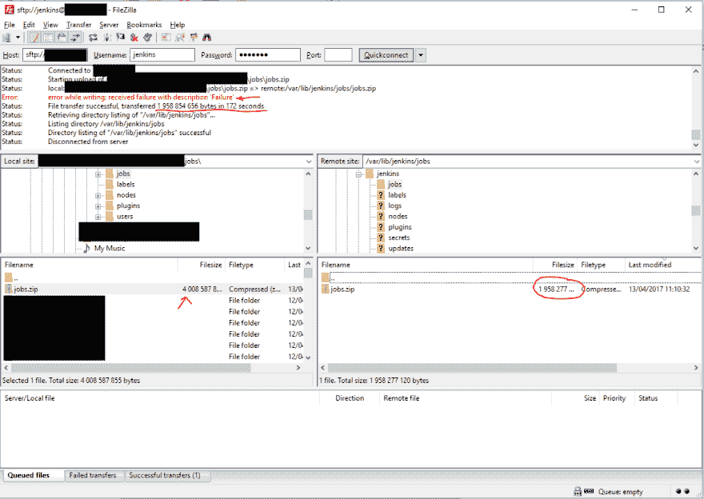
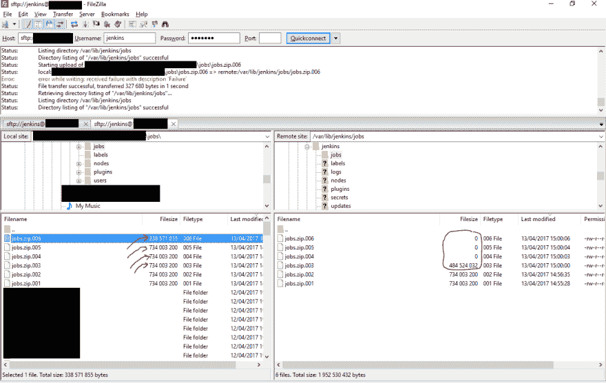
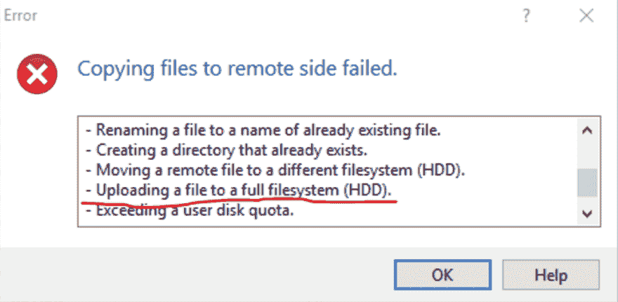

# 为什么清晰的错误消息很重要

> 原文:[https://dev.to/rentes/why-a-clear-error-message-matters](https://dev.to/rentes/why-a-clear-error-message-matters)

*这篇文章最初发表在[我的博客](http://rentes.github.io/software/2017/05/02/Why-clear-error-message-matters/)T3 上*

上个月，当我上传几个文件到工作中的 Linux 服务器时，出现了一个错误。

[T2】](https://res.cloudinary.com/practicaldev/image/fetch/s--ezmMO4gy--/c_limit%2Cf_auto%2Cfl_progressive%2Cq_auto%2Cw_880/https://thepracticaldev.s3.amazonaws.com/i/1af61siirnwfmbj2ay14.png)

出于某种原因，上传总是停止在相同的字节数。不仅如此，错误消息显示上传失败，但下一行显示上传成功。在我看来，这让最终用户感到困惑。除此之外，错误消息没有说太多其他的。

我在想这个错误的几个原因，即:

1.  设置了一个文件系统限制，阻止上传大于我试图上传的 zip 文件的大小(约 4gb)；
2.  我的 FTP 客户端(FileZilla)的一个 bug...这对我来说似乎很牵强，但这是可能发生的；
3.  网络问题似乎是自然原因；
4.  Linux 服务器上超过了用户磁盘配额；
5.  控制组配置限制 Linux 服务器上的磁盘 I/O 资源。

我做的下一件事是将我的 zip 文件分成更小的文件(每个 700MiB ),以检查我的第一个假设是否正确。

[T2】](https://res.cloudinary.com/practicaldev/image/fetch/s--uXduVqVV--/c_limit%2Cf_auto%2Cfl_progressive%2Cq_auto%2Cw_880/https://thepracticaldev.s3.amazonaws.com/i/zmxfz4huqv7iuqjfy941.png)

嗯...没有运气 FTP '所有的压缩文件到 Linux 服务器。此时，我尝试了选项 2)，下载了 WinSCP(我在 Windows 机器上工作)并再次尝试。

[T2】](https://res.cloudinary.com/practicaldev/image/fetch/s--Pe0q8QRF--/c_limit%2Cf_auto%2Cfl_progressive%2Cq_auto%2Cw_880/https://thepracticaldev.s3.amazonaws.com/i/3uk29qh7a3oz0sktym4m.png)

又一次没有运气，但是这一次错误信息很清楚，而且对我来说好多了，因为:

*   它指出有一个错误(并没有在下一行指出上传成功)；
*   它列出了我所面临的问题的几个可能的原因。

事实就是这样:在阅读了可能的原因之后，我首先检查了

```
 partition was full because it seemed the most probable error cause, and indeed it was. Problem solved!


This simple error message saved me precious work time, and it showed me how important a clear error message can be (and even better if it contains a list of possible error causes). Sometimes the "natural cause" is not the real cause for a problem, and if we have a great error message to help us out, we can avoid wasting a lot of time. Always code your error messages to provide this kind of feedback to your end users, as it is better to loose 5 minutes coding a good error message then having your end user wasting half an hour (or even more time) trying to figure out what is wrong.

Until next time, have an awesome coding fun! 
```

<svg width="20px" height="20px" viewBox="0 0 24 24" class="highlight-action crayons-icon highlight-action--fullscreen-on"><title>Enter fullscreen mode</title></svg> <svg width="20px" height="20px" viewBox="0 0 24 24" class="highlight-action crayons-icon highlight-action--fullscreen-off"><title>Exit fullscreen mode</title></svg>