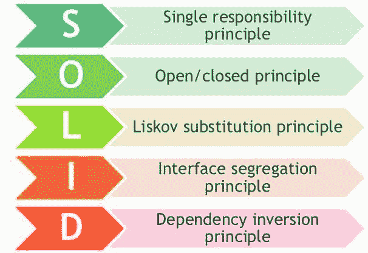

# 编码最佳实践第 1 部分(命名约定和类设计原则)

> 原文：<https://dev.to/mohitrajput987/coding-best-practices-part-1-naming-conventions--class-designing-principles>

在我的上一篇文章[写干净代码的重要性](https://dev.to/mohitrajput987/importance-of-writing-clean-code)中，你意识到了创建一段漂亮代码的重要性。您学习了一些优化源代码的技术。在这篇文章中，我将解释如何编写漂亮的、可伸缩的、可维护的和可读的代码，这些代码在敏捷开发中是有成本效益的。这些规则不是*的“强制遵循”而是要记住——*

 **“可以但不应该”*

这意味着，你可以用任何方式编写代码，但是要记住你应该遵循什么，不应该遵循什么。这些最佳实践不仅会提高代码的可读性；你将学会创建高质量的软件。这些主题可以大致分为两类:一是命名约定，二是设计类的最佳实践。

## 1。命名约定-

避免含糊不清和难以理解的小名称。名称应该是描述性的，这样就能说明它的用途。以下是 Java 命名约定的一些规则。然而，这些规则也适用于其他语言，如 C++，PHP 等。每种语言都有自己的命名惯例-
**a. Class-** 类名必须以大写字母开头，然后应该大写，即类名中每个单词的首字母都是大写。不需要下划线。应该是名词。例如-
*错误名称-* student，Inkjet_printer，Bookinghistory
*正确名称-* Student，InkjetPrinter，BookingHistory
**b .变量-** 变量名的规则与类相同，只有一处变化。变量应该以一个小写字母开头。例如-
*错误名称-* 学生、喷墨打印机、订书机历史
*正确名称-* 学生、喷墨打印机、订书机历史
**c .方法-** 方法名称的规则与变量相同。它应该以一个小字母开始；这应该是骆驼的情况，并为单词的分离，使下一个单词的第一个字母大写。应该是动词。一个方法应该做它的名字所说的事情，即如果方法名是“getExpensesHistory()”，它必须返回“费用列表”的对象。如果你让它的返回类型为 void，那么根据它的名字，它没有达到正确的目的。如-
*错误名称-* void getExpensesHistory()，int setMyAge()
*正确名称-* List getExpensesHistory()，void setMyAge(int age)
**d .常量-** 常量必须大写。与类、变量和方法不同，它的单词应该用下划线分隔。
*错误名称-* minRegistrationAge，MINREGISTRATIONAGE
*正确名称-*MIN _ REGISTRATION _ AGE
**e .接口-** 接口名称的所有规则与类相同。应该是形容词而不是名词。如果您的接口名称以大写 I 开头会很好，这样在大型代码库中搜索它会很容易。
*错误名称-* onClick_listener，onClick_listener，onClick
*正确名称-* OnClickListener，ionclick listener
**f . Package-**包的所有字母都要小写。一个项目必须有最多三个级别的包名。如果您公司的域名是 XYZ.com，项目名是 ABC，那么包名应该是“com.xyz.abc”。然后，您可以在 abc 中为不同的东西创建多个包，例如 beans、数据库、util。

## 2。课程设计(固体原理)

阶级是建造坚固建筑的砖块。如果这些积木不够坚固，你的建筑可能很快就会被摧毁。对于一个强大的类设计来说，有五个原则叫做 SOLID-

**A .单一责任原则(SRP) -** 一个类应该有且只有一个责任。它的所有方法应该一起工作来实现一个单一的目标。例如，如果你正在获取一个用户的位置，它应该只做与位置相关的工作。如果它是一个模型类，它应该只代表一个实体。
**b .开闭原理(OCP)——**一个类必须是开的才能扩展，闭的才能修改。这意味着你应该以这样一种方式编写一个类，如果你的开发伙伴想要使用你的类，他应该能够继承它。如果现有的需要任何额外的功能，他应该能够覆盖该方法并为扩展编写代码。不应该有任何修改现有代码的需要。例如——看看 java 中的 Spring 框架。您不能修改其逻辑，但可以通过扩展其类来创建应用程序流。
**c .利斯科夫的替代原理(LSP)——**可以说是 OCP 的变异。这个原则说“派生类型必须完全可以替换它们的基类型”。这意味着如果一个开发伙伴通过扩展你的类来创建一个类，它不应该破坏应用程序或者改变它的行为。例如，-
正方形是一个具有特殊性的矩形。它有相同的长度和宽度。你可以通过扩展看起来合乎逻辑的矩形来创建正方形。但是如果你设置正方形的宽度，它也会设置高度。如果你设置高度，它也设置宽度。同为开发人员的人看不到这种行为，他会认为如果他设置了唯一的宽度，那么高度就没有变化。这违背了利斯科夫原理。
**d .接口隔离原则(ISP)-** 根据这个原则，你应该以这样一种方式来设计一个接口，即同开发人员不需要实现不必要的方法。原则是，“客户不应该被迫实现他们不会使用的不必要的方法”。例如——
有一个叫“IShape”的接口，有两个方法——get area()和 getWidth()。如果你通过实现这个接口来创建一个圆，你将实现 getArea()方法，但是你也将被迫实现 getWidth()，即使在一个圆中没有像 Width 这样的东西。你必须实现它，让它保持空白。你可以通过扩展“IShape”来创建一个名为“IPolygon”的新接口。IShape 将只有一个 getArea()方法，而 IPolygon 可以有 getWidth()方法。
**e .依赖倒置原则(DIP) -** 这个原则鼓励你编写依赖抽象而不是具体细节的代码。由 *Robert C. Martin* 在他的书*敏捷软件开发、原则、模式和实践*中定义的原则说——
(I)。高层模块不应该依赖低层模块。两者都应该依赖于抽象。
(二)。抽象不应该依赖于细节。细节应该依赖于抽象。例如，如果你在商店用信用卡付款，你不应该为信用卡是 Visa 还是 MasterCard 而烦恼。高级信用卡不应影响低级专业卡的效果。你可以在机器里刷任何卡。

这两种技术是编写专业代码的基本技术。这篇文章看起来更像是专门针对 Java、C++和 PHP 的。命名约定基于 Java 命名约定。不同语言的规则是不同的。但是所有 OOPS 语言的基本规则都是一样的。在下一篇文章中，我将介绍对象声明技术。在那之前，学习并执行这些规则。我很想知道你对评论的看法。

还有，看看我开发的手机垃圾清理 app [mDoctor](https://www.engineerbabu.com/blog/2017/04/mdoctor-ultimate-doctor-cell-phones/) 的案例研究-*