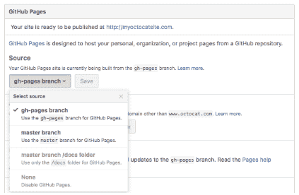

# 如何滥用/docs 的“特性”在 GitHub 页面上快速部署一个中间人静态站点

> 原文:[https://dev . to/tra/how-to-abuse-the-docs-feature-to-quick-deploy-a-middleman-static-site-on-github-pages](https://dev.to/tra/how-to-abuse-the-docs-feature-to-quickly-deploy-a-middleman-static-site-onto-github-pages)

*   "中间人是一个静态站点生成器，使用了现代 web 开发中的所有快捷方式和工具."- [中间人主页](//middlemanapp.com)

其中一个捷径是有一个目录结构来帮助组织你的项目。下面是该目录结构的一个简短版本(更完整的版本位于[文档](https://middlemanapp.com/basics/directory-structure/))。

```
mymiddlemansite/
-- .gitignore
-- Gemfile
-- Gemfile.lock
-- config.rb
-- source (all the files necessary for building the static site)
-- build (the generated static site files) 
```

<svg width="20px" height="20px" viewBox="0 0 24 24" class="highlight-action crayons-icon highlight-action--fullscreen-on"><title>Enter fullscreen mode</title></svg> <svg width="20px" height="20px" viewBox="0 0 24 24" class="highlight-action crayons-icon highlight-action--fullscreen-off"><title>Exit fullscreen mode</title></svg>

这个想法是，您将在源目录中编写所有代码，键入`bundle exec middleman build`来生成您的构建目录，然后将这个构建目录运送到其他地方，由 web 服务器提供服务。最有可能的是，你会使用诸如[中间人-部署](https://github.com/middleman-contrib/middleman-deploy)或[中间人-gh-pages](https://github.com/edgecase/middleman-gh-pages) 这样的工具来自动化部署过程。这两个工具都能够本地支持部署到 GitHub 页面，通常是通过将构建目录推到 GitHub 存储库的`gh-pages`分支。

但是如果您不想使用这些工具来部署到您的存储库的一个单独的分支呢？如果出于可维护性和美观的原因，您希望您的网站文件与您的中间人源代码位于同一个**分支中，该怎么办？幸运的是，GitHub Pages 为您提供了这个选项...尽管是以一种相当间接和粗暴的方式。**

[T2】](https://res.cloudinary.com/practicaldev/image/fetch/s--yqs1wgqj--/c_limit%2Cf_auto%2Cfl_progressive%2Cq_auto%2Cw_880/https://help.github.com/asseimg/help/pages/select-gh-pages-or-master-as-source.png)

在 GitHub 存储库的设置中，你告诉 GitHub 页面从`gh-pages`分支、`master`分支或者`/docs`文件夹中读取。

最后一个选项对于开源项目非常有用，开源项目需要一个特定的`/docs`文件夹来存储他们项目的所有文档文件。比如[分类器重生开源项目](https://github.com/jekyll/classifier-reborn)有一个 [GitHub 页面](http://www.classifier-reborn.com)，其源代码存储在 [`/docs`文件夹](https://github.com/jekyll/classifier-reborn/tree/master/docs)内。

所以我们将滥用这个特性来部署我们自己的中间人站点。首先，我们需要在回购的设置中选择`master branch /docs folder`选项。其次，我们需要将`/build`重命名为`/docs`。这可以通过编辑`config.rb`来改变构建目录的名称。

```
configure :build do
  set :build_dir, 'docs'
end 
```

<svg width="20px" height="20px" viewBox="0 0 24 24" class="highlight-action crayons-icon highlight-action--fullscreen-on"><title>Enter fullscreen mode</title></svg> <svg width="20px" height="20px" viewBox="0 0 24 24" class="highlight-action crayons-icon highlight-action--fullscreen-off"><title>Exit fullscreen mode</title></svg>

最后，我们只是打出...

```
bundle exec middleman build 
```

<svg width="20px" height="20px" viewBox="0 0 24 24" class="highlight-action crayons-icon highlight-action--fullscreen-on"><title>Enter fullscreen mode</title></svg> <svg width="20px" height="20px" viewBox="0 0 24 24" class="highlight-action crayons-icon highlight-action--fullscreen-off"><title>Exit fullscreen mode</title></svg>

...将生成的构建文件夹提交到我们的存储库，然后将结果推送到我们的 GitHub 存储库。

但是仍然有一个小缺陷。任何时候您需要进行更改，您都必须重新构建`/docs`目录并提交生成的文件。我让读者来决定如何最好地自动化这个过程(可能通过写出一个 Raketask)。