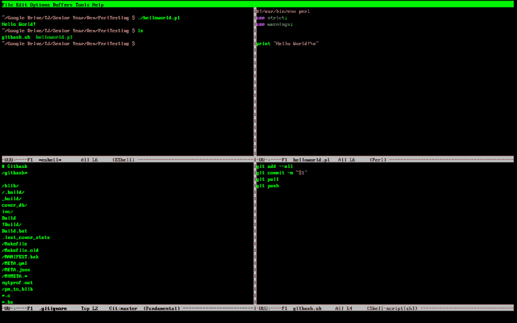

# Emacs 中美丽的三个阶段(从一个 17 岁孩子的角度)

> 原文:[https://dev . to/sishaarrao/17 岁女孩眼中的美丽三阶段](https://dev.to/sishaarrao/the-3-stages-of-beauty-in-emacs-from-a-17-year-olds-perspective)

在我学校一个最容易被忽视的角落里，放着一台陈旧但仍能正常工作的 Apple II，光彩照人。有一天，我决定登录，却发现一些奇怪的 IDE 在终端上运行——我很快发现这是一个 Emacs 实例。我以前听过这个名字。在哪里？哦耶！在社交网络里！

[T2】](https://res.cloudinary.com/practicaldev/image/fetch/s--4bP1qDDV--/c_limit%2Cf_auto%2Cfl_progressive%2Cq_66%2Cw_880/http://i.imgur.com/9mJoLIz.gif)

大约 6 个月前，当我准备进行这一转换时，Atom 是我的首选 IDE。这是体面的，它完成了工作，所以我还能想要什么？当我听说 Emacs 时，我做了一些研究，发现在 Emacs 超级用户和更主流的 Vim-ers 之间似乎存在竞争。

本着青少年的叛逆精神，我抛弃了可靠的 Atom，避开了主流的 Vim，转而选择了 Emacs，这是我需要完全学习和利用的新偶像。我用这本教科书以及[官方 GNU Emacs 手册](https://www.gnu.org/software/emacs/manual/)和超级有用的 [Emacswiki](https://www.emacswiki.org/emacs) 学习了一些命令。就这样，我开始了从零开始学习这个基于命令行的编辑器的 3 阶段旅程。

## *第一阶段*:太烂了。大家认真用这个吗？

对于 Emacs，我必须学习的第一件事就是如何移动。如何向前移动光标？落后？向上？下来？搞什么鬼。`C-x f`为前进？`C-x b`为落后？字母与单词相匹配很好，但是还有什么比箭头更直观的呢？还是指指点点？！这不能打乱我的工作流程:我甚至还没能开始工作，因为这太复杂了！

作为新手，Emacs 中的导航可能是 Emacs 学习曲线中最陡峭的部分，所以如果有人正在学习或可能已经放弃了——继续练习，我保证会变得更好。

开个玩笑，在事情变得简单之前会变得更难。我了解了所有重要的键绑定，通常是在尝试导航时不小心点击了某个键。哎呦，不小心点了`C-s` —哦等等，什么是迭代搜索？这还挺不错的。我学会了如何打开和保存文件，如何切换缓冲区，以及如何关闭 Emacs(信不信由你，我花了一段时间才弄明白，我只是关闭了我的终端应用程序)

## *第二阶段*:上帝保佑埃舍尔

当我发现 Eshell 的时候，我看到了生产力的瞬间提升。(查看[这个网站](https://www.masteringemacs.org/article/complete-guide-mastering-eshell)了解总体概况)在备用缓冲区中拥有一个 shell 意味着我可以快速地从工作和编写代码跳到测试和修改文件结构。有了一个功能齐全的 Shell，我绕过了在 ide 中编码、切换到我的终端来运行它、再切换回来修改代码的繁琐任务。当我熟悉了 Eshell，我开始注意到我在 Emacs 中的工作效率在提高。

## *第三阶段*:嘿，这还真有点巧！

Emacs 有一些非常酷的特性，也提高了我的工作效率，所以我要给他们一个特别的大喊。

#### 宏

[宏](https://www.emacswiki.org/emacs/KeyboardMacros)允许你将多个命令链接成一个命令。例如，如果对于一个代码块，您想要删除每隔一行的前五个字符和后五个字符，您可以将这些命令串在一起，使其成为一个宏，从而使您可以在几秒钟内完成这样的任务。

#### 按键绑定定制

Emacs 允许您将新命令绑定到整个系统的字符。例如，我找到了[这个有用的 Stackoverflow 答案](http://stackoverflow.com/questions/7733668/command-to-clear-shell-while-using-emacs-shell)，并按照第二个答案创建了一个键绑定，让我可以轻松地清除我的 Eshell 屏幕！按键绑定是用 Emacs 的母语 [Lisp 编写的，所以如果你懂这种语言](https://www.gnu.org/software/emacs/manual/eintr.html)你可以创建自己的绑定来定制和改进你的工作流程！

#### 拆分窗口

信不信由你，这个特性花了我一些时间才发现，但是 Emacs 干净地分割窗口的能力意味着我可以以比以前更快的速度在不同的文件之间切换和工作。我不再被困在切换标签或窗口的过程中(现在令人沮丧)。我的工作流程现在看起来是这样的:

[T2】](https://res.cloudinary.com/practicaldev/image/fetch/s--I-tibFAe--/c_limit%2Cf_auto%2Cfl_progressive%2Cq_auto%2Cw_880/http://i.imgur.com/o3NYwej.png)

## 总之

说到 Emacs，我还是要说我是个新手。有些超级用户将 Emacs 的强大功能发挥到了极致，而我与他们相去甚远。也就是说，我已经使用 Emacs 大约一年了，我希望这里概述的我的经验能够对任何考虑转换或学习这种环境的人有价值。我经常发现自己在谷歌文档、Gmail 和各种地方使用 Emacs 导航命令(令人惊讶的是，它们真的有效！)所以可以肯定地说，我不会很快离开 Emacs。

我可能在这里和那里犯了一些事实错误，所以如果你发现了什么，请评论！知道我没有提到的其他很酷的功能吗？也请评论那些！谢谢！