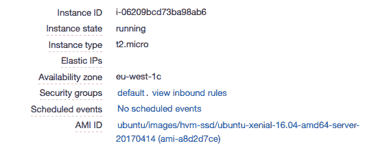

# 使用 Terraform 进行云部署——第 1 部分

> 原文：<https://dev.to/koenighotze/using-terraform-for-cloud-deployments---part-1>

这篇文章从初学者的角度探索了地形。我们将看看 Terraform 解决的问题以及它的独特之处。

通过使用一些相当简单的例子，我们将很好地了解如何在现实生活中使用它。我们将基于 LAMP 栈构建一个运行中的 EC2 实例。这篇文章涵盖了简单版本，后续文章将展示使用 Consul 进行状态同步和使用 [Ansible](https://www.ansible.com/) 进行配置管理的高级配置。

这些示例侧重于 AWS，因此您可能需要一个客户来跟进。我将只使用免费资源，所以即使是一个模拟账户也足够了。

注意:我既不是 Terraform 专家，也不是 AWS 专家...所以对一切都要半信半疑；)

# 什么是 Terraform，我为什么要关心？

Terraform 是来自 Hashicorp 的开源工具。它负责整理您的基础设施。这意味着，您可以编写配置文件，而不是在 AWS 控制台中四处点击。这些文件是纯文本，因此可以像任何代码一样共享、版本化和同行评审。

基本上，Terraform 是一个帮助你实现代码为 (IaC)的[基础设施的工具。](https://en.wikipedia.org/wiki/Infrastructure_as_Code)

## 安装地形

我们将安装 Terraform 并运行一个简单的演示，以使事情更清楚。

安装 Terraform 非常容易。从 https://www.terraform.io/downloads.html[下载相应的 Zip 文件。解压文件并将`terraform`二进制文件放在您的`PATH`上的某个地方。](https://www.terraform.io/downloads.html)

运行这个命令来检查是否一切正常:

```
$ terraform -v 
```

Enter fullscreen mode Exit fullscreen mode

输出应该类似于

```
Your version of Terraform is out of date! The latest version
is 0.9.3\. You can update by downloading from www.terraform.io 
```

Enter fullscreen mode Exit fullscreen mode

创建一个包含以下内容的简单文件:

```
provider "aws" {
  region = "eu-west-1"
}

resource "aws_instance" "simple" {
  instance_type = "t2.micro"
  ami = "ami-a8d2d7ce"
} 
```

Enter fullscreen mode Exit fullscreen mode

在这里，我们基本上是说，我们希望使用 [AWS](https://aws.amazon.de/) 作为我们的云`provider`。Terraform 主要支持跨提供商。这意味着，你可以轻松地跨 AWS、Heruko、Azure 等配置你的环境。如上所述，在这篇文章中，我将继续关注 AWS。

另外创建了一个`resource`。在这种情况下，一个新的 EC2 `aws_instance`。我们称这种资源为`simple`。例如`${aws_instance.simple.ami}`指的是`"ami-a8d2d7ce"`。这个以后会派上用场的。

实例类型是`t2.micro`，是空闲层的一部分。AMI 定义了用于创建实例的映像。

运行以下命令来验证您的配置:

```
$ terraform plan 
```

Enter fullscreen mode Exit fullscreen mode

基本上试运行您的配置。这可以让你提前检查，什么是将要发生的。

然后`apply`实际创建资源的配置。

```
$ terraform apply 
```

Enter fullscreen mode Exit fullscreen mode

输出将告诉您 Terraform 实际上创建了什么。

```
aws_instance.simple: Creating...
  ami:                         "" => "ami-a8d2d7ce"
  associate_public_ip_address: "" => "<computed>"
  availability_zone:           "" => "<computed>"
  ebs_block_device.#:          "" => "<computed>"
  ephemeral_block_device.#:    "" => "<computed>"
  instance_state:              "" => "<computed>"
  instance_type:               "" => "t2.micro"
  ipv6_addresses.#:            "" => "<computed>"
  key_name:                    "" => "<computed>"
  network_interface_id:        "" => "<computed>"
  placement_group:             "" => "<computed>"
  private_dns:                 "" => "<computed>"
  private_ip:                  "" => "<computed>"
  public_dns:                  "" => "<computed>"
  public_ip:                   "" => "<computed>"
  root_block_device.#:         "" => "<computed>"
  security_groups.#:           "" => "<computed>"
  source_dest_check:           "" => "true"
  subnet_id:                   "" => "<computed>"
  tenancy:                     "" => "<computed>"
  vpc_security_group_ids.#:    "" => "<computed>"
aws_instance.simple: Still creating... (10s elapsed)
aws_instance.simple: Creation complete (ID: i-0df9487a7eb151059)

Apply complete! Resources: 1 added, 0 changed, 0 destroyed.

The state of your infrastructure has been saved to the path
below. This state is required to modify and destroy your
infrastructure, so keep it safe. To inspect the complete state
use the 'terraform show' command.

State path: 
```

Enter fullscreen mode Exit fullscreen mode

正如所料，一个基于 AMI 和 type 的新实例被创建。根据默认值或外部配置计算其他设置。

注意关于
的一件小事

```
To inspect the complete state use the "terraform show" command. 
```

Enter fullscreen mode Exit fullscreen mode

现在就做吧。

这将告诉您代表您的配置创建和配置的所有内容(为了可读性，删除了一些行):

```
$ terraform show
aws_instance.simple:
  id = i-0df9487a7eb151059
  ami = ami-a8d2d7ce
  ... // snip
  instance_state = running
  instance_type = t2.micro
  ... // snip
  public_dns = ec2-54-72-243-229.eu-west-1.compute.amazonaws.com
  public_ip = 54.72.243.229
  ... // snip
  tags.% = 0
  tenancy = default
  vpc_security_group_ids.# = 1 
```

Enter fullscreen mode Exit fullscreen mode

显然，对你来说事情会变得不同。

如果仔细观察，您会注意到一个被创建的文件`terraform.tfstate`。当我们谈到国家的时候，我们会回到这个话题。现在请注意，Terraform 使用这个文件来了解如何更新某个云配置...*所以不要删除它*！否则你得自己清理。

因为我们喜欢干净和合适的东西，所以让我们销毁创建的实例

```
$ terraform destroy
Do you really want to destroy?
  Terraform will delete all your managed infrastructure.
  There is no undo. Only 'yes' will be accepted to confirm.

  Enter a value: 
```

Enter fullscreen mode Exit fullscreen mode

用`yes`回答，Terraform 会移除它所创建的一切。

```
aws_instance.simple: Refreshing state... (ID: i-0df9487a7eb151059)
aws_instance.simple: Destroying... (ID: i-0df9487a7eb151059)
aws_instance.simple: Still destroying... (ID: i-0df9487a7eb151059, 10s elapsed)
aws_instance.simple: Still destroying... (ID: i-0df9487a7eb151059, 20s elapsed)
aws_instance.simple: Still destroying... (ID: i-0df9487a7eb151059, 30s elapsed)
aws_instance.simple: Still destroying... (ID: i-0df9487a7eb151059, 40s elapsed)
aws_instance.simple: Still destroying... (ID: i-0df9487a7eb151059, 50s elapsed)
aws_instance.simple: Still destroying... (ID: i-0df9487a7eb151059, 1m0s elapsed)
aws_instance.simple: Destruction complete Destroy complete! Resources: 1 destroyed. 
```

Enter fullscreen mode Exit fullscreen mode

* * *

旁注:如果事情出错了怎么办？

通过`TF_LOG`设置日志级别，您可以获得 Terraform 行为的详细视图。

```
$ TF_LOG=INFO terraform apply 
```

Enter fullscreen mode Exit fullscreen mode

* * *

## 但是等等...Terraform 怎么知道我的证书

您可以使用环境变量或配置参数(如
)显式定义您的凭证

```
provider "aws" {
  access_key = "myaccess"
  secret_key = "mysecret"
} 
```

Enter fullscreen mode Exit fullscreen mode

如果您不提供这些值，那么 Terraform 将使用`.aws/credentials`中的值。

有了这个简单的例子，我们将直接进入一个更复杂、更现实的场景。

# 去企业

我们现在将在基本示例的基础上进行构建。我们的案例将分两个阶段构建。阶段 1 只是一个简单的实例，运行灯堆栈。第二阶段会更复杂，用[consult](https://www.consul.io/)处理状态，用 [Ansible](https://www.ansible.com/) 提供。这将是下一篇文章的一部分。

这一步的目标是一个正在运行的 [LAMP](https://en.wikipedia.org/wiki/LAMP_(software_bundle)) 服务器。这意味着设置一个 Linux 盒子并安装 LAMP。最后，我们将修改索引页面，以便显示标准的“Hello World”。

## 创建 EC2 实例

一如既往，起点是提供者的声明

```
provider "aws" {
  region = "eu-west-1"
} 
```

Enter fullscreen mode Exit fullscreen mode

现在我们将添加 EC2 实例

```
resource "aws_instance" "stage1" {
  instance_type = "t2.micro"
  ami = "ami-a8d2d7ce"

  tags {
    Name = "stage1"
  }
} 
```

Enter fullscreen mode Exit fullscreen mode

这个应该看着眼熟。
我添加了一个`tags`部分，允许我们向创建的资源添加元数据。

让我们运行它来检查事情是否像预期的那样工作。

如果您切换到 AWS 控制台并浏览 EC2 实例，您会发现类似这样的内容:

[T2】](https://res.cloudinary.com/practicaldev/image/fetch/s--T70iG_bq--/c_limit%2Cf_auto%2Cfl_progressive%2Cq_auto%2Cw_880/https://koenighotze.github.io/asseimg/2017-04-25/aws_console.png)

实例的详细信息完全符合预期。

[T2】](https://res.cloudinary.com/practicaldev/image/fetch/s--_ZALiaFi--/c_limit%2Cf_auto%2Cfl_progressive%2Cq_auto%2Cw_880/https://koenighotze.github.io/asseimg/2017-04-25/details.png)

在[https://Gist . github . com/koenighotze/fdb 630 f 548 f 43 f 3d 9 c 06 de 4 be 8 e 40 B1 b](https://gist.github.com/koenighotze/fdb630f548f43f3d9c06de4be8e40b1b)找到此步骤的要点

## 添加 SSH 连接

很明显，那个东西很无聊，没有网络连接真的无法访问。

为了允许 SSH，我们定义了一个新的安全组。

```
resource "aws_security_group" "stage1-sec-group" {
  name = "Allow SSH"

  ingress {
    from_port = 22
    to_port = 22
    protocol = "tcp"
    cidr_blocks = ["0.0.0.0/0"]
  }

  tags {
    Name = "stage1"
  }
} 
```

Enter fullscreen mode Exit fullscreen mode

我们定义了一个名为`stage1-sec-group`的新的`aws_security_group`资源。我们再次添加了一个标签，这样我们可以更容易地找到东西。目前只定义了一个入口(传入规则)。该规则允许来自任何地址的端口 22 连接(`"0.0.0.0/0"`)。

然后，我们需要通过添加实例配置，将我们的实例与这个安全组相关联。

```
resource "aws_instance" "stage1" {
  # ...

  vpc_security_group_ids = ["${aws_security_group.stage1-sec-group.id}"]

  # ...
} 
```

Enter fullscreen mode Exit fullscreen mode

我们使用引用表达式`${aws_security_group.stage1-sec-group.id}`来引用安全组的 id。

再次运行 run `terraform plan`检查创建和更改了什么。

```
$ terraform plan
Refreshing Terraform state in-memory prior to plan...
....

~ aws_instance.stage1
    vpc_security_group_ids.#: "" => "<computed>"

+ aws_security_group.stage1-sec-group
    description:                           "Managed by Terraform"
    egress.#:                              "<computed>"
    ingress.#:                             "1"
    ingress.2541437006.cidr_blocks.#:      "1"
    ingress.2541437006.cidr_blocks.0:      "0.0.0.0/0"
    ingress.2541437006.from_port:          "22"
    ingress.2541437006.ipv6_cidr_blocks.#: "0"
    ingress.2541437006.protocol:           "tcp"
    ingress.2541437006.security_groups.#:  "0"
    ingress.2541437006.self:               "false"
    ingress.2541437006.to_port:            "22"
    name:                                  "Allow SSH"
    owner_id:                              "<computed>"
    tags.%:                                "1"
    tags.Name:                             "stage1"
    vpc_id:                                "<computed>"

Plan: 1 to add, 1 to change, 0 to destroy. 
```

Enter fullscreen mode Exit fullscreen mode

有两件事值得注意。首先，Terraform 告诉我们资源`aws_instance.stage1`将会改变。它将获得一个新的属性`vpc_security_group_ids.#`。

其次，创建一个新资源`aws_security_group.stage1-sec-group`(注意`+`)。如果您检查输出，您会注意到 SSH 的`ingress`配置。

现在应用它并连接到它。

```
$ terraform apply                     # apply the changed configuration
$ terraform show | grep 'public_id =' # get the public ip
$ ssh ubuntu@<PUBLIC IP> 
```

Enter fullscreen mode Exit fullscreen mode

...当然，它失败了，因为我们需要将一个键与这个实例关联起来。我不会讨论公钥配置，所以我将假设您配置了一个密钥对。只需查看[http://docs . AWS . Amazon . com/CLI/latest/reference/ec2/create-key-pair . html](http://docs.aws.amazon.com/cli/latest/reference/ec2/create-key-pair.html)和[http://docs . AWS . Amazon . com/CLI/latest/user guide/CLI-ec2-key pairs . html](http://docs.aws.amazon.com/cli/latest/userguide/cli-ec2-keypairs.html)即可了解该主题的详细信息。

* * *

**旁注:直接输出公有 IP**

只需在 Terraform 配置的底部添加以下片段，您将直接被告知公共 ip。

```
resource "aws_eip" "ip" {
  instance = "${aws_instance.stage1.id}"
}

output "ip" {
  value  = "${aws_eip.ip.public_ip}"
} 
```

Enter fullscreen mode Exit fullscreen mode

* * *

让我们假设您现在有一个名为`terraform-test-key`的密钥对。我们需要将该密钥对与我们的实例相关联。将下面一行添加到我们的 EC2 资源中:

```
key_name = "terraform-test-key" 
```

Enter fullscreen mode Exit fullscreen mode

会告诉你，它需要销毁并重新创建实例。

```
$ terraform plan
Refreshing Terraform state in-memory prior to plan...
...

-/+ aws_instance.stage1
    ami:               "ami-a8d2d7ce" => "ami-a8d2d7ce"
    ...
    key_name:          "" => "terraform-test-key" (forces new resource)
    ...

Plan: 1 to add, 0 to change, 1 to destroy. 
```

Enter fullscreen mode Exit fullscreen mode

所以继续进行配置。Terraform 完成后，您可以通过 SSH 访问您的实例。请注意，公共 id 将在实例的重新创建之间发生变化。

```
$ ssh -i terraform-test-key.pem  ubuntu@<PUBLIC IP>
Welcome to Ubuntu 16.04.2 LTS (GNU/Linux 4.4.0-1013-aws x86_64)
... 
```

Enter fullscreen mode Exit fullscreen mode

在[https://Gist . github . com/koenighotze/28eb 1930148 D8 BC 5192495 e5e 790 e 380](https://gist.github.com/koenighotze/28eb1930148d8bc5192495e5e790e380)中找到这方面的要点

## 调配实例

置备程序用于引导资源、应用配置等。后续帖子将使用 [Ansible](https://www.ansible.com/) 显示这一点。现在，我们将使用一个相当简单的文件和内联示例。现在我们需要安装灯组。

```
resource "aws_instance" "stage1" {
  # ...
  provisioner "remote-exec" {
    inline = [
      "sudo apt update",
      "sudo apt -q -y upgrade",
      "DEBIAN_FRONTEND=noninteractive sudo -E apt install -q -y lamp-server^",
      "cd /var/www/html/",
      "sudo mv index.html index.html.backup",
      "sudo echo 'Hello World' | sudo tee index.html"
    ]
    connection {
      timeout = "5m"
      user = "ubuntu"
    }
  }
  # ...
} 
```

Enter fullscreen mode Exit fullscreen mode

不赘述，基本上就是装个灯堆，改装一下`index.html`。

但是，如果你执行`terraform plan`，它会告诉你，什么都没有改变？

```
$ terraform plan
...

This means that Terraform did not detect any differences between your
configuration and real physical resources that exist. As a result, Terraform
doesn't need to do anything. 
```

Enter fullscreen mode Exit fullscreen mode

这是因为 Terraform 只会在创建资源时应用置备程序。所以我们首先需要摧毁和重建资源。

```
$ terraform destroy
$ terraform apply 
```

Enter fullscreen mode Exit fullscreen mode

...它失败了。

```
...
Error applying plan:

1 error(s) occurred:

* aws_instance.stage1: 1 error(s) occurred:

* timeout Terraform does not automatically rollback in the face of errors.
Instead, your Terraform state file has been partially updated with
any resources that successfully completed. Please address the error
above and apply again to incrementally change your infrastructure. 
```

Enter fullscreen mode Exit fullscreen mode

如果您在启用调试的情况下运行它`TF_LOG=INFO terraform apply`，或者如果您通过 SSH 登录并亲自尝试第一个命令`sudo apt update`，您会注意到在
有一个超时

```
ubuntu@ip-172-31-19-15:~$ sudo apt update
0% [Connecting to eu-west-1.ec2.archive.ubuntu.com (54.217.155.209)] [Connecting to security.ubuntu.com (91.189.88.149)] 
```

Enter fullscreen mode Exit fullscreen mode

在 AWS 中，每个创建的 EC2 实例都有一个允许传出网络连接的安全规则。Terraform 默认删除该规则。所以我们需要自己添加规则。

```
resource "aws_security_group" "sec-group" {
  # ...
  egress {
    from_port = 0
    to_port = 0
    protocol = "-1"
    cidr_blocks = ["0.0.0.0/0"]
  }
  # ...
} 
```

Enter fullscreen mode Exit fullscreen mode

所以再次应用配置。然后将您的浏览器指向公共 ip，您应该会看到以下内容:

[T2】](https://res.cloudinary.com/practicaldev/image/fetch/s--Si94ZvyI--/c_limit%2Cf_auto%2Cfl_progressive%2Cq_auto%2Cw_880/https://koenighotze.github.io/asseimg/2017-04-25/output.png)

哇！你应该印象深刻；)你可以在[https://gist . github . com/koenighotze/362 a 0903d 0121 a4 ce 71 b 6 FDD 84 CAC 8](https://gist.github.com/koenighotze/362a0903d0121a4ce7e71b6fdd84cac8)找到完整的例子

# 接下来是什么？

这篇文章只是介绍了一些基础知识。下一部分将探索一个更复杂的例子，类似于您在现实世界中所做的事情。

此外，我们将比较 Terraform 与其竞争对手，如厨师，木偶等。

如果你想了解更多，显然，有一本书: [Terraform up and running](http://www.terraformupandrunning.com/) 。虽然官方文档是一流的，但这是强烈推荐的。

你应该知道，Terraform 仍然是 0.x 版本，所以事情仍然可能会中断。

总之，Terraform 帮助您以可重复的方式安全地构建基础设施。一切都可以被审计、版本化、检查。可以避免典型的配置漂移情况。Terraform 不是银弹。您将需要其他工具，例如用于配置管理的 [Ansible](https://www.ansible.com/) 和用于管理状态的[consult](https://www.consul.io/)。

IaC 空间非常拥挤，而且不断变化。为你的情况找到最好工具的唯一方法就是尝试。