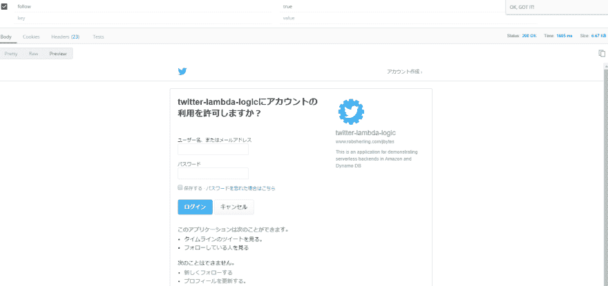

# AWS 云的无服务器后端:Twitter 会话

> 原文:[https://dev . to/rob 117/server less-back ends-with-AWS-cloud-Twitter-sessions](https://dev.to/rob117/serverless-backends-with-aws-cloud-twitter-sessions)

这是 AWS 无服务器架构系列的一部分。在这里和我的博客 [J-bytes](http://robsherling.com/jbytes/index.php/2017/01/08/serverless-backends-with-aws-cloud-intro/) 上都可以找到原始的博文系列。

# 如何在 DynamoDB 中创建会话

在本节中，我们将在一个会话(保存在 DynamoDB 中)中保存一些浏览信息，并将用户重定向到 Twitter。一旦回调到位，我们将使用会话数据让用户跟踪我们。我们还可以使用该数据在稍后向用户发送消息(我们实际上拥有用户 DM 本身，将在下一节中解释),提供一些促销新闻。

更具体地说，我们将在 DynamoDB 的一个表中保存他们的请求令牌以及其他一些东西，然后当他们确认我们的应用程序时，使用他们的 oAuth 令牌获取附加到请求令牌的数据，并完成这个链。

这相当简单，让我们直接进入主题。

## 第 0 步:制作一个 Twitter 应用

[在此设置您的 Twitter 应用程序](https://apps.twitter.com/)。它快速、免费、简单。你将需要它来做任何像消息用户一样酷的事情，并建立友谊(在 Twitter 上，这项技术不能保证以任何其他方式建立友谊)，所以现在让它变得有意义。当你设置这个应用程序时，这是**超级关键命令**，你去权限选项卡，选择读取、写入和访问直接消息。你这样做是因为我们需要他们以后自己做 DM。

## 第一步:DynamoDB 表

你应该知道我们上次碰桌子的步骤，所以我们现在就把剩下的桌子装好。我们总共还需要 4 张桌子。我们将需要为我们创建的会话准备临时表和生产表，以便在用户登录到他们的 Twitter 帐户以(希望)授权我们时保存用户的数据，并且我们将需要临时表和生产表，以便在他们从授权返回并点击我们的回调时保存他们的数据。

打开 DynamoDB 表，并制作以下表格:

```
name: staging_session -> primary key: request_token (string)
name: production_session -> primary key: request_token (string)

name: staging_twitter -> primary key: uid(Number)
name: production_twitter -> primary key: uid(Number) 
```

关于 Twitter 表中的 uid 的快速说明:在我们的 lambdas 中，uid 实际上将被视为一个字符串，并在存储中自动转换。这是因为 Javascript 有时候会出现 numbers 和 uid[(source)](https://dev.twitter.com/overview/api/twitter-ids-json-and-snowflake)的问题，但是 DynamoDB 根本不在乎。

## 第二步:env-config.json

打开——或者从您的 S3 下载——您的 env-config.json 文件(您应该有两个，我们创建的每个环境一个)。我们将填充其余的值，现在只留下 twitter_api_callback 为空(我们将在下一节中完成)。您可以从您在第 0 步中设置的 Twitter 应用程序中获取您的 consumer_key 和 consumer_secret 值。您可以在应用程序设置的密钥和访问令牌选项卡中找到它。

twitter_table_name 应该是`<stage>_twitter`，twitter_session_table_name 应该是`<stage>_session`。

对于 follow uid，您可以从标记为 Owner Id 的相同密钥和访问令牌选项卡中获得它。如果是*而不是*你自己的账户，使用[这个链接](https://tweeterid.com/)并输入你想关注的账户。

保存您的 JSON，并重新上传到适当的 S3 桶。

## 第三步:构造 Twitter Lambda

在本地磁盘上创建一个 session_lambda 文件夹，并放入 cd。

我们将像以前一样下载库。这一次，我们将需要 node-twitter-api 库。注意这个命令的间距，这有点复杂(复制时要小心):

`npm install –prefix=./ node-twitter-api`

添加我们在使用硬系统链接之前创建的 loader.js，或者将其复制到文件夹中，这取决于您的专业知识。如果您从 github repo 为项目复制 loader.js，记得将第 61 行的 S3 桶改为我们实际的桶。

添加 [index.js](https://github.com/Rob117/serverless-twitter-email/blob/master/session_lambda/index.js) 文件。
将第 6 行中的行更改为您合适的 db 区域。

阅读注释的索引文件，但它应该相当简单。我们只需接受一个 POST 请求，它将告诉我们用户是否选择关注我们，点击 Twitter API 以获取一些请求令牌，保存所有数据，然后重定向到 Twitter 站点，以便他们可以完成授权。如果您不需要用户在会话中跟踪一个帐户或跟踪任何其他数据，请稍后随意将其作为 get 请求。

像我们制作电子邮件 lambda 一样压缩文件夹(压缩文件夹的内容，而不是文件夹本身),然后直接进入 lambda 控制台。

创建 lambda 函数。为蓝图选择**空白功能**。
在弹出的配置触发器部分单击下一步，进入下一个屏幕。
函数名使用 **generate_twitter_session** 。
将代码输入类型下拉框更改为“上传 zip 文件”
上传我们刚做的 zip。
在 Lambda 函数处理程序和角色下，使用现有角色下拉框中的 **master_lambda** 。
将超时设置为 15s
点击下一步，然后创建功能。
从操作下拉列表中，配置测试事件。

```
{
 "body-json": "follow=true"
} 
```

单击保存。
点击操作并创建两个别名。一个是“筹备”，另一个是“生产”。两者都应该指向 Version: $LATEST(如果您愿意，可以创建版本 1)。
单击测试左侧的按钮(可以以别名或 say 限定符开始)，并单击别名下拉选项卡下的 staging。然后单击测试。
如果您在日志中的 JSON.parse 一行得到一条错误消息，说**syntax error:Unexpected token u**或类似的话，请再次检查您的测试事件。

您应该会看到一条错误消息，指出:

```
 "errorMessage": "Twitter.MovedPermanently : Redirecting.",
  "errorType": "https://twitter.com/oauth/authenticate?oauth_token=<SOME TOKEN STUFF HERE>"
If you do, you are in good shape and ready to move on to hooking up our API endpoint. 
```

## 第四步:打造我们的门户

我们只是将一个 API 端点连接到我们的 Twitter。这基本上是我们制作的电子邮件 API 的副本，所以如果你需要复习，请现在再去读一遍。

打开 API 网关控制台，单击我们制作的服务-api。点击/api，然后点击 Actions 下拉菜单并选择**创建资源**。将资源命名为 twitter-session，并单击 Create Resource。

这个资源将模仿我们的电子邮件资源几乎相同。记得准备好您的 AWS CLI，以批准我们的阶段变量控制 lambdas。

点击 twitter-session 资源，并点击**创建方法**。将方法更改为 post，然后单击复选标记。

将 lambda 区域更改为您所在的区域，然后键入`generate_twitter_session:${stageVariables.alias}`。保存，当您看到巨大的文本墙时，将其放入 AWS CLI 并用 staging 替换`${stageVariables.alias}`。输入，然后再次替换为生产。再次输入。确认无错误文本。

回到你的 lambda 控制台，点击 ok。然后点击方法响应。删除 200，添加 301，然后编辑它以包含“位置”标题。

转到集成响应。删除状态为 200 的默认响应。点击**添加集成响应**，将状态更改为 301，并进行错误正则化，`^Twitter.MovedPermanently.*`

编辑我们新创建的集成响应，并将位置头映射的值设置为**integration . response . body . error type**。单击复选标记。

最后，从 twitter-session post 选项返回到我们的集成请求，并添加一个身体映射模板。类型为**application/x-www-form-urlencoded**。当没有定义模板时，将常规模板设置为方法请求传递，将请求正文传递设置为。全部保存。

部署到试运行和生产环境。出口。保存。

## 第五步:邮递员

点击 stages 下的 staging，然后点击 **/api/twitter-session** 。复制调用 URL 并将其粘贴到 Postman 中。将割台设置为`Content-Type: application/x-www-form-urlencoded`。将主体设置为`x-www-form-urlencoded`，将数据键值设置为`follow : true`。确保方法类型为 POST，然后点击 send。邮递员应该说加载一小段时间(例如，如果你在东京附近做这件事，而你的服务器在加利福尼亚，可能会很长)，然后像这样向你走来(你必须点击“漂亮”来使它漂亮):

[T2】](https://res.cloudinary.com/practicaldev/image/fetch/s--0b0SVjJg--/c_limit%2Cf_auto%2Cfl_progressive%2Cq_auto%2Cw_880/http://robsherling.com/jbytes/wp-content/uploads/2017/01/api-session.png)

有用！

目前没有必要走得比这更远。如果检查 staging_session 数据库表，应该会有一些数据。这标志着本节的结束。

在下一部分，我们将发送确认推文，实际关注一个帐户，等等。