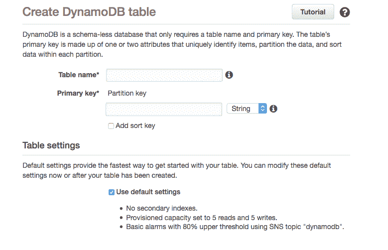

# AWS 云的无服务器后端:Email Lambda 和 DynamoDB

> 原文:[https://dev . to/rob 117/server less-back ends-with-AWS-cloud-email-lambda-and-dynamo db](https://dev.to/rob117/serverless-backends-with-aws-cloud-email-lambda-and-dynamodb)

这是包含端到端生产 AWS 无服务器系统教程的系列文章的一部分。如果你中途加入，请阅读这个系列的介绍文章，可以在我的博客 [J 字节](http://robsherling.com/jbytes/index.php/2017/01/08/serverless-backends-with-aws-cloud-intro/)上找到它的原始格式。

这是一首非常非常长的曲子。

# 电子邮件，拉姆达，邮件枪，迪纳摩，S3

在这篇文章中，会有很多东西同时向你涌来。这是一个大型项目，有许多移动的部分，虽然我实际上是逐步构建的，但我们将在这里构建几乎所有的最终阶段(除了少数例外)。慢慢来，什么都读。在这篇文章中，我们将涉及 S3、Lambda、IAM、KMS 和 DynamoDB 服务。

## 电子邮件 DynamoDB 表格

我们要做的就是创建一个 DynamoDB 表来存储我们所有的注册信息。

导航到 AWS 控制面板中的 DynamoDB。点击**创建表格。**您应该会看到这个屏幕:

[T2】](https://res.cloudinary.com/practicaldev/image/fetch/s--zSGEiLkd--/c_limit%2Cf_auto%2Cfl_progressive%2Cq_auto%2Cw_880/http://robsherling.com/jbytes/wp-content/uploads/2017/01/Dynamo-Create-Screen.png)

主键只是保证每个数据库条目都有的一个键。对于不同的项目，还有其他关于 dynamo DB 的东西需要了解，但对于这个项目来说基本上就是这些了。

让我们把我们的表名叫做 **production_emails** ，主键叫做 **email** 。

我们将每次都让**使用默认设置**处于选中状态。这将把我们的表限制在每秒 5 次读取和 5 次写入，这样做既好又便宜。对于生产，您的需求显然会根据预期的工作负载而有所不同。

我们不需要排序关键字，所以只需点击 **create。**

创建另一个表，表名为 **staging_emails** ，主键为 **email** 。再次点击**创建**。

**关于阶段**的说明:我们通常会为测试、阶段、生产和开发制作不同版本的表格，但为了简洁起见，我们在本教程中只制作两个。

给它几分钟来做桌子。

## IAM

让我们创建 lambda 接下来要使用的角色。

打开 IAM

*   点击**角色**
*   点击**创建新角色**
*   给这个角色起你想要的名字(master_lambda 比较好)
*   角色类型是 AWS Lambda
*   附加策略**amazondynamodbullaccess**
*   附加策略 **AmazonS3ReadOnlyAccess**
*   附加策略 **CloudWatchFullAccess**
    *   注意:即使采用这种策略，有时也需要很长时间才能真正看到 CloudWatch 日志。见本页末。
*   救援

## λ

在你的 AWS 控制面板中打开 Lambda，点击**立即开始**。

当我第一次做这个项目的时候，我遇到了一些 Lambda 的主要问题。一个建议:不要选择默认的 Dynamo 模板。他们是一个陷阱。在我做这个项目的时候，他们使用一种旧的连接到 dynamo 的方式，这种方式已经不再受支持了，我花了将近一整天的时间试图解决我认为是我的代码的问题。旧的模板试图强迫你指定你要保存的数据类型，但由于某种原因，这一切都失败了。

选择**空白功能。**
你现在会在这个页面上看到**配置触发器**来链接你的 API。不要那样做。这也是一个陷阱。它将为您创建一个新的空白 API 资源，目前我们不需要它。留空，然后点击下一步。

我们要全力以赴。实际上，我首先做了基本的电子邮件功能，然后是加密，最后我完成了发送邮件的功能。然而，我们将从我的知识中受益，并且第一次就把它做好，这样我们就可以一次性写完。

根据您选择发送电子邮件的邮件提供商，以下步骤会略有不同。我最初是用 Sendgrid 做这个项目的，但是 Mailgun 更容易演示，而且从实现的角度来看，它们几乎是相同的。一个小小的谷歌将在这里帮你做得很好。

我们需要上传几个文件:index.js 用于发送电子邮件，email.html 用于我们想要发送的内容，loader.js 用于加载我们所有的环境变量。我们还需要将用于 Mailgun 的库上传到 Lambda。这实际上出乎意料的简单，因为 Mailgun 有非常适合我们工作的文档( [docs](https://github.com/orliesaurus/nodemailer-mailgun-transport) )。

为了上传文件，最小化浏览器窗口，并在本地系统上执行以下操作。

## λ索引文件

对于索引文件本身，在版本控制中创建一个名为 email_lambda 的文件夹。在其中，创建一个名为 index.js 的文件，并粘贴以下代码:

[index.js](https://github.com/Rob117/serverless-twitter-email/blob/master/email_lambda/index.js)

在第 8 行，将 **us-west-1** 改为您实际的发电机位置。

如果文件中发生的事情不清楚，请阅读注释。

所有代码路径最终都会抛出错误的原因是，这是使用 API 网关从 Lambda 重定向到网站的唯一方法。这将在我们制作 API 时详细解释。

## 加载我们的配置

这需要 S3，我们将设置后。之后我还会解释为什么我们对环境变量使用 S3 加载器，而不是 AWS 控制台中每个 lambda 底部新添加的环境变量函数。目前，信任。

实际上，你可以在你的 lambda 文件夹之外创建这个文件，并把一个硬系统链接放入每个 lambda 文件夹，这样它们都有这个文件的相同版本。如果你不知道怎么做，谷歌或者每次直接把它放在文件夹里。总之，在 index.js 旁边创建一个名为 loader.js 的文件，并将以下代码放入其中:

[loader.js](https://github.com/Rob117/serverless-twitter-email/blob/master/loader.js)

编辑文件如下:
将第 61 行的**配置桶名**替换为我们稍后将创建的实际 S3 桶名。我强烈建议类似`<project-name>-dev-config`的东西。请查看[本](https://www.concurrencylabs.com/blog/configure-your-lambda-function-like-a-champ-sail-smoothly/)为原版指南。我做了一些修改，使它更适用于我们的项目。

## 邮件模板

只需将一个名为 email.html 的文件也放入该文件夹中，随您所需。建议的内容(收件人将被我们在 index.js 文件中的代码替换为正确的电子邮件):

[email.html](https://github.com/Rob117/serverless-twitter-email/blob/master/email_lambda/email.html)

## 安装邮件枪库

注意:Mailgun 使用的库很大，因为它会使你超过指定的大小限制，所以在你执行了下面几个步骤后，你将不能使用 AWS lambda 中的内联代码编辑器。如果您只需要做一个小的编辑，这可能会有点令人沮丧，因为您每次都必须重新压缩文件，但是您会很快习惯它(并且还可以创建一个别名来为您做这件事以节省您的时间)。

安装[相关邮件节点包](https://aws.amazon.com/blogs/compute/nodejs-packages-in-lambda/)的时间。

从 email_lambda 文件夹中运行以下命令。对我来说，复制粘贴总是弄乱节点安装，所以要小心，当你复制时，它实际上是正确复制的。

```
npm install –prefix=./ nodemailer
npm install –prefix=./ nodemailer-mailgun-transport 
```

`tree`应该吐出来:

```
.
|-- email.html
|-- etc
|-- index.js
|-- loader.js
`-- node_modules (with a ton of files in here, omitted for brevity) 
```

转到您在安装过程中创建的 Mailgun 帐户，为您的项目获取一个 API 密钥(如果可以的话，验证一个域，强烈推荐，但是很麻烦)。将这些放在环境变量部分。

压缩文件，**而不是文件夹**。在 Mac 上，如果你只是压缩文件夹本身，它会在压缩后的文件夹中创建一个文件夹，这样你的文件就会在**下两层**而不起作用。zip 应该直接打开到 node_modules/、index.js、loader.js、email.html 和 etc/。如果您使用 unix 工具来压缩，请确保指定-r 选项。

在我们已经打开的 Lambda 控制台屏幕上，将**名称**更改为 **email_service** (或任何您喜欢的名称)并将**代码输入类型**更改为**上传一个 zip 文件。然后点击上传，选择我们刚刚制作的 zip 文件。让环境变量为空，我们一会儿会谈到它们。**

Handler 告诉 lambda 调用时首先执行什么文件名和什么函数。格式为 filename.function。保持原样。

对于 Role，选择 existing role，并选择我们之前创建的 lambda 角色(如果您遵循了指南，请选择 master_lambda)。

将内存保持在 128 mb/s，将超时时间设置为 15 秒之类的健康值。记住，我们按实际使用的时间收费，而不是我们设定的最大值。DynamoDB 在读取或写入时偶尔也会有一些奇怪的延迟，所以你希望这个延迟很长，以防万一。

其余为默认设置，点击**下一个**，然后点击**创建功能**。

## 环境变量

如果你不知道什么是 AES 或者什么是 IV，粗略地读一页。基本上，AES 是一系列的加密标准，而 IV 是每个数据项唯一的信息，使得每个数据项的安全性更难破解。

在代码选项卡下 lambda 的 AWS 屏幕上(应该是上传 zip 文件后看到的屏幕)，您将看到一个环境变量的空间。我们不会用这些。

通常情况下，Lambda 会用 process.env.KEY_NAME 读入这些文件。我们不能真的使用它们，因为虽然它们对于单个 lambda 来说很棒，但对于共享信息，如跨多个 lambda 的 AES 密钥或电子邮件地址，或者对于不同阶段的变量(生产密钥需要不同于所有其他阶段)，它们真的不太好用。如果您忘记更改 lambda 的某个版本的某个键，它可能会以非常可怕和微妙的方式崩溃。

因此，我们要做的是从一个 JSON 文件中加载我们所有的环境变量，我们将为每个阶段制作这个文件，并用 KMS 加密，这样只有我们的管理员和我们的 lambda 可以读取它。当我们将它存储在 S3 dev 桶中时，就会发生加密。

## KMS

首先，我们做一把钥匙。在控制台中直接到 KMS(IAM->加密密钥)。

*   点击**开始/创建键。**
*   对于别名，您可以使用任何东西( **S3 加密密钥**)并点击下一步。
*   在“密钥管理员”下，选择您希望谁能够轮换/编辑/删除密钥
*   在 Key Usage Permissions 下，选择我们之前创建的 **master_lambda** 角色，以及您希望能够访问该文件的任何控制台用户/角色。
*   点击**下一步**，然后**完成**

## S3

我们需要创建一个 JSON 配置对象，然后将它上传到我们的 staging 和 production 文件夹中。我们将使用我们刚刚制作的 KMS 密钥对其进行加密，因为加密您的静态敏感数据是一种很好的做法。

首先，转到 S3，创建一个 bucket(这个 bucket 应该与您在 loader.js 文件中设置的名称相同，最好是`<project-name>-dev-config`)。

[T2】](https://res.cloudinary.com/practicaldev/image/fetch/s--JvuKN41j--/c_limit%2Cf_auto%2Cfl_progressive%2Cq_auto%2Cw_880/http://robsherling.com/jbytes/wp-content/uploads/2017/01/Screen-Shot-2017-01-09-at-00.50.16-768x663.png)

在那个桶里面，制作两个文件夹， **staging** 和 **production** 。

[T2】](https://res.cloudinary.com/practicaldev/image/fetch/s--au-C5_aZ--/c_limit%2Cf_auto%2Cfl_progressive%2Cq_auto%2Cw_880/http://robsherling.com/jbytes/wp-content/uploads/2017/01/Screen-Shot-2017-01-09-at-00.52.27.png)

此时，我们已经准备好上传我们的环境配置了。在示例文件中，我将链接一些我们实际上还不需要的数据，但是保留虚拟数据并在需要时更新是没有问题的。请在 S3 之外保存这些数据的备份，以防愤怒的管理员删除这些数据，从而导致您丢失 AES 密钥。

记住:永远不要将环境变量配置文件提交给存储库。这将完全挫败环境变量的意义。这只是回购中的一个例子。

下载以下文件，并根据下面的说明进行配置。

env-config . JSON

解释:

*   站点 _ 回调

这是你放置页面的地方，当你的用户注册他们的邮箱或者 twitter 时，你希望你的用户被重定向到这个页面。比如:[http://robsherling.com/jbytes](http://robsherling.com/jbytes)。

*   电子邮件/twitter/session_table_name

要从中存储/读取数据的表名。例子有 **staging_emails** 和 **production_twitter** 。

*   aes _ 密码

这是您将用于加密密钥的密码。
AES 对钥匙非常非常挑剔。它们必须具有特定的字节长度。至少对于测试来说，你可以从[http://randomkeygen.com](http://randomkeygen.com)那里得到钥匙

只需进入 CodeIgniter Encryption Keys，获取一个你喜欢的并保存在除配置文件之外的某个地方，因为如果你丢失了它，你就无法访问它所保护的所有信息。

*   发件人电子邮件

我们希望这封邮件看起来像是发自。

*   邮件应用编程接口密钥/邮件枪域名

使用您的 Mailgun 帐户设置中的 API 密钥和域名。

现在您已经知道了变量的作用，请填写 site_callback、email_table_name、aes_password、mail_api_key、mailgun_domain_name 和 from_email 字段。

您必须将此文件上传两次；一次保存到生产文件夹，一次保存到暂存文件夹。选择要上传的 env-config 文件后，点击右下角的 **Set Details** 按钮。选中**使用服务器端加密**，然后**使用 AWS 密钥管理服务主密钥**，然后从下拉列表中选择我们创建的密钥。上传(不要担心权限，照现在的样子，它们工作得很好)。如果看不到您的键，请检查键区域和桶区域是否相同。

请更改用于暂存和生产的 AES 密钥和 DynamoDB 表(暂存 _ 电子邮件与生产 _ 电子邮件)；我还会将 staging 文件夹中的 env-config.json 更改为使用不同的 **from_email** 地址，这样您就知道 staging 被正确调用了。

## λ别名

最后，让我们的 lambda 别名与我们的阶段相对应，编辑我们的测试动作，让这个坏小子兴奋起来！

首先，让我们在 lambda 控制台中设置测试动作。点击我们制作的 **email_service** lambda，点击页面顶部靠近蓝色**测试**按钮的**动作**下拉菜单，然后点击**配置测试事件。**删除事件中的任何代码，复制并粘贴以下内容，将名称和域更改为接收测试电子邮件的适当值:

`{ "body-json": "email=<user>%40<domain.com>"}`

请注意，每次我们手动测试时，上面的电子邮件都会收到一封电子邮件，请放心。

*   点击**保存**，不要点击**保存并测试**

*   点击**动作**，然后**发布新版本。**关于描述，请将**测试完毕并准备好！或者你想要的任何东西。点击**发布**。**

*   再次点击**动作**，然后点击**创建别名**。对于别名，键入**生产**。对于版本，选择 **1** (我们刚刚制作的版本)并点击创建。现在，再重复一次，但是对于名称类型 **staging** 和版本选择 **$LATEST。**这就是你如何将别名指向代码的不同版本。

现在，在左侧，点击**限定符**，然后点击别名下的**暂存**。然后点击蓝色的**测试**按钮。

1) It **应该**说执行失败，并带有错误消息电子邮件。MovedPermanently:重定向。这是因为稍后我们将在 AWS API Gateway 中捕获它，并使用它进行重定向。

2)如果您检查我们创建的 dynamo db **staging_emails** 表并单击 items 选项卡，应该会有一个带有 email 和 email_iv 的项目，而且应该是一堆胡言乱语。这很好。

3)你的邮件可能需要几秒钟才能到达。如果它还没有到达，检查您的 CloudWatch 日志中的错误和您的 Sendgrid/Mailgun 日志。

4)如果出现错误，在您尝试修复错误并重新上传任何文件后，请确保在运行测试前再次从别名列表中选择 **staging** 。我们还没有制作一个 **$LATEST** dev-config 文件夹和 json，所以如果你没有正确设置别名，它不会加载任何环境配置。

## 云观察日志

如果你试图查找 CloudWatch 日志时没有显示出来，*祝你好运*。亚马逊支持团队对此的普遍看法似乎是:**如果角色不工作，就一直折腾他们，直到他们工作为止。**说真的，我试图将 CloudWatchFullAccess 策略放在我的 master_lambda 角色上，但它什么也没做。我摆弄了几个小时的角色，它什么也没做。所以，我就把 CloudWatchFullAccess 重新打开，然后走开了。大约五天后我回来了，没有做任何改变，它就神奇地开始工作了。

这标志着我们第一个 lambda 的完成。接下来，我们将它连接到一个 API，这样我们就可以用 Postman 测试它。