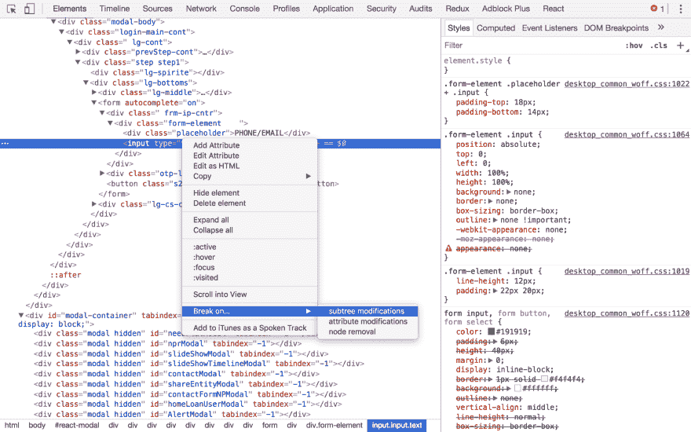
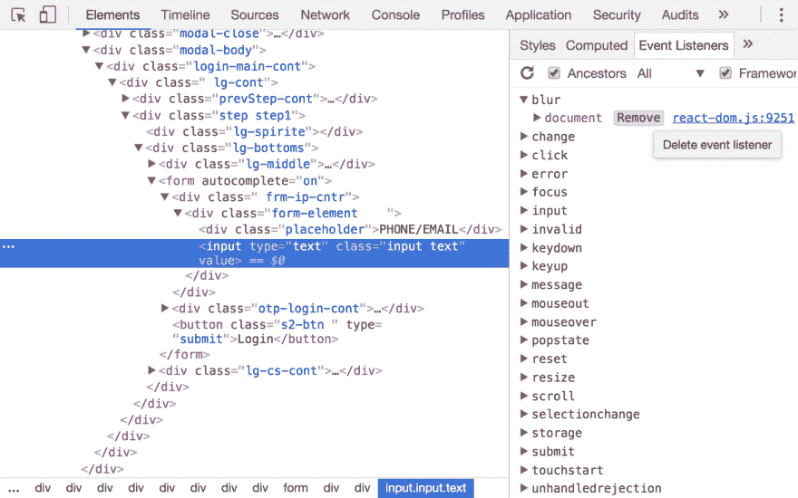
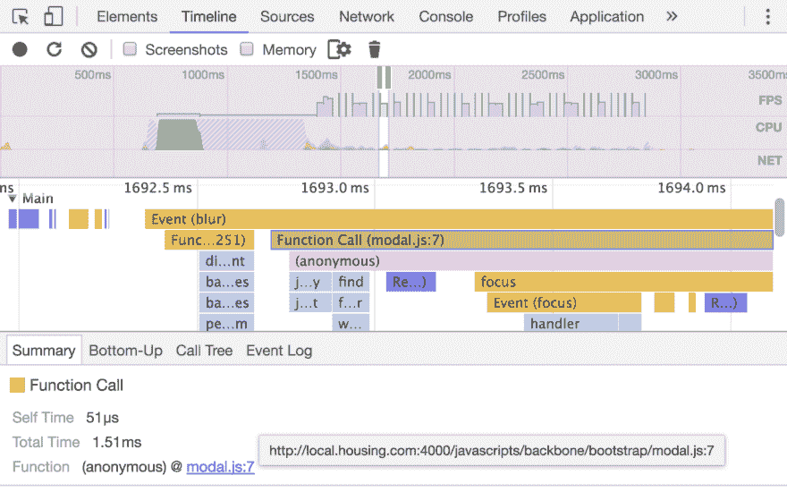
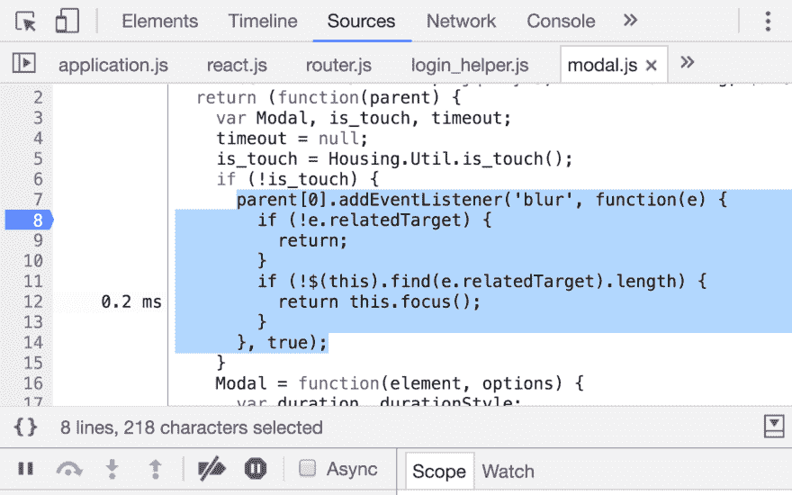
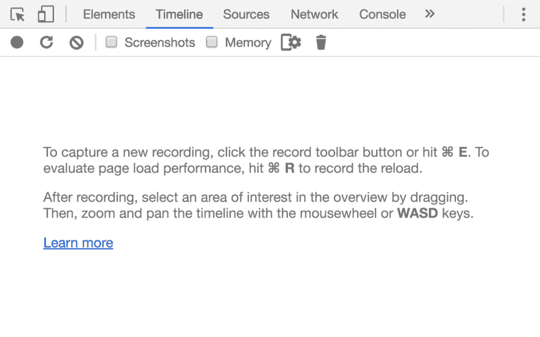

# 找到劫持您事件的讨厌的监听器(Javascript)

> 原文：<https://dev.to/azizhk110/finding-that-pesky-listener-thats-hijacking-your-event-javascript>

这是一个关于如何确定什么事件监听器正在调用`event.preventDefault()`或`event.stopPropagation()`或其他一些完全随机的不允许您预期操作的事情的调试故事。

[https://www.youtube.com/embed/4JAzpzDrLlE](https://www.youtube.com/embed/4JAzpzDrLlE)

### 问题

我们有这样一个表单，当我们点击输入框时，它不会聚焦。所以很明显，有什么东西在听这个输入框的焦点，或者在听别的什么东西的模糊点，并试图把焦点放在其他一些不在那里或隐藏在屏幕上的输入框上。现在我们有了一个庞大的代码，其中包含了大量的意大利面条式的代码，不知何故，这些代码都可以正常工作。(我们有 React 和 Backbone，我们有 jQuery 和下划线，我们都有。我们即将完成迁移),因此很难找出导致这种情况的原因。事件侦听器是从许多地方添加的，但不知道有多少。

### 使用 Chrome DevTools 查找 DOM 修改

在 Chrome DevTools 中，要找出是否有东西正在修改 DOM 是非常容易的，只需在 elements 窗格中选择元素，右键单击，然后可以选择中断子树修改、属性修改和节点删除。

[T2】](https://res.cloudinary.com/practicaldev/image/fetch/s--cjLeByCu--/c_limit%2Cf_auto%2Cfl_progressive%2Cq_auto%2Cw_880/https://cdn-images-1.medium.com/max/2000/1%2AohJcqBjSLciuf1sG6kAYzw.png)

但是对于我们当前的问题，DOM 没有被修改，所以这在这里没有帮助。

### 列出特定事件的所有 DOM 事件监听器

在 Chrome DevTools 的元素面板中，Styles 旁边有一个事件监听器标签。这里有一个列表，列出了所有事件和为该事件添加的事件侦听器，覆盖了在 Elements 窗格中选择的当前 DOM 元素的所有祖先。(听起来像绕口令😂)

[T2】](https://res.cloudinary.com/practicaldev/image/fetch/s--weUgx5nF--/c_limit%2Cf_auto%2Cfl_progressive%2Cq_auto%2Cw_880/https://cdn-images-1.medium.com/max/1600/1%2AeqSp3QIKqP-dKc4vNOwZHw.png)

这里有删除侦听器的选项，或者您可以转到侦听器函数定义。但是如果你使用任何像 jQuery 或 React 这样的框架，它会带你到它的内部函数，所以这是没有帮助的。所以我们想，让我们去掉监听器，我们可能会很幸运。我们移除了聚焦、模糊、点击等的监听器。如果这就是阻碍我们的原因。但是遗憾的是，我们移除了所有祖先上所有事件的所有侦听器，但是我们仍然无法将注意力集中在我们的输入框上。

### 这告诉我们什么？

这确实告诉我们一件事，监听器不是监听焦点或点击事件，而是监听我们的元素的不相交树中的一些其他元素的模糊事件。我们在存储库中搜索了“blur”、“blur”和 onBlur，找到了超过 25 个实例。废话。这需要很长时间。我的同事开始到处添加调试器语句。
现在，我们可以在窗口上添加一个事件监听器，用于捕获阶段的焦点，我们可以找到窃取焦点的罪魁祸首 DOM，但它没有提供设置焦点的罪魁祸首函数。我们需要一些额外的步骤来找到它。

### 我们能做得更好吗？输入时间线。

从脚本到时间轴面板中的渲染，您可以记录浏览器中发生的所有事情的火焰图。所以我们开始记录，点击输入框并停止，瞧，我们找到了事件和它的听众。

[T2】](https://res.cloudinary.com/practicaldev/image/fetch/s--yUicatQO--/c_limit%2Cf_auto%2Cfl_progressive%2Cq_auto%2Cw_880/https://cdn-images-1.medium.com/max/1600/1%2APvVLUKRmWmwGy78TfsL9nQ.png)

单击名称会将您带到源代码面板中的定义，它就在那里:

[T2】](https://res.cloudinary.com/practicaldev/image/fetch/s--FWHumC8x--/c_limit%2Cf_auto%2Cfl_progressive%2Cq_auto%2Cw_880/https://cdn-images-1.medium.com/max/1600/1%2AJq-8R6IeKSgu8FCnJEqO1Q.png)

查看预编译的代码，我们发现作者留下了一个注释。

```
parent[0].addEventListener('blur', function(e) {
  if (!e.relatedTarget) {
    return;
  }
  // if tab key is pressed, and something out of modal-container is focused, snatch it back.
  if (!$(this).find(e.relatedTarget).length) {
    return this.focus();
  }
}, true); 
```

Enter fullscreen mode Exit fullscreen mode

### 什么？？

如果有别的东西被聚焦，就把它抢回来。什么？？像这样的一段代码在做什么？

[T2】](https://i.giphy.com/sauYjWmJJ18xW.gif)

因此，这段代码被添加到了模态库代码中，这样，如果有人单击 tab 或 shift + tab，并且在模态背景后面有其他输入框，光标可能会移动到那里，或者如果您在您的身体上添加了一个隐藏的溢出，并且您的输入框在屏幕的底部，浏览器可能会向下滚动，用户可能看到的只是背景。所以这是一段非常简洁的代码。普拉纳夫·古普塔的加入值得称赞。

### 那么我们做错了什么呢？

所以正如我上面提到的，我们正在将我们的代码库从主干迁移到 React。我们所做的是在主干模型之上打开了一个 React 模型(用 React 编写的模型)。我们制作了两个不同的容器，一个用于所有主干模态，另一个用于所有反应模态，这就是为什么活动模态失去焦点会导致这个问题。添加了一些小条件，我们解决了这个问题。

### 取走- Chrome DevTools 时间轴

这可能不是有史以来最难的错误，但是使用时间线可以是一个有效的工具来发现到底发生了什么，一个操作有多慢或多快。它可以很容易地用于发现性能下降。所以开始记录吧。

[T2】](https://res.cloudinary.com/practicaldev/image/fetch/s--aOhp_Ma8--/c_limit%2Cf_auto%2Cfl_progressive%2Cq_auto%2Cw_880/https://cdn-images-1.medium.com/max/1600/1%2A5vCigt7gfY09LLfv34eXHA.png)

你认为有更好的方法来调试这个吗？(除了写出更好代码的明显方法之外😂)请在评论中提到这一点。如果你学到了新的东西，推荐这个故事。