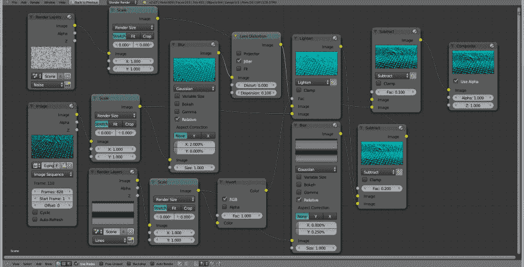
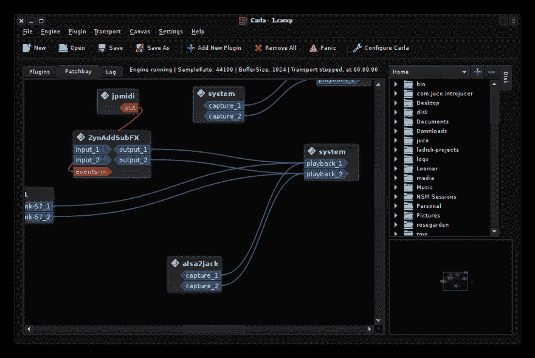

# Graphology:用 HTML5 编写节点 UI 图(第 1 部分)

> 原文:[https://dev . to/minkovsky/graphology-writing-a-graph-of-nodes-ui-in-html 5-part-1](https://dev.to/minkovsky/graphology-writing-a-graph-of-nodes-ui-in-html5-part-1)

我喜欢 Blender 的合成器节点。

[T2】](https://res.cloudinary.com/practicaldev/image/fetch/s--QBsgATOn--/c_limit%2Cf_auto%2Cfl_progressive%2Cq_auto%2Cw_880/http://i.imgur.com/LBSEWh4.png)

这并不意味着我知道如何很好地使用它们，但我喜欢它的用户界面，我认为它在这种情况下工作得很好。

我还有点喜欢 JACK Patchbay，因为它向您展示了所有东西的确切连接位置——并且它使用了类似的界面。

[T2】](https://res.cloudinary.com/practicaldev/image/fetch/s--iUcEjjH1--/c_limit%2Cf_auto%2Cfl_progressive%2Cq_auto%2Cw_880/http://kxstudio.linuxaudio.org/screenshots/carla-patchbay.png)

我们不会在这里谈论 ALSA 模块合成器。

我喜欢这些界面，因为它们向您展示了复杂图形中的一切是如何连接的，您可以放大特定部分并更改单个节点的一些设置，或者缩小并很好地感受数据(无论是像素、矢量数据、声音等)是如何流经图形的。

所以我想写一个通用的图形接口来处理复杂节点的图形。我想使用一种数据驱动的方法，这样，如果你愿意，节点 ui 将自动生成。

## 至此

漫无目的的实验方法。这就是我所追求的那种用户界面。它对屏幕尺寸的反应相当糟糕。

[T2】](https://res.cloudinary.com/practicaldev/image/fetch/s--OcsbbUul--/c_limit%2Cf_auto%2Cfl_progressive%2Cq_auto%2Cw_880/https://thepracticaldev.s3.amazonaws.com/i/sk7nfzihx4dju0igsa1c.png)

[节点 UI 示例](https://codepen.io/FLamparski/pen/LyErym)

这里有一个简单的演示，演示了我所追求的交互之一:[拖动贝塞尔曲线连接器](https://codepen.io/FLamparski/pen/JNoZEM)。

请注意，这很可能是一种可怕而拙劣的方法。它使用 *SVG* 来呈现连接器，并在您用鼠标拖动其自由端时实时更改路径。

## 现有软件

似乎在某些方面会有所帮助，但我找不到一个能捕捉到我想要的东西的演示。此外，我希望这个用户界面与 React(或多或少)兼容，而 d3 不兼容。

这个演示抓住了我想做的事情的*本质*。它丑得像一只赤裸的鼹鼠，图书馆本身的价格是每年$k。我希望我的 UI 库是开源的(如果这个概念流行起来，有合理的商业许可)。

## 基础数据模型

在下面的例子中，我假设了以下情况:

1.  节点是函数的表示
2.  一个节点可以有许多输入和输出

```
import {Node, Input, Output} from 'nodes-ui';
import {Colour} from '../image/Colour';

export const ColourMixer = Node({
  type: 'ColourMixer',
  name: 'Colour Mixer',
  inputs: {
    colour1: { name: 'Colour 1', type: Colour },
    colour2: { name: 'Colour 2', type: Colour }
  },
  settings: {
    mixType: { name: 'Mix function', type: String }
  },
  outputs: {
    output: { name: 'Output', type: Colour }
  }
}); 
```

<svg width="20px" height="20px" viewBox="0 0 24 24" class="highlight-action crayons-icon highlight-action--fullscreen-on"><title>Enter fullscreen mode</title></svg> <svg width="20px" height="20px" viewBox="0 0 24 24" class="highlight-action crayons-icon highlight-action--fullscreen-off"><title>Exit fullscreen mode</title></svg>

这将是单个节点的定义。对于图中提供外部输入(“源”)或描述外部输出(“汇”)的节点，可能需要一个特例。UI 将接受这些节点定义，变魔术般地构造这些节点的图形表示，允许您添加和删除它们，并将它们链接到图形中。最后，它会给你一个类似这样的对象图(这里的`#'id'`符号应该被认为是“一个具有这个 ID 的节点对象的引用):

```
{
  id: 'ColourMixer-35',
  type: 'ColourMixer',
  settings: {
    mixType: 'multiply'
  },
  inputs: {
    colour1: {from: #'Image-24', output: 'colourData'},
    colour2: {from: #'Colour-5', output: 'colour'}
  },
  outputs: {
    output: {to: #'Display-1', input: 'colourData'}
  }
} 
```

<svg width="20px" height="20px" viewBox="0 0 24 24" class="highlight-action crayons-icon highlight-action--fullscreen-on"><title>Enter fullscreen mode</title></svg> <svg width="20px" height="20px" viewBox="0 0 24 24" class="highlight-action crayons-icon highlight-action--fullscreen-off"><title>Exit fullscreen mode</title></svg>

(我猜在顶层，你必须有一个像`{sources: [...], sinks: [...]}`这样的对象)

从那里，你可以使用这个图形表示来构造你的内部计算图或者任何你想要的东西，然后在这个结构上运行一些计算。

你觉得这个主意怎么样？我是在重新发明轮子吗？有没有已经可以做到这一点的图书馆？或者你有什么改进的建议？请在评论中告诉我！