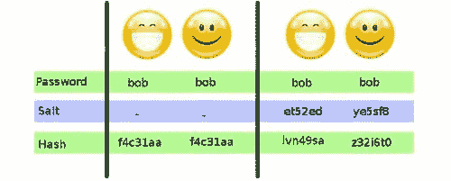

# 密码是如何存储的？

> 原文：<https://dev.to/mohamed3on/brief-introduction-to-salts-in-hashing>

你有没有想过你的密码是如何储存在你使用的网站上的？

你有没有想过为什么有些网站告诉你设置一个新的密码，而不是每当你点击“忘记密码”时就发送给你忘记的密码？。

这是因为现在大多数网站不会以纯文本形式保存你的密码，而是保存它的哈希，每当你用密码登录时，他们都会对它进行哈希处理，并将结果哈希与数据库中的哈希进行比较。这意味着任何进入他们数据库的攻击者只会看到你密码的散列，而不是真正的密码。

提示:如果你忘记了你的密码，而网站以明文的形式把它发送给你，那么这就是他们存储密码的方式。你应该确保你没有在其他地方使用那个密码，并且永远不再使用那个网站。

## 但是什么是哈希呢？

哈希是一个单向函数的输出，它接受一个输入并将其映射到一个固定长度的字符串，该字符串作为给定输入的唯一签名，并且理想情况下永远不会与任何其他输入一起产生 [(Wikipedia)](https://en.wikipedia.org/wiki/Cryptographic_hash_function) 。哈希函数的重要属性是

1.  确定性(相同的输入每次给出相同的散列)
2.  实际上不可能从两个不同的输入生成相同的散列
3.  除非尝试每一种可能的输入，否则不可能从散列中获得输入。
4.  对输入的任何更改，无论多小，都会使结果散列与原始输入的散列无法区分。散列函数的例子包括 MD5 [(被破坏)](http://www.win.tue.nl/hashclash/rogue-ca/.)、SHA-1 [(不推荐)](https://blog.qualys.com/ssllabs/2014/09/09/sha1-deprecation-what-you-need-to-know)和 SHA-3 [(推荐标准)](http://csrc.nist.gov/groups/ST/hash/sha-3/sha-3_standardization.html.)。不幸的是，许多人可以使用相同的密码，因为哈希函数是确定性的，这意味着这些密码的哈希将是相同的。这意味着如果密码数据库遭到破坏，并且您知道一个用户的密码，那么您也可以访问任何拥有相同密码的用户(因为哈希是相同的)。

## 输入盐

Salts 是对每个用户都是唯一的随机数据，在对其进行哈希运算之前，会将其添加到用户的密码中。由于好散列的第四个属性，新散列与旧散列不可识别，因此即使用户 X 和 Y 使用相同的密码(因为 X 和 Y 具有不同的、唯一的 salts ),每个用户的密码散列看起来也完全不同。salt 可以明文公开存储，因为它只是随机数据，不能提供任何关于用户密码的信息。

[T2】](https://res.cloudinary.com/practicaldev/image/fetch/s--V8qxheXy--/c_limit%2Cf_auto%2Cfl_progressive%2Cq_auto%2Cw_880/https://thepracticaldev.s3.amazonaws.com/i/ff65yhnhfcqcv6va5nca.png)

## 但是我如何在我的网站上存储密码呢？

[这是*广博*栈溢出的答案。](https://security.stackexchange.com/questions/211/how-to-securely-hash-passwords/31846#31846)