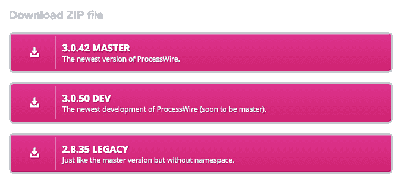
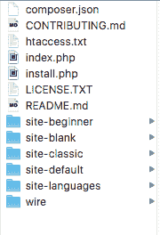
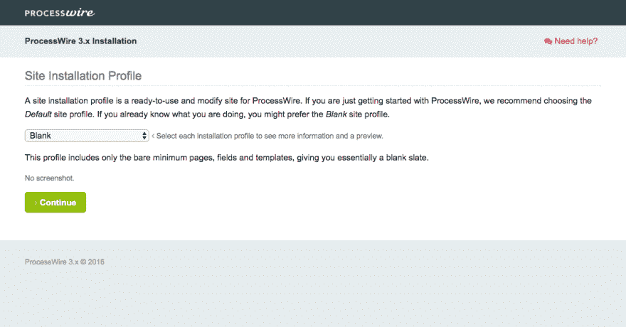
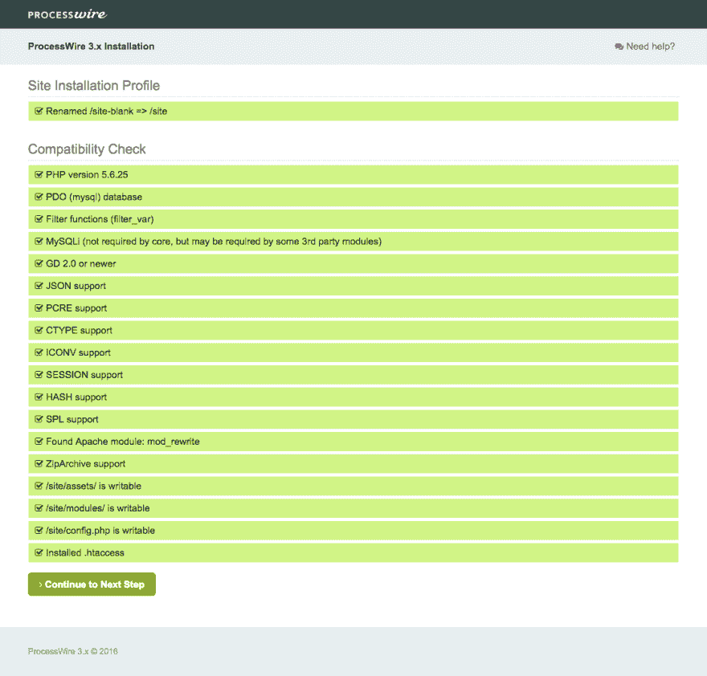
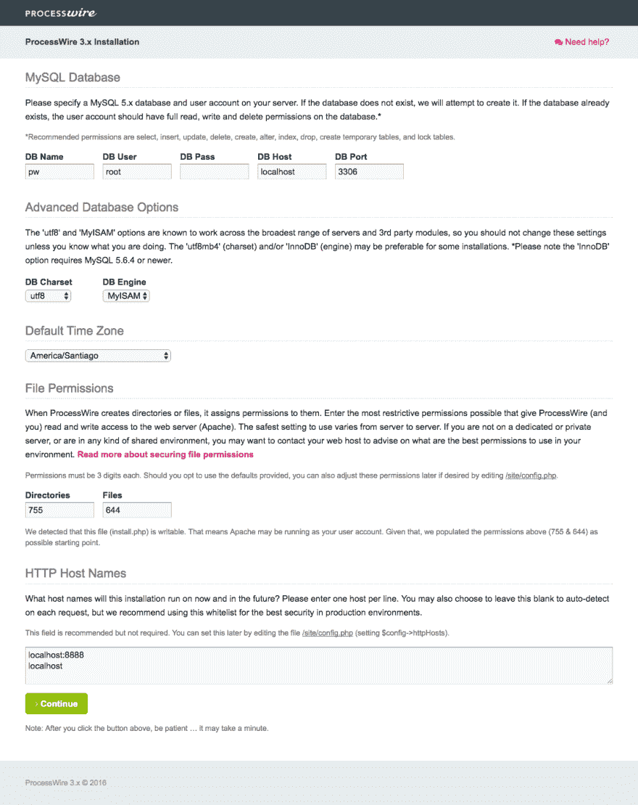
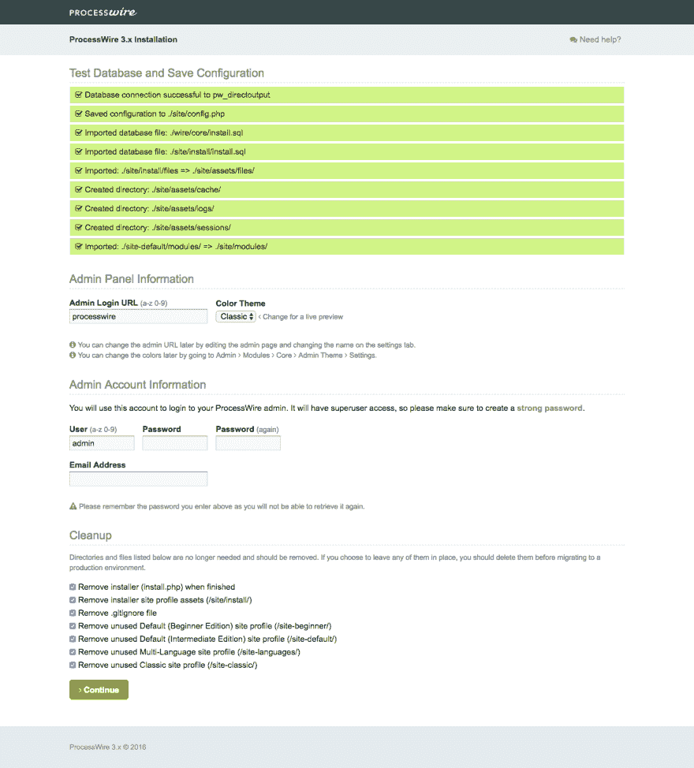
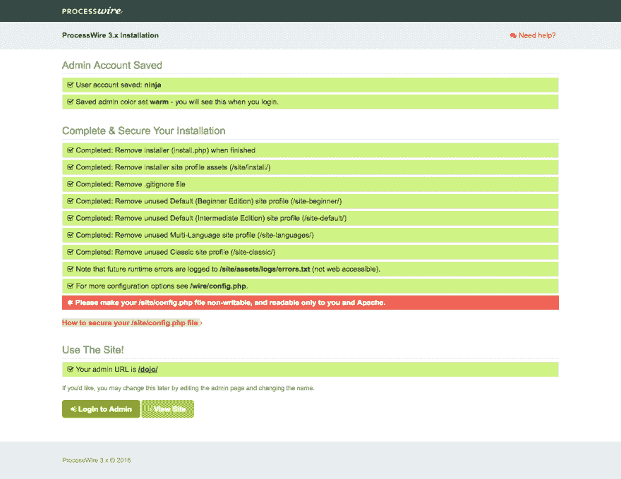
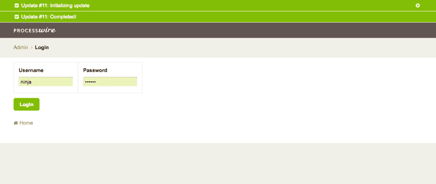

# 安装过程线

> 原文:[https://dev.to/clsource/installing-processwire](https://dev.to/clsource/installing-processwire)

*ProcessWire* 安装相当简单。有各种方法可以获得最新版本，如传统下载、 *git* 、使用[https://wireshell.pw/](https://wireshell.pw/)、 [http://grab.pw](http://grab.pw) 或使用[https://getcomposer.org](https://getcomposer.org)。由于更直接的方式是传统的下载，我们将使用这种方法。

## 下载最新版本

你必须去[https://processwire.com/download/](https://processwire.com/download/)选择更适合你需求的当前版本。截止到本文撰写之时，当前的 3.x 版本是 *3.0.61* 。

[T2】](https://res.cloudinary.com/practicaldev/image/fetch/s--fYTI8mno--/c_limit%2Cf_auto%2Cfl_progressive%2Cq_auto%2Cw_880/https://thepracticaldev.s3.amazonaws.com/i/9mjneipqkk1n6z3qd51o.png)

### 应该用哪个版本？

ProcessWire 有两种不同的版本。一个有 PHP 名称空间，另一个没有名称空间。很多模块是在 *ProcessWire* 支持名称空间之前制作的，但幸运的是 *ProcessWire* 足够聪明，加载它们没有问题。名称空间对于更干净地访问 *ProcessWire* 属性和方法非常方便，并且允许新类型的架构。

#### ProcessWire 3.x

创建新站点或首次下载 *ProcessWire* 时推荐。名称空间支持使用*作曲者*，因此您可以访问*作曲者*带来的大量代码。名称空间还允许多个 *ProcessWire* 实例(访问另一个 PW 安装)。

```
 The PHP namespace used by ProcessWire is:

<?php namespace ProcessWire; ?> 
```

<svg width="20px" height="20px" viewBox="0 0 24 24" class="highlight-action crayons-icon highlight-action--fullscreen-on"><title>Enter fullscreen mode</title></svg> <svg width="20px" height="20px" viewBox="0 0 24 24" class="highlight-action crayons-icon highlight-action--fullscreen-off"><title>Exit fullscreen mode</title></svg>

#### ProcessWire 2.8.x 遗留

当您需要与 3.x 相同的功能，但在 2.7 这样的非名称空间环境中时，推荐使用。通常当旧项目需要安全更新，而您不需要或不想要名称空间支持时。此版本中不允许有*编写器*或多个实例。

#### Dev 还是 Master？

*Master* 是代码最稳定、经过测试的版本。相反的， *Dev* 可能包含新的 bug，因为增加了新的特性。如果你需要可靠的东西，使用*大师*，如果你想尝试新的好东西，使用*开发*。如果你发现了一个 bug，需要帮助或者想要申请一个新功能，请在官方的 github 库([https://github.com/processwire](https://github.com/processwire))或者论坛([https://processwire.com/talk](https://processwire.com/talk))中报告。

## 服务器需求

ProcessWire 需要一个基本的设置，这个设置可以在很多主机提供商那里找到。

以下是最低要求:

*   运行 Apache 的基于 Unix 或 Windows 的 web 服务器。
*   支持 PDO 数据库的 PHP 版本 5.3.8 或更新版本(最好是 PHP 5.6 以上)。
*   MySQL 或 MariaDB，5.0.15 或更高版本(5.6+优先)。
*   Apache 必须启用 mod_rewrite(如果适用)。
*   阿帕奇必须支持。htaccess 文件(如果适用)。
*   PHP 捆绑的 GD 2 库(也支持 ImageMagick)。

### 是否只支持 Apache？

可以使用其他网络服务器。但是默认配置只适合 Apache。用户报告使用 https://www.nginx.com 的[或 https://caddyserver.com 的](https://www.nginx.com)[成功运行了 *ProcessWire* 。除了 Apache 之外，使用 Web 服务器的风险应该由您自己承担。](https://caddyserver.com)

### 除了 MySQL (MariaDB)还支持其他数据库吗？

不支持。不支持其他数据库，如 *SQLite* 、 *Oracle* 、 *PostgreSQL* 或 *Microsoft SQL Server* 。主要原因是因为 *ProcessWire* 经过了高度优化和定制，以适应 *MySQL* 技术。这使得能够以超高效的方式存储大量数据和执行复杂查询。

## 安装

我们将假设您已经有一个工作的 PHP、Apache 和 MySQL 环境，至少满足最低 *ProcessWire* 要求。流行的 PHP 开发应用有 https://www.mamp.info/en/的 Mamp [、http://www.ampps.com 的 Ampps](https://www.mamp.info/en/) [或 https://www.apachefriends.org/es/index.html 的 Xampp](http://www.ampps.com)。我们将使用命令行进行 MySQL 配置。尽管如果你愿意的话，你可以使用那些应用程序自带的工具，比如 PHPMyAdmin。也支持像 *Laravel 的代客*[https://laravel.com/docs/master/valet](https://laravel.com/docs/master/valet)这样的现代工具参见[https://process wire . com/talk/topic/13246-Laravel-Valet-with-process wire/](https://processwire.com/talk/topic/13246-laravel-valet-with-processwire/)

### 创建一个 ProcessWire 数据库

具备所有先决条件后，我们可以继续为 *ProcessWire* 创建一个新的 MySQL 数据库和用户。

首先，登录 MySQL Shell:

```
$ mysql -u root -p 
```

<svg width="20px" height="20px" viewBox="0 0 24 24" class="highlight-action crayons-icon highlight-action--fullscreen-on"><title>Enter fullscreen mode</title></svg> <svg width="20px" height="20px" viewBox="0 0 24 24" class="highlight-action crayons-icon highlight-action--fullscreen-off"><title>Exit fullscreen mode</title></svg>

现在，创建数据库和用户:

`

```
CREATE DATABASE processwire;
CREATE USER pwuser@localhost;
SET PASSWORD FOR pwuser@localhost= PASSWORD("password");
GRANT ALL PRIVILEGES ON processwire.* TO pwuser@localhost 
IDENTIFIED BY 'password';
FLUSH PRIVILEGES;
exit 
```

<svg width="20px" height="20px" viewBox="0 0 24 24" class="highlight-action crayons-icon highlight-action--fullscreen-on"><title>Enter fullscreen mode</title></svg> <svg width="20px" height="20px" viewBox="0 0 24 24" class="highlight-action crayons-icon highlight-action--fullscreen-off"><title>Exit fullscreen mode</title></svg>

这里发生了几件事:

1.  创建实际的`processwire`数据库。
2.  创建用户`pwuser`。
3.  为此用户设置密码。
4.  将`processwire`数据库的所有权限授予该用户。
5.  重新加载新的用户设置。

请随意用不同的名称命名您的数据库或用户。

### 下载并复制文件

我们就去下载页面抓取最新的 master[https://github . com/process wire/process wire/archive/master . zip](https://github.com/processwire/processwire/archive/master.zip)。并将其解压缩到开发目录中。如果您喜欢使用命令行，您可以使用(Unix 兼容):

`

```
$ curl  -SL http://grab.pw > pw.zip && unzip pw.zip && rm pw.zip 
```

<svg width="20px" height="20px" viewBox="0 0 24 24" class="highlight-action crayons-icon highlight-action--fullscreen-on"><title>Enter fullscreen mode</title></svg> <svg width="20px" height="20px" viewBox="0 0 24 24" class="highlight-action crayons-icon highlight-action--fullscreen-off"><title>Exit fullscreen mode</title></svg>

如果一切顺利，您应该会看到以下文件:

 ``CONTRIBUTING.md composer.json install.php site-classic wire
LICENSE.TXT htaccess.txt site-beginner site-default
README.md index.php site-blank site-languages`` 

 ``[T2】](https://res.cloudinary.com/practicaldev/image/fetch/s--ER1-rdy7--/c_limit%2Cf_auto%2Cfl_progressive%2Cq_auto%2Cw_880/https://thepracticaldev.s3.amazonaws.com/i/wyfe31uwsjove7szqqi0.png)

#### 安装后修改

安装完成后，所有的`site-*`目录都将被删除，并被一个带有所选配置文件的`site`所取代。这里我们将只使用`blank`配置文件。

`htaccess.txt`将被重命名为`.htaccess`(仅在 Apache 服务器中有效)。

所有这些修改都由`installer.php`文件自动完成。

#### 重要文件和目录

以下项目很重要。不应删除。

**composer.json**

该文件启用了 *composer* 集成。如果您想使用该工具，则不应删除。

**index.php**

保存 *ProcessWire* 的主脚本。如果您想在另一个脚本中使用 *ProcessWire* 的功能和属性，您必须像这样包含这个文件:

`` PHP
T3】？php
包含("/path/to/process wire/index . PHP ")；`

 ``

 `**电线/**

这个目录包含了所有的*核心*文件。不应该碰它。仅用于升级核心版本。

**地点/**

所有与站点相关的文件(模板、模块、日志、图像)都组织在这个目录中。

**。htaccess**

定义 Apache 的路由和安全规则。如果您使用 Apache，请不要删除。

### 开始安装

打开浏览器，导航到您定义的开发目录。你应该会受到 *ProcessWire* 安装程序的欢迎。要做的第一个决定是选择所需的配置文件。这些概要文件包含示例代码，您可以自己进一步探索。我们将在本文中使用的概要文件是`Blank`概要文件。

[T2】](https://res.cloudinary.com/practicaldev/image/fetch/s--6OdlB-_3--/c_limit%2Cf_auto%2Cfl_progressive%2Cq_auto%2Cw_880/https://thepracticaldev.s3.amazonaws.com/i/ewr4kkww8fy3g9dklxwo.png)

#### 服务器检查

选择所需的配置文件后， *ProcessWire* 将检查您的服务器是否符合最低要求。如果缺少什么，您应该检查您的服务器配置并重试。

[T2】](https://res.cloudinary.com/practicaldev/image/fetch/s--HKjdoOy9--/c_limit%2Cf_auto%2Cfl_progressive%2Cq_auto%2Cw_880/https://thepracticaldev.s3.amazonaws.com/i/vxz5obcoygbyxr6va62u.png)

#### 数据库配置

如果满足了所有的服务器要求，现在您将需要告诉 *ProcessWire* 数据库凭证(*用户*、*密码*、*服务器地址*、*服务器端口*)，以及可选的数据库字符集和引擎。

[T2】](https://res.cloudinary.com/practicaldev/image/fetch/s--EXDsF4Mz--/c_limit%2Cf_auto%2Cfl_progressive%2Cq_auto%2Cw_880/https://thepracticaldev.s3.amazonaws.com/i/6lsr9ud3epvl2t6ogglz.png)

##### MyISAM 和 InnoDB 哪个引擎更好？

*ProcessWire* 没有默认为 InnoDB 的唯一原因是因为 *PW* 大量使用了全文索引，InnoDB 直到 MySQL 5.6.4 才支持它们。如果您想使用 InnoDB，只需在选择选项之前确保您的开发和生产环境都支持它。

虽然相对于 MyISAM，InnoDB 有很多好处，但无可否认，在 *ProcessWire* 世界中，我们很少遇到 MyISAM 的相对缺点。但是，如果处理一个需要执行大量页面保存(无论是自动保存，还是由一组人同时编辑)的高流量站点，您可能会注意到使用 InnoDB 的真正好处。对于需要定期自动导入数据以更新大量页面的网站，您可能也会看到显著的好处。为什么？InnoDB 不需要像 MyISAM 那样锁定整个表来执行这样的操作，因此在这些安装中确实有提高性能的潜力。出于这个原因， *ProcessWire* 一直在某些表上使用 InnoDB(比如那些用于用户会话的表)。但是现在您可以指定 *ProcessWire* 应该对所有的表使用 InnoDB。

选择 InnoDB 时要小心，因为如果您的开发服务器运行的是 MySQL 5.6.4 或更新版本，而您的生产服务器没有运行，这可能是一个真正的问题。在这种情况下，生产服务器将无法导入开发服务器数据库。

##### utf8 和 utf8mb4 哪个字符集好？

要使用 *utf8mb4* 字符集，您需要 MySQL 5.5.3 或更新版本。使用时，它使 *ProcessWire* 能够存储 4 字节字符，而不是像 *utf8* 那样只存储 3 字节字符。

相对于 *utf8* ，你为什么需要 *utf8mb4* ？大多数人可能不知道，但是有些语言对它有需求，因为 *utf8mb4* 极大地扩展了可以表示的字符数量。例如，除了语言需求之外，它还能让你在 *ProcessWire* 中使用*表情符号*。

因为 *utf8mb4* 每个字符使用更多的字节，它对 *ProcessWire* 使用的索引长度设置了新的限制。 *ProcessWire* 有几个 255 字符的索引长度， *utf8mb4* 允许的最大长度是 MyISAM 的 250 个和 InnoDB 的 191 个(MySQL 前缀使用 MyISAM 可以达到 1000 字节长，InnoDB 表可以达到 767 字节长。由于 *utf8bm4* 最长为 4 个字节，因此在 MyISAM 中，密钥长度最长应为 250 个字符`4 * 250 = 1000 bytes`，在 InnoDB `4 * 191 = 764 bytes`中最长应为 191 个字符。因此，为了支持 *utf8mb4* ，所有核心*字段类型*在 MyISAM 中使用的长度索引不超过 250 个，在 InnoDB 中不超过 191 个。然而，第三方模块可能使用与 *utf8mb4* 不兼容的索引长度，所以这一点需要记住。

与 InnoDB 选项一样，在使用该选项之前，您需要确保您的 MySQL 版本在开发和生产服务器之间足够新。尽管这些要求是针对 MySQL 5.5.3 或更高版本的，但在这里大多数情况下都没问题。然而，因为目前没有多少人在 *ProcessWire* 中使用 *utf8mb4* 支持，所以你应该考虑只在需要的时候使用它。

#### 时区

像`$page->created`这样的模块和时间相关字段使用这个时区信息来正确显示日期和时间。你应该选择对你的需要更有意义的一个。安装中显示的默认值取决于 *php.ini* 设置值。例子`date.timezone = "America/Santiago"`。

#### 文件权限

当 *ProcessWire* 创建目录或文件时，它会给它们分配权限。当你安装 *ProcessWire* 时，它会检查 install.php 文件是否可写。如果是的话，那么 Apache 很有可能(虽然不能保证)作为您的用户帐户运行。如果检测到这种情况，它会建议对可写目录使用 755 权限，对可写文件使用 644 权限，作为起点。这意味着目录和文件只对你是可写的，但对其他人是可读的。

如果安装程序填充 777 和 666 权限，这将转化为每个人都可读和可写的目录和文件，这在共享环境中不是一个好的场景。但是如果不知道更多关于托管环境的信息，它们可能是我们所知道的唯一可以让 *ProcessWire* 运行的权限。在这两种情况下，你都应该阅读文件许可文档以获得更多的细节。https://processwire.com/docs/security/file-permissions/[。](https://processwire.com/docs/security/file-permissions/)

通常我们只需要默认的推荐值，对于目录是 755 权限，对于文件是 644 权限。

#### 主机名称

这个安装现在和将来将在什么主机名上运行？。您也可以选择将此字段留空，以便对每个请求进行自动检测，但是为了在生产环境中获得最佳安全性，我们建议使用此白名单。

推荐的选择是在开发环境中将其留空，仅在生产环境中执行时填充。如果您将开发中使用的值(例如`localhost`)留在这个列表中，那么像`$page->httpUrl`这样的一些属性可能包含本地主机地址，即使您正在使用您的生产环境。还建议您填写所有可能的子域(`example.com, www.example.com`)，否则当您登录管理面板时会收到一条警告消息。

#### 最后一步

最后，剩下的唯一配置是管理 url 和管理员用户配置。为了增加安全性，建议*管理员登录 URL* 应该不同于*管理员*或 *processwire* ，并且与您的站点上下文更加相关。例如，在一个食品相关的网站中，管理页面可以被称为`kitchen`。隐藏你的管理网址是一个很好的做法。但是如果使用了强密码，就像他们应该做的那样，拥有一个已知的管理 URL 也不会有安全问题。建议您移除所有安装文件和未使用的描述文件。

[T2】](https://res.cloudinary.com/practicaldev/image/fetch/s--EX5PfGPx--/c_limit%2Cf_auto%2Cfl_progressive%2Cq_auto%2Cw_880/https://thepracticaldev.s3.amazonaws.com/i/t6n507qcf5g3smzwr2df.png)

##### 重置管理员 URL 或密码

如果您忘记了您的管理员 url 或用户，您可以通过将脚本放入模板或`site/ready.php`文件来设置新值。

**重置管理员密码**

``php
<?php
$u = $users->get('admin'); // or whatever your username is
$u->of(false);
$u->pass = 'your-new-password';
$u->save();`  `**显示管理员网址**``

 ````php
<?php
echo wire('config')->urls->admin;`` 

 ``如果您想使用一个单独的文件。在`index.php`的同一个目录下创建一个名为`reset.php`的文件。

`` PHP
T2】？服务器端编程语言（Professional Hypertext Preprocessor 的缩写）`

 `要求“index . PHP”；
$admin = wire('用户')- > get('管理')；
$ admin->setOutputFormatting(false)；
$admin- > set('pass '，' your-new-password ')；
$admin- >保存(‘通过’)；

？>
`

 `*ProcessWire* 版本 2.6.9 及更高版本也可以使用这种更短的形式:

``php`

 `要求“index . PHP”；
$ admin = $ users->get(' admin ')；//或者随便你的用户名是什么
$admin- > setAndSave('pass '，' your-new-password ')；

？>
`

 `工作完成后记得删除那些代码。

#### 工作完成

恭喜你！现在，您已经有了一个功能齐全的 *ProcessWire* 站点。你现在可以访问你的管理网址，并开始创建真棒网站。建议在生产环境中为您的 config.php*配置正确的权限。(有关更多信息，请参见文件权限文档)。*

[T2】](https://res.cloudinary.com/practicaldev/image/fetch/s--cyIQSc7N--/c_limit%2Cf_auto%2Cfl_progressive%2Cq_auto%2Cw_880/https://thepracticaldev.s3.amazonaws.com/i/063cx7k9bjjem2c4j8u0.png)

在空白个人资料中，您只会看到标题为*主页*的空白页面。

[T2】](https://res.cloudinary.com/practicaldev/image/fetch/s--tqydcaCo--/c_limit%2Cf_auto%2Cfl_progressive%2Cq_auto%2Cw_880/https://thepracticaldev.s3.amazonaws.com/i/43uy6l9eqtacczgc0124.png)

管理面板将类似于下图。

[T2】](https://res.cloudinary.com/practicaldev/image/fetch/s--OGsP1BIL--/c_limit%2Cf_auto%2Cfl_progressive%2Cq_auto%2Cw_880/https://thepracticaldev.s3.amazonaws.com/i/od4tnae8m2uqncvspz0d.png)

#### 安装完成

典型的 *ProcessWire* 系统的安装既简单又快捷。有很多方法，比如使用定制的*站点简介*或者使用*wireshell*([https://wireshell . pw](https://wireshell.pw))。对于大多数开发人员来说，前面的逐步安装过程足以满足他们的需求。

##### 更多信息

[http://processwire.com/docs/install/](http://processwire.com/docs/install/)

[https://web design . tuts plus . com/tutorials/how-to-install-and-setup-process wire-CMS-CMS-25509](https://webdesign.tutsplus.com/tutorials/how-to-install-and-setup-processwire-cms--cms-25509)

#### 特别感谢

我要感谢 *fbg13* 在 PW 论坛上的更正:)````````````