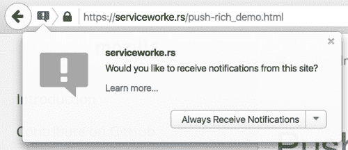
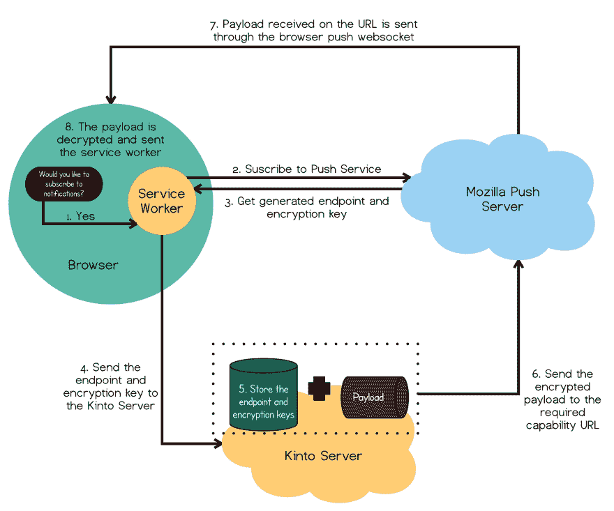

# 网络推送的内容和方式

> 原文:[https://dev.to/mansimarkaur/the-what-and-how-of-web-push](https://dev.to/mansimarkaur/the-what-and-how-of-web-push)

## 什么是 web 推送通知？

一段时间以来，本地应用程序有幸能够向用户发送引人入胜的及时内容。网络紧随其后。基本上，你连接到互联网，忙于浏览器之外的其他事情或在浏览器中浏览其他网站，如果你允许网站推送通知，你会收到一个所谓的网络推送通知。之所以这样称呼这些通知，是因为它们是由网站的服务器“推”给客户端的，并使用 showNotification API 显示。Push API 负责将有效负载从服务器发送到客户端。

 
请求用户许可推送通知的网站显示类似的提示，并且如果用户同意被通知，则网站的*活跃服务工作者*订阅推送通知。

## 什么是服务人员？

服务人员是在浏览器后台工作的 JavaScript 文件，可以控制与其相关联的网页/站点。它不与特定的选项卡或页面链接，而是通过充当网站服务器和浏览器之间的链接来充当浏览器的代理服务器。它处理推送通知，并在后台同步 API。即使在页面或网站关闭后，甚至在浏览器重启之间，它也能继续工作。强大的东西。权力越大，责任越大，所以，服务人员只能在 HTTPS 的网页上注册。由于服务人员没有链接到标签或网页，他们根本不处理任何 DOM。但是，它们可以与打开的选项卡通信，并向它们发送事件。未来，服务人员将支持其他东西，如定期同步或地理围栏(一种 API，让 [webapps](https://www.w3.org/TR/geofencing/#dfn-webapp) 在特定位置周围设置地理边界，然后在主机设备进入或离开这些区域时发送通知。)

## 推送通知是如何工作的？

对于一个向用户推送通知的网站，它必须有一个活跃的服务工作者。现在，对于要激活的**服务人员**:它需要首先用`ServiceWorkerContainer.register()`方法注册，然后当服务人员控制的网页/站点被访问时立即下载，然后仅当发现下载的文件是新的时才安装，然后一旦没有任何使用旧服务人员的加载页面时激活。在用户允许站点推送通知之后，服务人员使用`PushManager.subscribe()`订阅推送服务。推送服务器生成唯一的能力 URL(这向网站服务器通知通知必须被推送至的端点)和加密密钥来认证和加密数据。这些详细信息被发送给服务人员，服务人员将其发送给 web 应用服务器。在 web app 服务器端，存储了推送订阅凭证(由服务工作者发送的端点和加密密钥),以便在需要将推送消息发送给推送订阅者时可以使用它们。[ *功能 URL:基本上，有两种方式在 web 上提供访问信息的权限:1 .服务器要求想要访问内容的人提供正确的令牌(如密码)或 2。这些信息出现在一个模糊的网址上，只有有权访问的人才能获得链接。这些 URL 被称为功能 URL。* ]

### 推送服务器

推送服务器是中间人，在 web 应用服务器和客户端的服务人员之间路由有效负载。每个服务工作者打开一个通信信道来与推送服务通信。推送服务使用全球唯一的用户代理 ID (UAID)来将客户端与其相关联的通道 ID 相关联，即每个浏览器只有一个 websocket，然后使用用户代理 ID 将所有服务工作者的所有通知路由到同一个 websocket，然后浏览器将使用通道 ID 将有效载荷路由到正确的服务工作者

### 最终步骤

当服务器必须向用户推送新内容时，它会向推送服务发送一个 HTTP POST 请求，其中包含订阅通知的用户的订阅 id 和加密的有效负载。该请求必须包含一个 [TTL](https://blog.mozilla.org/services/2016/02/20/webpushs-new-requirement-ttl-header/) 报头(生存时间),用于限制用户不在线时消息应该排队多长时间。【*通过互联网发送数据时，传输的每个单元都包含报头信息和实际发送的数据。报头标识数据包的来源和目的地，而实际数据称为有效载荷。* ]

浏览器启动服务工作器，负责处理在 UserAgent push websocket 上接收的消息。然后，应用程序可以通过`ServiceWorkerRegistration.showNotification()`发出通知或对有效载荷做其他事情来对收到的推送消息做出反应。

这里有一个图表，可以帮助缓解围绕所有相关服务器的混乱:
