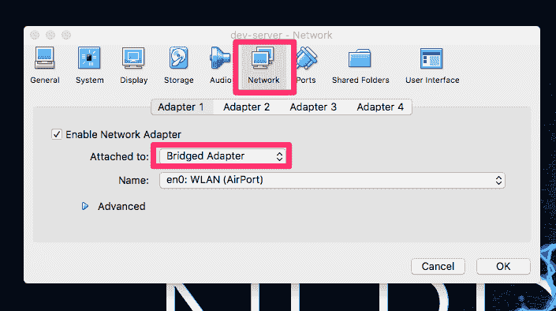
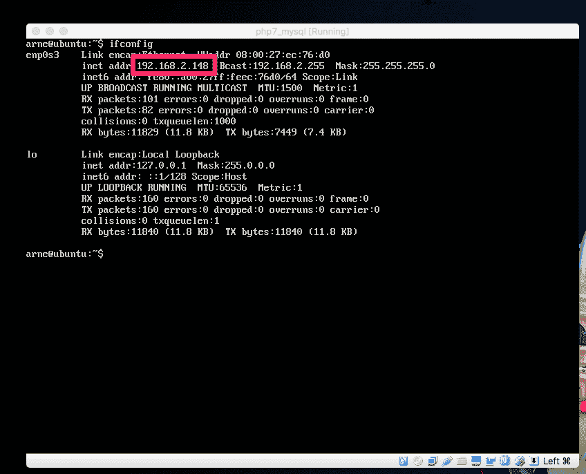
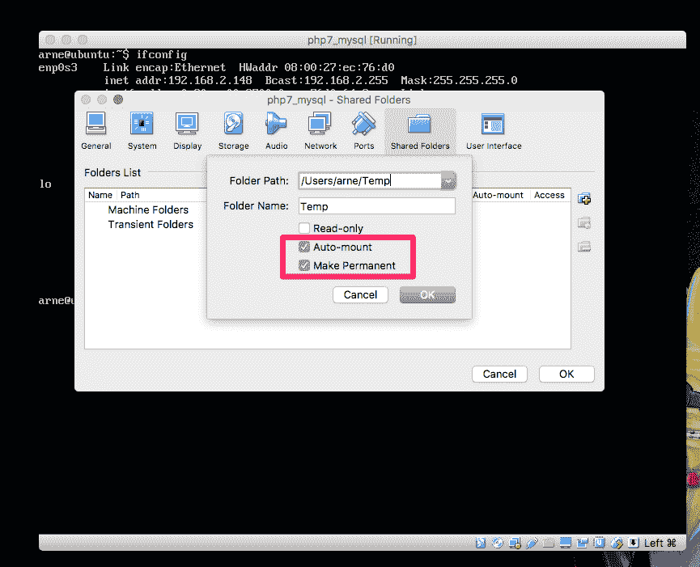
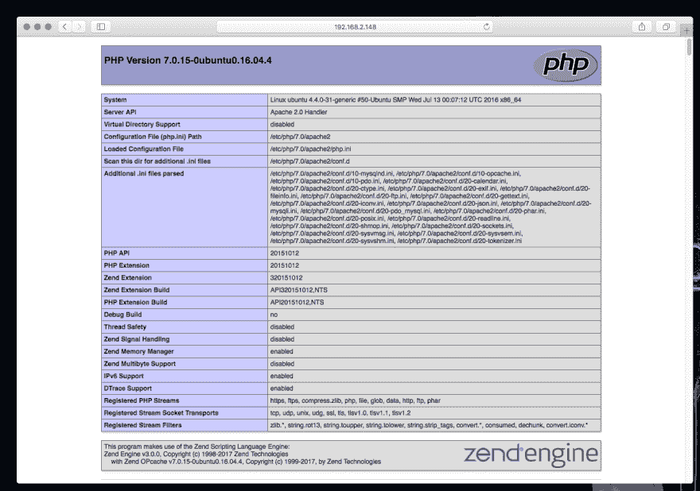

# 在 Ubuntu 上使用 PHP 7.0、MySQL、Apache 2 和 PhpMyAdmin 设置虚拟机

> 原文：<https://dev.to/ophasnoname/setting-up-a-vm-with-php-70-mysql-apache-2-and-phpmyadmin-on-ubuntu>

对我来说，又到了处理 PHP 的时候了，是的，有些人可能会大叫，但是我喜欢这门语言。因为我想再次使用一个“真正的虚拟机”,而不是 Docker 容器，这里有一个使用 Virtualbox 创建虚拟机的小教程，它可以做以下事情。

## VM 的“特性”

*   PHP 7.x
*   MySQL 5.x
*   Apache 2.x
*   Ubuntu 16.04.x
*   PHPMyAdmin
*   Mac 共享文件夹

第一步，获取我们的 Ubuntu 16.04.x 镜像:[下载](https://www.ubuntu.com/download/server)。

因此，我们在 Virtualbox GUI 中创建了一个虚拟机，我最喜欢的是使用网桥进行 ssh 访问——这样虚拟机就可以从我的网络中获得一个内部 IP，原则上也可以从外部通过 NAT 进行访问。

[T2】](https://res.cloudinary.com/practicaldev/image/fetch/s--zTKuv4_o--/c_limit%2Cf_auto%2Cfl_progressive%2Cq_auto%2Cw_880/https://thepracticaldev.s3.amazonaws.com/i/ds7mvu95idl802aauaqe.png)

我认为，Ubuntu 服务器的安装没有什么我不需要在这里描述的，只有重要的:在安装的最后勾选 OpenSSH 服务器，这样我们就可以通过 SSH 与我们的虚拟机很好地工作。

如果你仍然不确定如何做到这一点，或者只是想进入一种恍惚状态，我已经在 Youtube 上上传了整个视频(没有评论)，6:30 放松(有点慢，因为在后台《上古卷轴在线》正在做他的安装工作)。

[截屏@ Youtube](https://youtu.be/5RBxmsuTRX8)

要获得新虚拟机的私有 IP，只需登录并使用“ifconfig as”命令。

[T2】](https://res.cloudinary.com/practicaldev/image/fetch/s--FyP_3uC9--/c_limit%2Cf_auto%2Cfl_progressive%2Cq_auto%2Cw_880/https://thepracticaldev.s3.amazonaws.com/i/cfmowgm2dluc276655xj.png)

从现在开始，我们使用 SSH 连接从我们的计算机到 Virtualbox 虚拟机。

```
ssh ssh user@vm-ip 
```

Enter fullscreen mode Exit fullscreen mode

## 安装软件包

继续安装我们的小型服务器所需的包:PHP、Apache 和 MySQL、PHPMyADMIN(从浏览器管理数据库)。

```
sudo apt-get update
sudo apt-get install apache2 libapache2-mod-php7.0 php7.0 php7.0-mysql mysql-server
sudo apt-get install phpmyadmin php-mbstring php-gettext 
```

Enter fullscreen mode Exit fullscreen mode

请注意“root 密码”,它是在安装 MySQL 服务器时设置的。因此，我们可以稍后连接到数据库——我认为在开发服务器上，我们不需要专门的用户。

一些，或者大部分 PHP 框架需要 mod rewrite 来重写 URL，所以:

```
sudo a2enmod rewrite 
```

Enter fullscreen mode Exit fullscreen mode

对于 VirtualBOX Guest-extension(我们需要将它与 Mac 文件夹共享),请在安装之前安装以下软件包:

```
sudo apt-get install build-essential module-assistant 
```

Enter fullscreen mode Exit fullscreen mode

下一步:将“CD 装入 VirtualBox，上面有客户扩展。为此，请使用 virtualbox 打开窗口，然后单击“设备”-“插入来宾附件”..在菜单栏的顶部。

回到终端，这些现在已经安装:

```
sudo mount /dev/sr0 /media/cdrom/
cd /media/cdrom
sudo ./VBoxLinuxAdditions.run 
```

Enter fullscreen mode Exit fullscreen mode

是重启机器的时候了！若要与您的 Mac 共享文件夹(您稍后会将代码放在那里)，请再次点按“设备”，然后打开“共享文件夹”。在你的电脑上搜索一个合适的文件夹和一个好听的名字，检查自动挂载和永久保存选项。在我的例子中，我想使用个人文件夹中的临时目录。

[T2】](https://res.cloudinary.com/practicaldev/image/fetch/s--MH2_X4hp--/c_limit%2Cf_auto%2Cfl_progressive%2Cq_auto%2Cw_880/https://thepracticaldev.s3.amazonaws.com/i/tuft9vi2vudj3ono7o4a.png)

回到终端，我们现在只需要包含文件夹，我总是将它直接挂载到 Apache web 服务器的文档根目录中。

```
sudo mount -t vboxsf Temp /var/www/html 
```

Enter fullscreen mode Exit fullscreen mode

我们不想在每次重启时都重复这个操作，所以我们把这个东西放到“/etc/rc.local”中:

```
#!/bin/sh -e
#
# rc.local
#
# This script is executed at the end of each multiuser runlevel.
# Make sure that the script will "exit 0" on success or any other
# value on error.
#
# In order to enable or disable this script just change the execution
# bits.
#
# By default this script does nothing.
mount -t vboxsf Temp /var/www/html 
```

Enter fullscreen mode Exit fullscreen mode

让我们在电脑的共享文件夹中创建一个 index.php，内容如下:

```
<?php phpinfo(); ?> 
```

Enter fullscreen mode Exit fullscreen mode

如果我们现在用虚拟机的私有 ip 打开浏览器，我们应该得到 PHP 信息:

[T2】](https://res.cloudinary.com/practicaldev/image/fetch/s--gSvUgQdg--/c_limit%2Cf_auto%2Cfl_progressive%2Cq_auto%2Cw_880/https://thepracticaldev.s3.amazonaws.com/i/mplk5q66nyjj8p5zizuo.png)

要打开 PHPMyAdmin，只需点击 URL:[http://IP/phpymadmin](http://IP/phpymadmin)

就是这样——对不起我的英语，但不是我的母语。希望有人觉得这个简短的教程有用。

如果你想阅读更多我的文章，只要在 Twitter 上关注我: [@ophasnoname](https://twitter.com/ophasnoname)