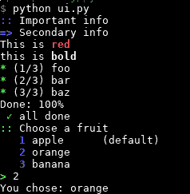

# python-cli-ui 简介

> 原文：<https://dev.to/dmerejkowsky/introducing-python-cli-ui>

*这篇文章最初发表在[我的博客](https://dmerej.info/blog/post/introducing-python-cli-ui/)T3 上*

很长一段时间以来，我一直在我从事的一些 Python 项目中添加一个名为`ui.py`的文件。

因为我相信三个的[法则，而且我已经有三个不同的项目在使用它，所以我决定与全世界分享它。](https://blog.codinghorror.com/rule-of-three/)

请随意看看 github 的页面。

# 它有什么作用

让我们从一个屏幕截图开始:

[T2】](https://res.cloudinary.com/practicaldev/image/fetch/s--HWs8HSnC--/c_limit%2Cf_auto%2Cfl_progressive%2Cq_auto%2Cw_880/https://dmerej.info/blog/pics/python-cli-ui-demo.png)

## 着色

是用 Python 写五颜六色命令行界面的模块。

它是在`colorama`之上的一个小包装，有一个比[蜡笔](https://pypi.python.org/pypi/crayons)或 [lazyme](https://pypi.python.org/pypi/lazyme) 更好的 API。

这里有一个例子:

```
ui.info(ui.red, "Error", ui.reset, ui.bold, file_path, ui.reset, "not found") 
```

Enter fullscreen mode Exit fullscreen mode

这将以红色显示“错误”,以粗体显示文件路径，并正常显示“未找到”。

该 API 遵循`print()`函数的行为:默认情况下，标记由空格分隔，`\n`添加在末尾，如果需要，您可以指定自己的`sep`和`end`关键字。

## 显示枚举

它还允许显示一个列表的条目，注意“一个接一个”的错误，并很好地对齐数字(注意`1/12` )
的前导空格)

```
>>> months = ["January", "February", ..., "December"]
>>> for i, month in enumerate(months):
>>>     ui.info_count(i, 12, month)
* ( 1/12) January
* ( 2/12) February
...
* (12/12) December 
```

Enter fullscreen mode Exit fullscreen mode

## 缩进

```
>>> first_name = "John"
>>> last_name = "Doe"
>>> adress = """\ ACME Inc.
795 E Dragram
Tucson AZ 85705
USA
"""
>>> ui.info("People")
>>> ui.info(ui.tabs(1), first_name, last_name)
>>> ui.info(ui.tabs(1), "Adress:")
>>> ui.info(ui.indent(2, adress))
People:
  John Doe
  Adress:
    795 E Dragram
    Tucson AZ 85705
    USA 
```

Enter fullscreen mode Exit fullscreen mode

## Unicode 善良

您可以定义自己的字符集，它将获得一种颜色、一个 unicode 和一个 ASCII 表示(这样它也可以在 Windows 上工作)。)

例如:

```
check  = _Characters(green, "✓", "ok")

ui.info("Success!", ui.check) 
```

Enter fullscreen mode Exit fullscreen mode

在 Linux 上:

[T2】](https://res.cloudinary.com/practicaldev/image/fetch/s--5C-fU8KU--/c_limit%2Cf_auto%2Cfl_progressive%2Cq_auto%2Cw_880/https://dmerej.info/blog/pics/python-cli-ui-check-unicode.png)

在 Windows 上:

[T2】](https://res.cloudinary.com/practicaldev/image/fetch/s--LO2CQKNf--/c_limit%2Cf_auto%2Cfl_progressive%2Cq_auto%2Cw_880/https://dmerej.info/blog/pics/python-cli-ui-check-ascii.png)

## 语义

该模块还包含`info_1`、`info_2`、`info_3`等“高级”方法，这样就可以编写:

```
ui.info_1("Making some tea")
...
ui.info_2("Boiling water")
...
ui.info_3("Turning kettle on")
...
ui.info_1("Done") 
```

Enter fullscreen mode Exit fullscreen mode

这将被呈现为:

[T2】](https://res.cloudinary.com/practicaldev/image/fetch/s--z1eOUO9w--/c_limit%2Cf_auto%2Cfl_progressive%2Cq_auto%2Cw_880/https://dmerej.info/blog/pics/python-cli-ui.png)

这允许你以一种连贯的方式将你的信息分组。

这里的主要信息是“泡茶”。“烧水”是泡茶的一个子任务，而“打开水壶”是烧水过程的一个子任务。

同样，当出现问题时，会提供`warning`、`error`和`fatal`方法。(最后一个叫`sys.exit()`，故名)

还有一个`debug`函数，用于您只在调试时感兴趣的消息:您可以使用`CONFIG`全局字典来控制详细程度。

```
ui.CONFIG['quiet'] = True
ui.info("this is some info") # won't get printed 
```

Enter fullscreen mode Exit fullscreen mode

```
ui.CONFIG['verbose'] = True
ui.debug("A debug message") # will get printed 
```

Enter fullscreen mode Exit fullscreen mode

## 互动

### 任意一个缺省字符串

```
>>> domain = ui.ask_string("Please enter your domain name", default="example.com")
>>> print("You chose:", domain)
> Please enter your domain name (example.com)
(nothing)
> You chose example.com

>>> domain = ui.ask_string("Please enter your domain name", default="example.com")
>>> print("You chose:", domain)
> Please enter your domain name (example.com)
foobar.com
> You chose foobar.com 
```

Enter fullscreen mode Exit fullscreen mode

### 布尔选择

注意提示是如何从`Y/n` (y 大写)到`y/N` (n 大写)取决于默认值:

```
>>> with_sugar = ui.ask_yes_no("With sugar?", default=True)
> With sugar ? (Y/n)
n
> False

>>> with_cream = ui.ask_yes_no("With cream?", default=False)
> With cream? (y/N)
(nothing)
> False 
```

Enter fullscreen mode Exit fullscreen mode

### 列表中的选择

注意用户是如何陷入循环直到他输入一个有效的答案，以及默认情况下第一项是如何被选中的:

```
>>> choices = ["apple", "orange", "banana"]
>>> answer = ui.ask_choice("Select a fruit:", choices)
> Select a fruit:
1. apple (default)
2. orange
3. banana
> foobar
Please enter a number between 1 and 3
> 4
Please enter a number between 1 and 3
> 2
>>> print(answer)
oranges 
```

Enter fullscreen mode Exit fullscreen mode

## 其他好东西

### 计时器

```
@ui.timer("Doing foo")
def foo():
     # something that takes time 
>>> foo()
... # output of the foo method Doing foo took 3min 13s 
```

Enter fullscreen mode Exit fullscreen mode

也适用于`with`语句:

```
with ui.timer("making foobar"):
    foo()
    bar() 
```

Enter fullscreen mode Exit fullscreen mode

### 你的意思是？

```
>>> commands = ["install", "remove"]
>>> user_input = input()
intall
>>> ui.did_you_mean("No such command", user_input, choices)
No such command.
Did you mean: install? 
```

Enter fullscreen mode Exit fullscreen mode

### 一个 pytest 夹具

您还可以编写测试来断言发出了与 regexp 匹配的特定消息。

```
def say_hello(name):
    ui.info("Hello", name)

def test_say_hello(messages):
    say_hello("John")
    assert messages.find(r"Hello\w+John") 
```

Enter fullscreen mode Exit fullscreen mode

# 临别赠言

好吧，我希望你会发现这个模块有用。

它在 [pypi](https://pypi.org/project/python-cli-ui/) 上作为`python-cli-ui`提供

干杯！