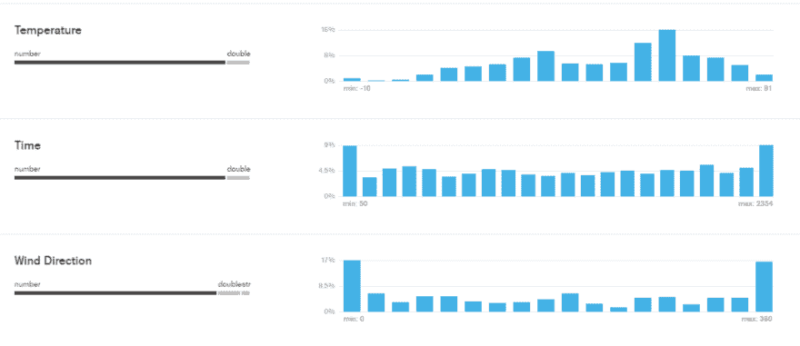
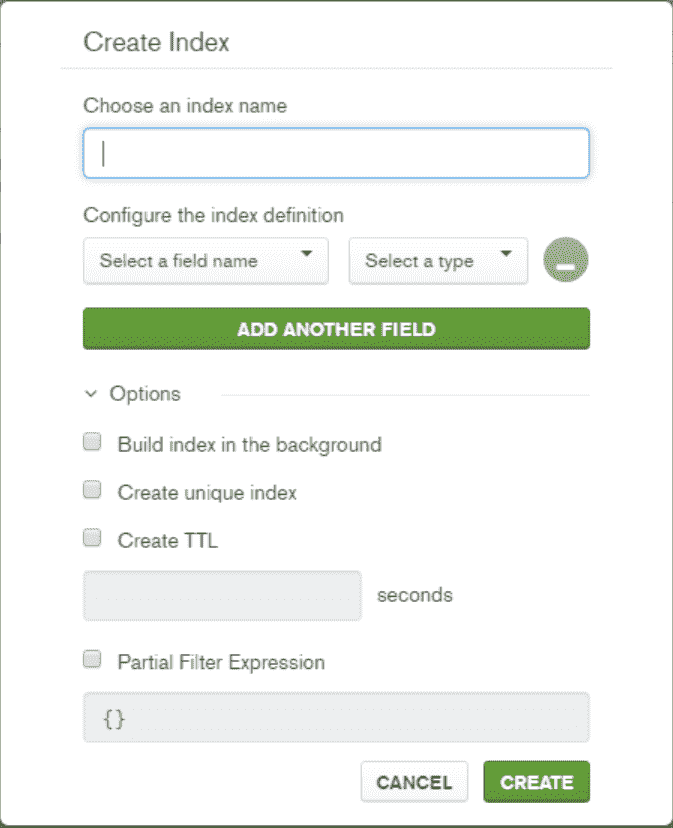
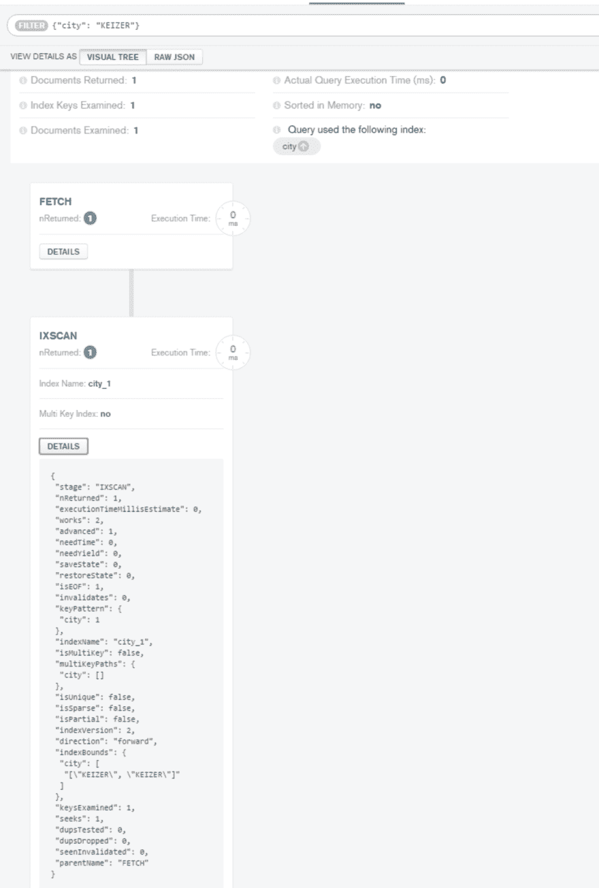

# MongoDB Compass:概述

> 原文：<https://dev.to/kenwalger/mongodb-compass-an-overview>

我刚开始用电脑的时候，一切都是通过命令行完成的。一切。苹果公司还没有推出麦金塔电脑，Windows 在微软眼中还没有一丝曙光。就此而言，微软还不是一线曙光。每个人都习惯了生活在 shell 中，知道大量的命令、参数和语法来完成哪怕是最小的任务。随着图形用户界面(GUI)的出现，操作系统和各种工具都出现了。这些工具中的许多都提供了许多可以在命令行中实现的功能，当然大多数最常见的任务都包含在一种更易于使用和可视化的格式中。

这就是 [MongoDB](http://www.mongodb.com) 的[指南针](https://www.mongodb.com/products/compass)产品的情况。自从它在 2015 年 12 月发布以来，已经增加了几个版本和升级，截至撰写本文时，我们现在是 1.6 版。像许多 GUI 工具一样，它旨在提供一个更简单的界面来完成许多任务，否则人们可能会在 [mongo shell](https://docs.mongodb.com/manual/reference/mongo-shell/) 中完成这些任务。

MongoDB 的一个很棒的特性是它有一个灵活的[数据模型](https://docs.mongodb.com/manual/data-modeling/)。这是模式设计的一个强大特性。但是，从 shell 来看，它可能会对了解集合模式的确切构成造成限制。Compass 提供了一个可视化界面，[对集合中的数据子集进行采样](https://docs.mongodb.com/compass/master/faq/#compass-faq-sampling)，并分析该子集内的文档。

[T2】](https://res.cloudinary.com/practicaldev/image/fetch/s--OUGElRSl--/c_limit%2Cf_auto%2Cfl_progressive%2Cq_auto%2Cw_880/https://thepracticaldev.s3.amazonaws.com/i/gcfb9za2h08iycnt3o2v.PNG)

这提供了一个易于使用的图形用户界面风格的集合是如何设计的快照。人们可以立即获得关于集合中字段的类型、范围和频率的信息，然后可以根据模式可视化中呈现的数据轻松地选择、排序和查询集合。使用 shell 命令当然可以获得相同的结果，但是需要花费更多的时间和精力。

Compass 中的这一特性本身就值得下载，但还有更多！在 Compass 中创建和删除数据库和集合是可能的，正如我在以前的一篇关于[索引](https://www.kenwalger.com/blog/nosql/mongodb/indexing-in-mongodb/)MongoDB 集合的文章中指出的，[索引](https://docs.mongodb.com/manual/indexes/)可以对查询的性能产生巨大的影响。Compass 不仅为索引创建提供了一个直观的界面，它还提供了关于查询性能的详细反馈，以及 MongoDB 返回文档需要经过多少步骤和时间。

[T2】](https://res.cloudinary.com/practicaldev/image/fetch/s--XomGeU08--/c_limit%2Cf_auto%2Cfl_progressive%2Cq_auto%2Cw_880/https://thepracticaldev.s3.amazonaws.com/i/x1s16zntpf86yvogeyl6.PNG)

[T2】](https://res.cloudinary.com/practicaldev/image/fetch/s--Lqas8sYj--/c_limit%2Cf_auto%2Cfl_progressive%2Cq_auto%2Cw_880/https://thepracticaldev.s3.amazonaws.com/i/qanlir32akf77tkmtnmj.PNG)

再说一次，所有这些*可以在 shell 中完成吗？我们可以用`db.collection.createIndex()`在 shell 中创建一个索引，我们也可以在 shell 中得到[解释](https://docs.mongodb.com/manual/reference/explain-results/)结果。不过我可能会说，在 Compass 中创建索引更容易，因为在创建步骤中有许多不同的索引创建细微差别。此外，能够直观地看到解释计划的结果是有益的，当然您也可以看到原始的 [JSON](http://www.json.org/) 来更深入地查看结果。*

 *我想在这篇文章中讨论的最后一个特性是深入了解数据库本身的一些操作方面的能力。Compass 为[服务器性能](https://docs.mongodb.com/compass/master/performance/)提供了一个 GUI 界面，用于衡量操作、读取&写入、网络和内存使用情况。它还提供了关于最热集合的信息，即活动最多的集合，以及关于运行缓慢的查询的信息(这里是索引的潜在候选对象)。所有信息都可以使用 MongoDB 自带的各种工具从命令行获得，例如 [mongostat](https://docs.mongodb.com/manual/reference/program/mongostat/#bin.mongostat) 和 [mongotop](https://docs.mongodb.com/manual/reference/program/mongotop/#bin.mongotop) ，以及用于慢速查询的[分析器](https://docs.mongodb.com/manual/tutorial/manage-the-database-profiler/?_ga=1.209304209.2079735664.1483559375)。在我看来，Compass 提供的 GUI 界面再次提供了一种更容易理解 MongoDB 服务器的方式。

我意识到，使用 Compass 并不能管理和维护 MongoDB 数据库服务器和相关集合的所有功能。目前仍有一些任务需要使用命令行...见鬼，我仍然在 Windows 和 OS 中使用命令行执行任务，这些产品有 GUI 界面多久了？然而，对于一个才推出不到一年半的产品来说，这是一个很好的开始。

Compass 还有很多我没有在这里介绍的特性，我鼓励您下载适用于 Windows、OS X 或 Linux 系统的 compass，并探索一种可视化 MongoDB 数据和图形化管理系统的新方法。*