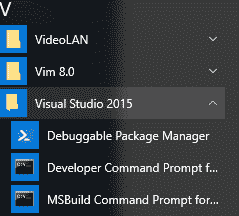
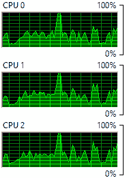
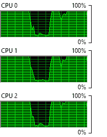
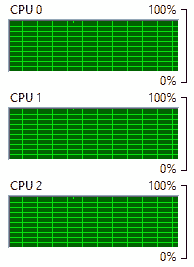
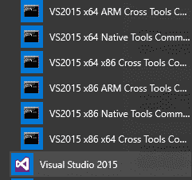

# CMake、Visual Studio 和命令行

> 原文:[https://dev . to/dmerejkowsky/cmake-visual studio-and-the-command-line](https://dev.to/dmerejkowsky/cmake-visual-studio-and-the-command-line)

*这篇文章最初发表在[我的博客](https://dmerej.info/blog/post/cmake-visual-studio-and-the-command-line/)T3 上*

很长一段时间以来，我一直在使用 Visual Studio 构建复杂 C++项目的团队中工作。

因为我经常是“buildfarm 的家伙”,也因为我不太喜欢 GUI，所以我必须找到从命令行构建 Visual Studio 项目的方法。

这是我尝试过的所有事情的故事。

在我们开始之前，请注意:在整篇文章中，我将使用 Windows 10 上的 Visual Studio 2015 来构建 CMake 本身的源代码。对于案例研究来说，这是一个很好的项目，因为它既不太大也不太小，并且没有需要担心的依赖性(当然，它使用 CMake 来构建自己:)

## 使用 CMake 生成 Visual Studio 项目

CMake 的工作原理是解析`CMakeLists.txt`文件中的代码，然后*生成*代码，这些代码将被*另一个*程序使用，该程序将执行构建本身。

当您使用 CMake 时，您必须指定一个*生成器*。在 Windows 上，默认生成器将是最近找到的 Visual Studio，运行 CMake 后，您将获得一个可以在 Visual Studio 中打开的`.sln`文件，以便编辑、构建和调试项目。

所以我的任务是找到一种从命令行构建这些`.sln`文件的方法。

## 使用 devenv

我发现的最明显的方法是使用一个叫做`devenv`的工具。事实上，如果您在互联网搜索引擎上查找“从命令行构建 Visual Studio 项目”,您可能会找到这个答案。你还会发现他们建议你使用`MSBuild.exe`的地方。

但是，不幸的是，如果你试图直接从`cmd.exe`运行`devenv`，你会得到著名的错误消息:

```
'devenv' is not recognized as an internal or external command, operable program or batch file. 
```

诀窍是使用“开始”菜单中的“命令提示符”之一:

[T2】](https://res.cloudinary.com/practicaldev/image/fetch/s--yZOP1i7H--/c_limit%2Cf_auto%2Cfl_progressive%2Cq_auto%2Cw_880/https://dmerej.info/blog/pics/start-menu-visual-command-prompts-top.png)

我从“开发者命令提示符”开始:

```
cd c:\User\dmerej\src\cmake\build-vs devenv CMake.sln 
```

Visual Studio 已打开。哼，那不是我想要的。结果是，如果你在命令行提示中犯了任何错误，Visual Studio 都会打开。

正确的做法是加上`/build`开关:

```
devenv /build Debug CMake.sln 
```

输出相当不错:

```
3>  cmbzip2.vcxproj -> C:\...\src\cmake-3.7.2\build-vs\Utilities\cmbzip2\Debug\cmbzip2.lib
7>------ Build started: Project: cmjsoncpp, Configuration: Debug Win32 ------
7>  Building Custom Rule C:/Users/dmerej/src/cmake-3.7.2/Utilities/cmjsoncpp/CMakeLists.txt
7>  CMake does not need to re-run because
      C:\...\src\cmake-3.7.2\build-vs\Utilities\cmjsoncpp\CMakeFiles\generate.stamp
      is up-to-date.
2>  Generating Code...
6>  fs-poll.c
2>  Compiling... 
```

## 使用 MSBuild

也可以试试用`MSBuild.exe`，但是输出有点难看。(但是您可以获得更多信息，比如编译一个项目花费的时间、使用的完整命令行以及警告/错误的数量):

```
Project
  "c:\Users\dmerej\src\cmake-3.7.2\build-vs\Utilities\cmcompress\cmcompress.vcxproj.metaproj" (7)
  is building
  "c:\Users\dmerej\src\cmake-3.7.2\build-vs\Utilities\cmcompress\cmcompress.vcxproj" (8)
  on node 1 (default targets).
InitializeBuildStatus:
  Creating
  "cmcompress.dir\Debug\cmcompress.tlog\unsuccessfulbuild"
  because "AlwaysCreate" was specified.
CustomBuild:
  Building Custom Rule C:/Users/dmerej/src/cmake-3.7.2/Utilities/cmcompress/CMakeLists.txt
  CMake does not need to re-run because
    C:\Users\dmerej\src\cmake-3.7.2\build-vs\Utilities\cmcompress\CMakeFiles\generate.stamp
    is up-to-date.
ClCompile:
  C:\Program Files (x86)\Microsoft Visual Studio 14.0\VC\bin\CL.exe /c
  /I"C:\Users\dmerej\src\cmake-3.7.2\build-vs\Utilities"
  /I"C:\Users\dmerej\src\cmake-3.7.2\Utilities" /Zi /nologo /W3 /WX- /Od /Ob0
  /Oy- /D WIN32 /D _WINDOWS /D _DEBUG /D _CRT_SECURE_NO_DEPRECATE /D
  _CRT_NONSTDC_NO_DEPRECATE /D CURL_STATICLIB /D "CMAKE_INTDIR=\"Debug\"" /D
  _MBCS /Gm- /RTC1 /MDd /GS /fp:precise /Zc:wchar_t /Zc:forScope /Zc:inline
  /Fo"cmcompress.dir\Debug\\" /Fd"cmcompress.dir\Debug \cmcompress.pdb" /Gd /TC
  /analyze- /errorReport:queue
  "C:\Users\dmerej\src\cmake-3.7.2\Utilities\cmcompress\cmcompress.c"
cmcompress.c
...
cmArchiveWrite.cxx
cmBase32.cxx
cmBootstrapCommands1.cxx
...

0 Warning(s)
0 Error(s)

Time Elapsed 00:00:06.93 
```

## 使用 CMake 构建

好了，现在我知道了如何从命令行构建 Visual Studio 项目。

我们有一个相当大的 C++代码库，我们想在 Linux、macOS 和 Windows 上构建它。

我们使用 Jenkins 进行持续集成，因此我们必须编写构建脚本，只要任何开发人员提出合并请求，这些脚本就可以在节点上运行，以确保提议的更改可以在所有平台上构建。

在 Linux 和 macOS 上，默认的生成器是“Unix Makefiles”，所以代码很简单:

```
#/bin/bash -e

git pull
mkdir -p build
(
  cd build
  cmake ..
  make
) 
```

在 Windows 上，我们使用批处理文件:

```
git pull
@call "%VS140COMNTOOLS%VsDevCmd.bat"
mkdir build
d build
cmake ..
devenv c:\Users\dmerej\src\cmake-3.7.2\build-vs\CMake.sln /build 
```

你可能想知道奇怪的`@call "%VS140COMNTOOLS%VsDevCmd.bat"`线从何而来。

首先，如果你转到`C:\ProgramData\Microsoft\Windows\Start Menu\Programs\Visual Studio 2015\Visual Studio Tools`，你可以右击“开发者命令提示符”快捷方式并打开“属性”窗口。在那里你会发现目标是:`cmd.exe /k "C:\Program Files (x86)\Microsoft Visual Studio 14.0\Common7\Tools\VsDevCmd.bat"`

第二，如果你运气好的话，有人 <sup id="fnref1">[1](#fn1)</sup> 会告诉你，对于任何版本的 Visual Studio，都设置了一个名为`VS<version>COMNTOOLS`的环境变量，其中
`<version>`是你的 Visual Studio 安装的 2 或 3 位数版本号。

如果你不明白我的意思，这里有一个表格:

```
"Marketing" version      "Internal" version
Visual Studio 8 2005         80
Visual Studio 9 2008         90
Visual Studio 10 2010       100
Visual Studio 11 2012       120
Visual Studio 12 2013       130
Visual Studio 14 2015       140 
```

因此，您可以避免对 Visual Studio 安装路径进行硬编码，而是使用`VS140COMNTOOLS`变量。(不过，您仍然需要对 Visual Studio 版本进行硬编码)。

因此，该命令所做的是将`VS140COMNTOOLS`环境变量的值与提示文件的基本名称(`VsDevCmd.bat`)连接起来，并对其运行
`@call`。

## 使用 Python

但是，随着时间的推移，我们想用 Python，
重写所有的构建脚本，以便我们可以分解一些代码。(例如，在构建之前运行`git pull`来更新源代码)

在 Linux 和 macOS 上很容易:

```
subprocess.check_call(["cmake", ".."], cwd=build_dir)
subprocess.check_call(["make"], cwd=build_dir) 
```

但是在 Windows 上，事情有点棘手。我们如何在 Python 中实现`@call \path\to\bat_file`？

### setuptools 来救援！

我发现`setuptools`——Python 用来运行`setup.py`文件的模块——能够用 Visual Studio 构建东西，而不必使用 Visual Studio 命令提示符。

所以我查看了实现，找到了一个解决方案:

```
def source_bat(bat_file):
  interesting = {"INCLUDE", "LIB", "LIBPATH", "PATH"}
  result = {}

  process = subprocess.Popen('"%s"& set' % (bat_file),
                        stdout=subprocess.PIPE,
                        shell=True)
  (out, err) = process.communicate()

  for line in out.split("\n"):
      if '=' not in line:
          continue
      line = line.strip()
      key, value = line.split('=', 1)
          result[key] = value
    return result 
```

这个想法是运行一个批处理脚本(这就是我们使用`shell=True`的原因),它将:

*   调用我们需要的`.bat`文件
*   运行内置的`set`命令并解析其输出
*   在 Python 字典中返回整个环境。

事实上，有几种方法可以在`cmd.exe`上使用`set`:

*   设置环境变量:`set FOO=BAR`
*   要取消设置环境变量:`set FOO=`
*   查看名称以*前缀* : `set <prefix>`开头的所有环境变量
*   转储所有环境变量:`set`

我们解析`set`的输出，找到我们需要的三个变量(它们都是分号分隔的路径列表)

*   `PATH`:查找所需的可执行文件(`devenv`命令)
*   `LIB`:编译器将寻找`.lib`文件的地方
*   `INCLUDE`:编译器将在那里寻找头文件。

顺便说一句，如果您想知道为什么这个函数被称为`source_bat`，这是因为在 Unix 上，要执行 bash 脚本并更新您的环境，您需要使用内置的`source`，或者在其他一些 shells 上，使用`.`命令，(但是我离题了)。

### 建筑着。sln 文件

不过，还有一个问题。在 Linux 和 macOS 上，构建的命令总是`make`。

但是在 Windows 上，我不得不小心地编写`devenv`命令，这意味着指定`.sln`文件的路径。

起初，我只有几个糟糕的解决方案:

*   硬编码`.sln`文件的名称
*   解析最上面的`CMakeLists`来找到`project()`调用<sup id="fnref2">T3】2T5】</sup>
*   列出构建目录的内容，希望它们只是一个扩展名为`.sln`的文件。

幸运的是，通过运行`cmake --help`,我发现有一个`--build`开关可以用来抽象命令行，以便为要构建的项目运行。

所以代码看起来像:

```
def configure_and_build():
    if os.name == "nt":
        generator = "Visual Studio 14 2015"
    else:
        generator = "Unix Makefiles"

    subprocess.check_call(["cmake", "-G", generator, ".."], cwd=build_dir)
    subprocess.check_call(["cmake", "--build", ".", cwd=build_dir) 
```

这意味着我可以在任何地方运行`cmake --build`，而不必处理那些讨厌的`.bat`文件。

### 一次使用多个 CPU

默认情况下，Visual Studio 项目是使用所有 CPU 资源构建的，但对于`make`命令来说并非如此。

所以必须再次修补代码，让`make`使用所有可用的 CPU:

```
import multiprocessing

def build():
    cpu_count = multiprocessing.cpu_count()
    cmd = ["cmake", "--build", "."]
    if os.name != "nt":
      cmd.extend(["--", "-j", str(cpu_count)])
    subprocess.check_call(cmd, cwd=build_dir, env=build_env) 
```

(`--`参数在这里将由`cmake`二进制文件解析的参数与发送给底层构建命令的参数分开。这是命令行工具的常见做法)

## 性能问题

因此，我们让 Jenkins 节点运行 Python 脚本，在 Linux、macOS 和 Windows 上构建相同的源代码，一切都很好，只是在 Windows 上构建要花更长的时间。

起初我想，“嗯，众所周知，在 Windows 上运行可执行文件和访问文件系统总是比较慢，我们对此无能为力”。

但是我的团队成员一直抱怨构建时间太长，我对此感觉不太好:正如有人曾经说过的，“当进行持续集成时，计算机应该等待人类，而不是相反”。

因此，我寻找提高性能的解决方案。

### 使用 NMake

如果您在使用 Visual Studio 时查看 CMake 生成的文件的大小，就会意识到要获得良好的性能并不容易。

例如，要构建 CMake，您有一个 842 行的`.sln`文件，它引用了 115 个`.vcxproj`文件。

看看这些文件的内容，难怪解析它们需要相当长的时间。

```
// In CMake.sln
Microsoft Visual Studio Solution File, Format Version 12.00
# Visual Studio 14
Project("{2150E333-8FDC-42A3-9474-1A3956D46DE8}") = "CMakePredefinedTargets", "CMakePredefinedTargets", "{0FD1CAE9-153C-32D5-915F-6AB243496DE3}"
EndProject
Project("{2150E333-8FDC-42A3-9474-1A3956D46DE8}") = "CTestDashboardTargets", "CTestDashboardTargets", "{991076F0-B37F-32E8-88B9-1156BDA0D346}"
EndProject
Project("{2150E333-8FDC-42A3-9474-1A3956D46DE8}") = "Tests", "Tests", "{81200686-E54D-3D48-BDD9-782FCB64B8A8}"
EndProject
...
Project("{8BC9CEB8-8B4A-11D0-8D11-00A0C91BC942}") = "ALL_BUILD", "ALL_BUILD.vcxproj", "{BE9010A6-FD75-30CB-B4F7-EC8DD41D6F48}"
    ProjectSection(ProjectDependencies) = postProject
        {FF7E34C4-7170-3648-BBB6-B82173FFD31E} = {FF7E34C4-7170-3648-BBB6-B82173FFD31E}
        {765BC85F-D03F-35FC-ADE0-26ED16D75F4D} = {765BC85F-D03F-35FC-ADE0-26ED16D75F4D}
        ... 
```

```
<!-- in Source\cmake.vcxproj -->
<?xml version="1.0" encoding="UTF-8"?>
<Project DefaultTargets="Build" ToolsVersion="14.0" xmlns="http://schemas.microsoft.com/developer/msbuild/2003">
  <ItemGroup Label="ProjectConfigurations">
    <ProjectConfiguration Include="Debug|Win32">
      <Configuration>Debug</Configuration>

      ...

    <ClCompile>
      <AdditionalIncludeDirectories>C:\Users\dmerej\src\cmake-3.7.2\build-vs\Utilities;C:\Users\dmerej\src\cmake-3.7.2\Utilities;C:\Users\dmerej\src\cmake-3.7.2\build-vs\Source;C:\Users\dmerej\src\cmake-3.7.2\Source;C:\Users\dmerej\src\cmake-3.7.2\build-vs\Utilities\cmcompress;C:\Users\dmerej\src\cmake-3.7.2\Source\CTest;%(AdditionalIncludeDirectories)</AdditionalIncludeDirectories>
      <AssemblerListingLocation>Debug/</AssemblerListingLocation>
      <BasicRuntimeChecks>EnableFastChecks</BasicRuntimeChecks>
      <CompileAs>CompileAsCpp</CompileAs>
      <DebugInformationFormat>ProgramDatabase</DebugInformationFormat>
      <ExceptionHandling>Sync</ExceptionHandling>
      ...
      <PreprocessorDefinitions>WIN32;_WINDOWS;_DEBUG;_CRT_SECURE_NO_DEPRECATE;_CRT_NONSTDC_NO_DEPRECATE;CURL_STATICLIB;LIBARCHIVE_STATIC;UNICODE;_UNICODE;WIN32_LEAN_AND_MEAN;CMAKE_BUILD_WITH_CMAKE;CMAKE_INTDIR="Debug";%(PreprocessorDefinitions)</PreprocessorDefinitions>
      <ObjectFileName>$(IntDir)</ObjectFileName>
    </ClCompile>

    ... 
```

此外，如果您在构建期间查看 CPU 的使用情况，您会发现您远远没有使用所有的 CPU 能力:

[T2】](https://res.cloudinary.com/practicaldev/image/fetch/s--BqwFnC2M--/c_limit%2Cf_auto%2Cfl_progressive%2Cq_auto%2Cw_880/https://dmerej.info/blog/pics/building-vs.png)

所以我试图找到一个能够生成更简单代码的 CMake 生成器。

在我的研究中，我发现微软有他们自己的名为`NMake`的`Make`程序实现，所以我决定使用`NMake Makefile`生成器。

这次我将直接使用`cl.exe`、`link.exe`和他们的朋友。

我尝试使用`MSBuild`命令提示符，但是我得到:

```
cmake -G"NMake Makefiles" ..

-- The C compiler identification is unknown
-- The CXX compiler identification is unknown
CMake Error at CMakeLists.txt:11 (project):
  No CMAKE_C_COMPILER could be found.

  Tell CMake where to find the compiler by setting either the environment
  variable "CC" or the CMake cache entry CMAKE_C_COMPILER to the full path to
  the compiler, or to the compiler name if it is in the PATH.

CMake Error at CMakeLists.txt:11 (project):
  No CMAKE_CXX_COMPILER could be found.

  Tell CMake where to find the compiler by setting either the environment
  variable "CXX" or the CMake cache entry CMAKE_CXX_COMPILER to the full path
  to the compiler, or to the compiler name if it is in the PATH.

-- Configuring incomplete, errors occurred!
See also "C:/Users/dmerej/src/cmake-3.7.2/build-msbuild-nmake/CMakeFiles/CMakeOutput.log".
See also "C:/Users/dmerej/src/cmake-3.7.2/build-msbuild-nmake/CMakeFiles/CMakeError.log". 
```

这里，CMake 找不到`cl.exe`，因为它不在`%PATH%`中。事实上，如果你试图从`MSBuild Command Prompt`运行`cl.exe`，你会得到同样的“cl.exe 不被识别……”错误。

所以我试着使用“开发者命令提示”,这是我之前手动运行`devenv`时用过的

```
mkdir build-nmake cd build-nmake cmake -G"NMake Makefiles" ..

-- The C compiler identification is MSVC 19.0.24210.0
-- The CXX compiler identification is MSVC 19.0.24210.0
-- Check for working C compiler: C:/Program Files (x86)/Microsoft Visual Studio 14.0/VC/bin/cl.exe
-- Check for working C compiler: C:/Program Files (x86)/Microsoft Visual Studio 14.0/VC/bin/cl.exe -- works
-- Detecting C compiler ABI info
-- Detecting C compiler ABI info - done
-- Check for working CXX compiler: C:/Program Files (x86)/Microsoft Visual Studio 14.0/VC/bin/cl.exe
-- Check for working CXX compiler: C:/Program Files (x86)/Microsoft Visual Studio 14.0/VC/bin/cl.exe -- works 
```

万岁，编译器找到了！

您可能会注意到，到`cl.exe`的路径只是`VC\bin\cl.exe`。(在`VC\bin`中还有其他文件夹，但这里我们使用默认的 32 位版本)

另外，我很高兴地发现只生成了大约 30 个`Makefiles`文件。

所以下一步是:

```
cd build-nmake nmake
[ 27%] Built target cmsysTestsCxx
[ 27%] Built target cmsysTestDynload
[ 44%] Built target cmlibarchive
[ 61%] Built target cmcurl
[ 62%] Built target LIBCURL
Scanning dependencies of target CMakeLib
[ 62%] Building CXX object Source/CMakeFiles/CMakeLib.dir/cmCommands.cxx.obj
cmCommands.cxx
[ 62%] Linking CXX static library CMakeLib.lib 
```

我很高兴看到我得到了和在 Linux 和 macOS 上一样好的输出(进度百分比)。

但是后来我发现编译的时候只用了一个 CPU。

运行`nmake /?`并不能让多个任务并行运行。

该死的。

## 利用 JOM

再次查看输出，我发现还有一个名为“NMake Makefiles JOM”的生成器

[Jom](http://wiki.qt.io/Jom) 是由`Qt`民间制作的工具。它是`nmake`命令的重新实现，但是支持多个任务。使用多 CPU 构建的命令行开关也被称为`-j`，这很好，因为这意味着构建脚本代码会变得更简单。

这产生了相当好的结果，但是构建仍然比在 Linux 和 macOS 上慢。

为了进行调查，我决定在用 JOM 构建时保持 Windows 资源监视器打开:

[T2】](https://res.cloudinary.com/practicaldev/image/fetch/s--UwCt25OO--/c_limit%2Cf_auto%2Cfl_progressive%2Cq_auto%2Cw_880/https://dmerej.info/blog/pics/building-jom.png)

您可以看到在构建过程中 CPU 的使用率有所下降。据我所知，这是在链接过程中发生的。

## 使用忍者

终于在 2010 年左右，[忍者](https://ninja-build.org/)出来了。

当我读到这个项目的描述:“一个专注于速度的小型构建系统”，并且事实上在 CMake 中有对它的实验性支持，我渴望尝试一下。

事实上，它产生了巨大的效果！多年来，我终于第一次在 Windows 上拥有了与 Linux 相同的构建时间，并且所有内核的 CPU 使用率都稳定在 100%左右:

[T2】](https://res.cloudinary.com/practicaldev/image/fetch/s--EQLOraDs--/c_limit%2Cf_auto%2Cfl_progressive%2Cq_auto%2Cw_880/https://dmerej.info/blog/pics/building-ninja.png)

我还得到了使 Ninja 得名的简洁输出。 <sup id="fnref3">[3](#fn3)</sup>

```
cmake -GNinja ..
cmake --build .
[11/11] Linking CXX executable Tests\CMakeLib\CMakeLibTests.exe 
```

## 一个交叉编译的故事

在使用 CMake + Ninja 组合几年后，我在我们的一次 CI 构建中收到一条错误消息:

```
Linker fatal error: LNK1102: out of memory 
```

谷歌搜索错误导致:
[https://support . Microsoft . com/en-us/help/2891057/linker-fatal-error-lnk 1102-内存不足](https://support.microsoft.com/en-us/help/2891057/linker-fatal-error-lnk1102-out-of-memory)

因此，我试着遵循“解决方案”一节中的建议，仔细查看开始菜单中的命令行提示列表:

[T2】](https://res.cloudinary.com/practicaldev/image/fetch/s--wDRdP86P--/c_limit%2Cf_auto%2Cfl_progressive%2Cq_auto%2Cw_880/https://dmerej.info/blog/pics/start-menu-visual-command-prompts-bottom.png)

在上面两个我已经试过的提示下面，有几个条目，它们都是同一个`.bat`文件的快捷方式，但是有不同的参数:

```
VS2015 x64 ARM          "C:\...\Visual Studio 14.0\VC\vcvarsall.bat" amd64_arm
VS2015 x64 Native:      "C:\...\Visual Studio 14.0\VC\vcvarsall.bat" amd64
VS2015 x66 x86 Cross    "C:\...\Visual Studio 14.0\VC\vcvarsall.bat" amd64_x86 
```

啊哈！所以，我所要做的就是用正确的参数调用`vcvarsall.bat`文件，这在我查看`.bat`文件的内容时得到了确认:

```
...
:check_platform
if /i %1 == x86       goto x86
if /i %1 == amd64     goto amd64
...
goto usage
:x86
...
call "%~dp0bin\vcvars32.bat" %2 %3
goto :SetVisualStudioVersion

:amd64
...
call "%~dp0bin\amd64\vcvars64.bat" %2 %3
goto :SetVisualStudioVersion 
```

于是 Python 代码又打了补丁:

```
def source_bat(bat_file, arch):
  interesting = {"INCLUDE", "LIB", "LIBPATH", "PATH"}
  result = {}

  process = subprocess.Popen('"%s %s"& set' % (bat_file, arch),
                        stdout=subprocess.PIPE,
                        shell=True)
  (out, err) = process.communicate() 
```

CMake 输出为:

```
c:\Users\dmerej\src\cmake-3.7.2\build-cross-64-32>cmake -GNinja ..
-- The C compiler identification is MSVC 19.0.24210.0
-- The CXX compiler identification is MSVC 19.0.24210.0
-- Check for working C compiler: C:/Program Files (x86)/Microsoft Visual Studio 14.0/VC/bin/amd64_x86/cl.exe
-- Check for working C compiler: C:/Program Files (x86)/Microsoft Visual Studio 14.0/VC/bin/amd64_x86/cl.exe -- works
-- Detecting C compiler ABI info
-- Detecting C compiler ABI info - done
-- Check for working CXX compiler: C:/Program Files (x86)/Microsoft Visual Studio 14.0/VC/bin/amd64_x86/cl.exe
-- Check for working CXX compiler: C:/Program Files (x86)/Microsoft Visual Studio 14.0/VC/bin/amd64_x86/cl.exe -- works
-- Detecting CXX compiler ABI info 
```

注意`amd64_x86`子文件夹。

## 码签破损

有一段时间一切都很好，直到我们决定在发布可执行文件之前对其进行签名。

似乎最显而易见的方法是使用`signtool.exe`，所以我按照 Windows 开发中心 <sup id="fnref4">[4](#fn4)</sup> 上的[的指示，继续安装`Windows Driver Kit`](https://msdn.microsoft.com/en-us/library/windows/desktop/aa387764.aspx)

但是我们所有的构建都开始失败:

```
C:\Program Files (x86)\Microsoft Visual Studio 14.0\VC\INCLUDE\crtdefs.h(10):
fatal error C1083:
Cannot open include file: 'corecrt.h': No such file or directory 
```

我寻找解决方案，但是我得到的只是人们告诉我手动设置`INCLUDE`和`LIB`。

嗯，我已经用 Python 代码计算了环境变量，所以修复方法是:

```
def get_build_env(arch):
    vs_comntool_path = os.environ["VS140COMNTOOLS"[
    bat_file = find_bat_file(vs_comntool_path)
    env = source_bat(bat_file, env)

    inc_path = r"C:\Program Files (x86)\Windows Kits\10\Include\10.0.10069.0\ucrt\include"

    if arch == "amd64_x86":
        subfolder = "x86"
    else:
        subfolder = "x64"

    lib_path = r"C:\Program Files (x86)\Windows Kits\10\Lib\10.0.10069.0\ucrt\%s" % subfolder

    env["INCLUDE"] += inc_path + ";"
    env["LIB"] += lib_path + ";" 
```

请注意我们这里是如何用`x64`而不是`amd64`的:)

## 结论

嗯，这就是我今天的全部内容。

如果您有 Python 的构建脚本，那么使用 CMake 和 Ninja 构建 Visual Studio 项目会非常有效，前提是您愿意运行`.bat`脚本，并小心地将更改应用到环境变量中。

很快我会试着看看 Visual Studio 2017 的进展，也许事情会变得更容易，谁知道呢？

在那之前，愿建筑与你同在！

* * *

1.  大卫，如果你看到这封信，非常感谢你！ [↩](#fnref1)

2.  更多信息见 [CMake 文档](https://cmake.org/cmake/help/latest/command/project.html) [↩](#fnref2)

3.  它只是一行输出，在构建完成后很快就消失了，你明白吗？ [↩](#fnref3)

4.  原来我不知何故漏掉了[这个页面](https://msdn.microsoft.com/en-us/library/8s9b9yaz.aspx)告诉我`signtool.exe`在我在节点上设置 Visual Studio 时已经安装了... [↩](#fnref4)