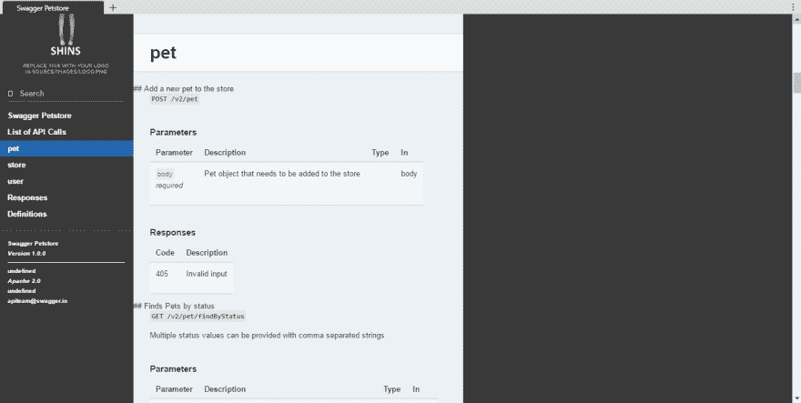
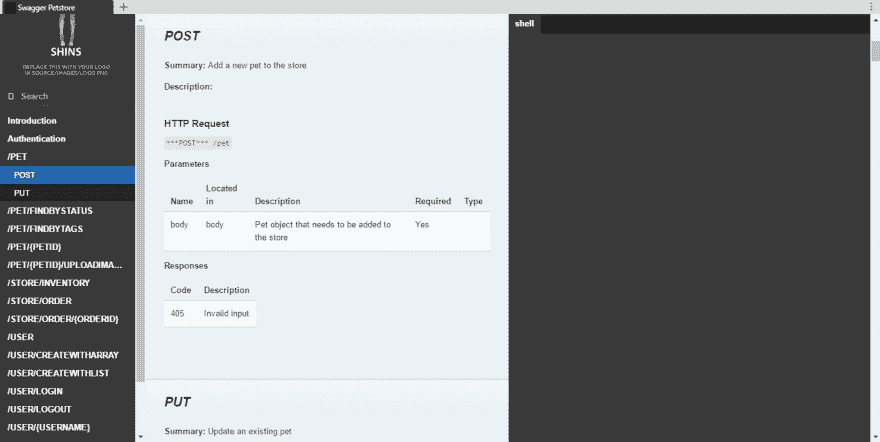
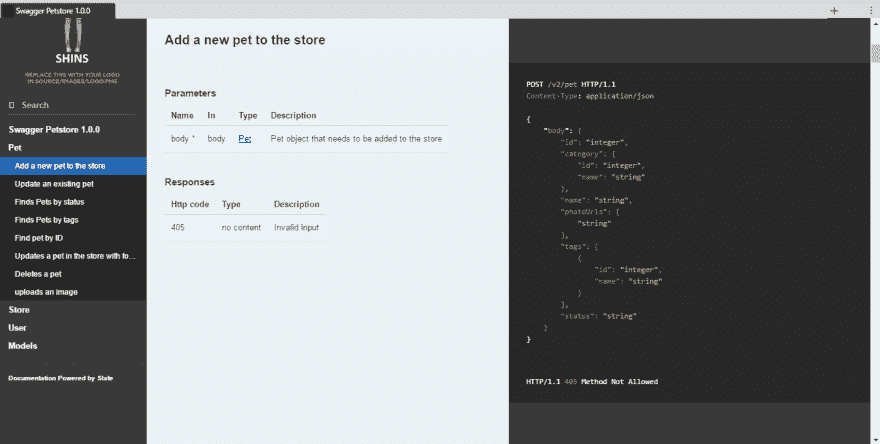
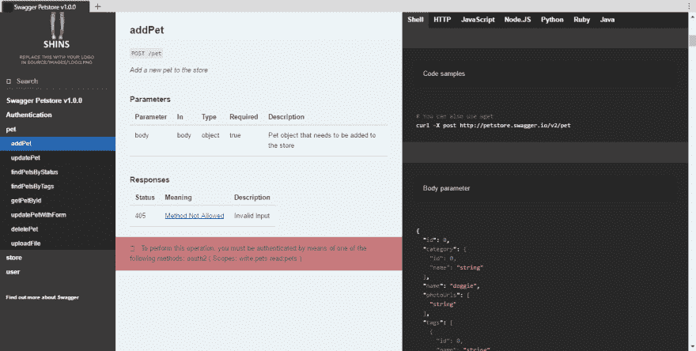

# 各种 OpenApi/Swagger 到 Slate 转换工具的比较

> 原文:[https://dev . to/mikeralphson/comparison-of-variable-openapi swagger-to-slate-conversion-tools](https://dev.to/mikeralphson/comparison-of-various-openapiswagger-to-slate-conversion-tools)

这个博客有点不同；旨在做类似工作的四个工具的比较，将 [OpenApi / Swagger](https://www.openapis.org/specification/repo) 定义转换成可以由 [Slate](https://github.com/lord/slate) (或其一个端口)呈现的简单 markdown。Slate 本身及其替代实现/端口可能是本博客后续文章的主题。

声明:这篇博文的作者也是其中一个比较工具(`widdershins`)和 [shins](https://github.com/mermade/shins) 的作者，这里使用的 Slate 的 Node.js 端口将每个工具的 Slate markdown 转换成 HTML。

当我开始使用`widdershins`时，我找不到任何工具可以直接将 OpenAPI / Swagger 定义转换成 Slate，除了用 PHP 编写的并且当时处于无人维护状态的`swagger2slate`。几周后，Node.js 中开发的另外两个工具(如`widdershins`)出现了，而`swagger2slate`有了进一步的开发，因此有了这个比较。

因为`shins`使用通用标记兼容的 [markdown-it](https://github.com/markdown-it/markdown-it) 作为其 markdown 处理器，所以与 Ruby Slate 使用的 markdown 库`redcarpet`产生的 HTML 相比，呈现的 HTML 可能会有差异。

每个工具都可以针对特定的 Slate CSS 主题进行优化。这里没有考虑这一点，但是如果提供了一个示例站点，它会链接到下面。

到目前为止，只使用了示例`petstore.json`来比较每个工具，这可能无法展示所有功能的最佳效果。

如果您使用 Java 和/或 Swagger-CodeGen，我注意到的另外两个项目可能值得一看:

*   [https://github.com/buremba/swagger-slate](https://github.com/buremba/swagger-slate)
*   [https://github.com/regga-ws/swagger-codegen-slate](https://github.com/regga-ws/swagger-codegen-slate)([截图](https://camo.githubusercontent.com/0ed0b72c2a786c97354c95b00909645e8dfe9bd4/68747470733a2f2f646f63732e676f6f676c652e636f6d2f612f657374656c612e66722f75633f61757468757365723d302669643d30422d42686a7736706c5264734d55314c624568755a546835644738266578706f72743d646f776e6c6f6164)，[举例](http://api.rakam.io/))

首先是:

## [OpenApi2Slate](https://github.com/scrive/openapi2slate)

[T2】](https://mermade.github.io/oa2s-comparison/openapi2slate.html)

`openapi2slate`是一个 BSD 许可的基于 Node.js 的工具，由 [Scrive](https://github.com/scrive/) 开发，它自称为

> 从 OpenAPI 到 Slate markdown 的自以为是的(正在进行中的)转换器

### 什么 OpenAPI2Slate 做对了

*   Scrive 的 CSS 主题化看起来的确令人印象深刻，这可以从他们的 API 文档[中看出](http://apidocs.scrive.com/)
*   最右边的窗格用于文档框和模式描述
*   中间窗格的顶部以及最左侧的目录中包含了一个漂亮的 API 调用列表。当文档不仅仅由简单的 API 调用和响应组成时，这很有帮助
*   在 [npm](https://www.npmjs.com/package/openapi2slate) 上以套装形式提供
*   可以使用 OpenAPI 供应商扩展将标签和参数标记为仅供内部使用，这使得从同一个 OpenAPI 定义生成内部和面向外部的文档变得简单。
*   根据 BSD-3 条款许可明确许可。

### 需要改进的地方

*   代码示例没有选项
*   未显示认证信息
*   在 OpenAPI 定义中缺少一些可选信息的地方，`openapi2slate`在目录页脚中呈现`undefined`。
*   如果能够调用一个文档化的 API 以编程的方式生成 markdown，而不是仅仅作为一个输出到 STDOUT 的命令行工具，那就太好了
*   有些降价与普通标志不兼容，这导致`shins`至少呈现出次优状态。这可以从未转换的标题中看出。这可能是由于大量的 HTML 与降价混合在一起。

正如项目的[自述文件](https://github.com/scrive/openapi2slate/blob/master/README.md)中所记录的那样，`openapi2slate`需要了解一些限制/设计决策:

> 解引用(sic)没有正确实现，相反，它试图为您解引用文件并使用它。YMMV。API 模式工作得相当好，一些特性可能会丢失...
> 我们在 Slate Markdown 中渲染符合我们需求和定制的东西，因此这可能不太适合您！

## [招摇过市](https://github.com/lavkumarv/swagger-to-slate)

[T2】](https://mermade.github.io/oa2s-comparison/swagger-to-slate.html)

`Swagger-to-Slate`也是一个基于 Node.js 的工具，由 [Lav Kumar Vishwakarma](https://github.com/lavkumarv) 开发，它自称为

> 将 swagger.json 或 YAML 文件转换为 slate markdown 的节点模块

### 什么样的招摇过市是正确的

*   参数和响应以表格形式清晰呈现
*   虽然没有文档记录，但是通过编程调用转换是非常容易的
*   处理 yaml 以及 json 格式的定义
*   在 [npm](https://www.npmjs.com/package/swagger-to-slate) 上作为模块提供
*   明确 MIT 许可

### 需要改进的地方

*   没有显示关于 API 的标头元数据，例如端点 URL、联系人和许可证信息
*   未显示身份验证范围
*   目录被大写，看起来有些喧闹
*   虽然`shell`被定义为一个语言标签，但是还没有显示任何例子
*   轻微的公共标记故障，例如`code`块中的强调没有渲染
*   项目页面上没有指向示例 HTML 输出的链接

默认情况下,`Swagger-to-Slate`包含 Slate 的`_error.md`文件，所以您需要记得更新它以包含您的 API 文档。

## [摇摆器 2 平板](https://github.com/e96/swagger2slate)

[T2】](https://mermade.github.io/oa2s-comparison/swagger2slate.html)

在某种程度上，它是所有这些工具的鼻祖，比它们早了 18 个月。

它是由 Andrey Putilov 编写的 PHP 应用程序，项目描述如下

> 将 swagger api 文档( [http://swagger.io](http://swagger.io) )转换为 slate 静态 html 页面(【https://github.com/tripit/slate】T2)

我原本不打算将`Swagger2Slate`包括在这个比较中，因为作者自己承认它不再被维护，有几个突出的问题，并且用 PHP 编写对我来说不是很容易测试的事情(很像 Slate，用 Ruby 编写——并且不支持 Windows，这可能是许多基于
Node.js 的端口存在的原因)。

然而，在撰写本文时，对`Swagger2Slate`的最近一次提交仅仅是在五个小时前，将稍微被篡改的代码版本部署到 [heroku](https://swagger2slate.herokuapp.com) 让我可以看到示例输出。

*   显示身份验证信息(但不显示 oAuth 范围)
*   目录使用操作总结/描述，可读性很好
*   产生和使用的 MIME 类型显示在右侧窗格中
*   HTTP 示例用于右侧窗格
*   输入和输出模型显示在右侧窗格中
*   模型名称不仅仅显示`Object`，还有超链接
*   没有明显的降价故障

### 需要改进的地方

*   一些标题元数据，如许可证和联系信息没有显示
*   有时很难区分输入和输出模型
*   如果名称匹配，响应模型的链接实际上会链接回标签
*   文档令人困惑，因为它意味着您必须从包含 Swagger 注释的 PHP 应用程序开始。事实并非如此，而且`Swagger2Slate`很乐意处理任何 OpenAPI 定义，不管它是如何生成的。
*   项目页面上没有指向示例生成的 HTML 的链接

## [威德斯](//https:/github.com/mermade/widdershins)

[T2】](https://mermade.github.io/oa2s-comparison/widdershins.html)

如上，`Widdershins`是这篇博文的作者写的，`shins`的作者，所以你可能想在这里停止阅读！

### 寡妇们做对了什么

*   显示了所有标题/元数据，包括 oAuth 认证范围
*   显示标签级外部文档
*   默认情况下，响应代码链接到官方 RFC 描述
*   显示了 shell、HTTP、Javascript 和 Node 的代码示例。默认为 Js、Ruby、Python 和 Java
*   显示了每个操作的验证方法
*   如果检测到匹配的`produces` MIME 类型，响应将同时显示在 JSON 和 XML 中
*   响应显示为示例，而不仅仅是模式
*   每个部分和代码示例都是由用户可覆盖的模板构建的
*   代码样本可以从 OpenAPI 定义内的[供应商扩展](https://github.com/Rebilly/ReDoc/blob/master/docs/redoc-vendor-extensions.md#operation-object-vendor-extensions)中读取
*   没有已知的降价故障
*   明确 MIT 许可
*   广泛的测试套件(近 800 个定义)
*   处理 JSON 或 YAML 格式定义
*   可配置的语法突出显示主题(近 [70 个主题](https://highlightjs.org/static/demo/)
*   在 [npm](https://www.npmjs.com/package/widdershins) 上作为模块提供
*   有一个定义好的、有文档记录的 API，用于以编程方式转换定义

### 需要改进的地方

*   事后看来，`Widdershins`并不是最具描述性的名字，可能意味着它只适用于`shins`。事实并非如此，`Widdershins`应该使用原始的 Ruby `Slate`或者它的任何端口/分叉/衍生物。
*   不是所有的东西都可以使用用户模板来配置——这将在 v3 中实现！
*   ~~`Widdershins`使用 operationIds(如果目录可用)。对于人类可读的文档来说，这可能不是最佳选择~~参见- summary 选项
*   ~~由于大量的元数据标题，最右边的面板乍一看是空的~~
*   ~~认证信息可以更好地呈现为表格~~
*   ~~复杂类型显示为`Object`，而不是型号名称~~
*   ~~默认代码样本非常通用，并且在涉及所需参数时不完整~~