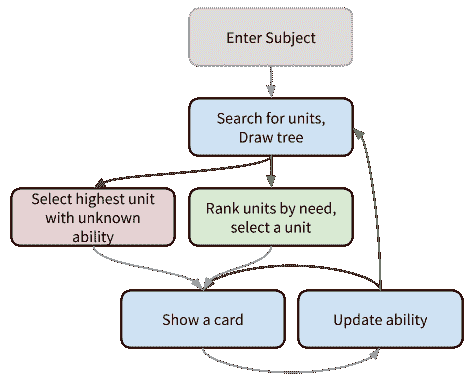
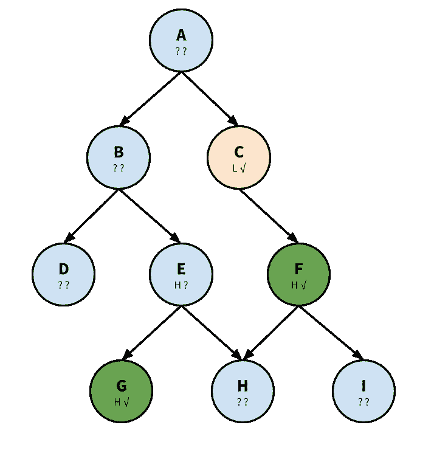
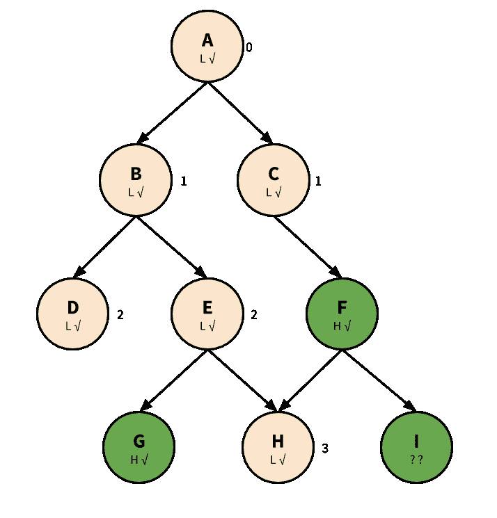
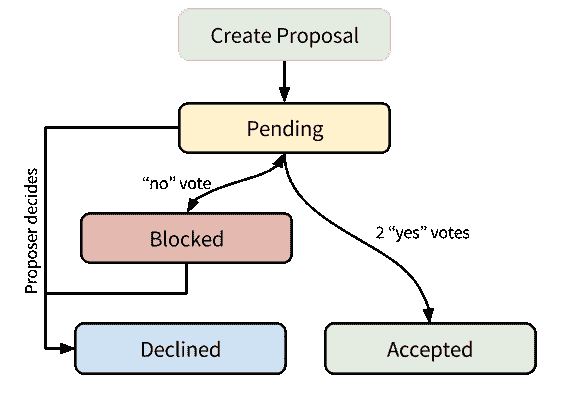

# 萨吉菲的数学

> 原文:[https://dev.to/heiskr/the-mathematics-of-sagefy-37p1](https://dev.to/heiskr/the-mathematics-of-sagefy-37p1)

在这篇文章中，我将谈论到目前为止我在 Sagefy 中使用的一些数学模型。我将讨论一下我遇到的一些问题，以及还有哪些问题有待解决。我希望随着 Sagefy 使用的数学方法的变化，偶尔更新这篇文章。

## 什么是 Sagefy？

Sagefy 是一个开放内容的自适应学习系统。 *开放内容*意味着任何人都可以创建和更新学习内容，比如维基百科。*适应性学习*指的是根据学习者的目标和他们先前的知识改变内容。这种结合意味着任何人都可以学习任何东西，不管他们之前有什么知识。要了解关于 Sagefy 的更多信息，请查看这篇[深度文章](https://dev.to/stories/why-i-m-building-sagefy)。

## sage fy 学习体验

创建账户后，首先要做的是找到一个**科目。** *一个* ***科目*** *就像是一门课程或者课程的集合。*你可以把它想象成你电脑上的文件夹；它们筑巢。你将主题添加到你的主题列表中。然后，当你开始这个主题时，你会看到一个单位树**。** *每个* ***单元*** *是一个单一的学习目标。然后，Sagefy 会让你选择你想从哪个单元开始。Sagefy 根据你所了解的情况提出了一个推荐单位。选好单位后，Sagefy 会给你看一张牌。*一张* ***卡片*** *是单项学习活动*，像视频或者选择题。当你使用卡片时，Sagefy 会更新你对该单位了解程度的模型。当你学完一个单元，你选择另一个。**科目、单位、卡**三者定义学习体验。*

[T2】](https://res.cloudinary.com/practicaldev/image/fetch/s--V4A-lwTS--/c_limit%2Cf_auto%2Cfl_progressive%2Cq_auto%2Cw_880/http://heiskr.cimg/math-1.png)

## 流行的学习模式

有几种不同的学习模式。主题是多样的。[《构建智能互动导师》比佛利公园伍尔夫](https://www.elsevier.com/books/building-intelligent-interactive-tutors/woolf/978-0-12-373594-2)更全面的处理。以下是一些主要的例子:

### 遗忘曲线

艾宾浩斯遗忘曲线是最古老的模型之一。根据记忆的强度，我们的记忆能力通常遵循以下公式:

[T2】](https://res.cloudinary.com/practicaldev/image/fetch/s--c55h_D7S--/c_limit%2Cf_auto%2Cfl_progressive%2Cq_auto%2Cw_880/http://heiskr.cimg/math-2.png)

在这个公式中，`r`是保持力，`tau`是时间，`s`是记忆的强度。

### 学习曲线

遗忘曲线的反面是学习曲线:

[T2】](https://res.cloudinary.com/practicaldev/image/fetch/s--nGlCGC3Z--/c_limit%2Cf_auto%2Cfl_progressive%2Cq_auto%2Cw_880/http://heiskr.cimg/math-3.png)

`a`在哪里学习。一些作者提出了另一种学习模型，一种 sigmoid 函数:

[T2】](https://res.cloudinary.com/practicaldev/image/fetch/s--mn92OA22--/c_limit%2Cf_auto%2Cfl_progressive%2Cq_auto%2Cw_880/http://heiskr.cimg/math-4.png)

### 贝叶斯知识追踪

[贝叶斯知识追踪](https://en.wikipedia.org/wiki/Bayesian_Knowledge_Tracing)根据学习者的回答，确定学习者了解某项技能的可能性。

贝叶斯知识追踪源于贝叶斯定理。

|  |

我们称之为…

*   `p(A|B)`**后验**——我们看到数据后所相信的。
*   `p(A)`之前的**——数据之前我们所相信的。**
***   `p(B|A)`**可能性**——给定我们先前的信念，数据的可能性有多大。*   `p(B)`**规格化器**——给出所有假设的数据的可能性有多大。**

 **`p(B)`往往难以表述。我们可以用这个来代替:

|  |

`~`在这里指的是*而不是*。

对于 BKT，我们有以下因素:

*   `p(L)` —学习者学会技能的概率。
*   `p(C)` —学习者答对题目的概率。
*   `p(T)` —学习者将学习特定项目技能的概率。
*   学习者猜出正确答案的概率。
*   `p(S)` —学习者即使知道技能也会出错的概率。

对于任何一项，得到正确答案的概率是:

[T2】](https://res.cloudinary.com/practicaldev/image/fetch/s--Aj6BbvcJ--/c_limit%2Cf_auto%2Cfl_progressive%2Cq_auto%2Cw_880/http://heiskr.cimg/math-7.png)

综上所述，给定一个正确答案，学习者学会该技能的概率是:

[T2】](https://res.cloudinary.com/practicaldev/image/fetch/s--FiWLYelo--/c_limit%2Cf_auto%2Cfl_progressive%2Cq_auto%2Cw_880/http://heiskr.cimg/math-8.png)

给出一个错误答案:

[T2】](https://res.cloudinary.com/practicaldev/image/fetch/s--iNlj5Pe2--/c_limit%2Cf_auto%2Cfl_progressive%2Cq_auto%2Cw_880/http://heiskr.cimg/math-9.png)

我们还必须考虑到学习者可能在卡片过程中提高了技能。所以…

[T2】](https://res.cloudinary.com/practicaldev/image/fetch/s--fCTz31G---/c_limit%2Cf_auto%2Cfl_progressive%2Cq_auto%2Cw_880/http://heiskr.cimg/math-10.png)

Bayes 的强大之处在于它能够在我们每次收到新信息时更新模型。我们不必以更低的频率对更大的数据集进行操作。我们可以不断更新模型，每次只更新一点点。

为了更好地解释，我推荐 Ryan Baker 的大数据和教育课程中的视频[。](https://www.youtube.com/watch?v=_7CtthPZJ70)

### 项目反应理论

[项目反应理论](http://en.wikipedia.org/wiki/Item_response_theory)决定了学习者正确回答特定问题的可能性。这是一种逻辑功能。我们在测试中更常用 IRT，但是我们也可以在适应性学习中使用 IRT。参数如下:

*   `theta` —学习者能力。
*   `b` —项目难度。
*   `a` —项目鉴别；该物品决定能力的可能性。
*   `c` —物品猜测。

有两种常见的公式:

 

公式会因作者不同而略有不同。

我们可以将项目反应理论扩展到[绩效因素分析](http://pact.cs.cmu.edu/pubs/AIED%202009%20final%20Pavlik%20Cen%20Keodinger%20corrected.pdf)。PFA 是一个与贝叶斯知识追踪相竞争的模型。

### 知识空间理论

[知识空间理论](http://en.wikipedia.org/wiki/Knowledge_space)代表学习者所知道的技能。KST 来源于[的抗疟疾药](http://en.wikipedia.org/wiki/Antimatroid)。

我们假设一个学习者要么学会了一项技能，要么没有。给定技能`+`、`-`、`*`和`/`，我们将形成先决条件，例如:

*   `+ -> -`
*   `+ -> *`
*   `* -> /`

知识空间代表学习者可能拥有的所有可能的知识集合，例如:

*   没有人
*   `+`
*   `+, -`
*   `+, *`
*   `+, *, /`
*   `+, -, *, /`

单个学习者对这些集合中的每一个都有一个可能性。KST 假设，一个单独的问题可能会询问多种技能。我们从提出使用多种技能的问题开始，然后反向评估学习者的知识。

有几个自动系统可以根据学习者的表现自动确定先决条件。

### 间隔重复

间隔重复建议学习者应该分散练习。随着能力的提高，评审应该减少。

最流行的算法是 [SuperMemo 2](http://www.supermemo.com/english/ol/sm2.htm) 。第一次审查是在 1 天后，第二次审查是在 6 天后。在此之后，下一次审查是:

[T2】](https://res.cloudinary.com/practicaldev/image/fetch/s--pxiVn1EI--/c_limit%2Cf_auto%2Cfl_progressive%2Cq_auto%2Cw_880/http://heiskr.cimg/math-13.png)

…其中`e`是项目的难易程度。`e`在 1.3 到 2.5 之间，它使用学习者对[李克特量表](http://en.wikipedia.org/wiki/Likert_scale)的反应来决定下次复习的时间。

[SuperMemo](http://www.supermemo.com/help/smalg.htm)的后续版本包括其他考虑事项，例如:

*   相似的卡片
*   上一次迭代持续时间
*   艾宾浩斯遗忘曲线

最新的是版本 [11/15](http://www.supermemo.com/english/algsm11.htm) 。

### 为什么 Sagefy 使用贝叶斯知识追踪

Sagefy 使用贝叶斯知识追踪。原因是这是一个简单的公式，计算成本低。另一个优势是，使用贝叶斯，每次学习者与系统交互一点点时，模型都会更新。这个特性可以一次性避免昂贵的建模计算。这意味着 Sagefy 既能更容易地扩展，又能处理更多样化的内容。

### 给贝叶斯知识追踪添加时间

贝叶斯知识追踪不考虑遗忘。为了解释遗忘，我在最后的计算中加入了艾宾浩斯遗忘曲线的味道。一个计算`belief`的新公式，它是给定经过时间后我们对`p(L)`的置信度:

> 经验(-1 *时间增量*(1-学习)/信念因子)

基于猜测和检查，我将我的信念因子设置为 708000。很可能，我可以在以后优化这个值。

## 我是如何学习卡、单位和科目参数的

到目前为止，这里的一切都展示了如何估计学习者了解该单元的可能性。但是，其他的参数是什么，我们又是怎么知道的呢？这是更具挑战性的领域。

### 卡片、单位、科目的参数

**纸牌。**在贝叶斯知识追踪中，大多数实现在单元级分配一个**猜测**、**滑移**、**中转**。但是，对于 Sagefy 来说，为了获得更深层次的信息，我将这些参数分配给了卡片。Transit 通知我们卡的*质量*。猜测和滑动通知我们卡片的*难度*。*难度*帮助我们选择适合学习者能力的卡片。我们还想跟踪**学员的数量**，当我们对卡片进行更改时，他们将受到影响。

**单位。**我们想知道一种方法来确定学习一个单元平均需要多少时间或多少张卡片。这是 ***难度*** 的单位。我们可以根据该单元学习者的平均能力来判断该单元的**素质**。我们还想跟踪**数量的学员**，当我们对单元进行更改时，他们将受到影响。

**科目。**我们想知道一种方法，在给定学习者当前进度的情况下，告知他们完成该主题需要多长时间。这就是本题的 ***难度*** 。我们可以通过合计剩余单元的难度来计算出该科目的难度。我们也可以以类似的方式计算**质量**，但是使用平均值而不是总和。我们还希望跟踪**数量的学员**，当我们对主题进行更改时，他们将会受到影响。

你可以看到我们有很多关于最小实体的数据，而关于更高实体的数据较少。我们跟踪关于卡片的精细数据，关于单位的数据少一点，而主题只是聚合单位数据。因此，对于本文的这一部分，重点将放在卡参数上。

### 概率质量函数

贝叶斯让我们能够不断更新我们的模型，而不是一次做大量繁重的计算。为了实现这一点，我们使用了*发行版*。所以我们有了一个折线图，而不是一个数字。一个轴是可能的值，另一个轴是该值成为正确答案的概率。因此，当我们获得更多的数据时，图表会围绕一个值收紧。

有两种类型的分布。一个是连续的。在连续分布中，我们有一个代表整个图形的方程。另一种是离散的。所以我们有具体的数据点来代表我们的图表。计算机处理离散数据自然比处理连续数据快得多。离散分布的正式名称是 [**概率质量函数**](https://en.wikipedia.org/wiki/Probability_mass_function) 。因为 Sagefy 最终是由服务器组成的，所以 PMF 是更高效、更易于使用的选择。

在 Bayes 中，PMF 很容易使用。每个可能的值都有自己的更新，与`p(A|B) = p(A) * p(B|A) / p(B)`公式相匹配。然后，我们在更新后对 PMF 进行归一化，使得这些值的总概率为 1。有了 PMF，规格化器就能搞定`p(B)`。我们已经有了`p(A)`，它是之前的一组假设。这意味着我们需要一种方法来计算`p(B|A)`，即可能性。

我所知道的关于概率密度函数的一切都是从艾伦·唐尼写的《思考贝叶斯》这本书上学来的。他给出了比我更好的解释，而且这本书是免费的。

### 卡片参数

我们需要更新每个学员响应的猜测、失误和过渡*。猜测应该随着正确答案而增加，随着错误答案而减少。错误的答案会增加滑动，正确的答案会减少滑动。如果后面的响应更正确，则传输应该增加，如果后面的响应不太正确，则传输应该减少。*

对于猜测和滑动，我知道如何计算可能性，尽管它不像我希望的那样准确。一个学习者能否得到正确答案的公式是:

> 已学习* (1-slip) + (1-learned) *猜测

并且不正确…

> 学习*滑动+(1-学习)*(1-猜测)

如果学习者答对了，我可以用第一个公式作为可能性。如果学习者错了，我可以用第二个公式。有学问是学习者的学问。你用先前的滑动来计算猜测，用先前的猜测来计算滑动。guess 或 slip 的值只是每个假设的值(因此您对每个假设值进行计算)。做数学，这意味着早期的学习者将影响猜测更多，后期的学习者将影响滑更多，正如预期的那样。

当我在模拟中运行时，它与初始值有很强的相关性。但是，它们的规模相差很大。我已经手动调整了 Sagefy 中的比例。凌日很可能会打乱这些计算，但我无法找到一个公式来自动剔除这个因素。这是一个改进的机会。

我无法找到计算过境可能性的方法。我知道以下是真的:

> transit =(learned _ post-learned _ pre)/(1-learned _ pre)

这种可能性从来没有在模拟中出现过，所以现在 Sagefy 为所有的卡设置了一个中转。这是一个重大的改进机会。

我还没有想出如何计算学习者的数量。这与其说是数学上的挑战，不如说是技术上的挑战。

### 单位和科目参数

我还没有做计算两个单元两个科目参数的工作:**难度**和**学习人数**。这两者本质上都是数据库查询。回答表可以告知难度。学习者订阅主题，而不是单元。解决方案需要弄清楚所有的关系，然后从那里开始计数。不是不可能，但也不容易。

### 我如何模拟模型和错误率

因为 Sagefy 是新的，所以我没有太多真实的用户数据来测试我的模型。目前，我使用模拟数据。我创建了一个脚本，它将创建一个主题、单位、卡片和用户的随机集合，每个都有一定范围内的随机参数。我使用三角形范围代替完全线性随机化来更接近地模拟真实数据。然后，我可以根据模拟数据运行我的模型，并计算错误率。我们可以计算每个参数的误差率，如下所示:

[T2】](https://res.cloudinary.com/practicaldev/image/fetch/s--atdEDuN4--/c_limit%2Cf_auto%2Cfl_progressive%2Cq_auto%2Cw_880/http://heiskr.cimg/math-14.png)

其中`s_i`是模拟值(每个实例)，`r_i`是真实值，`n`是实例数。

当我对此建模时，我能够通过改变我的 PMF 中的步数来减少我的错误。我也看到了缩小猜测和滑动的改进…再次，这在这一点上仍然是一个谜。希望，如果 Sagefy 吸引了用户，我们将能够使用真实数据而不是模拟数据创建更好的模型。

## 遍历单位图

贝叶斯知识追踪帮助我们在一个单位内。但是，科目包含许多单元。为了学习这门课程，我们必须在单位图上迭代。

我们收集学习者将要参与的单元的主题。我们需要诊断学员没有见过的任何单元。我们还需要诊断学习者看过的任何单元，但是由于时间的原因，我们对能力分数不再有信心。

下面是这个过程的一个例子，称为图遍历。

[T2】](https://res.cloudinary.com/practicaldev/image/fetch/s--npTPtcHU--/c_limit%2Cf_auto%2Cfl_progressive%2Cq_auto%2Cw_880/http://heiskr.cimg/math-15.png)

该算法利用深度优先搜索。我们从接近树的末端开始，一路向下进行诊断。我们将每个节点记录在三个列表之一中:诊断、就绪和学习。

首先，我们从节点“A”开始。我们诊断为 L(低分)。因为是低分，所以会继续遍历树。在诊断列表中添加“A”。

接下来，我们将继续节点“C”。这是因为我们对“C”的信心高于“B”。" C "已经确诊了。列表就绪后添加“C”。我们注意到“C”有一个依赖项“A”。

第三，我们继续节点“F”(深度优先搜索)。我们确信学习者知道节点“F ”,我们从链的另一端开始。在 Learned 后面加上“F”。虽然“F”需要“I”，但因为我们对“F”有高能力的自信，所以不会诊断“I”。

因为“C”没有其他要求，我们回到“B”。我们发现这是一种低级的能力。追加到就绪，1 依赖:a。

我们对“E”的了解比“D”多，所以继续“E”。我们发现“E”是一种低能力。追加到就绪，2 个从属:A 和 b。

我们已经知道“G”，所以在 Learned 后面加上“G”。

我们诊断“H”，发现是能力低下。附加到 Ready，3 个从属项:“A”、“B”和“E”。如果学习者没有学习“F”，单元“H”将有 4 个从属关系，而不是 3 个。该算法考虑给定节点上有多少节点*依赖于*，而不是该节点在图中有多深。

最后，我们诊断节点“D”能力低。追加到 Ready，有 2 个依赖项:“A”和“B”。

[T2】](https://res.cloudinary.com/practicaldev/image/fetch/s--IqUEWJHX--/c_limit%2Cf_auto%2Cfl_progressive%2Cq_auto%2Cw_880/http://heiskr.cimg/math-16.png)

我们还有以下列表:

> 诊断:[]就绪:[A，C，B，E，H，D]已学习:[F，G]

我们现在准备开始学习过程。

以下过于简单化；大多数学习者在第一次尝试时不会“学习”一个单元。如果在任何时候单元组成发生变化，当我们回到树中时，我们将需要诊断任何新的单元。此外，学习者需要不时地复习一些单元，以保持自信分数。

在就绪列表中，A、B 和 E 都有要求，所以这些对学习者来说还不是选项。可用的就绪节点有 C、D 和 h。

“H”有最多的依赖者，所以 Sagefy 会推荐“H”作为学习者的起点。假设学习者选择先学习单元“D”。

现在剩下的集合是 C 和 h，学习者选择 h，所以现在剩下的集合是 E 和 C，假设学习者选择 C。

现在，剩下的唯一选择是 E。在 E 之后，学习者会做 B，然后是 a。

## 选择卡片

在学习者选择一个单位后，Sagefy 必须为他们选择一张卡片。几个因素开始起作用:

*   学习者对这一单元的掌握程度如何？`p(L)`
*   哪些卡是评估 v 非评估卡？(例如，视频是非评估，多选是评估)
*   学习者最近见过这张卡片吗？
*   该卡是否需要先办另一张卡？
*   卡有多好？`p(T)`

我们的目标如下:

*   我们想展示适当难度的卡片。例如，滑差高的牌不适合`p(L)`低的人。
*   我们希望将重点放在低`p(L)`的非评估卡和高`p(L)`的评估卡上。
*   我们希望尽可能避免展示学员最近看过的卡片。
*   我们想‘遵循’卡的要求。

当前流程是这样工作的:

*   找到`p(L)`。
*   在单位中随机选择十张牌。
*   根据评估和非评估将卡片分开。
*   如果学习者的`p(L)`很低，更可能倾向于不评估。随着`p(L)`的增加，更倾向于评估。
*   对于评估卡，尽量找一个正确概率大于 0.25 小于 0.75 的。否则，出示任何评估卡。
*   非考核的，就挑第一个。
*   否则，选择任何剩余的可用卡。

这里有些东西可以改进。我们可以添加标签，跟踪学习者如何使用不同种类的卡片，并使用`p(T)`来选择质量更好的卡片。总的来说，这并不像找出学习者知道什么和不知道什么那样困难。

## 贡献者经历

贡献者体验仍是一项进行中的工作。

在大多数开放内容系统中，*任何人都可以编辑*。但是，通常会有许多人订阅内容的所有更改。当未讨论的变更发生时，该变更立即被**恢复**。只有通过**讨论**和**同意**才能使变更永久化。

Sagefy 通过不允许直接编辑，而是允许任何人**提议**对内容进行修改，来规范这个过程。然后，其他用户可以**对提案进行**投票。有了足够多的支持票，萨吉菲做出了改变。Sagefy 也记录了所有的变化。如果有任何重大异议，萨格菲**会阻止这个提议。**

## 贡献者评级和基于共识的决策

[T2】](https://res.cloudinary.com/practicaldev/image/fetch/s--63kjQlaE--/c_limit%2Cf_auto%2Cfl_progressive%2Cq_auto%2Cw_880/http://heiskr.cimg/math-17.png)

接受提议的决定有几个因素:提议者和投票者的**声誉**以及实体的**使用**。

### 实体计算

我们将“赞成”的投票权计算为提议者和“赞成”投票者的投票权之和。

我们将“反对”投票权计算为“反对”投票人投票权的总和。

要接受一项提案，该提案需要`log2(number_of_learners)`投赞成票的权力。

要阻止一项提案，该提案需要`log100(number_of_learners)`投“否”票的权力。

为了消除提案的障碍，我们必须共同努力，将“反对”的投票权减少到这个数量以下。否则，提议者可以拒绝他们的提议。

原因很简单:不可能总是达成完美的共识。然而，我们应该认真考虑异议。多数决没有近乎一致的意见那么强大。

*举例:*

> *   Number of learners, number of acceptors, come to block-1, 0, 0-10, 3.32, 0.5-100, 6.64, 1-1000, 9.97, 1.5-10000, 13.28, 2-100000, 16.61, 2.5.

### 贡献者计算

每一个提案和对处于已接受状态的提案的投票计为+1 分。Sagefy 将投票权计算为`1-e^(-points/40)`。这似乎是一个令人费解的公式。原因是为了避免“超级用户”,他们仅凭线性声誉就可以做出任何改变。0 和 10 次成功投稿之间的差异给了我们很多信息。10 到 100，少一点。还有 100 到 1000，甚至更少。我们从最早的例子中学到的最多，而从每个例子中学到的越来越少。

*举例:*

> *   Minutes: strength-0: 0-5: 0.12-10: 0.22-20: 0.39-50: 0.71-100: 0.91-150: 0.97-200: 0.99.

## 行动号召

如你所见，这只是开始。萨吉菲现在是它将来成长的种子。回顾一下，下面是最直接的开放式问题和待办事项:

*   为什么似然函数会高估猜滑？
*   我们如何计算过境的可能性？
*   计算单元和科目的难度和学习人数。
*   在进入“学习模式”之前，有效地诊断学习者的当前知识。
*   用真实数据代替模拟数据进行测试。
*   实施贡献者评级和共识制度。

### 在 Sagefy 中使用数学的其他一些机会:

*   完善选卡模式。
*   创建一个处理异步同级评估的模型。(如简答/短文类型题，文件上传等。)
*   向学习者推荐新的科目。
*   过滤垃圾邮件和低质量的内容。
*   将学员与其他学员和导师配对。
*   小组学习。
*   学习者应该什么时候休息？
*   内容的有效性或准确性如何？

如果你觉得这很有趣，就来加入吧！伸手在 [**上呢喃**](https://twitter.com/sagefyorg) **。**谢谢！

如果你想了解更多关于 Sagefy 的信息，请访问今天的网站。**