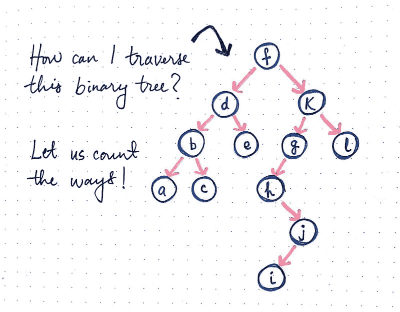
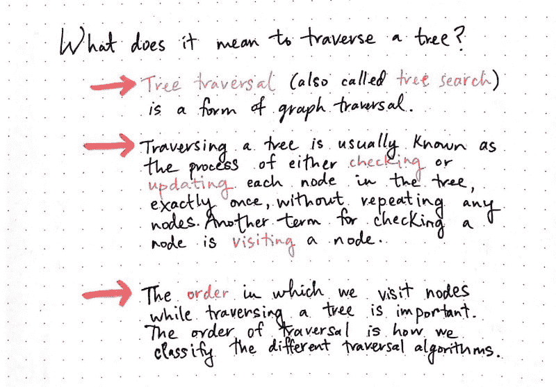
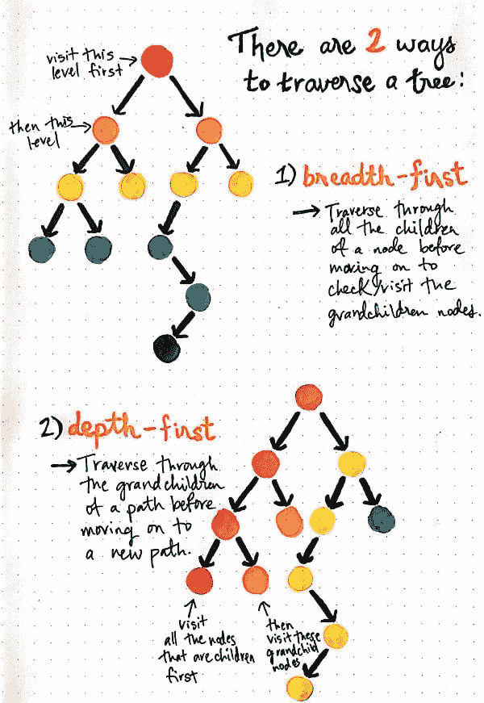
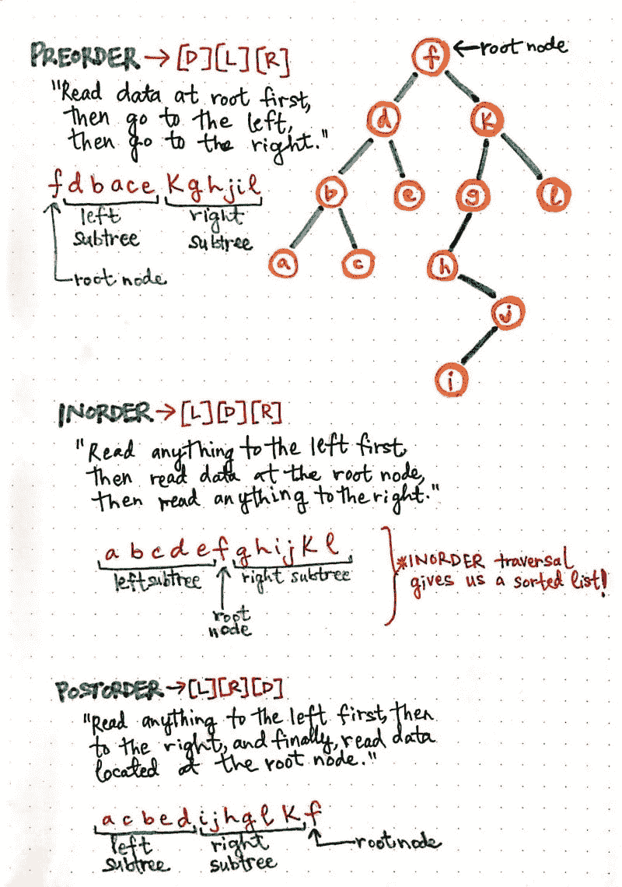
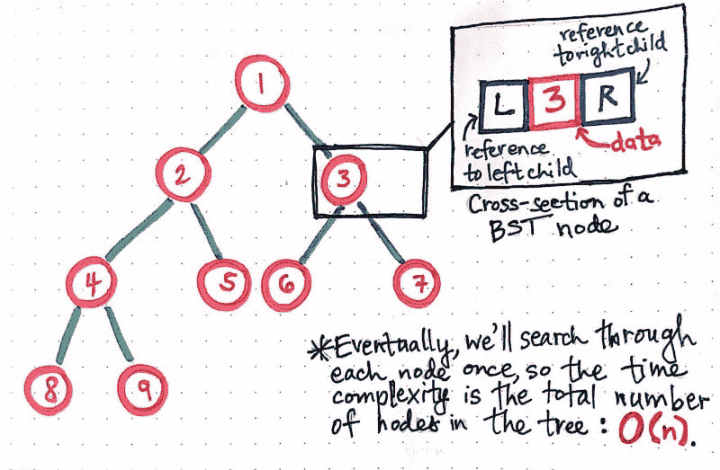
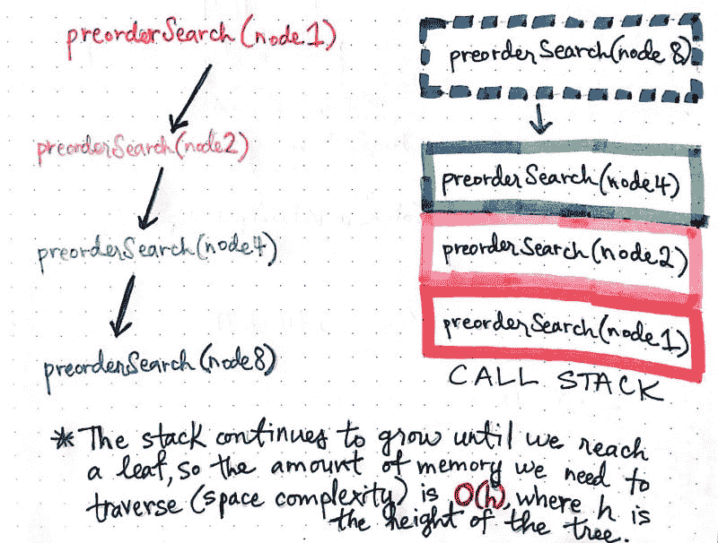

# 揭秘深度优先搜索

> 原文:[https://dev.to/vaidehijoshi/demystifying-depth-first-search](https://dev.to/vaidehijoshi/demystifying-depth-first-search)

一旦你对不同的数据结构有了足够的了解，你就开始对自己思考:对，那么…这又有什么意义呢？为什么我们首先会有所有这些结构？

当你下到树林里时，很容易会失去对森林的任何感觉。但是现在是我们缩小一点的时候了，因为我们终于可以——终于！——开始进入超级有趣的东西。我说的超级有趣是指:**算法**！

我开始[这个系列](https://dev.to/vaidehijoshi)想了解更多关于这些我一直听说的算法(偶尔会发现自己在技术面试前的半夜搜索，疯狂地试图通过记忆互联网告诉我应该知道的术语来准备)。但是，事实证明，在你进入算法之前，你必须知道数据结构！现在我们知道了。我们讨论了[线性和非线性](https://dev.to/vaidehijoshi/whats-a-linked-list-anyway)数据结构之间的区别，以及一种类型的结构何时比另一种更有用。我们深入研究了[图](https://dev.to/vaidehijoshi/a-gentle-introduction-to-graph-theory)和[树](https://dev.to/vaidehijoshi/leaf-it-up-to-binary-trees)之间的差异，以及它们存在于互联网和我们机器内部的所有隐藏之处。

现在，是做好事的时候了:让*使用*我们的数据结构，以便了解它们到底有什么用处。没有比算法更好的起点了，这个算法在很长一段时间里给我带来了很多困惑:深度优先搜索。

### 极小的树遍历的味道

在我们真正进入深度优先搜索的复杂性之前，我们需要先回答一个重要的问题:遍历一棵树到底意味着什么？我们对行走和[遍历图形](https://dev.to/vaidehijoshi/knigsberg-seven-small-bridges-one-giant-graph-problem)有所了解，但是树呢？

[T2】](https://res.cloudinary.com/practicaldev/image/fetch/s--m8YND_JZ--/c_limit%2Cf_auto%2Cfl_progressive%2Cq_auto%2Cw_880/https://cdn-images-1.medium.com/max/800/1%2AcpvBj8a_cCDKSZOhKxVSTg.jpeg)

好吧，如果你的记忆力比我好，你会记得树实际上只是图形的有限版本——也就是说，树是遵循一组更严格规则的图形。我们已经知道有许多不同的方式来遍历一个图:我们可以从一个节点开始，在另一个节点结束，或者我们可以在同一个地方开始和结束。我们可以找到一条简单的路径，使我们永远不会重复相同的节点或边两次，或者我们可以找到一条允许我们重复节点和边的路径。

然而，尽管它们相似，树和图肯定是不同的。当我们谈论遍历一棵树时，理解我们到底在谈论什么是很重要的。让我们看看我们在处理什么。

因为树是图的一种*类型*，**树遍历**在逻辑上也是一种图遍历。树遍历有时也被称为**树搜索**。然而，遍历树的过程与更广泛的遍历图的过程略有不同。当我们搜索一棵树时，我们通常是为了达到以下目的:或者*检查*树结构中的所有节点，或者*更新*结构中的所有节点。不管是哪种情况，这里有一点需要注意:我们不会多次搜索一棵树的节点。如果我们试图检查或更新树中的每个节点，我们不希望重复访问一个节点不止一次！

> 因此，当我们遍历一棵树时，我们真正想做的是不重复地遍历这棵树。

[T2】](https://res.cloudinary.com/practicaldev/image/fetch/s--241HzSvG--/c_limit%2Cf_auto%2Cfl_progressive%2Cq_auto%2Cw_880/https://cdn-images-1.medium.com/max/800/1%2AY59AZP6aTWpWQSkcVSOM1Q.jpeg)

但是，不只是访问每个节点一次才算数，顺序也很重要！事实证明，对于树，当遍历树中的每个节点并只访问一次时，我们可以依靠的主要技术只有两种。最终，我们有两个选择:我们可以走得更远，或者走得更远。

[T2】](https://res.cloudinary.com/practicaldev/image/fetch/s--vILEmcvH--/c_limit%2Cf_auto%2Cfl_progressive%2Cq_auto%2Cw_880/https://cdn-images-1.medium.com/max/600/1%2AWjNB8eZNiOLl3tnb1h0X2A.jpeg)

描述这两个选项更常见的术语是**广度优先搜索**和**深度优先搜索**，它们可能正是你所期望的*。*

 *在*广度优先搜索(BFS)* 中，我们可以说是通过撒开一张大网来搜索树中的所有节点。这意味着我们将从一个级别到下一个级别搜索节点，并在继续访问孙节点之前遍历一个节点的所有子节点(我们将在访问曾孙节点之前访问孙节点……您明白了吧！).

但是我们现在还不讨论广度优先搜索。相反，让我们转向两个选项中的第二个:*深度优先搜索(DFS)* 。

> 在深度优先搜索中，一旦我们开始一条路径，我们就不会停止，直到我们到达终点。换句话说，我们遍历一棵树的一个分支，直到找到一片叶子，然后再回到树干。

在上图中，我们可以看到，我们不是逐层遍历，而是通过访问所有的子代、孙代、曾孙代(等等)来遍历树，直到到达路径的末端。然后——也只有到那时——我们才能回到水平线上，开始一条新的道路。我们沿着这条路径，首先访问红色的所有节点，然后继续访问橙色的节点。

### 这棵树太深了，我差点淹死

当然，在计算机科学的世界里，没有什么是那么简单的。尽管我们已经将树遍历选项分解为两种可能的路径——BFS 和 DFS——但事实证明我们可以更深入地进行深度优先搜索！谁会想到。

一旦我们缩小了树遍历方法的范围，使用深度优先搜索，我们仍然只完成了一半。即使在 DFS 领域，我们也有几个不同的选项来选择在树搜索中要实施的深度优先策略。

有几种不同的方法可以搜索树的子节点、孙节点和曾孙节点。实际上，这一切都归结于我们决定做事的顺序。

您可能还记得，除了包含一些数据，[二叉树](https://dev.to/vaidehijoshi/leaf-it-up-to-binary-trees)中的一个节点只能有两个引用:一个是对其左边节点的引用(其数据较小)，另一个是对其右边节点的引用(其数据较大)。我们已经知道，每当我们搜索一棵树时，我们都试图或者*检查*或者*更新*结构中的所有节点。

在这两种情况下，我们需要做三件事:

1.  读取我们正在检查或更新的节点的数据。
2.  检查我们当前所在的节点(左侧引用)左侧的**节点。**
3.  检查我们当前所在的节点(左引用)右边**的节点。**

不同的深度优先策略都围绕着我们做这三件事的顺序。

[T2】](https://res.cloudinary.com/practicaldev/image/fetch/s--iNaufynT--/c_limit%2Cf_auto%2Cfl_progressive%2Cq_auto%2Cw_880/https://cdn-images-1.medium.com/max/600/1%2AiHf2wqSyra1kqOKvVBsbtA.jpeg)

因为我们每次访问/检查一个节点时都要做三件事，所以我们做这些事的顺序有六种可能的排列，我在左图中画出了这些排列。

然而，在这六种排列中，前三种是最受欢迎的，也是最常见的。事实上，它们无处不在，以至于有了特殊的名字！

第一种常见的 DFS 策略是这样的:a)读取我们所在节点的数据，b)访问引用左边的节点(如果存在), c)访问引用右边的节点(如果存在)。读取数据，然后先访问左节点再访问右节点的过程，常简写为 **DLR** ，其中 **D** 代表数据， **L** 代表左节点， **R** 代表右节点。

我们用这个简写来描述我们检查的顺序。我告诉过你这三种策略有特殊的名字，对吗？我想我应该告诉你它们是什么:

1.  **Preorder (DLR)** :读取节点的数据，然后访问左边的子树/节点，接着是右边的子树/节点。
2.  **Inorder (LDR)** :访问左边的子树/节点，然后读取该节点的数据，最后访问右边的子树/节点。
3.  **后序(LRD)** :访问左子树/节点，再访问左子树/节点，最后读取节点的数据。

好吧。所有这些定义可能看起来像是要一下子接受大量的信息。我认为有了图画，事情会变得容易得多——希望会更清楚一点！让我们用一个示例树来仔细看看前序、中序和后序遍历是什么样子的。

在下图中，我们正在一棵总共有 12 个节点的二叉树上尝试所有这三种技术。如果我们在访问时打印出每个节点的名称，那么每个遍历看起来会是这样:

[T2】](https://res.cloudinary.com/practicaldev/image/fetch/s--Z5DzmB1M--/c_limit%2Cf_auto%2Cfl_progressive%2Cq_auto%2Cw_880/https://cdn-images-1.medium.com/max/800/1%2AVXCLl-ZaTisSgDGPTOXZeQ.jpeg)

有意思！如果我们看看这三个遍历是如何工作的，我们会很快注意到整个“DLR 简写形式”实际上具有很大的权重。

例如，在*前序遍历*中，我们首先读取节点处的数据，然后移动到左边的子树，然后移动到右边的子树。因此，我们访问的节点(以及我们打印它们的数据)遵循这种模式:首先我们打印根节点的数据，然后是左子树的数据，然后是右子树的数据。

然而，在 *inorder 遍历*中，我们沿着路径一直向下到最左边的叶子，然后在沿着路径向下到最右边的叶子之前，返回到根节点。Inorder 遍历特别酷，因为我们最终得到了一个排序的节点列表！

最后，在*后序遍历*中，我们首先访问左边的节点引用，然后是右边的节点，如果不存在，我们读取当前所在节点的数据。这就是为什么我们在读取 node_b_ 的数据之前，先读取节点 *a* 的数据，然后读取节点 *c* 的数据。我们在遍历的最后读取根节点(在访问了左子树和右子树中的所有节点之后)，这与后序遍历的简写匹配:LRD。

### 用递归更深入！

好了，我们有三种不同的方法来实现深度优先搜索。

我想这很酷。

但是……我们实际上如何着手*实施*这些策略呢？为什么，当然是通过使用递归！

如果你是递归的新手，我强烈推荐你阅读我以前关于递归的帖子。以防你需要快速复习一下:**递归**是在内从*调用一个方法的过程——并且有效地一次又一次重复一个动作。*

您可能已经看到深度优先策略是如何作为递归方法实现的。如果你仔细想想，就会越来越清楚:我们在做同样的事情——读取数据，检查左节点引用，检查右节点引用——一次又一次，直到我们遍历完树中的所有节点。当然，根据我们选择的策略，有时我们会以*稍微*不同的顺序做这三个动作——但是，我们仍然以相同的顺序对我们访问的每个节点做相同的三件事。

我们可以递归地实现这一点，首先考虑这些节点在我们代码的上下文中可能是什么样子。这里有一个二叉查找树氏结的小横截面，可以帮助你想象:

[T2】](https://res.cloudinary.com/practicaldev/image/fetch/s--T5cg6BF4--/c_limit%2Cf_auto%2Cfl_progressive%2Cq_auto%2Cw_880/https://cdn-images-1.medium.com/max/800/1%2A60uzSIuYpOKC5H8oJKo0Bg.jpeg)

每个节点都有三个部分——数据、左引用和右引用。立刻，我们已经可以非常清楚地看到一件事:我们将不得不重复“为树中的每个节点读取节点的这三个部分。

> 因此，我们使用 DFS 遍历树所花费的时间与树中的节点数成正比。在二叉树上使用广度优先搜索的时间复杂度是 O(n)，其中 n 是树中节点的数量。

如果我们有 5 个节点，这将花费我们 O(5)的时间，如果我们有 50 个节点要访问，这将花费我们 O(50)的时间。

好的，那么我们如何在代码中实现这些节点的横截面呢？嗯，它可能像一个物体一样简单，看起来像这样:

```
node1 = {  
  data: 1,  
  left: referenceToLeftNode,  
  right: referenceToRightNode  
}; 
```

那还不算太糟！我们能更进一步吗？让我们为前序遍历搜索策略写一个函数。我将用 JavaScript 对它进行伪代码化，但希望它能很容易地从一种语言翻译成另一种语言:

```
function preorderSearch(node) {  
  // Check that a node exists. 
  if (node === null) {  
    return;  
  } 
```

```
// Print the data of the node. 
  console.log(node.data);  

  // Pass in a reference to the left child node to preorderSearch. 
  // Then, pass reference to the right child node to preorderSearch. 
  preorderSearch(node.left);  
  preorderSearch(node.right);  
} 
```

好吧，也没有我想象的那么糟糕！我们所做的只是将前序遍历的 **DLR** 简写转换成代码。该函数接收一个节点，并检查该节点是否存在。然后，它读取节点的**数据**，并对**左**节点引用进行前序搜索，随后对**右**节点引用进行前序搜索。

哇哦。递归在起作用。我们实际上写了*一个*函数，但是我们从它自身内部调用那个*完全相同的函数*。你开始头晕了吗？

好吧，好吧，听我说，因为这个递归魔术实际上揭示了一个更重要的事情:广度优先搜索的时间复杂度。我们知道 BFS 花费的*时间*直接对应于一棵树有多大——具体来说，它有多少个节点，因为这是我们需要访问的节点数，这将直接影响我们遍历整棵树所需的时间！

但是关于*空间*的复杂性呢？因为 DFS 通常是递归实现的，所以最终我们会多次从函数内部调用一个函数。让我们回头看看我们的横截面示例树。如果我们要实现前序搜索，我们将从节点 1 遍历到节点 2，从节点 2 遍历到节点 4，从节点 4 遍历到节点 8。每当我们访问这些节点中的一个时，我们将从传入根节点时调用的第一个函数中调用`preorderSearch`函数。

为什么这很重要？嗯，因为**调用栈**。你可能还记得在本系列的前面，我们了解到堆栈[是根据后进先出原则](https://dev.to/vaidehijoshi/stacks-and-overflows)运行的。这意味着只有当最后一个函数结束运行并返回时，我们才能开始从栈顶弹出那些*当前占用空间*的函数。

[T2】](https://res.cloudinary.com/practicaldev/image/fetch/s--Sc73aoSy--/c_limit%2Cf_auto%2Cfl_progressive%2Cq_auto%2Cw_880/https://cdn-images-1.medium.com/max/800/1%2AmhCQswDT8zWlKP41zcS4WA.jpeg)

这意味着我们的调用堆栈将继续增长，直到到达一个叶节点。

> 一旦我们到达一个叶节点，我们的`preorderSearch`函数将`return`，因为我们将把对`left`和`right`节点的引用传递给它，而*根本不会存在*！

然后我们调用栈中的每个打开的函数将开始返回并关闭，直到我们返回到开始调用的第一个函数。理解这一点很重要，因为它举例说明了深度优先搜索的*空间复杂性*——也就是说，我们在内存方面需要的空间量取决于树的高度，或 **O(h)** 。树的高度将告诉我们在最深的递归函数调用中需要多少内存，这将告诉我们运行深度优先搜索算法的最坏情况。

当我们后退一步，这实际上是非常强大的——我们可以学到很多关于优点(和缺点！)的算法，只要看一个数据结构！由于我们已经知道树在哪里使用——例如在`git bisect`命令中，以及在实现复杂的结构中，如迷宫——我们可以理解使用 DFS 搜索它们有多容易或多难，只需简单地看一眼。

我不知道你怎么想，但是我想说我们正在成为算法奇才的路上。

### 资源

深度优先搜索似乎在编码面试中经常出现，一开始可能很难理解。如果 DFS 仍然感到困惑，或者如果你只是想了解更多关于它如何工作和不同的搜索策略，你可以从下面的链接开始。

1.  [二叉树](https://www.cmpe.boun.edu.tr/~akin/cmpe223/chap4.htm)，H. Levent Akin 教授
2.  内森·兰德曼，卡莉·摩尔，姬敏·希姆
3.  [二叉树的 BFS vs DFS](http://www.geeksforgeeks.org/bfs-vs-dfs-binary-tree/)，GeeksforGeeks
4.  [深度优先搜索的应用](http://www.geeksforgeeks.org/applications-of-depth-first-search/)，GeeksforGeeks
5.  [二叉树遍历:前序，中序，后序](https://www.youtube.com/watch?v=gm8DUJJhmY4&index=34)，mycodeschool*