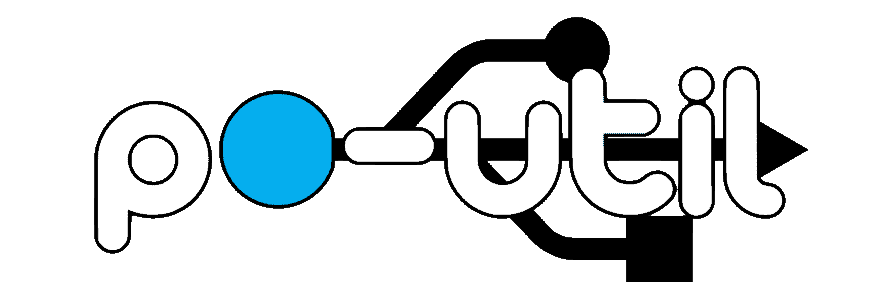

# 如何使用 po-util 在本地开发粒子

> 原文:[https://dev . to/nrobinson 2000/how-to-develop-particle-locally-using-po-util](https://dev.to/nrobinson2000/how-to-develop-particle-locally-using-po-util)

> Particle Web IDE、Particle Dev 和 particle-cli 并不是编程粒子设备的唯一方式。

[T2】](https://res.cloudinary.com/practicaldev/image/fetch/s--6U86s6cr--/c_limit%2Cf_auto%2Cfl_progressive%2Cq_auto%2Cw_880/https://cehs.github.img/po-util-updated.svg)

## 什么是 po-util？

Po-util ，Particle Offline Utility 的缩写，是我维护的一个工具，用于促进最终的本地粒子开发体验。Po-util 通过消除使用粒子云来构建固件的需要，消除了在本地开发粒子项目的麻烦。

Po-util 是我个人的本地粒子开发解决方案，它使用 GCC for ARM Cortex 处理器工具链，直接在您的计算机上使用[粒子固件源](https://github.com/spark/firmware)构建您的项目。

Po-util 是一个 bash shell 脚本，可以在 GitHub 上获得，适用于 Linux 和 macOS。

## po-util 的特性

除了使用几个`make`命令之外，还有更多的功能可以利用。Po-util 是我精心开发的独特的工作流程，以便其他人可以体验本地粒子开发的方式。

#### Po-util 提供了许多功能，包括:

*   所需依赖项的完全安装。

*   支持为粒子光子、电子、P1、核心、树莓 Pi 和 Redbear Duo 构建固件。

*   使用 DFU 实用程序通过 USB 上传“即时”固件。

*   连续无线固件上传到“产品”中的多个设备。

*   在 po-util 的 Linux 和 macOS 版本之间交叉兼容的统一项目结构。

*   一个高效的库管理器，可以处理来自粒子库 2.0 或 GitHub 的库。

*   一系列键盘快捷键加速了在 Atom 中的开发。

## po-util 入门

安装和使用 po-util 是一种有益的体验。(但是，您必须是计算机管理员。)

对于基于 Debian、Red Hat 或 Arch 的 Linux 发行版，您可以在终端中运行以下命令来安装 po-util:

```
$ bash <( curl -sL https://git.io/vX4cl ) install 
```

<svg width="20px" height="20px" viewBox="0 0 24 24" class="highlight-action crayons-icon highlight-action--fullscreen-on"><title>Enter fullscreen mode</title></svg> <svg width="20px" height="20px" viewBox="0 0 24 24" class="highlight-action crayons-icon highlight-action--fullscreen-off"><title>Exit fullscreen mode</title></svg>

在 macOS 上，你可以使用[自制软件](https://brew.sh) :
安装 po-util

```
$ brew tap nrobinson2000/po
$ brew install po
$ po install 
```

<svg width="20px" height="20px" viewBox="0 0 24 24" class="highlight-action crayons-icon highlight-action--fullscreen-on"><title>Enter fullscreen mode</title></svg> <svg width="20px" height="20px" viewBox="0 0 24 24" class="highlight-action crayons-icon highlight-action--fullscreen-off"><title>Exit fullscreen mode</title></svg>

## 用 po-util 创建项目

要使用 po-util，您必须在一个初始化的项目目录中工作。(下面有更多关于项目结构的信息。)

要创建一个项目，只需在您的终端中运行以下命令:

```
$ po init photon newProject 
```

<svg width="20px" height="20px" viewBox="0 0 24 24" class="highlight-action crayons-icon highlight-action--fullscreen-on"><title>Enter fullscreen mode</title></svg> <svg width="20px" height="20px" viewBox="0 0 24 24" class="highlight-action crayons-icon highlight-action--fullscreen-off"><title>Exit fullscreen mode</title></svg>

该命令创建`newProject`文件夹，并在其中创建适当的文件夹和文件。原子快捷方式文件被设置为构建粒子光子的固件。(您可以将`photon`替换为`electron`、`P1`、`core`、`pi`或`duo`来初始化其他设备的项目。)

要使用这些快捷方式，您将需要 [Atom 构建包](https://atom.io/packages/build)。你可以很容易地把这个包和其他几个推荐的包放在一起:

```
$ po setup-atom 
```

<svg width="20px" height="20px" viewBox="0 0 24 24" class="highlight-action crayons-icon highlight-action--fullscreen-on"><title>Enter fullscreen mode</title></svg> <svg width="20px" height="20px" viewBox="0 0 24 24" class="highlight-action crayons-icon highlight-action--fullscreen-off"><title>Exit fullscreen mode</title></svg>

## Po-util 项目结构

Po-util 的工作原理是将你的代码按照一个有组织的结构分成几个项目:

```
firmware/
└ main.cpp

bin/
└ firmware.bin

devices.txt
libs.txt
.atom-build.yml
README.md 
```

<svg width="20px" height="20px" viewBox="0 0 24 24" class="highlight-action crayons-icon highlight-action--fullscreen-on"><title>Enter fullscreen mode</title></svg> <svg width="20px" height="20px" viewBox="0 0 24 24" class="highlight-action crayons-icon highlight-action--fullscreen-off"><title>Exit fullscreen mode</title></svg>

所有源代码都放入`firmware/`，编译后的二进制保存为`bin/firmware.bin`。您可以在`devices.txt`中指定要按顺序刷新的设备，而`libs.txt`是 po-util 跟踪项目中要使用的库的方式。

Po-util 支持为 [Atom](https://atom.io) 构建快捷方式，这些快捷方式是在`.atom-build.yml`中设置的，如果你需要在每个项目的基础上修改的话。

## 使用 po-util 与 Atom

现在您已经创建了一个项目并安装了推荐的包，在 Atom 中打开项目文件夹。

在左边，您应该会找到您的`firmware/main.cpp`文件。这是你应该保存大部分代码的地方。(然而，您可以使用单独的文件和库，但是您的大部分代码应该放在这里。)

当您的项目被初始化时，您会在您的`firmware/main.cpp`中找到下面的伪代码:

```
#include "Particle.h" 
void setup() { // Put setup code here to run once

}

void loop() { // Put code here to loop forever

} 
```

<svg width="20px" height="20px" viewBox="0 0 24 24" class="highlight-action crayons-icon highlight-action--fullscreen-on"><title>Enter fullscreen mode</title></svg> <svg width="20px" height="20px" viewBox="0 0 24 24" class="highlight-action crayons-icon highlight-action--fullscreen-off"><title>Exit fullscreen mode</title></svg>

在这里，您可以观察到 po-util 最有用的特性之一，Atom 的键盘快捷键。如果按下`Ctrl + Alt + 1`，Atom 将通过运行:
来构建项目

```
$ po photon build 
```

<svg width="20px" height="20px" viewBox="0 0 24 24" class="highlight-action crayons-icon highlight-action--fullscreen-on"><title>Enter fullscreen mode</title></svg> <svg width="20px" height="20px" viewBox="0 0 24 24" class="highlight-action crayons-icon highlight-action--fullscreen-off"><title>Exit fullscreen mode</title></svg>

按下`Ctrl + Alt + 2`构建固件，并使用 DFU 实用程序通过 USB 将其刷新到您的设备，方法是运行以下程序，也可以从您的终端完成:

```
$ po photon flash 
```

<svg width="20px" height="20px" viewBox="0 0 24 24" class="highlight-action crayons-icon highlight-action--fullscreen-on"><title>Enter fullscreen mode</title></svg> <svg width="20px" height="20px" viewBox="0 0 24 24" class="highlight-action crayons-icon highlight-action--fullscreen-off"><title>Exit fullscreen mode</title></svg>

> 如果你像我一样快速原型化，闪烁将成为一个常用的快捷方式。

按`Ctrl + Alt + 3`清除固件，并通过运行
删除`bin/`目录

```
$ po photon clean 
```

<svg width="20px" height="20px" viewBox="0 0 24 24" class="highlight-action crayons-icon highlight-action--fullscreen-on"><title>Enter fullscreen mode</title></svg> <svg width="20px" height="20px" viewBox="0 0 24 24" class="highlight-action crayons-icon highlight-action--fullscreen-off"><title>Exit fullscreen mode</title></svg>

按下`Ctrl + Alt + 4`将固件上传到您的设备，无需通过运行
进行重建

```
$ po photon dfu 
```

<svg width="20px" height="20px" viewBox="0 0 24 24" class="highlight-action crayons-icon highlight-action--fullscreen-on"><title>Enter fullscreen mode</title></svg> <svg width="20px" height="20px" viewBox="0 0 24 24" class="highlight-action crayons-icon highlight-action--fullscreen-off"><title>Exit fullscreen mode</title></svg>

按下`Ctrl + Alt + 5`通过运行
将固件无线上传到`devices.txt`中列出的任何设备

```
$ po photon ota --multi 
```

<svg width="20px" height="20px" viewBox="0 0 24 24" class="highlight-action crayons-icon highlight-action--fullscreen-on"><title>Enter fullscreen mode</title></svg> <svg width="20px" height="20px" viewBox="0 0 24 24" class="highlight-action crayons-icon highlight-action--fullscreen-off"><title>Exit fullscreen mode</title></svg>

## 配置您的设备以使用 po-util

po-util 将使用 DFU 实用程序上传固件的所有设备必须修补/升级其固件，以便 po-util 自动将其置于 DFU 模式。为此，[手动将您的设备置于 DFU 模式](https://docs.particle.io/guide/getting-started/modes/photon/#dfu-mode-device-firmware-upgrade-)，并运行以下程序来更新您设备上的系统固件:

```
$ po photon update 
```

<svg width="20px" height="20px" viewBox="0 0 24 24" class="highlight-action crayons-icon highlight-action--fullscreen-on"><title>Enter fullscreen mode</title></svg> <svg width="20px" height="20px" viewBox="0 0 24 24" class="highlight-action crayons-icon highlight-action--fullscreen-off"><title>Exit fullscreen mode</title></svg>

> 默认情况下，当连接的计算机将串行波特率设置为`14400`时，所有粒子设备将进入 DFU 模式。但是，在 Linux 上，波特率不能像`14400`一样设置为任意值。Po-util 通过使用`19200`作为波特率将设备置于 DFU 模式来解决这个问题。如果你愿意，你可以在 macOS 上使用`14400`，运行`$ po config`并在提示输入波特率时选择`default`。

## 使用带有 po-util 的粒子库

po-util 最大的特点之一是它灵活的库管理器。库管理器不仅允许使用粒子库列表中的库，还支持使用 GitHub 中的任何库。

通过使用`$ po lib get`和`$ po lib add`命令，可以下载一个库并将其添加到项目中。例如，您可以使用以下命令将`neopixel`库添加到项目中:

```
$ po lib get neopixel
$ po lib add neopixel 
```

<svg width="20px" height="20px" viewBox="0 0 24 24" class="highlight-action crayons-icon highlight-action--fullscreen-on"><title>Enter fullscreen mode</title></svg> <svg width="20px" height="20px" viewBox="0 0 24 24" class="highlight-action crayons-icon highlight-action--fullscreen-off"><title>Exit fullscreen mode</title></svg>

您甚至可以从`neopixel`库中加载一个例子。

首先，用
检查有哪些例子

```
$ po lib ex ls neopixel 
```

<svg width="20px" height="20px" viewBox="0 0 24 24" class="highlight-action crayons-icon highlight-action--fullscreen-on"><title>Enter fullscreen mode</title></svg> <svg width="20px" height="20px" viewBox="0 0 24 24" class="highlight-action crayons-icon highlight-action--fullscreen-off"><title>Exit fullscreen mode</title></svg>

上面的命令返回以下内容，表明有可用的示例:

```
Found the following neopixel examples:

a-rainbow, extra-examples, rgbw-strandtest 
```

<svg width="20px" height="20px" viewBox="0 0 24 24" class="highlight-action crayons-icon highlight-action--fullscreen-on"><title>Enter fullscreen mode</title></svg> <svg width="20px" height="20px" viewBox="0 0 24 24" class="highlight-action crayons-icon highlight-action--fullscreen-off"><title>Exit fullscreen mode</title></svg>

将`extra-examples`示例加载到您的项目运行中:

```
$ po lib ex load neopixel extra-examples 
```

<svg width="20px" height="20px" viewBox="0 0 24 24" class="highlight-action crayons-icon highlight-action--fullscreen-on"><title>Enter fullscreen mode</title></svg> <svg width="20px" height="20px" viewBox="0 0 24 24" class="highlight-action crayons-icon highlight-action--fullscreen-off"><title>Exit fullscreen mode</title></svg>

## 共享一个公共工程

共享 po-util 项目最实用的方法是将其上传到 GitHub，因为您的项目被初始化为 git 存储库，并设置为使用 [Travis CI](https://travis-ci.org/) 进行测试。

如果您想要一种“快速而肮脏”的方式来共享您的代码，以便可以在不使用 Po-util 的情况下构建它，po-util 提供了另一种方法。使用`$ po lib pack`，您可以创建一个`firmware/`目录的副本，其中包含所有的符号链接和库。还创建了一个 tar.gz 档案。

使用可公开访问的库时，建议您从项目中清除二进制文件和库。这将从您的`firmware`目录中移除符号链接，但是将您的项目所依赖的库保留在您的`libs.txt`中。

要清理您的项目，请运行以下命令:

```
$ po lib clean 
```

<svg width="20px" height="20px" viewBox="0 0 24 24" class="highlight-action crayons-icon highlight-action--fullscreen-on"><title>Enter fullscreen mode</title></svg> <svg width="20px" height="20px" viewBox="0 0 24 24" class="highlight-action crayons-icon highlight-action--fullscreen-off"><title>Exit fullscreen mode</title></svg>

您可以随时使用
重新下载和添加库

```
$ po lib setup 
```

<svg width="20px" height="20px" viewBox="0 0 24 24" class="highlight-action crayons-icon highlight-action--fullscreen-on"><title>Enter fullscreen mode</title></svg> <svg width="20px" height="20px" viewBox="0 0 24 24" class="highlight-action crayons-icon highlight-action--fullscreen-off"><title>Exit fullscreen mode</title></svg>

> 如果您正在使用 GitHub 和 Travis CI 进行共享，清理是不必要的，因为 Travis CI 会为您完成。

## 更多实用信息

要了解更多关于 po-util 的信息，请阅读带有`$ man po`的手册页，查看[网站](https://nrobinson2000.github.io/po-util/)，或者查阅 GitHub 上的[资源库。](https://github.com/nrobinson2000/po-util)

非常感谢明星、反馈、投稿和捐款。我希望你喜欢使用 po-util，就像我喜欢创建它一样。

[Linux 版回购](https://github.com/nrobinson2000/po-util) - [macOS 版回购](https://github.com/nrobinson2000/homebrew-po)

[用 Paypal 捐款](https://www.paypal.me/nrobinson2000) - [用比特币捐款](http://nrobinson2000.github.io/donate-bitcoin/?currency=USD)

[原载于我的博客](https://cehs.github.io/2017/03/31/how-to-develop-locally-using-po-util.html) - [下载 PDF](https://cehs.github.io/develop-with-po-util.pdf)