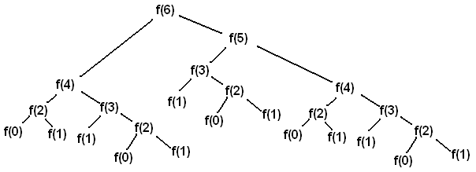

# 动态编程系列-简介

> 原文:[https://dev.to/ankursheel/dynamic-programming-series-简介](https://dev.to/ankursheel/dynamic-programming-series---introduction)

*本文已从[这里](http://ankursheel.com/blog/dynamic-programming-series-introduction/)T3 交叉发布*

动态编程是每个程序员都应该拥有的技术之一。但是，这也让很多人感到困惑。很长一段时间，我都在努力掌握如何将动态编程应用于解决问题。我在互联网上找到的大多数文章都给出了最终的动态编程解决方案，而没有实际展示达到最终解决方案所采用的方法。

在本文中，我将通过一个例子展示使用动态编程方法解决问题的好处。最后，我将展示一些可以用来找到动态编程解决方案的步骤。希望在阅读完本文后，您会发现动态编程简单而直观。

* * *

# **什么是动态编程？**

动态规划是解决特定类型的复杂计算问题的有效方法。这些问题通常是那些可以分解成更小的重叠子问题的问题。它的基本特征是递归和记忆。记忆是保存特定状态的结果以备后用的能力。

* * *

# **剖析**

为了证明我们正在改进我们的解决方案，我们需要可以比较的统计数据。我将使用[谷歌基准](https://github.com/google/benchmark)来帮助描述我们的解决方案。基准将如下所示

| 基准名称 | 执行时间 | 迭代次数/秒 | 每秒项目数 |
| --- | --- | --- | --- |

1.  **基准名称:**基准的名称。它将是传入的 FunctionName/value 格式。
2.  **运行时间**:我们的函数返回一个结果所用的时间。
3.  **迭代次数/秒**:1 秒钟内可以调用函数的次数。
4.  **每秒项目数:**—1 秒内处理的项目数。

2 和 3 将给出函数的时间复杂度，而 4 将给出空间复杂度。

* * *

# **举例:斐波那契数列**

解释动态编程的经典例子是[斐波纳契运算](https://en.wikipedia.org/wiki/Fibonacci_number)——它可以被形式化为如下

```
Fibonacci(n) = 0; if n = 0
Fibonacci(n) = 1; if n = 1
Fibonacci(n) = Fibonacci(n-1) + Fibonacci(n-2) ; if n >=2 
```

<svg width="20px" height="20px" viewBox="0 0 24 24" class="highlight-action crayons-icon highlight-action--fullscreen-on"><title>Enter fullscreen mode</title></svg> <svg width="20px" height="20px" viewBox="0 0 24 24" class="highlight-action crayons-icon highlight-action--fullscreen-off"><title>Exit fullscreen mode</title></svg>

## **朴素递归方法**

斐波纳契数列可以通过下面的递归方法轻松求解:

```
long Fibonacci(long n)
{
  if (n == 0)
  {
    return 0;
  }
  if (n == 1)
  {
    return 1;
  }
  return Fibonacci(n - 2) + Fibonacci(n - 1);
} 
```

<svg width="20px" height="20px" viewBox="0 0 24 24" class="highlight-action crayons-icon highlight-action--fullscreen-on"><title>Enter fullscreen mode</title></svg> <svg width="20px" height="20px" viewBox="0 0 24 24" class="highlight-action crayons-icon highlight-action--fullscreen-off"><title>Exit fullscreen mode</title></svg>

在我的机器上运行上述代码并对其进行分析后，我得到:

| 基准名称 | 执行时间 | 迭代次数/秒 | 每秒项目数 |
| --- | --- | --- | --- |
| 斐波那契逆/10 | 0 毫秒 | Two million four hundred and eighty-eight thousand eight hundred and eighty-nine | 17.0685 米 |
| 斐波那契逆/20 | 0 毫秒 | Twenty-one thousand three hundred and thirty-three | 303.026 千 |
| 斐波那契逆/30 | 8 毫秒 | One hundred and seventy-nine | 3.60887 千 |
| 斐波那契逆/40 | 997 毫秒 | one | Forty |
| 斐波那契逆/50 | 124510 毫秒 | one | 0.40282 |

虽然这种方法对于 n = 30 的几乎可以立即返回，但是对于 n = 40 的**需要不到一秒的时间，对于 n = 50 的**大约需要 2 分钟。为什么跑步时间增长如此之快？这可以通过执行堆栈很容易地解释。为了简单起见，我们对 **n = 6** 这样做。下图显示了调用的顺序。 [](https://res.cloudinary.com/practicaldev/image/fetch/s--2E7cm862--/c_limit%2Cf_auto%2Cfl_progressive%2Cq_auto%2Cw_880/http://ankursheel.com/wp-content/uploads/2017/03/Algorithms-F6CallTree.png) 斐波那契数列:来自维基共享****

查看图像，我们可以看到，为了计算*斐波那契(6)，*我们计算了—*斐波那契(5)* 1 次—*斐波那契(4)* 2 次\\,*斐波那契(3)* 3 次,*斐波那契(2)* 5 次\\,斐波那契(1)8 次\\*斐波那契(0) 5 次在整个调用栈中，我们重复计算已经计算过的值。随着 ***n*** 越来越大，重复工作的数量也在不断增加。你一定已经意识到这种解决方案根本不具备可伸缩性。如果你认为一定有更好的方法，你是对的。*

## **带记忆的自顶向下递归方法**

改进上述解决方案的第一步是添加记忆功能，即将之前计算的值存储在某种数据结构中。虽然您可以使用任何您喜欢的数据结构，但是对于这个例子，我将使用一个映射。

```
#define MOD 1000000007 
long FibonacciMemonized(long n)
{
  std::map<long, long> computedValues;
  computedValues.insert(make_pair(0, 1));
  computedValues.insert(make_pair(1, 1));
  return FibonacciMemonized(n, computedValues);
}

long FibonacciMemonized(long n, std::map<long, long>& computedValues)
{
 if (computedValues.find(n) != computedValues.end())
 {
   return computedValues[n];
 }
 long newValue = (FibonacciMemonized(n - 1, computedValues) + FibonacciMemonized(n - 2, computedValues)) % MOD;
 computedValues.insert(make_pair(n, newValue));
 return newValue;
} 
```

<svg width="20px" height="20px" viewBox="0 0 24 24" class="highlight-action crayons-icon highlight-action--fullscreen-on"><title>Enter fullscreen mode</title></svg> <svg width="20px" height="20px" viewBox="0 0 24 24" class="highlight-action crayons-icon highlight-action--fullscreen-off"><title>Exit fullscreen mode</title></svg>

topÂ方法是我们的主要方法。它所做的只是将两个基本案例添加到一个映射中，然后调用底层方法，并将映射作为参数之一。这个底层方法就是我们的递归方法。在这个方法中，我们检查映射是否包含计算值。如果是，那么我们只返回那个值，否则，我们计算 n-1 和 n-2 的值。我们使用 **1000000007** 修改结果以避免溢出。在返回它们的总和之前，我们将值存储在地图中。这个版本有多好？让我们看看基准测试的结果

| 基准名称 | 执行时间 | 迭代次数/秒 | 每秒项目数 |
| --- | --- | --- | --- |
| 斐波那契放大/1000 | 0 毫秒 | Four thousand and seventy-three | 3.60284 米 |
| fibonaccimmonized/5000 | 2 毫秒 | Eight hundred and ninety-six | 2.90891 米 |
| fibonaccimmunized/10000 | 3 毫秒 | Four hundred and seven | 2.82288 米 |
| fibonaccimmonized/15000 | 5 毫秒 | Two hundred and forty-two | 2.66937 米 |
| fibonaccimmonized/20000 | 7 毫秒 | One hundred and eighty-seven | 2.65432 米 |

我们可以看到，我们已经大大减少了时间。即使对于 **n = 20000** ，结果也是瞬时的。然而，这种方法有一个问题。你能发现它吗？如果你说的是内存使用，那你绝对是对的。尽管新版本更快，但它仍然是一个递归算法。递归算法的问题是每次递归调用都会占用堆栈上的一些空间。一个足够高的 **n** ，我们就有耗尽内存的风险。让我们用一个例子来看看为什么会发生这种情况，其中 **n = 100** 。因为，我们开始的时候没有结果，我们递归调用 999，998，997 的方法...1.在这一点上，我们在我们的地图上有所有的计算结果。现在，当我们从递归函数返回时，我们只需在表中查找值并返回它。因此，即使我们减少了递归调用的次数，我们仍然在得到初始结果之前进行了 **n** 次递归调用。通过比较这个算法和前一个算法之间的迭代次数/秒，可以很容易地看出这一点。让我们试试更好的。

## **用动态规划的自下而上方法**

在前一种方法中，我们的主要问题是算法的递归性质。让我们看看是否可以通过使用迭代方法来摆脱它。我们如何做到这一点？我们不是从最终值开始，而是从最小的值-n 开始建立结果。

```
#define MOD 1000000007 
long FibonacciDP(long n)
{
  if (n == 0)
  {
    return 0;
  }
  if (n == 1)
  {
    return 1;
  }
  long* results = new long[n + 1];
  results[0] = 0;
  results[1] = 1;
  for (int i = 2; i <= n; i++)
  {
    results[i] = (results[i - 1] + results[i - 2]) % MOD;
  }
  long value = results[n];
  delete[] results;
  return value;
} 
```

<svg width="20px" height="20px" viewBox="0 0 24 24" class="highlight-action crayons-icon highlight-action--fullscreen-on"><title>Enter fullscreen mode</title></svg> <svg width="20px" height="20px" viewBox="0 0 24 24" class="highlight-action crayons-icon highlight-action--fullscreen-off"><title>Exit fullscreen mode</title></svg>

在上面的函数中，我们有一个由 n+1 组成的数组来存储结果。我们为我们的基本情况 **n=0** 和**n = 1 * *初始化数组，然后开始从**2** 到 **n** 迭代。在每一步，我们可以使用之前计算的 2 个值，并最终返回结果。让我们再来看看基准测试的结果，看看这种方法的效果如何？

| 基准名称 | 执行时间 | 迭代次数/秒 | 每秒项目数 |
| --- | --- | --- | --- |
| FibonacciDP/100000 | 1 毫秒 | One thousand nine hundred and six | 130.711 米 |
| FibonacciDP/600000 | 5 毫秒 | Two hundred and eighty | 111.456 米 |
| FibonacciDP/1100000 | 10 毫秒 | One hundred and forty-five | 110.626 米 |
| FibonacciDP/1600000 | 14 毫秒 | One hundred | 112.249 米 |
| FibonacciDP/2100000 | 18 毫秒 | Eighty-one | 110.448 米 |

即使当 **n=210，000** 时，这种方法也几乎立即返回。同时，由于这种算法本质上不是递归的，我们大大减少了所需的空间。我们可以通过比较物品/秒来看出这一点——虽然 **n** 比以前增加得更快，但减少得更慢。现在你可能会想，既然我们有线性时间复杂度和线性空间复杂度，这就是结局。在大多数情况下，这是真的。但是，在这种情况下，我们可以进一步优化我们的解决方案。

## **自下而上的动态规划方法(优化)**

在最后一种算法中，所需的空间量与-**n**成正比。这是因为我们正在存储所有的结果。但是，我们不需要存储它们。让我们只使用 3 个变量来去掉这个数组——2 个存储以前的结果，1 个存储当前的结果。

```
#define MOD 1000000007 
long FibonacciDPOptimized(long n)
{
  if (n == 0)
  {
    return 0;
  }
  if (n == 1)
  {
    return 1;
  }
  long n1 = 0;
  long n2 = 1;
  long current = 0;
  for (int i = 2; i <= n; i++)
  {
    current = (n1 + n2) % MOD;
    n1 = n2;
    n2 = current;
  }
  return current;
} 
```

<svg width="20px" height="20px" viewBox="0 0 24 24" class="highlight-action crayons-icon highlight-action--fullscreen-on"><title>Enter fullscreen mode</title></svg> <svg width="20px" height="20px" viewBox="0 0 24 24" class="highlight-action crayons-icon highlight-action--fullscreen-off"><title>Exit fullscreen mode</title></svg>

尽管该算法与前一个算法做的事情完全相同，但我们已经将空间复杂度降低到常数，因为所需的空间量不再依赖于-**n**。再次比较基准测试结果

| 基准名称 | 执行时间 | 迭代次数/秒 | 每秒项目数 |
| --- | --- | --- | --- |
| FibonacciDPOptimized/100000 | 0 毫秒 | Two thousand nine hundred and eighty-seven | 202.569 米 |
| FibonacciDPOptimized/600000 | 3 毫秒 | Four hundred and ninety-eight | 207.242 米 |
| FibonacciDPOptimized/1100000 | 5 毫秒 | Two hundred and eighty | 202.138 米 |
| FibonacciDPOptimized/1600000 | 7 毫秒 | One hundred and eighty-seven | 205.188 米 |
| FibonacciDPOptimized/2100000 | 10 毫秒 | One hundred and twenty-eight | 205.0708 米 |

在这里，我们可以看到，虽然* *在增加，但每秒的项目数大致相同。这是我们能做的最好的了，没有进一步优化的可能。

* * *

# **结论**

从上面的例子中，我们可以看到，我们只需要识别重叠的子问题，然后通过缓存计算结果来避免重复工作。总的来说，我们可以使用这些步骤来找到解决问题的动态编程方法

1.  找出重叠的子问题。
2.  从递归解决方案开始
3.  修改递归解决方案以使用自顶向下的记忆版本。
4.  通过使递归成为迭代解决方案来消除递归。
5.  如果不需要保留之前的所有结果，只保留需要的结果。

如果你想自己运行代码，你可以在这里找到代码[—](https://github.com/AnkurSheel/DynamicProgramming)

* * *

希望这篇文章已经揭开了动态编程的神秘面纱。在本系列接下来的几篇文章中，我们将研究一些可以通过动态编程解决的更常见的问题，并使用上述步骤提出解决方案。你以前试过动态编程吗？你的体验如何？请在评论中告诉我。