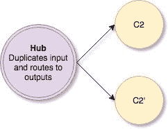
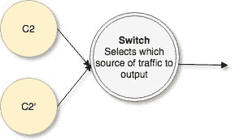

# 使用配置执行快速代码回滚

> 原文:[https://dev . to/MSS Cohen/performing-rapid-code-roll backs-using-configuration](https://dev.to/msscohen/performing-rapid-code-rollbacks-using-configurtion)

*原载于 msscohen.com<u>[——一个软件工程师的想法](http://www.msscohen.com/posts/rolling-code-releases-back-rapidly-using-the-project%E2%80%99s-configuration)</u>*

 *常见的代码发布如下所示:

 
*系统变更前由三个部件组成*

 
*改变后的系统:一个组件被替换为改进的组件。*

如果出现问题，并且 <u>[回滚是可能的](http://guides.beanstalkapp.com/deployments/best-practices.html)</u> ，回滚应该用旧的生产代码替换新的生产代码(用 C2 替换 C2)。回滚计划通常意味着:

*   通过将相反的差异提交给项目的版本控制来恢复当前版本。
*   将上述变更部署到生产环境中。
*   重新启动项目服务以应用新代码。
*   回滚过程完成后，可能需要额外的修复，如修复损坏的数据。

回滚过程可能看起来微不足道，但是当使用分布式系统时，执行提交并向几十个服务器发布新版本可能需要时间。这段时间非常宝贵，因为这是一个有问题的生产版本工作的时间，可能会导致更多的损坏数据、更多的数据丢失、更多的停机时间等等。

处理这种情况的一种方法是应用一种架构模式，这种模式允许通过更改项目配置文件中的单个参数来进行回滚。以下是这种架构的示意图:

 
*适应快速回滚的架构模式:使用 Hub 将数据复制并分发到新旧组件；交换机组件使用相应的配置密钥来决定启用哪条路径。*

该架构提供了两个新组件:

**Hub** :将流量复制并分发到几个输出端。对于文件系统，该组件将文件复制到几个目录中；对于消息队列，该组件将消息路由到多个队列(例如通过使用一个 <u>[扇出交换机](http://rubybunny.info/articles/exchanges.html#fanout_exchanges)</u>)；对于 HTTP 服务器，该组件将复制 HTTP 请求并将其发送到多个目的地。

[T2】](https://res.cloudinary.com/practicaldev/image/fetch/s--EXGcvrZa--/c_limit%2Cf_auto%2Cfl_progressive%2Cq_auto%2Cw_880/http://www.msscohen.com/assets/hub.jpeg)

**开关**:根据配置选择输出哪个流量源。您可以实现一个通用开关，也可以对每个端点应用一个开关，根据专用的配置密钥启用或禁用每个端点的输出。

[T2】](https://res.cloudinary.com/practicaldev/image/fetch/s--X34dgu2K--/c_limit%2Cf_auto%2Cfl_progressive%2Cq_auto%2Cw_880/http://www.msscohen.com/assets/switch.jpeg)

这种模式的优点之一是，您可以在不使用新代码的情况下部署它(当开关关闭时)，因此您可以用真实的生产数据和压力测试代码，并通过简单的配置更改激活它。此外，集线器和交换机是通用组件，可用于其他用例。

这种模式的一个缺点是，对于小版本来说，编写一个 hub，编写一个 switch 并复制所有传入的数据可能是多余的。另一个缺点是，一旦新版本足够稳定，下一个版本应该删除旧版本的(C2，可能还有集线器和交换机)。

我将这种模式应用于高风险变更或大型发布。在我管理的一个最大的项目中，我在产品中保持了几个月的新版本，但没有使用这种模式。在这几个月中，我们添加了越来越多的组件，并在不影响客户的情况下，用实际生产数据测试了系统的行为。只有当我们确信我们的系统是可靠的，我们才启用它。

## 进一步阅读

在 <u>[中实现的交换机和集线器组件点击](http://read.cs.ucla.edu/click/elements)</u> 。Click 是一种软件架构，用于构建灵活且可配置的路由器，最初由麻省理工学院开发。*