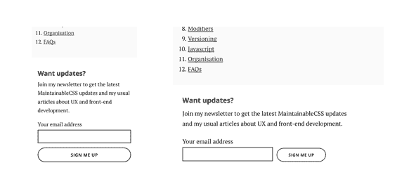

# 停止使用设备断点

> 原文:[https://dev.to/adambsilver/stop-using-device-breakpoints](https://dev.to/adambsilver/stop-using-device-breakpoints)

我总是看到它。设计师和开发人员一样，根据他们喜欢的设备设置断点。我们什么时候才能从过去的错误中吸取教训？

当网络出现时，我们选定了 640 像素的宽度。几年后，当更大的显示器上市时，我们选定了 960 像素。我们不再关心显示器更小的人。

然后又过了几年。移动网络诞生了。或者更准确地说，我们可以在手机上浏览网站，因为手机屏幕很小。一百万个浏览器问世了。一百万台设备问世了。浏览器给了我们媒体查询。

大约在这个时候，我们决定使用 320 像素的移动。*为什么？*因为我们很多人都有 iPhone，这是它的纵向宽度。

[T2】](https://res.cloudinary.com/practicaldev/image/fetch/s--J0RcxnqY--/c_limit%2Cf_auto%2Cfl_progressive%2Cq_auto%2Cw_880/https://cdn-images-1.medium.com/max/2000/1%2APO-X9g5ZJZQFDILcbAaDdA.png)

<figcaption>And then. And then. And then.</figcaption>

然后是风景模式。然后平板(那还是移动的对吧？).然后是桌面。然后是大桌面，比如超大尺寸的雷电屏幕，或者不管叫什么。(我没有谷歌它，因为你知道我的意思)。然后是电视。然后是手表，然后...

你明白了。卷筒纸不是印刷品。网络就是网络，我们不知道用户的屏幕有多大。我们控制不了。即使我们可以，设备的激增意味着为它们设计是徒劳的。

但是有些事情我们是知道的。我们知道自己的品牌和用户界面。更重要的是，我们知道我们的*内容*。内容不仅仅是文本的段落。它是*被持有或包含在某物中的东西。*

我们应该总是从内容开始。没有内容，设计就没有意义。我们*设计*帮助用户消费*内容*。我们不使用内容来帮助用户享受我们的设计。

我们经常从一个盒子开始设计。然后我们把小盒子放进去。然后，我们将在这些框中填入实际内容。

正如 Frank Chimero 在[的《网络的纹理》](http://www.frankchimero.com/writing/the-webs-grain/)、*中漂亮地解释的那样，这几乎是我们能做的最糟糕的事情了*。

在我们知道内容是什么之前，我们怎么可能设计出一些东西呢？

我曾目睹设计师完成他们的模型，并要求常驻内容设计师使内容适合。甚至可以要求他们缩短用户友好的内容，以确保它不会换行等等。可能对设计师有帮助。对用户没有帮助。

当他们在风景或不属于自己的设备上检查自己的设计时，他们会感到慌张。他们所认为的控制，实际上是对他们设计的一组已知设备尺寸的不必要的约束。

相反，我们应该让内容成为我们的向导。如果内容需要，我们应该在 when 和*设置断点。我们可以称它们为*内容断点*或者弗兰克所说的*重组点*。*

以 [MaintainableCSS](http://maintainablecss.com) 上的订阅表单为例。采用内容导向、小屏幕优先的方法，按钮位于文本框下方。如果有空位，他们会并排坐在一起。

[T2】](https://res.cloudinary.com/practicaldev/image/fetch/s--IZYx0AQF--/c_limit%2Cf_auto%2Cfl_progressive%2Cq_auto%2Cw_880/https://cdn-images-1.medium.com/max/800/1%2ABqGlYQLXhhRp7buZYx1ejw.png)

<figcaption>Responsive subscribe form based on content break points</figcaption>

媒体查询使用断点`36em`。*为什么？*因为这是内容重组的机会。当按钮和文本控件在更大的屏幕上变得很宽时，它们就失去了启示性。所以我们可以解决这个问题。

它只与订阅表单相关。没有一条通用规则规定`36em`的意思是“大”。断点反映了正在讨论的模块和内容的需要。

*技术上来说*这只是媒体的询问。但是心态和方法使它与众不同。设计支持内容。而不是相反。

这就是为什么 CSS [框架](http://getbootstrap.com/css/)会因为不必要地限制我们的内容以适应预定义的网格而导致问题。CSS 框架如何知道我们的内容是什么？它不能。

术语*移动优先*鼓励我们从设备的角度思考。但是网络不是一套设备。网络是一个没有边界的连续统一体。这是我写过最酷的一句话。

抱歉用了行话。意思是这样的。为了定义一个编码的响应网格，试图计算出一个特定设备的大小是绝对没有意义的。

往好里说，这是一种约束，往坏里说，它会引发问题。

相反，让内容成为你的向导。如果它中断了，我们可以用必要的内容断点重新组装它。

响应式设计将我们从基于设备的设计的束缚中解放出来，这是不可能实现的。无论用户使用何种尺寸的设备，内容断点都能给用户带来更好的体验。

***就这样结束了。但是，如果你喜欢这篇文章，你应该*** [***订阅我的私人邮件列表***](http://adamsilver.io/signup) ***。我大约一个月发一次这样的文章到你的收件箱。这是继续对话的好方法。*T13】**

*本帖最初发表于[medium.com](https://medium.com/simple-human/stop-using-device-breakpoints-b11a87e2625c)T3】*