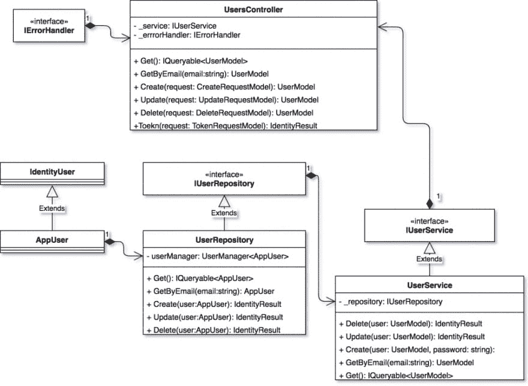

# 单元测试 ASP.NET 核心标识

> 原文：<https://dev.to/samueleresca/unit-testing-aspnet-core-identity>

最初发布于:[https://samueleresca.net](https://samueleresca.net)

> ASP.NET 核心身份是一个会员系统，允许您添加登录功能到您的应用程序。用户可以创建一个帐户，并使用用户名和密码登录，或者他们可以使用外部登录提供商，如脸书，谷歌，微软帐户，Twitter 等。

在下面的文章中，您将学习如何实现和单元测试——ASP.NET 核心标识。您可以配置[ASP.NET 核心标识](https://github.com/aspnet/Identity)使用 SQL Server 数据库来存储用户名、密码和配置文件数据。或者，您可以使用自己的持久性存储将数据存储在另一个持久性存储中，下面的文章将使用 SQL Server 作为数据源引擎。文中描述的项目也将使用 [OpenIddict](https://github.com/openiddict) 来实现令牌认证: [OpenIddict](https://github.com/openiddict) 旨在提供一个**简单易用的解决方案**来实现任何 ASP* *中的 **OpenID Connect 服务器。****网芯应用。

#### 设置项目

下面的文章将把[ASP.NET 核心标识](https://github.com/aspnet/Identity)添加到使用的示例项目中:使用 ASP.NET 核心实现 SOLID REST API[。为了使用](https://samueleresca.net/2017/02/implementing-solid-data-access-layers-using-asp-net-core/) [OpenIddict](https://github.com/openiddict) ，**将适当的 MyGet 库添加到您的 NuGet 源**中。这可以通过在您的解决方案的根目录下添加一个新的`NuGet.Config`文件来完成:[https://gist . github . com/samueleresca/f 4897 BF 1598 ea 116 df 04 E1 CB 94 ee 05d 5](https://gist.github.com/samueleresca/f4897bf1598ea116df04e1cb94ee05d5)以便使用 ASP.NET 核心身份和 [OpenIddict](https://github.com/openiddict) 将以下包添加到您的项目中:

[https://gist . github . com/samueleresca/db20d 8530 e0a 6785d 0 ea 6 c 9 c 60671460](https://gist.github.com/samueleresca/db20d8530e0a6785d0ea6c9c60671460)

##### 设置认证

创建新的`Startup.Auth.cs`文件，该文件将包含认证设置:[https://gist . github . com/samueleresca/622 b 50631610 c 9 b 9 aa 1 f 5 eed cf 9 b 613 e](https://gist.github.com/samueleresca/622b50631610c9b9aa1f5eedcf9b613e)`Startup.Auth.cs`包含部分启动类并初始化身份环境:

*   将`IdentityDbContext`添加到应用服务中；
*   将`AppUser`模型类映射为身份类；
*   配置 OpenIddict 的使用；

##### 从数据源中检索数据

以下模式显示了 API 实现，从数据访问层到 API 层:  为了从数据源中检索用户数据，应用程序将使用 4 个关键组件:

*   `AppUser`定义用户数据源模型；
*   `UserRepository`将服务类连接到数据源。它使用 DbContext 从数据库中检索信息；
*   `UserService`—聚合不同的提供商:`UserValidator`、`PasswordValidator`、`SignInManager`；它被`UserController`用来从数据库中获取信息；
*   处理来自客户端的 http 请求并检索用户信息；

下面的代码展示了`UserController`的实现。`UserService`和`UserRepository`在 Github 上有[。](https://github.com/samueleresca/Blog.Turnmeup)

[https://gist . github . com/samueleresca/143919 b 169408773885 c 176d 657 ecc7b](https://gist.github.com/samueleresca/143919b169408773885c176d657ecc7b)

#### 单元测试用户 API

显然，我们需要使用单元测试来覆盖`UsersController`。以下项目将使用 [xUnit](https://xunit.github.io/) 和 [Moq](https://github.com/moq/moq) 作为嘲讽框架。首先，`UsersControllerTests`定义了两个伪类:`FakeUserManager`和`FakeSignInManager`，它们将被嘲讽框架使用:

[https://gist . github . com/samueleresca/4780 B1 f 9026675764 c 850d 076 ff 750 fa](https://gist.github.com/samueleresca/4780b1f9026675764c850d076ff750fa)T2【https://gist . github . com/samueleresca/c3cd 952 B3 B0 b5 aff 15 ee 11 c 63446 f 93 f

为了模仿[ASP.NET 核心标识](https://github.com/aspnet/Identity)，创建一个新的测试服务器来解决应用程序依赖性:

[https://gist . github . com/samueleresca/b4e 9 a 886 e5f 27917792 f 315 e 940 BC 464](https://gist.github.com/samueleresca/b4e9a886e5f27917792f315e940bc464)

最后，我们需要通过使用 [Moq](https://github.com/moq) 来模拟我们的`FakeUserManager`和`FakeSignInManager`类。模拟将由`UserControllerTest`类的构造函数(setup)实现:

[https://gist . github . com/samueleresca/593 D1 b 602 DC 1 e 951 b 7 f 64 C2 f 433590 a 7](https://gist.github.com/samueleresca/593d1b602dc1e951b7f64c2f433590a7)

#### 结论

总之，ASP.NET 核心身份是由 ASP.NET 核心提供的开箱即用的会员框架。这篇文章展示了如何测试用户认证的行为，你可以在 GitHub 上找到[完整的项目。封面图片由](https://github.com/samueleresca/Blog.Turnmeup)[科拉多·泽妮](http://www.corradozeni.it/)拍摄。干杯:)