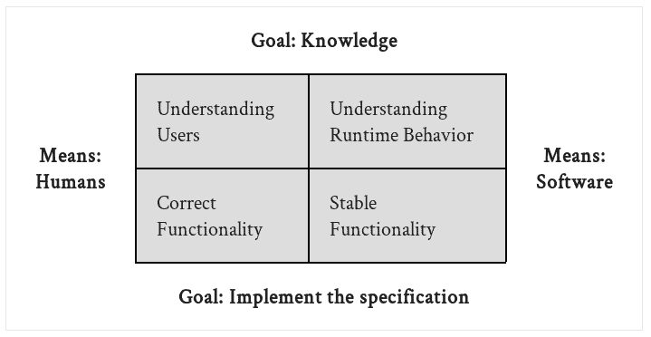

# 大图软件测试:单元测试，精益启动，以及介于两者之间的一切

> 原文:[https://dev . to/itamarst/big-picture-software-testing-unit-testing-lean-startup-and-everything in-between](https://dev.to/itamarst/big-picture-software-testing-unit-testing-lean-startup-and-everything-in-between)

> 这是我将在 2017 年 PyCon 上发表的演讲草稿，[最初发表在我的博客](https://codewithoutrules.com/2017/03/26/why-how-test-software/)上。我希望听到您的反馈、问题和建议。
> 
> ——伊塔马尔，[itamar@codewithoutrules.com](//mailto:itamar@codewithoutrules.com)

为什么要测试你的软件？你应该如何测试你的软件？有些人对这些问题有简单的答案。

Yolo 程序员根本懒得测试，乐于活在当下。更严肃的程序员会告诉你，你测试你的软件是为了生产一个高质量的产品。为了生产一个高质量的产品，你必须总是写单元测试和集成测试，并做质量保证。忽略这些中的任何一个，你的代码将会陷入满是 bug 的深渊。

虽然我更赞同第二种观点，但我不认为这是一个充分的答案。考虑到软件项目之间的差异，似乎不可能有一套适合所有人的答案:

*   手机游戏不等同于医疗器械，也不等同于网上商店。
*   每个组织都是不同的:一个白手起家的创业公司和一个大型跨国公司拥有非常不同的资源，两者都不太像 NASA。
*   每个项目都经历不同的阶段。一个没有用户的产品和一个被成千上万的企业使用的产品处于非常不同的位置。

**你需要的不是一个单一的答案，而是一种选择答案的方式，这些答案要符合*你的*情况和*你的*需求。**我们将首先考虑您可用于测试的方法。然后我们会考虑你为什么要测试你的软件。最后，我们将结合手段和目标来看看你如何选择测试你的软件。

## 可以使用哪些测试手段？

首先，让我们考虑一下您可以使用的不同测试方法。下面的代码是测试吗？

```
def test_add():
    assert add(2, 2) == 5 
```

<svg width="20px" height="20px" viewBox="0 0 24 24" class="highlight-action crayons-icon highlight-action--fullscreen-on"><title>Enter fullscreen mode</title></svg> <svg width="20px" height="20px" viewBox="0 0 24 24" class="highlight-action crayons-icon highlight-action--fullscreen-off"><title>Exit fullscreen mode</title></svg>

我会说，是的，这显然是一个测试。甚至在函数名中也这么说。测试证明`add()`做了它应该做的事情:将两个数字相加并给出结果。

当然，你已经注意到这个测试是*错的*。幸运的是，我们的开发过程还有另一个步骤:代码审查。亲爱的读者，你可以作为一个代码审查者告诉我，我的代码是错误的，2 + 2 是 4，而不是 5。

代码审查是测试的一种形式吗？如果你试图验证你的代码符合规范，那么，这是一个测试。您头脑中有一个算术规范(“2 + 2 = 4”)，并且您正在检查代码是否遵循它。

让我们将代码审查视为测试的一种形式，与自动化单元测试并列。即使它们都是测试，它们也有很大的不同。两者的核心区别是什么？

一种形式的测试是自动化的，另一种是由人来完成的。

自动化测试是一致的和可重复的。你可以这样写:

```
def test_add_twice():
    for i in range(10000000):
        assert add(i, i) == 2 * i 
```

<svg width="20px" height="20px" viewBox="0 0 24 24" class="highlight-action crayons-icon highlight-action--fullscreen-on"><title>Enter fullscreen mode</title></svg> <svg width="20px" height="20px" viewBox="0 0 24 24" class="highlight-action crayons-icon highlight-action--fullscreen-off"><title>Exit fullscreen mode</title></svg>

电脑每次都会运行完全相同的代码。代码将确保`add()`始终为这些特定的输入返回特定的结果。一个人在手工验证一千万个不同的计算时会面临一些困难:无聊、分心、错误、缓慢。

另一方面，人类可以阅读这段代码并告诉你它有问题:

```
def add(a, b):
    return a + b + 1 
```

<svg width="20px" height="20px" viewBox="0 0 24 24" class="highlight-action crayons-icon highlight-action--fullscreen-on"><title>Enter fullscreen mode</title></svg> <svg width="20px" height="20px" viewBox="0 0 24 24" class="highlight-action crayons-icon highlight-action--fullscreen-off"><title>Exit fullscreen mode</title></svg>

不管是好是坏，只要计算机做了它被告知的事情，人类就能提供意义。只有人类才能知道的软件是什么。

现在我们可以根据使用的方法对测试进行分类:**人类测试意义，而自动化测试确保一致性。**

## 为什么要测试你的软件？

接下来，我们来考虑目标。

测试你的软件的第一个可能的目标是确保它符合规范。这个目标是大多数程序员在讨论测试时想到的:它涵盖了单元测试和 QA 手动测试之类的东西。
正如我们所见，它也涵盖了代码审查。您的软件具有某些必需的功能，即规范，并且您希望确保它现在和将来确实如此。

一些需求是高层次的:一个在线商店希望客户能够订购他们已经添加到购物车中的产品。其他需求是低级的实现细节，主要是程序员感兴趣的。您可能希望`verify_creditcard()`接受信用卡号码作为字符串，如果信用卡无效，则抛出`InvalidCreditCard`异常。

所有这些要求的总和就是规范。它可能被非常详细地写下来，也可能是你头脑中的一个概念(例如“2 + 2 等于 4”)。不管怎样，你要测试你的软件以确保它做了它应该做的事情。

然而，有时测试会有不同的目标。在他的书《精益创业》中，Eric Ries 谈到构建软件，却发现没有人真正想使用它。如果没有人会使用你的软件，那么花大量时间测试以确保你的软件符合规范就是浪费时间。

里斯认为，你首先需要通过与潜在用户和客户一起测试他所谓的“最小可行产品”，来判断一个产品是否会成功。这是一种非常不同的测试形式:它不是验证你的软件是否符合规范，而是学习一些你以前不知道的东西。

测试你的软件的第二个可能的目标是为了获取知识。让我们来看看另一种以此为目标的测试形式。“A/B 测试”是一种测试形式，你可以尝试两种变化，看看哪一种产生更好的结果。也许你正在测试网站的重新设计:你向 90%的访问者展示当前的设计，向 10%的访问者展示新的设计，然后看看哪个会导致更多的产品注册。

注意，您有两个规范，并且您已经实现了它们。测试的目的是找出哪个更好，学习新的东西，而不是验证实现是否符合规范。

现在我们有了为什么您应该测试的答案:**要么验证您满足规范，要么获取新知识。**

## 你应该如何测试你的软件？

将我们提出的两个目标(获取知识和匹配规范)和两种测试手段(人和软件)结合起来，您将得到四种不同形式的测试，每种形式都提供了一个更具体的测试目标:

[T2】](https://res.cloudinary.com/practicaldev/image/fetch/s--oXH4EDjt--/c_limit%2Cf_auto%2Cfl_progressive%2Cq_auto%2Cw_880/https://thepracticaldev.s3.amazonaws.com/i/2xbv4pdmbnv0eq7kwcnj.png)

您必须选择适合您特定需求和情况的产品。让我们一个接一个地检查这四种类型的测试，看看你应该什么时候进行。

### 了解用户

*   人们会买你的产品吗？
*   设计的改变会导致更多的注册吗？
*   用户会理解你的软件是如何工作的吗？

这些都是无法通过将您的软件与规范进行比较来回答的问题。相反，你需要经验知识:当你的软件出现时，你需要观察真实的人类做了什么。

相关测试技术包括:

*   可用性测试。
*   最低可行产品测试(“精益启动”)。
*   A/B 测试。

### 理解运行时行为

*   你的软件在负载下表现如何？
*   你的软件有竞争条件吗？
*   你的软件会因为意外的输入而中断吗？

通过将你的软件与一个规范进行比较，这些问题并不总能得到解答。一旦你的软件足够复杂，你就不能完全理解或预测它将如何运行。你需要观察它的实际运行来理解它的行为。

相关测试技术包括:

*   压力测试和浸泡测试。
*   从生产日志中收集回溯和异常。

### 正确的功能

*   你的软件真的符合规格吗？
*   它做了它应该做的吗？

说自动化测试可以证明这一点很有诱惑力，但是请记住检查 2 + 2 等于 5 的单元测试。在更基本的层面上，软件可以在技术上匹配规范，但完全无法实现规范的目标。只有人类才能理解规范的含义，并决定软件是否与之匹配。

相关测试技术包括:

*   手动用户界面测试(例如 QA 人员使用您的网站)。
*   代码审查。

### 稳定功能

*   您的公共 API 对相同的输入返回相同的结果吗？
*   你的代码提供了它应该提供的保证吗？

人类不是测试这个的好方法。人类非常善于忽略微小的变化:如果一个按钮从“现在发送”变成了“现在发送”，你可能根本不会注意到。相反，如果你的 API 从`sendNow()`变为`send_now()`，或者如果返回类型发生微妙的变化，软件就会崩溃。

这意味着一个公共 API，一个其他软件依赖的 API，需要稳定性才能正确。为私有 API 或者快速变化的代码编写自动化测试，将会导致很高的维护成本，因为您需要不断地更新您的测试。

相关测试技术包括:

*   单元测试、集成测试和其他类似的自动化 API 测试。
*   自动化用户界面测试(例如网站的 Selenium 测试)。
*   编译器检查和 linters。

## 应用模型

那么这一切有什么用呢？

### 选择如何测试

首先，我们最初的目的:模型可以帮助你根据你的目标选择测试的形式。

假设一家初创公司正在开发一款不确定是否有人想要的产品。编写自动化测试可能被证明是浪费时间，因为它专注于在弄清楚用户真正想要什么之前实现一个规范。

一种可能的替代方法是精益创业方法，这种方法侧重于实验或测试，其目标是找到什么产品将满足客户的需求。这意味着专注于理解用户象限。一旦选择了一个产品，你就要花时间去制定比最小规格更多的规格，在这一点上，更多的资源被用于正确的功能和稳定的功能。

### 当你选择了错误的测试类型时，意识到这一点

第二，如果你使用了错误的测试类型，这个模型可以帮助你改变方向。举个例子，假设一个写报税软件的创业公司(细节灵感来自一个真实的公司。)他们为他们的 web UI 编写了 Selenium 测试，同时迅速对他们的 UI 进行了重大更改。

即使进行了测试，他们的应用程序仍然有问题，每次他们改变用户界面，测试就会中断。这些测试似乎没有提高质量，并且浪费了开发人员维护它们的时间。他们做错了什么？

他们的问题是他们的系统实际上有两部分:

1.  税收引擎相当稳定:税收代码每年只改变一次。税务引擎中的错误对用户来说是一个重大问题，不兼容的 API 更改对开发人员来说也是一个问题。这表明需要稳定的功能测试，例如直接与计税引擎对话的单元测试。正确的功能可以通过代码审查和税务会计师的反馈来确保。
2.  基于网络的用户界面。UI 一直在变化，这表明稳定的功能还不是目标。正确的功能仍然是一个目标，所以 UI 应该由人工测试(例如，程序员在编写代码时。)

### 讨论测试的基础

最后，该模型提供了一个共享的术语，可以帮助您在最广泛的意义上讨论测试及其许多不同的目标。

*   不要陷入手动测试是个好主意还是单元测试是个好主意的无结果的争论中，你可以从一个非常清楚地显示它们之间的差异的模型开始。
*   你也可以和公司的其他部门(比如市场部)讨论测试，他们从一个非常不同的角度出发。

## 总结

你为什么要测试你的软件？要么获取知识，要么实现规范。

你如何测试你的软件？不管是人类还是软件。

你应该如何测试你的软件？根据您的具体情况，选择相关的测试形式来理解用户、理解运行时行为、稳定的功能或
一致的功能。

**后记:**这个讲座是我多年学习测试的成果。我开始不知道这个主题，一个 yolo 程序员写的可怕的代码。然后我学习了单元测试和测试驱动开发。这使事情变得更好，但是我仍然艰难地认识到，在有些情况下，错误的测试形式可能是无益的或者代价高昂的。

如果你想做得比我更好，[注册我每周的软件小丑邮件](https://softwareclown.com)；每周我都会分享一个我在编程或职业生涯中犯的错误，以及你能从中学到什么。