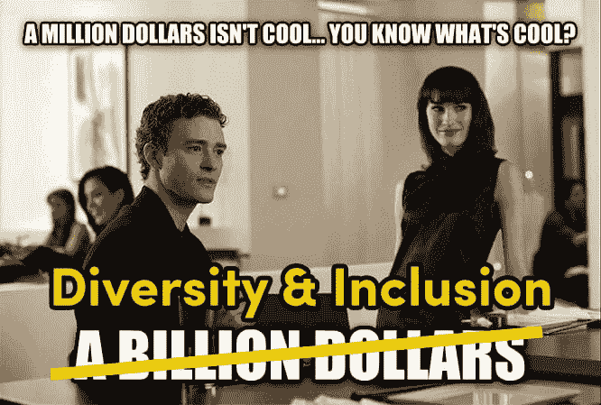

# 机器学习中的技术包容性和多样性

> 原文:[https://dev . to/clari fai/tech-inclusion-and-diversity-in-machine-learning](https://dev.to/clarifai/tech-inclusion-and-diversity-in-machine-learning)

包容意味着拥抱多元化——来自不同背景、拥有不同技能的人聚在一起，让我们的公司变得更加强大。虽然我们认为[包容的文化应该是任何科技公司](https://thenextweb.com/opinion/2016/01/12/the-elephant-in-the-valley/#.tnw_ZuBOdZ6K)的赌注，但我们认为这对于机器学习和人工智能公司尤为突出。毕竟，我们正在构建下一代智能应用和机器，这些应用和机器应该能够增强人类的智能——如果不考虑人类生活各个方面的观点，你就无法增强人类的智能。

科技行业存在多样性问题已经不是什么新闻了。然而，人工智能代表了科技领域一个新的同质化问题。人工智能依靠人类训练变得“聪明”因此，人类的偏见可以影响人工智能和计算机如何看待世界。当然，危险在于偏见通过人工智能比通过任何一个人都更容易被放大。

> “如果每个教计算机像人类一样行动的人都是男性，那么机器对世界的看法将是默认的狭隘，而且通过对数据集的管理，可能会有偏见。”

考虑到这一点，我们试图在 Clarifai 的业务的每个部分建立多样性，从招聘到建筑到运输产品。人工智能的多元化不仅仅意味着雇佣更多多元化的人。特别是对于图像识别，数据科学家需要一组标记良好的图像来训练模型，这意味着有人首先需要手动对这些图像进行分类。建立一个多样化的数据团队意味着将问题作为一个整体来看待，从有人给图像加标签到数据科学家训练模型。这就是我们从六大洲的男人和女人那里收集数据的原因！

我们很高兴[全球创业峰会](https://www.tech-inclusion.org/#pledge)让我们有机会正式承诺我们促进包容性和多样性的目标，并为机器学习领域的其他人树立榜样。作为我们承诺的一部分，我们必须:

*   实施并公布公司的具体目标，以招募、留住和提升多样化的技术人才，并实施具体措施来创建和维持包容性文化；
*   每年发布数据和进度指标，说明我们的技术人员在各个职能领域和资历级别的多样性；
*   投资合作伙伴关系，建立多样化的技术人才渠道，提高我们识别、培养和支持各种背景人才的能力

如果你相信建造**# robotsnotrobots**，[带着誓言](https://www.tech-inclusion.org/#pledge)和我们一起，让我们知道！