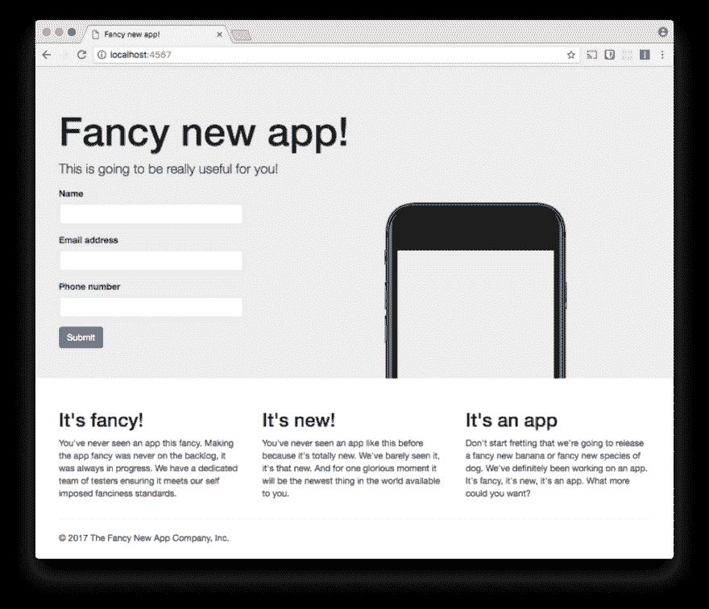
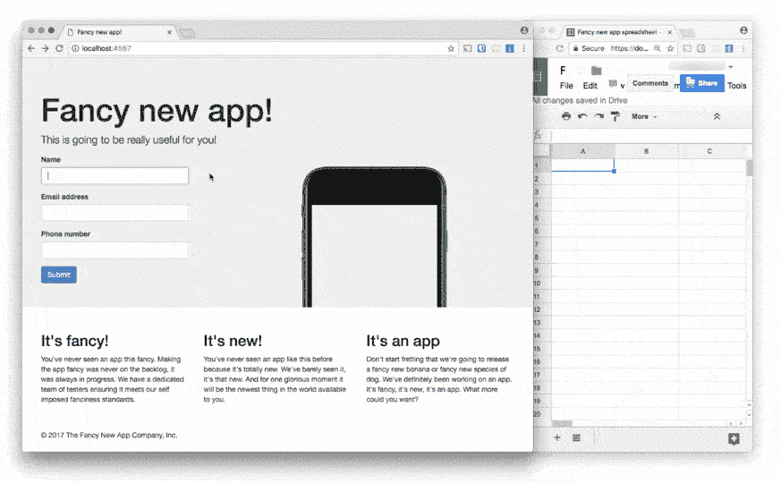

# 使用 Sinatra、Google 电子表格和 Ruby 创建一个登录页面

> 原文：<https://dev.to/twilio/create-a-landing-page-with-sinatra-google-spreadsheets-and-ruby>

在我的职业生涯中，我的任务是构建登录页面，以捕捉用户对产品或应用程序的兴趣。我们需要潜在用户的详细信息，如他们的姓名、电子邮件地址和电话号码，以便在应用程序准备好时联系他们。

你可以选择使用谷歌表单，但是你会看到一个看起来像谷歌表单的页面。正如我在上一篇文章中所展示的，[在 Ruby](https://www.twilio.com/blog/2017/03/google-spreadsheets-ruby.html) 上使用谷歌电子表格 API 是很好也很简单的。因此，下面是如何使用 Google Spreadsheet API 和 Ruby 构建自己的登录页面。

## 入门

首先，你需要一个新的电子表格来保存数据。在你的 [Google Drive](http://drive.google.com) 中创建一个。您还需要一个服务帐户，您可以授权该帐户代表您的应用程序编辑您的表单。按照前一篇文章中的[指示来设置你的服务账户](https://www.twilio.com/blog/2017/03/google-spreadsheets-ruby.html#h.6k35lx9u310k)。现在，用您的凭证保存 JSON 文件。

*如果您关注了上一篇文章，请不要忘记为您的新电子表格授予服务帐户的编辑权限。打开电子表格，点击右上角的共享，从您的* `client_secret.json` *文件中粘贴电子邮件地址。*

我已经用一些视图文件创建了一个模板项目，来帮助我们完成这篇文章。现在克隆或[下载](https://github.com/philnash/ruby-google-sheets-sinatra/archive/master.zip)模板。

```
git clone https://github.com/philnash/ruby-google-sheets-sinatra.git
cd ruby-google-sheets-sinatra 
```

获取您的 Google 证书，并将其添加到应用程序文件夹中，确保该文件名为`client_secret.json`。

在模板中，我已经包含了一个`Gemfile`，它包含了我们这个项目需要的两个依赖项；[辛纳特拉](http://www.sinatrarb.com/)和 [google_drive](https://github.com/gimite/google-drive-ruby) 。用
安装宝石

```
bundle install 
```

现在我们可以开始构建我们的应用程序了。

## 建筑与辛纳特拉

创建一个名为`app.rb`的文件，并在你最喜欢的文本编辑器中打开它。首先，我们需要要求我们的依赖。Bundler 可以为我们处理:

```
# app.rb
require("bundler")
Bundler.require 
```

现在，我们需要一个索引页面来呈现当我们点击根。我已经将布局和视图包含在`views`文件夹中。要呈现页面，只需添加:

```
# app.rb
require("bundler")
Bundler.require

get "/" do
  erb :index
end 
```

保存文件并启动应用程序，以确保您的操作正确无误。

```
bundle exec ruby app.rb 
```

你的应用将于 [开始 http://localhost:4567/](http://localhost:4567/) 。检查一下，看看你是否有一个像下面这样的屏幕。

[T2】](https://res.cloudinary.com/practicaldev/image/fetch/s--0-r1SoyG--/c_limit%2Cf_auto%2Cfl_progressive%2Cq_auto%2Cw_880/https://twilioinc.wpengine.com/wp-content/uploads/2017/03/landingpage-1024x880.png)

如果你能看到一个漂亮的新应用程序的登陆页面，那么一切都按预期运行。

如您所见，页面上有一个表单。这是我们将用来收集用户详细信息并用它们填充我们的电子表格的表单。在这种情况下，我们需要姓名、电子邮件和电话号码。应用程序完成后，我们可以通过电子邮件向用户提供最新信息，并在新应用程序就绪后，通过短信向他们发送安装链接。

该表单被设置为将数据发送到根路径。让我们现在构建端点。

## 从 Sinatra 将数据保存到谷歌电子表格

我们需要构建一个路由，该路由将从表单发出的 POST 请求中接收参数，并将它们发送到 Google 电子表格 API。让我们从编写一个 helper 方法开始，该方法将使我们能够访问我们想要保存数据的工作表。

该方法应该使用电子表格 API 启动一个新的会话，打开我们想要保存的电子表格并选择第一个工作表。我们将构建它，以便将对象保存为实例变量，这样我们就不必每次都经历这个过程。

```
# app.rb
def worksheet
  @session ||= GoogleDrive::Session.from_service_account_key("client_secret.json")
  @spreadsheet ||= @session.spreadsheet_by_title("Fancy new app spreadsheet")
  @worksheet ||= @spreadsheet.worksheets.first
end 
```

我把我的电子表格叫做“新奇的应用程序电子表格”。确保包含您选择的电子表格名称。

现在来写端点。我们将在`worksheet`的最后一行加上一行中添加数据，这样它总是添加到电子表格中。

```
# app.rb
post "/" do
  new_row = [params["name"], params["email"], params["phone_number"]]
  begin
    worksheet.insert_rows(worksheet.num_rows 1, [new_row])
    worksheet.save
    erb :thanks
  rescue
    erb :index, locals: {
      error_message: "Your details could not be saved, please try again."
    }
  end
end 
```

我们接受传入的参数，并将它们转换成表示行的数组。这些名称来自视图中各个`&lt;input&gt;`字段的`name`属性。请注意我们如何为每个字段使用相关的输入类型；`text`代表姓名，`email`代表电子邮件，`tel`代表电话号码。张秀坤最近展示了[这些字段对于验证以及在移动设备上弹出右键盘是多么有用](https://www.twilio.com/blog/2017/03/phone-number-verification-without-regular-expression.html)。

我们使用`worksheet.insert_rows`将新行插入到电子表格中，保存工作表，并呈现一个显示“谢谢”的页面。

我们在一个`begin … rescue … end`块中使用 API 来完成工作，这样如果 API 有任何问题，我们就可以捕捉到它们并将用户返回到主页。

保存文件并重新启动服务器。访问[http://localhost:4567/](http://localhost:4567/)并输入您的详细信息。点按“提交”并看到它们出现在您的电子表格中。

[T2】](https://res.cloudinary.com/practicaldev/image/fetch/s--yWZGtxhG--/c_limit%2Cf_auto%2Cfl_progressive%2Cq_66%2Cw_880/https://twilioinc.wpengine.com/wp-content/uploads/2017/03/spreadsheet_success.gif)

## 真实应用，电子表格数据存储

现在您已经看到了如何使用 Sinatra 从 HTML 表单中获取参数，并将它们存储在 Google 电子表格中。您可以为登录页面创建自己的设计，并轻松地让非技术用户使用这些数据。在 GitHub repo 的 [save-data 分支中查看这篇文章的所有代码。](https://github.com/philnash/ruby-google-sheets-sinatra/tree/save-data)

现在您已经将数据保存在电子表格中，您可以使用 Apps 脚本来操作数据。Greg 已经写了关于如何使用 Apps 脚本从 Google 电子表格发送 SMS 消息的文章。

如果你用 Google 电子表格和 Ruby 构建了什么有趣的东西，请告诉我。你可以在 philnash@twilio.com 的 [联系我，或者在推特上打](mailto:philnash@twilio.com)[@菲尔纳什](https://twitter.com/philnash)联系我。

* * *

*[用 Sinatra、Google Spreadsheets、Ruby 创建登陆页面](https://www.twilio.com/blog/2017/03/create-a-landing-page-with-sinatra-google-spreadsheets-and-ruby.html)最初发表于 2017 年 3 月 22 日 [Twilio 博客](https://www.twilio.com/blog/)。*