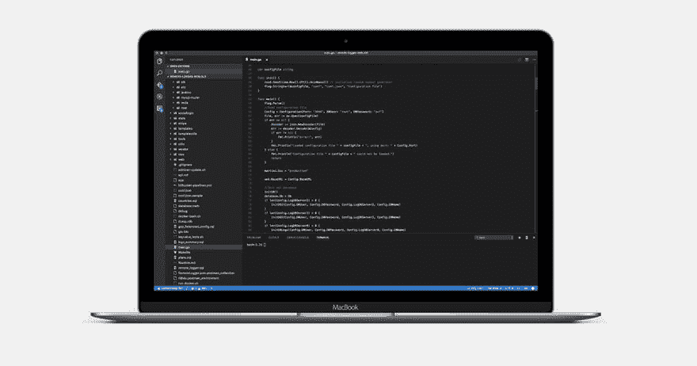

# 使用 Go 一年

> 原文:[https://dev.to/bugfenderapp/one-year-using-go](https://dev.to/bugfenderapp/one-year-using-go)

我们在 [Go](https://golang.org/) 的冒险都是从[移动爵士乐](http://mobilejazz.com)的内部实验开始的。正如公司名称所暗示的，我们开发移动应用程序。

在将一个应用程序发布到野外后，我们很快意识到我们缺少一个工具来检查用户实际上发生了什么，以及他们如何与应用程序交互——这在报告任何问题或错误的情况下会非常方便。

有几个工具声称可以在这方面帮助开发人员，但是没有一个达到目标，所以我们决定自己开发。我们从创建一组基本的脚本开始，这些脚本很快发展成为一个成熟的工具，今天被称为 [Bugfender](https://www.bugfender.com/) ！

由于这最初是一个实验，我们决定尝试一种新的趋势技术。对学习和继续教育的热爱是 Mobile Jazz 核心价值的一个重要方面，所以我们决定用 Go 来构建它；谷歌开发的一种相对较新的编程语言。它是游戏中的一个新玩家，已经有许多受人尊敬的开发者对它赞不绝口。

一年后，这个实验变成了一个创业项目，我们有了一个不可思议的工具，已经帮助了全世界成千上万的开发者。我们的服务器每天处理来自 700 多万台设备的超过 200GB 的数据。在使用 Go 一年后，我们想分享一些我们的想法和经验，从我们的小实验到处理数百万日志的生产服务器。

## 围棋生态系统

公司里没有人有过使用围棋的经验。Bugfender 是我们对这种语言的第一次探索。

学习基础知识非常简单。我们以前使用 C/C++/Java/Objective-C/PHP 的经验使我们能够快速学习 Go 并在几天内开始开发。当然，有一些新的和不寻常的东西需要学习，包括 GOPATH 和如何处理包，但这是意料之中的。

没过几天，我们就意识到，即使是作为一种设计上的简化语言，Go 也非常强大。它能够做现代编程语言应该做的一切:能够使用 JSON，在服务器之间通信，甚至毫无问题地访问数据库(并且只有几行代码)。

在构建服务器时，您应该首先决定是否要使用任何第三方库或框架。对于 Bugfender，我们决定使用:

### 马提尼

Martini 是一个强大的围棋网络框架。当我们开始实验时，这是一个很好的解决方案，直到今天，我们还没有遇到任何问题。然而，如果我们今天再次开始这个实验，我们会选择一个不同的框架，因为 Martini 不再保留。

我们进一步试验了鸢尾花(T1)(我们目前最喜欢的)和 T2 杜松子酒(T3)。Gin 是 Martini 的继任者，迁移到它将使我们能够重用现有的代码。

在过去的一年里，我们已经意识到 Go 的标准库非常强大，你不需要依赖一个沉重的 web 框架来构建一个服务器。最好使用专门处理特定任务的高性能库。

Iris 是我们目前最喜欢的，在未来，我们会重新编写我们的服务器来使用它，而不是马提尼/杜松子酒，但这不是现在的优先事项。

### 热

有些人是 ORM 的粉丝，有些人不是。我们决定使用 ORM，更确切地说是 [GORM](https://github.com/jinzhu/gorm) 。我们的实现仅适用于 web 前端，并使用手写的 SQL 对日志摄取 API 进行了优化。一开始，我们真的很高兴，但随着时间的推移，我们已经开始发现问题，我们很快就会从我们的代码中完全删除它，并使用一种更低级的方法，使用带有 [sqlx](https://github.com/jmoiron/sqlx) 的标准 SQL 库。

GORM 的一个主要问题是 Go 的生态系统。作为一门新语言，从我们开始开发产品以来，已经有了很多新版本。这些新版本中的一些变化不是向后兼容的，因此，为了使用最新的库版本，我们经常重写现有的代码，并检查我们为解决版本问题而创建的黑客。

这两个库几乎是任何 web 服务器的主要构建块，因此做出一个好的选择是很重要的，因为以后很难更改它，并且会影响您的服务器性能。

## 第三方服务

创建真实世界产品时要考虑的另一个重要方面是库、第三方服务和工具的可用性。在这里，Go 仍然缺乏成熟度，大多数公司还没有提供 Go 库，所以你可能需要依赖其他人写的库，在那里质量并不总是有保证。

例如，有很棒的用于使用 [Redis](https://github.com/go-redis/redis) 和 [ElasticSearch](https://github.com/olivere/elastic) 的库，但用于 Mixpanel 或 Stripe 等其他服务的库就不那么好了。

我们的建议是，在使用 Go 之前，先检查一下是否有一个好的库可以存放你可能需要的任何特定产品。

我们也经历了很多 Go 的包管理系统的问题。它处理版本的方式远非最佳，在过去的一年中，我们在不同的团队成员之间获取同一库的不同版本时遇到了各种各样的问题。然而，最近这个问题几乎得到了解决，这要归功于支持供应商包的新 Go 特性，以及 [gopkg.in](http://labix.org/gopkg.in) 服务。

## 开发者工具

[T2】](https://res.cloudinary.com/practicaldev/image/fetch/s--KCTCFLjX--/c_limit%2Cf_auto%2Cfl_progressive%2Cq_auto%2Cw_880/https://bugfender.com/wp-content/uploads/2017/03/go-ide.jpg)

由于 Go 是一种相对较新的语言，您可能会发现与其他成熟的语言(如 Java)相比，可用的开发工具并不太好。当我们开始 Bugfender 时，很难使用任何 IDE，似乎都不支持 Go。但在去年，随着 IntelliJ 和 T2 Visual Studio Code Go 插件的引入，这已经有了很大的改善。

最后，看看其他 Go 工具，调试器不怎么样，分析器更差，所以调试代码或试图优化代码有时会很困难。

## 驶向生产

这绝对是 Go 最棒的地方之一，如果你想将某个东西部署到生产环境中，你只需要构建你的二进制文件并将其发送到服务器，没有依赖性，不需要安装额外的软件，你只需要能够在你的服务器上运行二进制文件。

如果你习惯于处理其他需要包管理器的语言，或者需要小心你可能使用的语言解释器，那么使用 Go 是一件愉快的事情。

我们对 Go 的稳定性也非常满意，因为服务器似乎从来没有崩溃过。前一段时间，我们在向 go 例程发送大量数据时遇到了一个问题，但从那以后，我们很少看到任何崩溃。注意:如果您需要向 Go 例程发送大量数据，您需要小心，因为您可能会遇到堆溢出。

如果你对性能感兴趣，我们无法与其他语言相比，因为我们已经从零开始，但考虑到我们处理的数据量，我们觉得它的性能非常好，我们肯定无法使用 PHP 如此轻松地处理相同数量的请求。

## 结论

这一年来，我们在围棋上经历了起起落落。开始时我们很兴奋，但在实验转化为真正的产品后，我们开始发现问题。我们已经考虑过几次用 Java 完全重写，但是现在我们仍然在使用 Go，在过去的一年中，生态系统已经有了一些很大的改进，简化了我们的工作。

如果你想用 Go 来构建你的产品，你可以确定它能工作，但是你需要非常小心一件事:雇佣开发人员的可用性。硅谷只有几个高级围棋开发者，在其他地方找到一个可能是一件非常困难的事情。