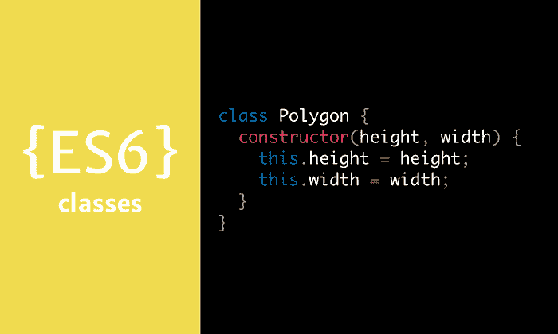

# 了解 ES6 类

> 原文：<https://dev.to/chuksfestus/understanding-es6-classes-4nkk>

[T2】](https://res.cloudinary.com/practicaldev/image/fetch/s--162NTSbR--/c_limit%2Cf_auto%2Cfl_progressive%2Cq_auto%2Cw_880/https://cdn-images-1.medium.com/max/700/1%2AyiS2QvVKIpYCb0fqvrsXZQ.png)

在引擎盖下，es6 类并不是什么全新的东西:它们只是我们一直拥有的基于原型的行为委托功能的语法糖。这确实使代码更具可读性，并为即将发布的规范中新的面向对象(OO)特性铺平了道路。

### 定义类别

让我们回忆一下，看看 ES5 中连接 OO 代码的典型方式。

```
function person(name, dob) {
  Object.defineProperty(this, 'name', {
    get: function() { return name; }
  });

  Object.defineProperty(this, 'dob', {
    get: function() { return dob; }
  });
}

person.prototype.toString = function() {
  return this.name + '  ' + this.dob;
}

var person = new person('Chuks Festus', 2017);

console.log(person.name); // Chuks Festus
person.name = 'John Doe';
console.log(person.toString()) // Chuks Festus 2017 
```

Enter fullscreen mode Exit fullscreen mode

很简单吧？我们定义了一个 peron 类，它有两个只读属性和一个自定义的 toString 方法。让我们在 ES6 中做同样的事情。

```
class person{
  constructor(name,dob){
    this.\_name= name;
    this.\_year = year;
  }
  get make() {
    return this.\_name;
  }
  get year() {
    return this.\_dob;
  }
  toString() {
    return `${this.name}${thi.dob}`
  }
}
let person =new person('chuks festus',2017);

console.log(person.name); // Chuks Festus
person.name = 'John Doe';
console.log(person.toString()) // Chuks Festus 2017 
```

Enter fullscreen mode Exit fullscreen mode

所以让我们试着分解一下:

### 定义类别

就像函数一样，javascript 中定义类有两种方式:**类表达式**和**类声明**

#### 类声明

要声明一个类，可以使用 classkeyword 和类名

```
class person {} 
```

Enter fullscreen mode Exit fullscreen mode

这里需要注意的一点是，与函数声明不同，类声明不能被提升。您首先需要声明您的类，然后访问它，否则您会得到一个 ReferenceError:

```
let chuks = new person(); // ReferenceError

class person {} 
```

Enter fullscreen mode Exit fullscreen mode

#### 类表情

一个**类表达式**是定义类的另一种方式。类表达式可以是命名的，也可以是未命名的。指定给命名类表达式的名称对于类的主体来说是局部的。

```
//unnamed
let person = class {
    constructor() {
    } 
}

//named 
let person = class person {
    constructor () {
    }
} 
```

Enter fullscreen mode Exit fullscreen mode

值得注意的是，类**表达式**也遇到了与类**声明**相同的提升问题。

### 构造函数

构造函数方法是一种特殊的方法，用于创建和初始化用类创建的对象。一个类中只能有一个名为“constructor”的特殊方法。

```
class person {
    constructor (name, dob) {
        this.name = name;
        this.dob = dob;
    }
} 
```

Enter fullscreen mode Exit fullscreen mode

### 静态方法

静态方法通常用于为应用程序创建实用函数。在 ES5 中，它看起来像是构造函数的一个基本属性。

```
function person () {}

person.compare = function (a,b) {} 
```

Enter fullscreen mode Exit fullscreen mode

新的静态语法看起来是这样的:

```
class person {
    static (a,b) {}
} 
```

Enter fullscreen mode Exit fullscreen mode

静态方法在没有实例化它们的类的情况下被调用，并且**不能通过类实例被调用。**

在幕后，JavaScript 仍然只是向 person 构造函数添加一个属性，它只是确保该方法实际上是静态的。请注意，您还可以添加静态值属性。

### 扩展类

extends 关键字用在*类声明*或*类表达式*中，创建一个类作为另一个类的子类。

```
class person{
  constructor(name,dob){
    this name= name;
    this year = year;
  }
  make() {
    return this.\_name;
  }
  year() {
    return this.\_dob;
  }
  toString() {
    return `${this.name}${thi.dob}`
  }
}

class gender extends person { 
    male(){
        console.log(this.name + " is a dude")
    }
}

let chuks = new gender("chuks", 2017)
chuks.male() 
```

Enter fullscreen mode Exit fullscreen mode

### 超类

要调用父构造函数，只需使用 super 关键字作为函数，例如 super(name，dob)。对于所有其他函数，使用 super 作为对象，例如 super.toString()。更新后的示例如下:

```
class Gender extends person {
    toString() {
        return 'male' + super.toString();
    }
} 
```

Enter fullscreen mode Exit fullscreen mode

此时，除了更好的语法之外，使用类比使用原型没有任何优势。然而，开始发展一种更好的实践并习惯新的语法是有好处的。围绕 JavaScript 的工具每天都在变得更好，有了正确的类语法，你将会得到这些工具的帮助。