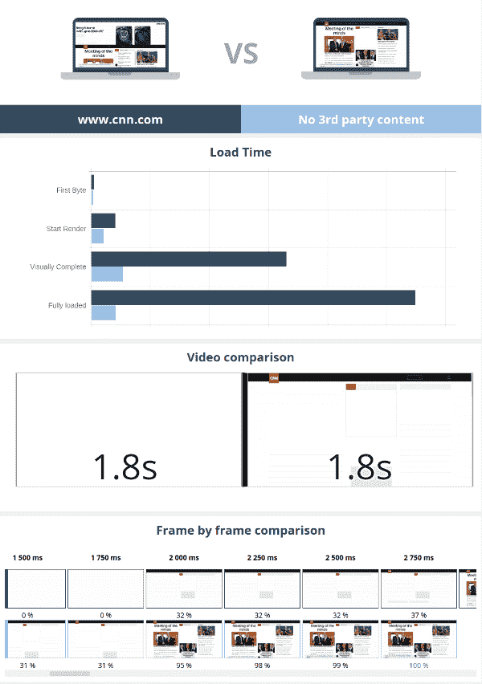

# Web 性能和安全性:如何控制第三方内容的影响

> 原文：<https://dev.to/damienjubeau/web-performance--security-how-to-master-third-party-content-impacts->

## 为什么我们需要照看第三方？

第三方内容是您基本上无法控制的资产，因为它们是由第三方提供和托管的。

社交网络小工具、广告和跟踪脚本或网络字体提供商是你经常打交道的一些常见的第三方。

无论免费与否，这些提供商允许网站所有者和开发者丰富网页和网络使用。经常，但不总是，有些功能我们自己无法提供(即使技术上可行，相关的成本可能会阻碍)。

第三方资产在我们的网站上越来越多的被使用(看看一个网页使用的平均域名数的演变吧),我们并没有对这个话题给予应有的关注。这里有一些证据:

*   2012 年，成千上万的网站面临着重大的减速…由于脸书的“Like widget ( [Forbes 的文章](http://www.forbes.com/forbes/welcome/?toURL=http://www.forbes.com/sites/ericsavitz/2012/06/01/facebook-outage-slowed-1000s-of-retail-content-sites/))
*   最近，你可能会想起 Typekit 的字体服务中断(与亚马逊 S3 中断有关)，这里又有数千个网站受到影响
*   一个更轻松、更有趣的例子可能是去年 DailyMotion 在 web 浏览器的开发者控制台中发布的招聘信息。这份工作邀请已经在*所有*网站上用他们的插件发布了几天了！ *(使用 DailyMotion 嵌入式视频小工具浏览任何网站时，在您的控制台中显示的消息)*

如果你不注意，第三方会在很多方面影响你的网站，甚至让你的访问者无法访问。

尽管如此，在使用或不是第三方时，你可能不是唯一的利益相关者。然而，你一定要走得更远，而不仅仅是阅读和遵循提供商的文档。我喜欢将第三方内容视为寄生虫。友好的，大部分时间都是善意的。但不管怎样，寄生虫和不断增长的感染可能会让你的整个网站瘫痪。

通过这篇文章，我旨在分享我对第三方内容的看法和经验，但最重要的是带给你一些最佳实践和工具，以减轻与第三方内容集成相关的风险。

## 速度和第三方内容，一个复杂的故事。

在第一部分中，我们将重点关注 web 性能和第三方内容对速度的影响。这是一个重要的话题，原因有几个。让我们从基础开始。首先，我们必须注意，外部资产是从另一个域名加载的，而不是从您的网站使用的域名加载的。这意味着 web 浏览器必须触发 DNS 解析，然后建立新的 TCP 连接。

在这个早期阶段，我们不得不质疑第三方服务器的位置:如果提供商不使用 CDN(内容交付网络)，可能会导致网络上的高延迟(因为延迟与网络的性质有关，但也与服务器和 web 浏览器之间的距离有关)。

如果你的网站针对某个特定的国家，你可能不熟悉这个问题，因为你可能就在这个国家托管你的网站。使用没有 CDN 的第三方提供商可能会导致加载位于世界另一端的资产。

但这还不是全部。如果请求得益于 HTTPs 的安全层(应该如此),您将不得不增加额外的延迟，因为 HTTPs 的使用意味着建立安全连接的额外交换。

最后，您将依赖于第三方提供商的服务器响应时间和上行带宽。

一些网站速度测试工具(试试我们的， [Dareboost](https://www.dareboost.com) ！)可能有助于您了解第三方内容对您网站性能的影响。例如，这里有一份 cnn.com 的对比报告，包括有无第三方内容。猜猜哪个版本更快？

[T2】](https://res.cloudinary.com/practicaldev/image/fetch/s---KoyQqX3--/c_limit%2Cf_auto%2Cfl_progressive%2Cq_auto%2Cw_880/https://blog.dareboost.com/wp-content/uploads/2017/03/cnn-no-3rd-party-performance-report.png)

如简介中所述，您无法控制第三方提供商的性能。你仍然可以建立一个 SLA(服务水平协议),但是大多数时候我们不能——除非是运营一个大网站。第三方内容是丰富网站的好方法，但它们也带来了重要的影响。这就是为什么你必须尽可能地限制这种依赖。

你不必加载一个社交网络的整个框架来显示一个简单的分享按钮。实现自己的目标很容易。想象一下你自己的实现，即使在某些方面有更多的限制，它最终肯定会是一个胜利。

很明显，这个例子很琐碎，可能有一些第三方的内容你就是离不开。那么你在整合的时候需要非常小心。

## 从关键渲染路径中排除第三方

显示一个网页需要来自浏览器的大量操作:接收 HTML 源代码、获取一些资源、构建 DOM、CSS 树。
**这些操作中的一些被阻塞**，意味着它们需要在允许任何显示之前终止。一个众所周知的例子是在网页的`<head>`中同步调用 Javascript。

性能优化最佳实践通常关注关键的呈现路径，换句话说，关注对页面折叠部分有影响的元素和操作。

考虑到使用第三方内容会增加不同的延迟，避免在关键的渲染路径中使用它们非常重要。您应该寻找对页面早期显示的绝对控制。

前面讨论的脸书和 Typekits 两个例子完美地说明了让第三方内容阻塞您的关键呈现路径的风险。在最好的情况下，依赖关系会降低页面加载速度。在最坏的情况下，如果它们失败，可能会导致网站不可用。

导致这种故障的相关性故障被称为单点故障。前端开发人员可能不太熟悉这个概念。

> 单点故障(SPOF)是系统的一部分，如果它发生故障，将会使整个系统停止工作
> *维基百科*

*   在这个阶段，大多数时候我能听到一些人告诉我:“是啊，好吧，我的网站有一些 SPOFs。但那是谷歌字体。我是说谷歌。我可以信任他们 100%的正常运行时间或任何他们有信心的大玩家。简而言之:他们错了。捡起你最喜欢的论点:没有防弹的大玩家。我们的介绍是关于脸书和 Typekit(与亚马逊 S3 失败有关)，对吗？总有一天会发生。
*   **只有在第三方失败的情况下才不会触发 SPOF**！防火墙或网络错误/拥塞也可能导致请求的文件没有响应！
*   当你的网站无法加载时，从访问者的角度来看，这是你的错。不是谷歌的。真实的人不知道需要什么来显示你的页面！你可以相信他们，但你将独自面对后果。

我可能听起来有点危言耸听。SPOF 是一种风险，你应该从发生的概率和相对于固定成本的相关收入损失来考虑它。这是你的个人博客？你可以完全信任谷歌，继续使用你的 SPOF！

当然，如果你使用第三方，那是因为它能满足你的需求。让第三方失败会导致功能缺失。大多数时候，你的网站可以——也应该——在没有这个功能的情况下工作。如果你真的在网上做生意，你需要尽一切办法消除欺诈！

不幸的是，一些第三方服务可能需要阻止行为。例如，一些 A/B 测试解决方案特别建议使用模块化集成。事实上，他们希望避免闪烁(在执行 A/B 测试编辑之前，不应显示原始页面)。没错，不亚于减慢页面渲染速度，但却是故意的。

无论如何，你仍然可以避免成为 SPOF。

一个阻塞的 javascript 文件，当加载太慢时，将被浏览器中止。然而，web 浏览器的默认超时策略并不适合非关键资源(您宁愿错过一些 A/B 测试会话，也不愿让一些客户等待 30 秒来呈现页面)。默认超时从几秒到几秒不等...分钟(如果你想了解更多，史蒂夫·索德斯有一篇很棒的文章)。

了解这一点后，如果您需要阻止第三方资产，您应该控制默认超时策略。考虑您和您的用户的特性值，配置适当的超时，您甚至可以添加一个后备！

查看来自 Typekit 的[这篇文章，他们在 2015 年的分解后更新了他们的文档。](https://helpx.adobe.com/typekit/using/embed-codes.html)

关于第三方和速度的最后一点:标签管理器。您可能已经在您的一些项目中集成了 Google Tag Manager，允许集中第三方调用，并为非技术人员添加新服务带来了全新的自治级别…好消息是 GTM 默认情况下是异步加载的，后续标签也是如此。

> “权力越大，责任越大”

标签管理人员经常回答没有技术文化的人的需求，这些人不会对这种注入内容的影响保持警惕。加载时间的风险，以及安全性的风险，我们将在后面发现。提供一个标签管理器意味着给它的用户权力，你的工作可能是让他们知道其中的含义，或者建立一个验证工作流程。

## 第三方质量审核

如前所述，在大多数情况下，我们无法与提供商讨论 SLA。无论如何，市场上可能有你需要的替代产品，你可能应该把质量和性能作为选择供应商的考虑因素。

我记得曾考虑过为我们自己的网站提供 click 2 的 Saas 提供商。在快速检查加载的资产时，我看到一个大约 250KB 的图像文件。优化这个图标将导致加载一个 100 倍轻的文件。

聊天是异步加载的，所以没什么大不了的。但是，对于低带宽连接，加载映像的速度仍然很慢。更重要的是:他们指出图像优化不是他们工作流程的一部分。图像也可以是 2MB。

[绩效预算](https://blog.dareboost.com/en/2015/10/performance-budget/)是一个非常有趣的方法，可以确保你的网站保持快速运行。由于网站监控，这是确保控制第三方及其演变的一个很好的方法。

为了审核第三方的质量，Simon Hearne 为你做了一件很棒的工作，他提供了一份清单[来确保你考虑到了所有的主要影响。
当发现问题或任何潜在的优化时，请随时与提供商联系。有一个编辑来修复它可能会使成千上万的网站受益！了解供应商如何处理你的需求也将是一个很好的洞察力。](https://webperf.ninja/2015/questions-to-ask-your-third-parties/)

## 减轻与第三方相关的风险

向网页添加第三方意味着对提供商的高度信任，因为您正在失去一些控制权。应用之前的建议，你确保了提供商是定性的，并且失败不会导致你的网站无法访问。

尽管如此，第三方已经获得了对您页面的控制权！你不能盲目相信他。即使提供商有最好的意图，它仍然可能出错，甚至被黑客攻击。让我们谈谈安全问题。

首先:HTTPs 是要求。如果你的网站使用安全版本的协议，你就不能让第三方通过 HTTP 工作(那会是[混合内容](https://developer.mozilla.org/en-US/docs/Web/Security/Mixed_content)，一些网络浏览器会自动阻止的东西)。

您需要在安全性方面更进一步，向第三方内容范围添加限制。例如，您可以在 iframes 上使用 sandbox 属性。它将允许您限制 iframe 中可用的操作(例如，禁止使用 Javascript)。

另一个非常强大的工具:[内容安全策略](https://blog.dareboost.com/en/2016/08/content-security-policy-secure-your-website/)。通过在服务器的响应中使用一个简单的 HTTP 头，您可以在页面中明确定义您信任的内容和行为。无论什么元素不被允许，浏览器都不会执行/请求它。当然，假设 web 浏览器支持 CSP。

如果您的网站容易受到一些跨站点脚本(XSS)的攻击，定义内容安全策略并不能解决漏洞。然而，它将保护您的用户免受 XSS 攻击的影响。

**举例:**通过使用你页面内的一个表单，攻击者成功的在你的页面中注入了一个 javascript 文件，姑且称之为恶意. js，请求恶意. js 的脚本标签确实在你的页面中。然而，web 浏览器实际上不会请求该文件，而是会抛出一个错误，因为这个请求违反了您的内容安全策略指令。XSS 漏洞已被利用，但没有对您的访问者产生影响。

这是一个很好的方法来确保你的第三方不允许他们自己对你的页面做更多的事情。如果一个提供商被黑客攻击，你可以降低自己流量的风险。

最后但同样重要的是，[保护你的饼干](https://blog.dareboost.com/en/2016/12/secure-cookies-secure-httponly-flags/)！在您的文档中注入 Javascript 的第三方可以通过 Javascript 访问与您的域相关的 cookies！设置带有 HttpOnly 标志的 cookies，您将禁止任何客户端使用！

## 轮到你了！

第三方使用增加。注意相关风险并尽可能限制其数量。审核那些你需要的，并在提供的选择中做出明智的选择。

记住他们是寄生虫，他们会进化:尽可能多的添加约束并监控他们！

* * *

*这篇文章最初是在[我们的博客](https://blog.dareboost.com/en/2017/03/third-party-content-performance-security/)上看到的，是关于网站速度和质量的。*