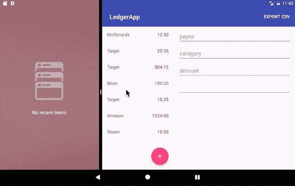
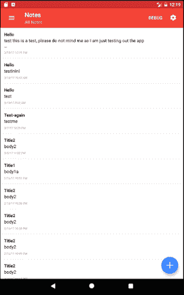
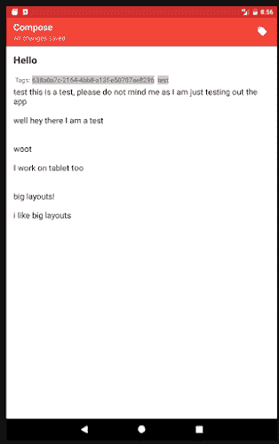
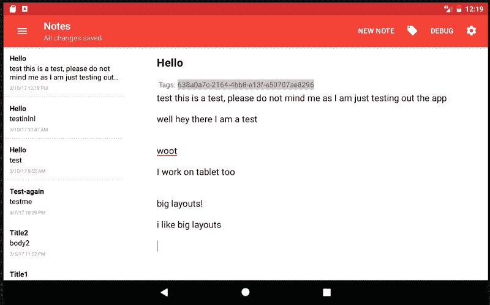

# Android 手机和平板电脑的模块化动态用户界面

> 原文:[https://dev . to/nbau 21/modular-and-dynamic-ui-for-Android-phones-and-tablets-56de](https://dev.to/nbau21/modular-and-dynamic-ui-for-android-phones-and-tablets-56de)

这个指南最初是去年发布在我的博客上的。一年半后，这些内容仍然非常适用。

一个简短的 Android 开发者指南，教你如何制作让手机和平板电脑用户都满意的用户界面。这是我关于同一标题的 [10 分钟演讲的配套博文。本文的示例部分有代码示例。](https://docs.google.com/presentation/d/1pm3wfW-Md8adLeSEZ0sz6ek--FKWPOkZN-ihSxJWpMY/pub?start=false&loop=false&delayms=3000&slide=id.p)

你可以在这里看到实际的演示！

我想在这篇文章中强调两点:**模块化**和**响应性**。我认为同时考虑手机和平板电脑用户的应用程序应该有模块化的视图/代码，无论屏幕大小如何都要好看。

## 模块化

一些视图应该被认为是独立的模块:它们应该能够独立存在，或者补充其他视图。示例:您正在构建一个在功能上有点类似于手机和平板电脑的屏幕，但平板电脑版本有一个额外的视图。

你可以做两件事 1)创建一个适用于手机的活动，另一个适用于平板电脑，或者更好 2)为这两个视图创建片段，对平板电脑版本使用相同的“模块”。

这样，您可以避免为您的视图复制粘贴相同的代码。

## 反应灵敏

反应灵敏的应用程序意味着无论方向或屏幕大小，应用程序都可以很好地展示自己。作为一个程序员，你不希望为不同的屏幕尺寸创建不同的活动/片段/视图。相反，你想写同样的代码，让 Android 替你做所有的工作。

## 为什么使用模块化/动态 UI 有意义

我们来看看手机和平板的异同。

人们通常在纵向模式下使用手机。纵向在屏幕空间上有所限制，但是对于列表来说效果很好。

平板电脑在横向模式下使用时会获得更多的屏幕空间。平板电脑在横屏模式下显示的布局就像在竖屏模式下一样，看起来很别扭。有太多未充分利用的空间！我们可以利用这个空间显示更多相关信息。

手机用户使用一只手，同时使用他们的拇指进行导航，“最佳位置”位于屏幕的右下角附近。平板电脑用户各不相同。有时他们用两只手，一只手拿着平板电脑，另一只手(食指)导航。也许他们用一只手将平板电脑平放在桌子上或以一定角度停靠。这告诉我们按钮等的位置。在手机上可能不如在平板电脑上好用。

手机和平板电脑共享相同的交互模式。用户可以滑动、点击、长按等。这太棒了，因为这使我们能够为双方用户创造熟悉的体验。我们不必“教”他们如何使用平板电脑。

**TL；灾难恢复用户可以执行相同的操作，但您可以在平板电脑的横向模式下显示更多数据。你可能需要重新定位东西来帮助用户更好地浏览应用程序。**

因此..现在，我们有动力编写一个在手机和平板电脑上都能很好工作的响应应用程序！我们如何在 Android 上做到这一点？

Android 资源可以使用[限定符](https://developer.android.com/guide/practices/screens_support.html#qualifiers)来指定。Android 根据声明的限定符加载相应的`.xml`资源。限定符很容易进入，但是根据使用情况可能会变得非常复杂。

为了简化这篇文章，让我们坚持使用`smallest width`限定词(具体来说，600dp)。这确保了每当 Android 检测到屏幕的长度或宽度至少有 600dp 可用时，我们将使用不同的布局。

等等，为什么不检查设备是否横着用(风景模式)？

当应用程序有足够的屏幕可用时，我们关心向用户显示更多的数据/重新定位视图。使用`land`(横向)作为限定符只检查设备是否横向使用。如果设备实际上是 4:3，并且横向模式没有我们想象的那么大的屏幕空间怎么办？

考虑下面的 gif。这是一款处于横向模式的平板电脑。如果我们使用`land`作为“更大”布局的限定词，应用程序将只显示在“更大”的布局中。相反，我们通过使用`w600dp-land`限定符，让 Android 在必要时使用“更小”的布局。

[ ](https://res.cloudinary.com/practicaldev/image/fetch/s--p50a0OqJ--/c_limit%2Cf_auto%2Cfl_progressive%2Cq_66%2Cw_880/https://thepracticaldev.s3.amazonaws.com/i/cn7h6b7kzw96ibtbx488.gif) * `w600dp-land`当宽度至少为 600dp 并且设备处于横向模式时，让 Android 选择更大的布局。更大的布局通常被称为`Master-Detail Pattern`。*

## 举例

让我们来看看这个例子，它来自我跟踪的一个开源项目，[标准注释](https://github.com/standardnotes/android)。它有一个通用的用户界面，让我们很容易把它分开。

[T2】](https://res.cloudinary.com/practicaldev/image/fetch/s--XvjG0PPd--/c_limit%2Cf_auto%2Cfl_progressive%2Cq_auto%2Cw_880/https://thepracticaldev.s3.amazonaws.com/i/4xzchls0hd7rv7lclr8e.png)

这是一个带有浮动操作按钮(FAB)的常规 RecyclerView。让我们称这个屏幕为`NotesListFragment`。点击 FAB 后，用户将进入`CreateNotesFragment`屏幕。让我们把窗口的“肉”(工具栏下面的白色区域 w/ text)称为`R.id.main_content`。

[T2】](https://res.cloudinary.com/practicaldev/image/fetch/s--SFF5BcWw--/c_limit%2Cf_auto%2Cfl_progressive%2Cq_auto%2Cw_880/https://thepracticaldev.s3.amazonaws.com/i/7nqj6ch36zmxvy74586x.png)

你可以看到这里没有什么疯狂的。我只是用`FragmentTransaction`到`add`来处理`R.id.main_content`上的任何东西和我们的新`CreateNotesFragment`。我还使用了`addToBackStack()`，以便当用户点击后退按钮时，用户被带回`NotesListFragment`。

```
supportFragmentManager
   .beginTransaction()
   .add(R.id.note_list_container, noteFragment, TAG_NOTE_FRAGMENT)
   .addToBackStack(null)
   .commit() 
```

<svg width="20px" height="20px" viewBox="0 0 24 24" class="highlight-action crayons-icon highlight-action--fullscreen-on"><title>Enter fullscreen mode</title></svg> <svg width="20px" height="20px" viewBox="0 0 24 24" class="highlight-action crayons-icon highlight-action--fullscreen-off"><title>Exit fullscreen mode</title></svg>

我们姑且称处理这些片段的活动为`MainActivity`，它对应的布局为`activity_main.xml`。`activity_main.xml`包含:

```
<Drawer layout + toolbar stuff..>
    <include layout="@layout/main_container" />
</closing tags> 
```

<svg width="20px" height="20px" viewBox="0 0 24 24" class="highlight-action crayons-icon highlight-action--fullscreen-on"><title>Enter fullscreen mode</title></svg> <svg width="20px" height="20px" viewBox="0 0 24 24" class="highlight-action crayons-icon highlight-action--fullscreen-off"><title>Exit fullscreen mode</title></svg>

并且在`layout/main_container.xml`下:

```
<FrameLayout
    android:id="@+id/note_list_container"
    xmlns:android="http://schemas.android.com/apk/res/android"
    xmlns:app="http://schemas.android.com/apk/res-auto"
    app:layout_behavior="@string/appbar_scrolling_view_behavior"
    android:layout_width="match_parent"
    android:layout_height="match_parent" /> 
```

<svg width="20px" height="20px" viewBox="0 0 24 24" class="highlight-action crayons-icon highlight-action--fullscreen-on"><title>Enter fullscreen mode</title></svg> <svg width="20px" height="20px" viewBox="0 0 24 24" class="highlight-action crayons-icon highlight-action--fullscreen-off"><title>Exit fullscreen mode</title></svg>

到目前为止，一切顺利！

平板/大景观布局呢？我们可以为此使用`Master-Detail`模式！

[T2】](https://res.cloudinary.com/practicaldev/image/fetch/s--DChAY-eh--/c_limit%2Cf_auto%2Cfl_progressive%2Cq_auto%2Cw_880/https://thepracticaldev.s3.amazonaws.com/i/1vpwk8tkrmphxvys3dcn.png)

我在`w600dp-land`文件夹下创建了一个新的布局。回想一下，当满足`w600dp-land`标准时，Android 将加载这个布局。这个新布局包含的一切是:

```
<LinearLayout xmlns:android="http://schemas.android.com/apk/res/android"
    xmlns:app="http://schemas.android.com/apk/res-auto"
    android:orientation="horizontal"
    android:showDividers="middle"
    android:layout_width="match_parent"
    android:layout_height="match_parent">

    <FrameLayout
        android:id="@+id/note_list_container"
        app:layout_behavior="@string/appbar_scrolling_view_behavior"
        android:layout_weight="1"
        android:layout_width="0dp"
        android:layout_height="match_parent" />

    <FrameLayout
        android:id="@+id/note_container"
        android:layout_marginTop="?android:attr/actionBarSize"
        android:layout_weight="3"
        android:layout_width="0dp"
        android:layout_height="match_parent" />

</LinearLayout> 
```

<svg width="20px" height="20px" viewBox="0 0 24 24" class="highlight-action crayons-icon highlight-action--fullscreen-on"><title>Enter fullscreen mode</title></svg> <svg width="20px" height="20px" viewBox="0 0 24 24" class="highlight-action crayons-icon highlight-action--fullscreen-off"><title>Exit fullscreen mode</title></svg>

同样，这里没有什么太疯狂的。我正在将`NotesListFragment`添加到`R.id.note_list_container`，并将`CreateNotesFragment`替换为`R.id.note_container`。(这是一个简化的例子。在应用程序中，我正在为`savedInstanceState`等
做一些检查

```
supportFragmentManager
    .beginTransaction()
    .add(R.id.note_list_container, noteListFragment, TAG_NOTE_LIST_FRAGMENT)
    .add(R.id.note_container, noteFragment, TAG_NOTE_FRAGMENT)
    .commit() 
```

<svg width="20px" height="20px" viewBox="0 0 24 24" class="highlight-action crayons-icon highlight-action--fullscreen-on"><title>Enter fullscreen mode</title></svg> <svg width="20px" height="20px" viewBox="0 0 24 24" class="highlight-action crayons-icon highlight-action--fullscreen-off"><title>Exit fullscreen mode</title></svg>

唷！太多了。然而，还有更多:D

截图中，风景中的`FAB`消失，变成了一个`MenuItem`，文字为“新笔记”。谢天谢地，限定词也适用于`menu`布局！在这个例子中，`NotesListFragment`布局处理`FAB`。

让我们将`NotesListFragment`常规菜单布局称为`menu_list.xml`。出于我们的目的，这个“菜单”布局是空的。

但是在`menu-w600dp-land`..

```
<menu xmlns:android="http://schemas.android.com/apk/res/android"
    xmlns:app="http://schemas.android.com/apk/res-auto">

    <item
        android:id="@+id/new_note"
        android:title="@string/new_note"
        android:orderInCategory="1"
        app:showAsAction="ifRoom" />
</menu> 
```

<svg width="20px" height="20px" viewBox="0 0 24 24" class="highlight-action crayons-icon highlight-action--fullscreen-on"><title>Enter fullscreen mode</title></svg> <svg width="20px" height="20px" viewBox="0 0 24 24" class="highlight-action crayons-icon highlight-action--fullscreen-off"><title>Exit fullscreen mode</title></svg>

每当符合限定符`w600dp-land`时，我们就添加一个 id 为`new_note`的新菜单项。

`NotesListFragment`怎么知道`New Note`什么时候被点击？有相当多的样板，但它相对较短。我们想告诉`MainActivity``NotesListFragment`有自己的菜单项，我们想显示它。`NotesListFragment`也会处理`New Notes`的点击事件。

原谅我的科特林。

```
override fun onCreateView(-stuff-): View? {
    val view = inflater.inflate(R.layout.frag_note_list, container, false)
    setHasOptionsMenu(true) // tell `MainActivity` to display this fragment's menu  
    return view
}

override fun onCreateOptionsMenu(menu: Menu, inflater: MenuInflater) {
    inflater.inflate(R.menu.note_list, menu) // inflate this menu layout
    super.onCreateOptionsMenu(menu, inflater)
}

override fun onOptionsItemSelected(item: MenuItem?): Boolean {
    when (item?.itemId) {
         R.id.new_note -> startNewNote(selectedTagId) // handle click events for "New Notes'
    }
    return super.onOptionsItemSelected(item)
} 
```

<svg width="20px" height="20px" viewBox="0 0 24 24" class="highlight-action crayons-icon highlight-action--fullscreen-on"><title>Enter fullscreen mode</title></svg> <svg width="20px" height="20px" viewBox="0 0 24 24" class="highlight-action crayons-icon highlight-action--fullscreen-off"><title>Exit fullscreen mode</title></svg>

这个例子就是这样！

## 来源

*   [在 Android 上构建响应式用户界面](https://medium.com/google-developers/building-a-responsive-ui-in-android-7dc7e4efcbb3#.egs8l4uji)
*   [手机与平板电脑用户界面](http://www.cognitiveclouds.com/insights/mobile-vs-tablet-user-interface-ui-design-key-differences-explained)
*   [安卓编程:大书呆子牧场指南](https://dev.toAndroid%20Programming:%20The%20Big%20Nerd%20Ranch%20Guide)