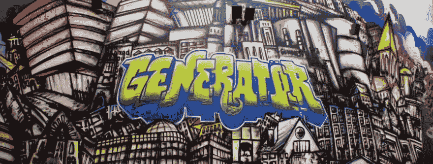

# 定制你的凤凰 HTML 生成器

> 原文:[https://dev . to/mutable state/customize-your-phoenix-html-generator-2l 85](https://dev.to/mutablestate/customise-your-phoenix-html-generator-2l85)

<figure>[](https://res.cloudinary.com/practicaldev/image/fetch/s--kcV2DpxX--/c_limit%2Cf_auto%2Cfl_progressive%2Cq_auto%2Cw_880/https://cdn-images-1.medium.com/max/1024/1%2AFBJdKJt9CTNCpV4dMzPJaw.jpeg) 

<figcaption>发电机招待所都柏林乘[罗莎克](https://www.flickr.com/photos/yukino/)</figcaption>

</figure>

**注:2019 更新进行中...凤凰 1.4 和 Tailwindcss ftw**

**这是怎么回事？**

用 Phoenix 发电机搭建脚手架，尤其是用`mix phx.gen.html`，是开始一个项目的好方法。您不仅获得了一个为 CRUD 准备好的资源，它还提供了单元测试并展示了最佳实践。

所有这些听起来都很棒，那么在最初的热情爆发后，我为什么不再使用这样一个强大的盟友呢？我认为主要原因是想要摆脱生成器提供的众所周知的训练轮子，开始编写一些甜蜜的灵丹妙药代码。错误消息和堆栈跟踪的有用反馈环帮助我提高了信心，并独自完成了任务。

使用带有模板的生成器时，我完全忽略了一个基本点，那就是通过自动化实现一致性。一致性是可维护代码库的关键之一，也是一个伟大的 UX 的基础。通过定制 Phoenix HTML 生成器，也许我可以实现这两个目标。

**场景**

作为一个固执己见的软件工程师，我已经决定我的新 CRUD 项目将使用[毫克](https://milligram.github.io/)，一个极简 css 框架，而不是 Phoenix 和大多数网站使用的标准引导 css。做出这样一个简单的决定会使标准的 Phoenix HTML 生成器变得毫无用处。

**众多解决方案之一**

用特定于项目的生成器和模板替换标准的`mix phx.gen.html`。然后可以更新和重用模板，以生成我添加的具有最新样式和布局的每个新资源。

让我们开始吧！

1.  创建新的 Phoenix 1.3 项目

```
mix phx.new boiler && cd boiler 
```

<svg width="20px" height="20px" viewBox="0 0 24 24" class="highlight-action crayons-icon highlight-action--fullscreen-on"><title>Enter fullscreen mode</title></svg> <svg width="20px" height="20px" viewBox="0 0 24 24" class="highlight-action crayons-icon highlight-action--fullscreen-off"><title>Exit fullscreen mode</title></svg>

1.  将 assets/css/phoenix.css 替换为 milligram.css

2.  制作模板和混合任务项目目录

```
mkdir -p priv/templates/boiler.gen.html && mkdir -p lib/boiler/mix/tasks 
```

<svg width="20px" height="20px" viewBox="0 0 24 24" class="highlight-action crayons-icon highlight-action--fullscreen-on"><title>Enter fullscreen mode</title></svg> <svg width="20px" height="20px" viewBox="0 0 24 24" class="highlight-action crayons-icon highlight-action--fullscreen-off"><title>Exit fullscreen mode</title></svg>

1.  将所有当前 HTML 生成器模板复制到新的项目模板目录中

```
cp -a deps/phoenix/priv/templates/phx.gen.html/. priv/templates/boiler.gen.html 
```

<svg width="20px" height="20px" viewBox="0 0 24 24" class="highlight-action crayons-icon highlight-action--fullscreen-on"><title>Enter fullscreen mode</title></svg> <svg width="20px" height="20px" viewBox="0 0 24 24" class="highlight-action crayons-icon highlight-action--fullscreen-off"><title>Exit fullscreen mode</title></svg>

1.  将当前生成器任务复制到新的项目任务目录中

```
cp deps/phoenix/lib/mix/tasks/phx.gen.html.ex lib/boiler/mix/tasks/boiler.gen.html.ex 
```

<svg width="20px" height="20px" viewBox="0 0 24 24" class="highlight-action crayons-icon highlight-action--fullscreen-on"><title>Enter fullscreen mode</title></svg> <svg width="20px" height="20px" viewBox="0 0 24 24" class="highlight-action crayons-icon highlight-action--fullscreen-off"><title>Exit fullscreen mode</title></svg>

1.  在您最喜欢的编辑器中打开`lib/boiler/mix/tasks/boiler.gen.html.ex`，并将模块名称更新为`Mix.Tasks.Boiler.Gen.Html`

2.  在同一文件中搜索/用`boiler`替换小写`phx`的所有实例

3.  检查您的代码是否已编译，并且您有一个锅炉项目混合任务

```
mix compile && mix help | grep boiler 
```

<svg width="20px" height="20px" viewBox="0 0 24 24" class="highlight-action crayons-icon highlight-action--fullscreen-on"><title>Enter fullscreen mode</title></svg> <svg width="20px" height="20px" viewBox="0 0 24 24" class="highlight-action crayons-icon highlight-action--fullscreen-off"><title>Exit fullscreen mode</title></svg>

如果一切顺利，你应该看到我们的新混合任务列为`mix boiler.gen.html`

1.  在使用我们新的生成器命令之前，是时候使用毫克类编辑`priv/templates/boiler.gen.html`中的`eex`模板和任何标记更改了。

毫克使用不同的网格系统来引导，所以我们也需要更新`lib/boiler/web/templates/layout/app.html.eex`

**其生成时间！**

像使用 Phoenix 生成器一样使用我们的新混合任务。

```
mix boiler.gen.html Accounts User users name:string email:string phone:string 
```

<svg width="20px" height="20px" viewBox="0 0 24 24" class="highlight-action crayons-icon highlight-action--fullscreen-on"><title>Enter fullscreen mode</title></svg> <svg width="20px" height="20px" viewBox="0 0 24 24" class="highlight-action crayons-icon highlight-action--fullscreen-off"><title>Exit fullscreen mode</title></svg>

按照说明将资源添加到路由器并运行迁移。

用`mix phx.server`启动服务器，并访问[http://localhost:4000/users](http://localhost:4000/users)，查看您定制生成的 HTML 模板的运行情况。

**现在不要停止**

这是一个为 CRUD 应用程序生成定制标记的小例子，但它只是一个尝试。

你是否以创造性的方式使用 Phoenix 定制生成器？

感谢阅读！

回购可以在[https://github.com/mutablestate/boiler](https://github.com/mutablestate/boiler)找到