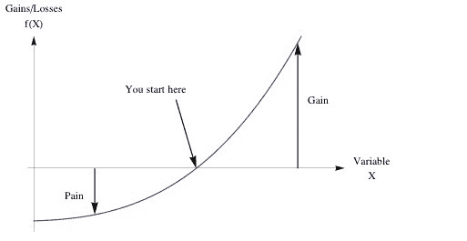

# 论赌博与技术债务

> 原文：<https://dev.to/bernardofanti/on-gambling-and-technical-debt>

解决复杂问题的启发式方法是一种实用的方法，不是*完美的*解决方案，而是*足够好的*来解决当前的问题，目的是加速几乎不可能的、复杂的决策，否则将需要*完美的解决方案*。

增量地应用于复杂系统中的小块问题，关于该系统的累积知识被创建(并且价值被传递给企业或客户)；将这些知识反馈到改进启发式算法本身，不断地使性能曲线(N 次事件的成功/失败值)向我们有利的方向倾斜。

我们需要从良好的、以前被证明的试探法开始，性能曲线向我们倾斜，并采取足够小的增量步骤，这样我们就永远不会耗尽资源，同时我们还可以持续交付价值，进一步提高我们的运行率。

想象一下用 100 美元在骰子桌上赌博。首先，你可以基于对掷骰子的物理现实的理解，创建一个启发式/统计模型；我们的目标是让业绩曲线向有利于我们的方向倾斜，即使是非常轻微的倾斜。请记住，这是一条概率曲线——你知道平均来说*你会赢(或领先)，比如说，49 次投掷中的 51 次，但你永远无法确定下一次投掷是否会赢。*(免责声明:当我使用骰子作为例子时，这个概率只是作为例子，并不反映骰子游戏的实际物理现实！)**

类似地，我们可以将我们想要应用于高度复杂、混乱、耦合的软件系统的任何特定变化想象成具有未知结果的概率事件。只有在用特定的技术尝试改变之后，我们才知道改变是否会成功，在这一点上，我们决定放弃并尝试不同的技术(以时间为代价),或者我们成功并交付价值。

 * [资料来源:纳西姆·塔勒布的抗脆弱性](https://www.edge.org/conversation/nassim_nicholas_taleb-understanding-is-a-poor-substitute-for-convexity-antifragility)*

考虑到非线性凸性能曲线(收益/损失曲线、回报曲线)的上述可视化，我们可以尝试将“软件变更”视为随机概率事件*。因此，该理论表明，我们不能专注于事件本身的质量(规划/设计*完美解决方案*，这几乎不可能预先确定)，而是应该专注于创建尽可能非线性和凸的性能函数。*过程胜于结果*。*

 *> 进化是应激源和错误的凸函数——基因突变没有成本，只有当它们是一种改进时才会被保留。社会中根深蒂固的祖传启发法和经验法则也是如此；通过不断采用“什么有效”的上限——纳西姆·塔勒布，形成类似食谱的形式

回到双骰桌上，口袋里有$100，你会在第一场游戏中赌上全部$100，甚至$50，因为你(假设)有 51-49 的优势？不要！在任何给定的实验中，你仍然有非常高的 49%的机会失败，一旦你失去了最初的 100 美元，你就不能再玩了——游戏结束，回家，你就死了(或破产了)。但是，如果你下注一个较小的、比例适当的金额，让你建立一个足够大的活动空间来进行平均，你更有可能在 10、100、1000 次游戏后胜出。

对复杂系统的软件工程应用充分理解和证明的重构启发法的好处是，那些实验事件不再像玩骰子时那样在统计上相互独立，而是建立在彼此的基础上，允许我们不断地改变启发法，改善对我们有利的性能(成本-回报)曲线。

我们能拿走什么？

1.  ***使用对你有利的开始试探法选择正确的游戏。*** (是的，你可以选择，在技术和商业领域，玩哪种游戏，活在哪条风险回报曲线上。专注于创造一条凸的风险回报曲线，而不是完美的解决方案、计划或结果)

2.  ***不要把所有的钱都押在第一次下注上。*** (需要进行足够小的投资，让我们能够继续投资，而不会失去选择，同时不断演化出更严重倾斜的风险回报曲线。)

3.  ***积累知识越多，按比例下注越多。*** (如果我们的过程创造了一个严重倾斜的成本回报曲线，并且我们有足够的投资储备，我们应该不断增加我们的投资规模，以避免被别人的黑天鹅发现所干扰。)

这个讨论还没有涵盖 Nassim Taleb 的黑天鹅事件的概念，黑天鹅事件本身可能不适用于管理复杂软件系统中的技术债务，但它进一步有助于使回报曲线向我们有利的方向倾斜，并且是基本的创新产品和业务中断背后的驱动因素之一。

*这篇文章是[最初在媒体上发布的](https://medium.com/@BernardoFanti/on-gambling-and-technical-debt-ed9c6adfff0#.xyc3naw89)。**