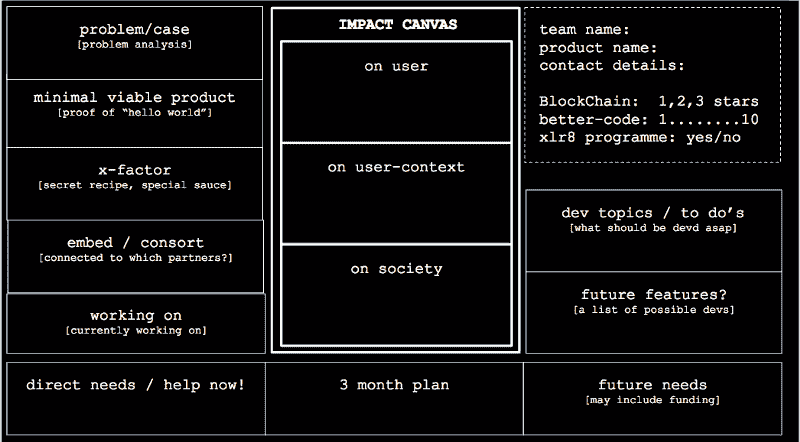
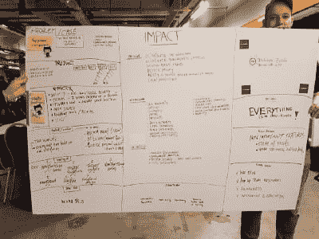
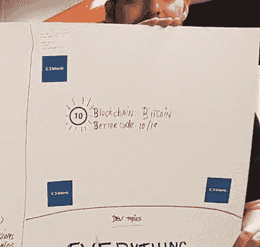
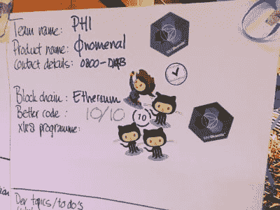
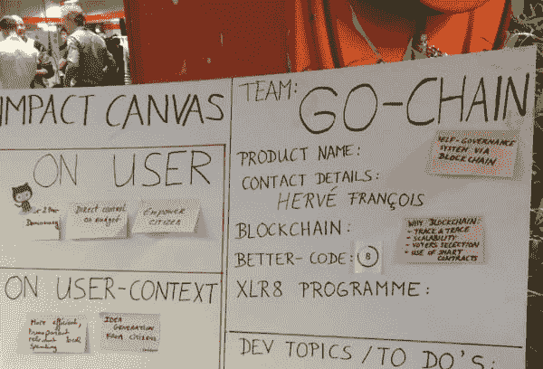
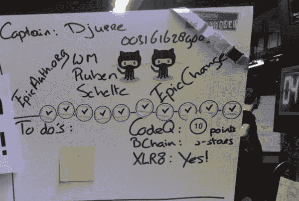

# 黑客马拉松如何欣赏高质量的代码

> 原文:[https://dev . to/jstvssr/how-a-hackathon-awares-quality-code](https://dev.to/jstvssr/how-a-hackathon-appreciates-quality-code)

## 全球最大的区块链黑客马拉松的一些教训

*图片:DC·西塞罗团队的罗宾·克纳彭在世界最大的区块链黑客马拉松上展示了他们在代码质量上的满分 10 分。图片由德伦特学院提供。*

上周末，[世界上最大的区块链黑客马拉松](https://blockchainhackathon.eu/p/hackathon)在荷兰举行。在 **54** 小时内， **350** 名参与者，被组织成 **55** 个团队，在**五条**赛道上，在**一个**格子上，在**零**时间内完成比赛。

此外，这些团队通过执行 **2000** 代码质量检查，对他们一起编写的代码质量负责。

以下是我们如何使这些 2000 检查成为可能，以及我们如何确保它们有助于加速团队。

## 有鉴赏力的评判方法

黑客马拉松组织者决定采取他们称之为“欣赏”的方式进行评判。用他们的话说:

> 我们不会举办选美比赛，也不会根据流畅的推销或你灿烂的笑容来评判你

相反，他们在整个活动过程中和活动结束后，在四个阶段促进了整体方法:(1)支持，(2)奖励，(3)奖励，和(4)加速。这种设置中的一个关键工具是“影响画布”，团队在其上从多个维度分享他们项目的财富。

 
*冲击画布模板。分享一个伟大的黑客马拉松项目的所有方面的空间。推动这种方法的 [Ritzo ten Cate](https://twitter.com/ritzotencate) 值得称赞。*

使用画布，团队与支持者、绝地、加速器和记者分享和讨论，带他们一起踏上旅程，与他们互动，共同创作。

## 代码质量怎么样？

伟大的黑客马拉松贡献的一个方面是解决方案的质量，包括代码。但是团队如何在代码质量上合作，并与其他人分享他们的代码质量成果呢？

为此，我们给了他们[更好的代码中枢](https://bettercodehub.com/):

*   我们给团队 **10 条构建可维护软件**的指导方针。在一次黑客马拉松前的会面中，这些指导方针被提交给了他们，他们收到了描述这些指导方针的奥莱利的书 [*构建可维护软件*](http://shop.oreilly.com/product/0636920049159.do) 。总之，这 10 条准则为代码质量提供了一个具有挑战性、可实现且有趣的定义。
*   我们让团队**免费访问 Better Code Hub** 的专业版，允许他们对照 10 条指导方针检查自己的代码，并给他们提供可操作的反馈，告诉他们如何修改代码以满足指导方针。团队可以前往 www.bettercodehub.com 的在几分钟内获得反馈，并且他们可以打开推&拉支持来获得每次提交的反馈。
*   一个软件质量绝地团队在活动期间帮助团队使用更好的代码中枢，并就任何与代码质量相关的问题向他们提供咨询。我应该应用哪种重构？我如何处理对第三方代码的依赖？如何让我的代码更易测试？代码质量绝地有答案。
*   在黑客马拉松最后一天的代码冻结之前，所有团队都有机会让绝地验证他们的代码质量结果**，绝地向他们提供奖品和徽章，并鼓励他们在 Impact 画布上分享他们的代码质量分数。**
***   活动结束后，团队可以在接下来的 12 个月内继续使用 Better Code Hub 的 Pro 版本(T0 )( T1 ),并继续获得 Jedi 在任何与代码质量相关的方面的支持。对于组装一个完整的应用程序来说，hackathon 是一个很好的学习体验，包括第三方组件和构建管道，但这只是迈向可发布产品的第一步。**

 **这是代码质量在一些影响画布上的样子:

*代码质量成就在荷兰区块链黑客马拉松几个团队的影响力画布上*

在数字方面，团队用 GitHub 徽章展示了他们的代码质量实力，这些徽章收集在记分牌上:

 
*更好的代码中枢徽章被收集在一个中央[记分牌](https://dutchblockchainhackathon.github.io/)上。*

## 那么，在一次黑客马拉松中，代码质量会受到什么影响呢？

我们选择不仅仅测量代码质量，并将测量结果反馈给陪审团。这将与“欣赏的方法”背道而驰，并产生错误的效果。相反，我们授权参与者以统一的方式获得正确的代码质量，使他们能够展示他们的代码质量成就，作为他们成就的众多维度之一。效果如下:

*   团结团队:有了对代码质量的清晰定义，团队就不需要浪费时间对编码风格吹毛求疵。此外，每次代码检查显示改进时，他们都会一起庆祝。
*   更快的编码:从一开始就构建高质量代码的团队可以在整个黑客马拉松中保持他们的编码速度。此外，他们可以更容易地在团队内部移交代码。没有意大利面可以纠缠。
*   对代码的欣赏:黑客马拉松应该是关于代码的，就像它们是关于学习、团队合作和绝妙想法一样。使代码质量易于度量、易于共享和易于奖励有助于给予代码应有的可见性。

因此，如果你正在组织一次黑客马拉松，我们可以推荐一种欣赏性的方法，包括一种增强代码质量的方法。如果你想学习我们在荷兰区块链黑客马拉松的经验，我们很乐意帮助你。

*[Joost Visser](https://www.linkedin.com/in/jstvssr) 是[软件改进小组](https://www.sig.eu/)的首席技术官，Radboud 大学的大型软件系统教授，也是 O'Reilly 书籍[《构建可维护软件》](http://shop.oreilly.com/product/0636920049159.do)和[《构建软件团队》](http://shop.oreilly.com/product/0636920048565.do)的作者。***