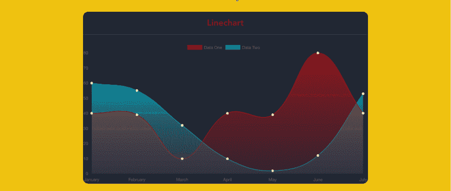

# 使用 Vue.js 和 Chart.js 创建令人惊叹的图表

> 原文:[https://dev . to/aperture less/creating-using-charts-with-vuejs-and-chartjs](https://dev.to/apertureless/creating-stunning-charts-with-vuejs-and-chartjs)

深入 chart.js 的选项来创建令人惊叹的图表。

交互式图表可以提供一种很酷的方式来可视化您的数据。
然而，大多数开箱即用的解决方案都没有它们应有的漂亮，都有默认选项。

我将向你展示如何定制你的 chart.js 选项来制作一些很酷的图表！

# 快速启动

我们将使用什么:

*   vista . js
*   [vista-chartjs](http://vue-chartjs.org)
*   vista-CLI

我们使用`vue-cli`来创建一个基本结构。所以我希望你已经安装好了。我们使用 [vue-chartjs](http://vue-chartjs.org) 作为 [chart.js](http://www.chartjs.org/) 的包装器。

```
vue init webpack awesome-charts 
```

<svg width="20px" height="20px" viewBox="0 0 24 24" class="highlight-action crayons-icon highlight-action--fullscreen-on"><title>Enter fullscreen mode</title></svg> <svg width="20px" height="20px" viewBox="0 0 24 24" class="highlight-action crayons-icon highlight-action--fullscreen-off"><title>Exit fullscreen mode</title></svg>

然后，我们进入项目文件夹，安装我们的依赖项。

```
cd awesome-charts && yarn install 
```

<svg width="20px" height="20px" viewBox="0 0 24 24" class="highlight-action crayons-icon highlight-action--fullscreen-on"><title>Enter fullscreen mode</title></svg> <svg width="20px" height="20px" viewBox="0 0 24 24" class="highlight-action crayons-icon highlight-action--fullscreen-off"><title>Exit fullscreen mode</title></svg>

我们添加 vue-chartjs :

```
yarn add vue-chartjs -S 
```

<svg width="20px" height="20px" viewBox="0 0 24 24" class="highlight-action crayons-icon highlight-action--fullscreen-on"><title>Enter fullscreen mode</title></svg> <svg width="20px" height="20px" viewBox="0 0 24 24" class="highlight-action crayons-icon highlight-action--fullscreen-off"><title>Exit fullscreen mode</title></svg>

# 我们的第一张图表

那么，让我们创建第一个折线图。

```
touch src/components/LineChart.js && subl . 
```

<svg width="20px" height="20px" viewBox="0 0 24 24" class="highlight-action crayons-icon highlight-action--fullscreen-on"><title>Enter fullscreen mode</title></svg> <svg width="20px" height="20px" viewBox="0 0 24 24" class="highlight-action crayons-icon highlight-action--fullscreen-off"><title>Exit fullscreen mode</title></svg>

现在我们需要从 [vue-chartjs](http://vue-chartjs.org) 导入线条基线图并创建我们的组件。

在 **mount()** 函数中，我们需要用我们的数据和选项调用 **renderChart()** 方法。

```
import {Line} from 'vue-chartjs'

export default Line.extend({
  mounted () {

    this.renderChart({
      labels: ['January', 'February', 'March', 'April', 'May', 'June', 'July'],
      datasets: [
        {
          label: 'Data One',
          backgroundColor: '#FC2525',
          data: [40, 39, 10, 40, 39, 80, 40]
        },{
          label: 'Data Two',
          backgroundColor: '#05CBE1',
          data: [60, 55, 32, 10, 2, 12, 53]
        }
      ]
    }, {responsive: true, maintainAspectRatio: false})

  }
}) 
```

<svg width="20px" height="20px" viewBox="0 0 24 24" class="highlight-action crayons-icon highlight-action--fullscreen-on"><title>Enter fullscreen mode</title></svg> <svg width="20px" height="20px" viewBox="0 0 24 24" class="highlight-action crayons-icon highlight-action--fullscreen-off"><title>Exit fullscreen mode</title></svg>

我们传入一个基本的 [chart.js](http://www.chartjs.org/) 数据对象和一些样本数据，在选项参数中，我们传入`responsive: true`。因此，图表将基于我们的外部容器增长。

我们可以调用方法 **renderChart()** ，因为我们扩展了 BaseChart，其中定义了该方法和一些属性。

## 装上&测试一下

现在我们从我们的`App.vue`中删除`Hello.vue`组件并导入我们的图表。

```
<template>
  <div id="app">
    <div class="container">
      <div class="Chart__list">
        <div class="Chart">
          <h2>Linechart</h2>
          <line-example></line-example>
        </div>
      </div>
    </div>
  </div>
</template>

<script>
import LineExample from './components/LineChart.js'
export default {
  name: 'app',
  components: {
    LineExample
  }
}
</script>

<style>
#app {
  font-family: 'Avenir', Helvetica, Arial, sans-serif;
  -webkit-font-smoothing: antialiased;
  -moz-osx-font-smoothing: grayscale;
  text-align: center;
  color: #2c3e50;
  margin-top: 60px;
}
.container {
  max-width: 800px;
  margin:  0 auto;
}
</style> 
```

<svg width="20px" height="20px" viewBox="0 0 24 24" class="highlight-action crayons-icon highlight-action--fullscreen-on"><title>Enter fullscreen mode</title></svg> <svg width="20px" height="20px" viewBox="0 0 24 24" class="highlight-action crayons-icon highlight-action--fullscreen-off"><title>Exit fullscreen mode</title></svg>

在我们的终端中运行开发脚本之后，我们应该会看到我们的图表。

```
yarn run dev 
```

<svg width="20px" height="20px" viewBox="0 0 24 24" class="highlight-action crayons-icon highlight-action--fullscreen-on"><title>Enter fullscreen mode</title></svg> <svg width="20px" height="20px" viewBox="0 0 24 24" class="highlight-action crayons-icon highlight-action--fullscreen-off"><title>Exit fullscreen mode</title></svg>

# ðÿ'„让我美丽

好了，现在是美化ðÿ'….的时候了 [chart.js](http://www.chartjs.org/) 里有几个很酷的小技巧。我们可以传递一个颜色十六进制值给`backgroundColor`；但是我们也可以传递一个 rgba()值。所以我们可以使我们的颜色透明。
由于 chart.js 是用 html canvas 来绘制的，我们可以利用[createlanegradient()](https://developer.mozilla.org/de/docs/Web/API/CanvasRenderingContext2D/createLinearGradient)。

这就是乐趣的开始。ðÿž:但是要使用它，我们需要画布对象。但这没什么大不了的，因为《T2》引用了它。我们可以通过`this.$refs.canvas`访问它

所以在我们的`LineChart.js`中，我们创建了两个变量来存储梯度。因为我们需要数据集。

然后我们创建两个渐变:

```
this.gradient = this.$refs.canvas
 .getContext('2d')
 .createLinearGradient(0, 0, 0, 450)
this.gradient2 = this.$refs.canvas
 .getContext('2d')
 .createLinearGradient(0, 0, 0, 450) 
```

<svg width="20px" height="20px" viewBox="0 0 24 24" class="highlight-action crayons-icon highlight-action--fullscreen-on"><title>Enter fullscreen mode</title></svg> <svg width="20px" height="20px" viewBox="0 0 24 24" class="highlight-action crayons-icon highlight-action--fullscreen-off"><title>Exit fullscreen mode</title></svg>

还有一个很酷的函数我们可以用: [addColorStop()](https://developer.mozilla.org/en-US/docs/Web/API/CanvasGradient/addColorStop)

我们为每个渐变创建三个颜色停止。对于 0%、50%和 100%。

```
this.gradient.addColorStop(0, 'rgba(255, 0,0, 0.5)')
this.gradient.addColorStop(0.5, 'rgba(255, 0, 0, 0.25)');
this.gradient.addColorStop(1, 'rgba(255, 0, 0, 0)');

this.gradient2.addColorStop(0, 'rgba(0, 231, 255, 0.9)')
this.gradient2.addColorStop(0.5, 'rgba(0, 231, 255, 0.25)');
this.gradient2.addColorStop(1, 'rgba(0, 231, 255, 0)'); 
```

<svg width="20px" height="20px" viewBox="0 0 24 24" class="highlight-action crayons-icon highlight-action--fullscreen-on"><title>Enter fullscreen mode</title></svg> <svg width="20px" height="20px" viewBox="0 0 24 24" class="highlight-action crayons-icon highlight-action--fullscreen-off"><title>Exit fullscreen mode</title></svg>

现在我们可以通过`this.gradient`到`backgroundColor`。我们有一个非常好的梯度。为了获得更好的效果，我们还将`borderColor`设置为 alpha 为 1 的单独颜色。(或者我们使用十六进制值)并将`borderWidth`设置为 1，最后但并非最不重要的是`pointColor`。

```
borderColor: '#FC2525', 
pointBackgroundColor: 'white', 
borderWidth: 1, 
pointBorderColor: 'white', 
```

<svg width="20px" height="20px" viewBox="0 0 24 24" class="highlight-action crayons-icon highlight-action--fullscreen-on"><title>Enter fullscreen mode</title></svg> <svg width="20px" height="20px" viewBox="0 0 24 24" class="highlight-action crayons-icon highlight-action--fullscreen-off"><title>Exit fullscreen mode</title></svg>

```
import {Line} from 'vue-chartjs'

export default Line.extend({
  data () {
    return {
      gradient: null,
      gradient2: null
    }
  },
  mounted () {
    this.gradient = this.$refs.canvas.getContext('2d').createLinearGradient(0, 0, 0, 450)
    this.gradient2 = this.$refs.canvas.getContext('2d').createLinearGradient(0, 0, 0, 450)

    this.gradient.addColorStop(0, 'rgba(255, 0,0, 0.5)')
    this.gradient.addColorStop(0.5, 'rgba(255, 0, 0, 0.25)');
    this.gradient.addColorStop(1, 'rgba(255, 0, 0, 0)');

    this.gradient2.addColorStop(0, 'rgba(0, 231, 255, 0.9)')
    this.gradient2.addColorStop(0.5, 'rgba(0, 231, 255, 0.25)');
    this.gradient2.addColorStop(1, 'rgba(0, 231, 255, 0)');

    this.renderChart({
      labels: ['January', 'February', 'March', 'April', 'May', 'June', 'July'],
      datasets: [
        {
          label: 'Data One',
          borderColor: '#FC2525',
          pointBackgroundColor: 'white',
          borderWidth: 1,
          pointBorderColor: 'white',
          backgroundColor: this.gradient,
          data: [40, 39, 10, 40, 39, 80, 40]
        },{
          label: 'Data Two',
          borderColor: '#05CBE1',
          pointBackgroundColor: 'white',
          pointBorderColor: 'white',
          borderWidth: 1,
          backgroundColor: this.gradient2,
          data: [60, 55, 32, 10, 2, 12, 53]
        }
      ]
    }, {responsive: true, maintainAspectRatio: false})

  }
}) 
```

<svg width="20px" height="20px" viewBox="0 0 24 24" class="highlight-action crayons-icon highlight-action--fullscreen-on"><title>Enter fullscreen mode</title></svg> <svg width="20px" height="20px" viewBox="0 0 24 24" class="highlight-action crayons-icon highlight-action--fullscreen-off"><title>Exit fullscreen mode</title></svg>

## 演示

最后一步是给我们的`App.vue`
中的容器添加一些样式

```
.Chart {
  background: #212733;
  border-radius: 15px;
  box-shadow: 0px 2px 15px rgba(25, 25, 25, 0.27);
  margin:  25px 0;
}

.Chart h2 {
  margin-top: 0;
  padding: 15px 0;
  color:  rgba(255, 0,0, 0.5);
  border-bottom: 1px solid #323d54;
} 
```

<svg width="20px" height="20px" viewBox="0 0 24 24" class="highlight-action crayons-icon highlight-action--fullscreen-on"><title>Enter fullscreen mode</title></svg> <svg width="20px" height="20px" viewBox="0 0 24 24" class="highlight-action crayons-icon highlight-action--fullscreen-off"><title>Exit fullscreen mode</title></svg>

# ðÿ'最终结果

[T2】](https://res.cloudinary.com/practicaldev/image/fetch/s--rVY2A4cr--/c_limit%2Cf_auto%2Cfl_progressive%2Cq_auto%2Cw_880/https://i.imgur.com/QqFCf8f.png)