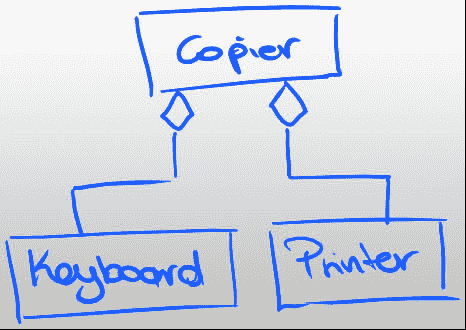
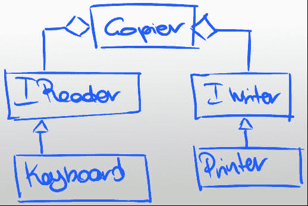

# 依赖倒置原则中的倒置是什么？

> 原文:[https://dev . to/ruidfigueiredo/what-inverts-in-dependency-inversion-principle](https://dev.to/ruidfigueiredo/what-inverts-in-the-dependency-inversion-principle)

你有没有想过为什么依赖倒置原则会这样命名？

依赖倒置原则通常被描述为[“依赖抽象，而非具体。”](http://butunclebob.com/ArticleS.UncleBob.PrinciplesOfOod)。但是从这种描述中很难看出什么是颠倒的。

如果我们画一个类结构的类图，其中不存在依赖倒置原则，然后我们改变它，使它不违反原则，指示依赖的箭头会倒置吗？好吧，让我们试试看。

我无耻地从鲍勃叔叔的《butunclebob.com/ArticleS.UncleBob.PrinciplesOfOod 的 T2》中的[到](http://docs.google.com/a/cleancoder.com/viewer?a=v&pid=explorer&chrome=true&srcid=0BwhCYaYDn8EgMjdlMWIzNGUtZTQ0NC00ZjQ5LTkwYzQtZjRhMDRlNTQ3ZGMz&hl=en)引用了这个例子。

假设您有一个`Copier`类，该类从键盘获取输入并将其发送到打印机。`Copier`类依赖于`Keyboard`类来读取用户的击键，依赖于`Printer`类来打印这些键(图 1)。

```
public class Copier{
    private readonly Keyboard _keyboard;
    private readonly Printer _printer;

    public Copier(Keyboard keyboard, Printer printer){
        _keyboard = keyboard;
        _printer = printer;
    }

    public void Copy(){
        int c = _keyboard.Read();
        while(!_keyboard.IsEndingCharacter(c)){
            _printer.Write(c);
            c = _keyboard.Read();
        }
    }
} 
```

<svg width="20px" height="20px" viewBox="0 0 24 24" class="highlight-action crayons-icon highlight-action--fullscreen-on"><title>Enter fullscreen mode</title></svg> <svg width="20px" height="20px" viewBox="0 0 24 24" class="highlight-action crayons-icon highlight-action--fullscreen-off"><title>Exit fullscreen mode</title></svg>

[](https://res.cloudinary.com/practicaldev/image/fetch/s--nQw7cVs9--/c_limit%2Cf_auto%2Cfl_progressive%2Cq_auto%2Cw_880/http://www.blinkingcaret.com/wp-content/uploads/2016/01/Diagram-without-dependency-inversion-1.png) 
*图 1 - `Copier`违反依存倒置原则的类*

现在我们将应用依赖倒置原则，即，`Copier`将依赖抽象，而不是依赖具体的类(图 2)。这些抽象将是:

*   **IReader**——定义从源获取输入的契约
*   IWriter -定义一个将数据写入输出的契约

-

```
public class Copier{
    private readonly IReader _reader;
    private readonly IWriter _writer;

    public Copier(IReader reader, IWriter writer){
        _reader = reader;
        _writer = writer;
    }

    public void Copy(){
        int c = _reader.Read();
        while(!_reader.IsEndingCharacter(c)){
            _writer.Write(c);
            c = _reader.Read();
        }
    }
} 
```

<svg width="20px" height="20px" viewBox="0 0 24 24" class="highlight-action crayons-icon highlight-action--fullscreen-on"><title>Enter fullscreen mode</title></svg> <svg width="20px" height="20px" viewBox="0 0 24 24" class="highlight-action crayons-icon highlight-action--fullscreen-off"><title>Exit fullscreen mode</title></svg>

[](https://res.cloudinary.com/practicaldev/image/fetch/s--DUmO-NFx--/c_limit%2Cf_auto%2Cfl_progressive%2Cq_auto%2Cw_880/http://www.blinkingcaret.com/wp-content/uploads/2016/01/Diagram-with-dependency-inversion-1.png) 
*图 2 - `Copier`不违反依赖倒置原则的类*

现在，`Keyboard`和`Printer`是`Reader`和`Writer`的实现，`Copier`不再依赖于它们，这意味着你现在可以从其他地方复制，例如，从键盘到磁盘上的文件。

这样做有很多好处。现在，`Copier`可以被重用而不需要`Keyboard`和`Printer`类。如果`IReader`和`IWriter`定义的契约(方法签名)不变，键盘和打印机实现细节的变化保证不会影响`Copier`。

但是，您看到图之间的任何明显的倒置依赖关系了吗？

我也没有。

但是让我们试着描述一下`Copier`类和它的依赖项之间的关系。

起初，`Copier`类依赖于底层的`Keyboard`和`Printer`类。

之后，`Copier`级依靠高级`Reader`和`Writer`。正是这种从低到高的反转可以被认为是依赖性反转的“反转”部分。

事实证明，很久以前，高层模块依赖于低层模块被认为是一种好的实践(在面向对象设计之前)。“*依存倒置*这个名字就是在影射这一点。

这里，更有说服力地说，它直接来自于[源(部分:依赖倒置原则)](http://docs.google.com/a/cleancoder.com/viewer?a=v&pid=explorer&chrome=true&srcid=0BwhCYaYDn8EgMjdlMWIzNGUtZTQ0NC00ZjQ5LTkwYzQtZjRhMDRlNTQ3ZGMz&hl=en):

> 有人可能会问我为什么要用“倒置”这个词。坦率地说，这是因为更传统的软件开发方法，例如结构化分析和设计，倾向于创建这样的软件结构，其中高级模块依赖于低级模块，抽象依赖于细节。实际上，这些方法的目标之一是定义子程序层次结构，该层次结构描述高级模块如何调用低级模块...因此，设计良好的面向对象程序的依赖结构相对于传统过程方法通常产生的依赖结构是“倒置的”。