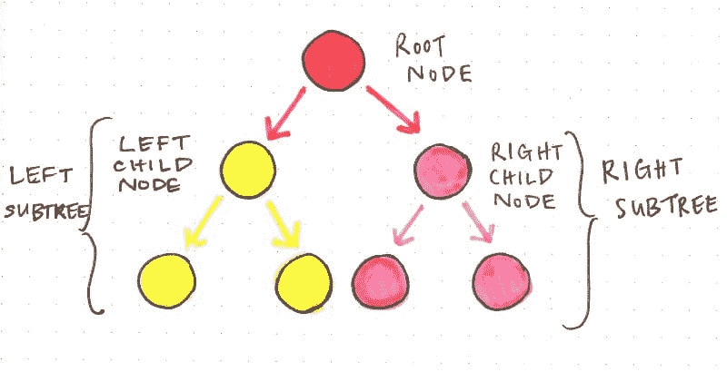
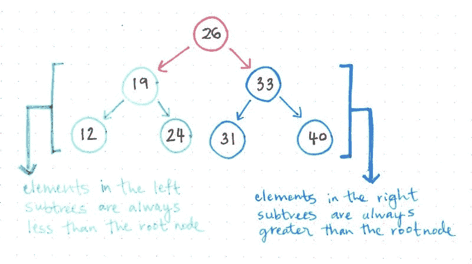
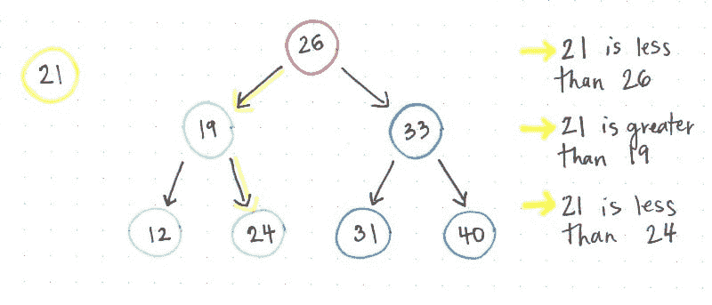
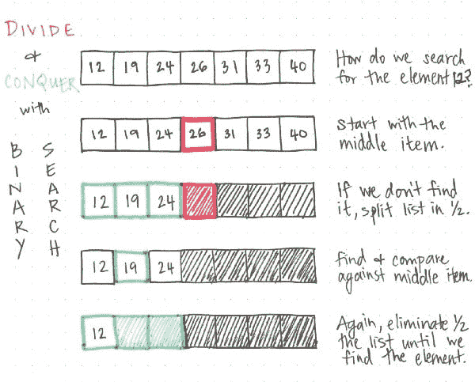
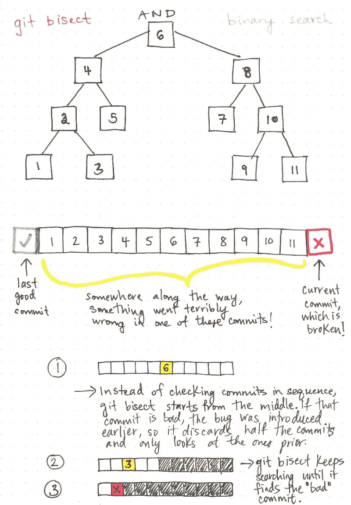

# 把它分成二叉树

> 原文:[https://dev.to/vaidehijoshi/leaf-it-up-to-binary-trees](https://dev.to/vaidehijoshi/leaf-it-up-to-binary-trees)

软件中的大多数东西都可以分解成更小的部分。大型框架实际上只是为创建重量级代码基础设施而构建的一小部分功能。面向对象编程实际上只是一堆相互继承的类。经典继承和“类层次结构”实际上只是一个层次树结构。树是数据结构，它实际上只是一堆相互连接的节点和链接。

看到了吗？一切都是一堆小东西放在一起。然而，真正有趣的是，当我们开始观察这些小部件在表面下是如何工作的——也就是说，它们可以被用来构建更大的抽象概念的所有不同方式。

上周，我们学习了[树形数据结构](https://dev.to/vaidehijoshi/how-to-not-be-stumped-by-trees)，它们通常被抽象出来，但却是更大的东西——比如我们计算机上的文件系统——如何在幕后工作的重要部分。编程中使用了几种不同类型的树结构，但是最常见的(也可以说是最强大的)一种是**二叉查找树**。

二分搜索法树，有时缩写为 BST，是遵循一组非常特定的规则的树数据结构。仅仅从它们的名字，你*可能*已经能够猜出那些规则是什么。这些树如此强大并最终如此有用的原因是*因为*这些特定的规则。但是，在我们滔滔不绝地谈论二分搜索法树之前，让我们更深入地了解一下它们是什么，以及它们与其他树的不同之处！

### 一树之内两树

我们已经熟悉了术语**二进制**，因为[我们已经在二进制(或以 2 为基数的)数字系统的上下文中讨论过它](https://dev.to/vaidehijoshi/bits-bytes-building-with-binary)。然而，binary 还有一个更简单的意思:任何与或*相关的*都是由* **两个事物**组成的。在树的上下文中，这一开始可能看起来有点奇怪。一棵树只能有一个根——这是它的特征之一！那么一棵树是怎么变成两棵树的呢？一棵树到底是如何变成… *二进制*的？*

为了理解是什么将“二进制”放在二叉查找树中，我们必须回想一下树数据结构的另一个特征:递归性。树是*递归数据结构*，这意味着一棵树是由许多其他树组成的。

> 树结构的子节点也很可能是许多其他子节点的父节点——这将有效地使其成为更大树结构的迷你子树的根节点。

树的递归特性对于二分搜索法的实际功能至关重要(更不用说，这也是它如此强大的原因之一)。

二叉树因其构造方式而得名；更具体地说，它们的名字来源于它们的*子树*的构造方式。正如我们所料，每个二叉树都有一个根节点。但在那之后，事情变得更加狭隘和严格。二叉树只能有两个链接，连接到两个节点。这意味着每个父节点只能有两个可能的子节点———*永远不会超过这个数目。*

但是递归是如何混合在一起的呢？嗯，如果每个父节点，包括根节点，都只能有*两个*子节点，这意味着根节点只能指向两个子树。因此，每个二叉树将包含两个子树:一个**左子树**和一个**右子树**。这条规则在我们沿着树往下走的时候仍然适用:左子树和右子树本身都是二叉树，因为它们是大树的递归部分。因此，左子树的根将指向另外两棵树，这意味着它包含*自己的*左子树和右子树！

[T2】](https://res.cloudinary.com/practicaldev/image/fetch/s--s8-i8fIF--/c_limit%2Cf_auto%2Cfl_progressive%2Cq_auto%2Cw_880/https://cdn-images-1.medium.com/max/800/1%2AUjSfPoMwCEkke1_iuNZ1EQ.jpeg)

二叉查找树的递归性是它如此强大的部分原因。事实上，我们知道一个 BST 可以被拆分并均匀地划分为若干个小树，这在我们开始遍历树的时候会派上用场！

但是首先，让我们来看看使二叉树如此特殊的一个更重要的规则。

### 向左，向左，树中所有小数字向左

如果你还没有完全掌握二分搜索法树的力量，那是因为我还没有分享它们最重要的特征:二叉查找树的节点必须以特定的方式排序。事实上，二叉查找树的组织和排序方式使其具有“可搜索性”。

为了使 BST 可搜索，根节点左边的所有节点必须小于根节点的值。那么，您可能会猜测，这一定意味着根节点右侧*的所有值都必须大于根节点。*

如果我们不仅在理论上，而且在实践中观察这种排序，一种模式开始显露出来。节点左侧的所有子树的值总是小于节点右侧的子树——当然，由于树的递归性质，这不仅适用于主总体树结构，也适用于每个嵌套的子树。

[T2】](https://res.cloudinary.com/practicaldev/image/fetch/s--rJDX-Z03--/c_limit%2Cf_auto%2Cfl_progressive%2Cq_auto%2Cw_880/https://cdn-images-1.medium.com/max/800/1%2ArJa-Z60bKE0-MOFrAuXttQ.jpeg)

在上面的示例树中，根节点左边的所有节点(值为 26)都小于 26。但是，如果我们看左边的绿色子树，我们会注意到，尽管 24 比 26 小，但它仍然比 19 大，所以它位于节点 19 的右边。

> 如果每个节点只有两个子节点，那么任何树都可以是二叉树。正是节点的排序使得二叉树变得可搜索，并且，通过扩展，使得它如此强大。

节点的显式排序使得二叉查找树很容易搜索到 T2。这也适用于人们想要在树上执行的所有基本操作。例如，假设我们想要执行一个`insert()`操作，我们希望它能够获取一个值并将其插入到树中的正确位置。

[T2】](https://res.cloudinary.com/practicaldev/image/fetch/s--XIL-SlIb--/c_limit%2Cf_auto%2Cfl_progressive%2Cq_auto%2Cw_880/https://cdn-images-1.medium.com/max/800/1%2A2KbEeyVk3OX82o3A1prDEw.jpeg)

我们可以很容易地伪代码化一个`insert()`函数，因为 BST 的排序规则:

1.  我们从根节点开始，将根节点的值(`26`)与我们想要的项目进行比较。
2.  由于`21`小于 `26`的*，我们立即确定我们想要插入的项目将位于更大的二叉查找树的左子树中的某处。*
3.  我们来看新的“根”节点:`19`。我们知道我们想要插入的项目，`21`大于`19`。因此，我们移动到节点`19`的右边节点，因为我们知道我们插入的条目更大，必须在右边的子树上。
4.  现在我们来到子树上的一片叶子:节点是`24`，比`21`大。我们需要在这里的某个地方插入我们的项目，但是我们也需要确保值为`24`的节点在正确的位置。
5.  我们设置我们正在插入的节点`21`，使它的右指针指向预先存在的节点`24`，因为`24`大于`21`。我们的插页完成了！

### 一半的元素和两倍的乐趣

二分搜索法树在计算机科学中确实很特别。原因很简单:它们允许你利用二分搜索法算法的力量。你可能还记得，并不是所有的二叉树都是二分搜索法树——它们必须以特定的方式组织，以便我们对它们执行二进制搜索。

等等——什么是二分搜索法？好吧，我们已经开始尝试二进制搜索，在前面插入函数的伪代码过程中。

> 二分搜索法是一种算法，它通过将搜索集分成两组，并将一个元素与一个大于或小于您要查找的元素进行比较，来简化和加快在排序集合中的搜索。

这个定义听起来有点拗口，但实际上通过观察它的运行，理解和掌握起来要简单得多。所以，让我们用一张图让自己轻松一点吧！我们将使用前面的同一个二叉查找树，它有一个根节点`26`；让我们把它重组为一个线性结构，比如一个数组，而不是树格式，这样看起来更容易一些。

[T2】](https://res.cloudinary.com/practicaldev/image/fetch/s--FpHrW5k3--/c_limit%2Cf_auto%2Cfl_progressive%2Cq_auto%2Cw_880/https://cdn-images-1.medium.com/max/600/1%2Ah-9gysybCLfvBIYNyUTwuQ.jpeg)

这里我们有 7 个元素(节点)，我们只想找到一个:`12`。在大多数情况下，我们不容易看到所有节点的值，但是在这个例子中，我把它们都写了出来，这样更容易理解。

好的——那么我们如何搜索值为`12`的节点呢？

我们已经知道我们的元素都是按大小排序的。所以让我们利用这一点。我们先从中间元素开始，也就是`26`。`26`比我们要找的数字小还是大？嗯，肯定是比较大。这意味着我们可以 100%确定这个中间元素右边的任何东西都不是我们正在寻找的元素`12`的家。所以，我们可以*消除*数组右边的所有东西。

好了，现在我们有 3 个元素要看！我们选其中的一个，正好是`19`。比`12`大还是小？肯定更大；所以我们可以排除这个节点右边的所有东西，因为我们知道它太大了，不是正确的数字。

好吧，还有一个号码，这是我们要查的！而且当然是我们一直在寻找的节点:`12`！成功！

如果我们再看一下这个例子，我们会注意到，随着我们所做的每一次检查和比较，我们实际上*消除了* ** *一半** * _ 我们需要检查的剩余元素。想一想。

> 在缩小搜索集的过程中，我们还*移除一半的搜索空间。*这非常强大——这正是二进制搜索如此强大的原因。

我们将 BST 重组到一个数组中，但是树上的二分搜索法和数组上的二分搜索法功能相同——只要所有的元素都进行了排序。这部分是关键。在数组中，中间元素左边的元素是左“子数组”，就像在二叉查找树中，根节点左边的元素组成左“子树”。

当你想到这样一个事实，即我们可以在一棵树中拥有*吨*个节点，但不必搜索所有节点(如果我们逐个搜索所有这些元素，或者在*线性搜索*中，我们将不得不这样做)，这种算法是令人难以置信的强大。如果我们的数据是有序和分类的，那么二分搜索法的效率要高得多，这样我们就可以很容易地将搜索空间一分为二。

希望通过观看二分搜索法的行动，你能开始明白它的名字从何而来——以及为什么它的名字如此完美！我们可以在一个巨大的数据集中搜索，但是更聪明的做法是*将我们的搜索空间一分为二*进行每次比较。

### 日常二进制搜索

当你能够思考*何时*使用抽象，以及*为什么*它们如此重要，是什么让它们如此有用时，抽象就处于最佳状态。这就引出了一个问题:到底什么时候二进制搜索和二分搜索法树才真正在更大的计算机科学世界中得到应用？

嗯，答案是:在很多地方！在我的回答中更精确一点:首先是在数据库中。如果你在使用数据库时见过术语 **t 树**或 **b 树**，这两种都是二叉树数据结构。但是等一下——还有更好的呢！数据库使用索引来搜索要检索和返回的正确行。它如何搜索正确的索引？你猜对了:通过使用二分搜索法！

然而，二进制搜索和二分搜索法树并不只是在较低层次的上下文中使用；我们中的一些人可能已经和他们直接交流过了。

如果你曾经从事过一个项目，并且意识到，在这个过程的某个地方，你引入了一个 bug 或者破坏了一个测试，你可能已经熟悉了令人敬畏的 git 命令`git bisect`。根据 git [文档](https://git-scm.com/docs/git-bisect)，这个命令让你告诉 git 搜索你所有提交的列表:

> 首先告诉它一个已知包含 bug 的“坏”提交，以及一个已知在引入 bug 之前的“好”提交。然后`git bisect`在这两个端点之间选择一个提交，并询问您所选择的提交是“好”还是“坏”。它继续缩小范围，直到找到引入更改的确切提交。

这种魔法是如何运作的？？当然是通过美丽的二叉查找树！

[T2】](https://res.cloudinary.com/practicaldev/image/fetch/s--hrH14-bR--/c_limit%2Cf_auto%2Cfl_progressive%2Cq_auto%2Cw_880/https://cdn-images-1.medium.com/max/800/1%2A6iuqgb1TokWO9ChycbjKZg.jpeg)

通过告诉 git 最后一次“好的”提交是什么时候，它搜索从那时到现在的所有提交。但它当然不会按时间顺序进行搜索，而是从中间提交开始，如果您确认中间提交也是“错误的”,那么它将继续进行之前的提交，并放弃之后的所有提交。它引导一个二分搜索法，就像我们今天处理的一样！

很神奇，对吧？谁知道我们这么多人用这么简单的概念在这么高的层次上调试东西呢？！我不知道你怎么想，但就我个人而言，我确信:当我们把穿越留给二分搜索法树的时候，我们都会过得更好。

### 资源

1.  [二叉树](https://www.cs.cmu.edu/~adamchik/15-121/lectures/Trees/trees.html)，维克多·亚当希克教授
2.  [二分搜索法和二叉查找树的区别？](http://stackoverflow.com/questions/21586085/difference-between-binary-search-and-binary-search-tree)，StackOverflow
3.  [数据结构和算法二分搜索法](https://www.tutorialspoint.com/data_structures_algorithms/binary_search_algorithm.htm)，教程要点
4.  [二叉树](http://cslibrary.stanford.edu/110/BinaryTrees.html)(高级)，尼克·帕兰特教授
5.  [用算法和数据结构解决问题](https://interactivepython.org/runestone/static/pythonds/SortSearch/TheBinarySearch.html)，布拉德·米勒和大卫·拉努姆
6.  [用 git-平分进行调试的故事](http://veldstra.org/2016/02/03/a-tale-of-debugging-with-git-bisect.html)，Hassy Veldstra