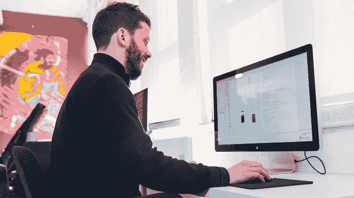
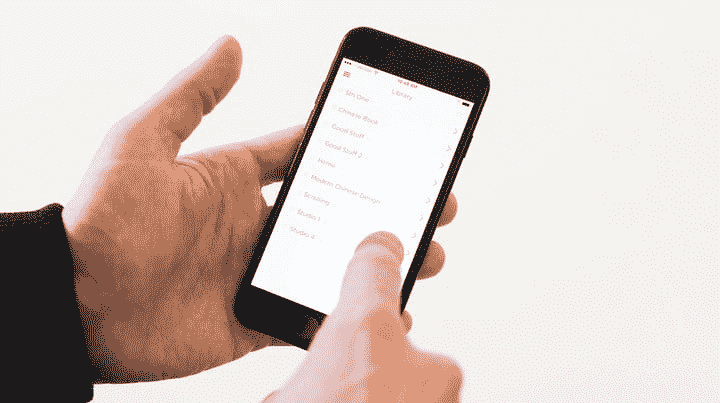
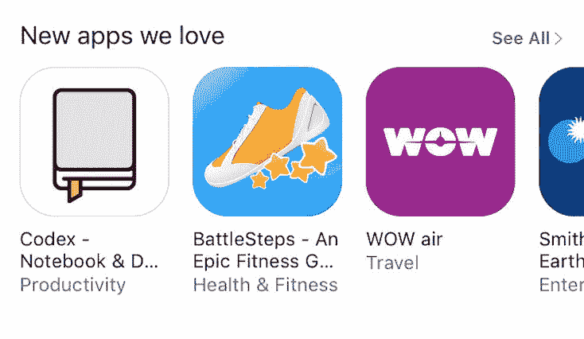

# 我是如何意外成为一名开发人员的

> 原文:[https://dev . to/adamkornfield/how-I-incidential-be-a-developer](https://dev.to/adamkornfield/how-i-accidentally-became-a-developer)

我以为我的头要爆炸了。我已经为我们的新应用 Codex 工作了将近一整年，它是一堵又一堵的砖墙。当最终向全世界发布的那一天到来时，我难以置信——从财务人员到开发人员的道路肯定是漫长而艰难的。

# 进入 App 竞技场

大约 3 年前，也就是 2014 年，我和我的联合创始人乔伊·科芬推出了巴龙无花果。最初，我们从 Kickstarter 上的知己精装笔记本开始。我们在最初的 24 小时内达到了 15，000 美元的目标，并筹集了超过 168，000 美元，是我们目标的 11 倍。这很难相信，但显然人们仍然想要物理模拟产品，即使在这个 iPhones 和 iPads 的高科技世界。

当时我全职从事金融工作，我不得不做出艰难的决定，离开相对舒适的生活，去帮助创办一家纸质笔记本公司。我深思熟虑了很久，最终[做出决定](https://www.linkedin.com/pulse/why-i-quit-my-finance-job-co-found-startup-adam-kornfield)向前迈进。

在推出我们的精装和软装笔记本后不久，我们就有了许多应用程序的想法。虽然我在大学学的是计算机工程，但我已经好几年没编过代码了，对 app 开发一窍不通。事实证明，他们在大学里教你的东西和你在现实世界中实际应用这些东西所需要的东西之间有一点差距(至少对我来说是这样)。

所以我们采取了最简单的方法，雇佣了一个外部开发人员。第一个应用的概念是给你的笔记本拍照，讽刺的是，这和我最终的工作很相似。我们通过朋友找到了一个自由开发者。这家伙看起来很聪明，我们就功能和合同达成了一致。在接下来的两个月里，我们开始设计、会面和构建这个应用程序。一切似乎进展得相当顺利，直到有一天他进来，突然告诉我们他要退出这个项目，因为他不喜欢为 iOS 编写代码。这个项目被搁置了。

既然我们有时间，乔伊和我重新开始考虑这个应用程序。如果没有一个只能在我们的笔记本上使用的应用程序，我们可以制作一些用户可以直接在上面做笔记的东西，会怎么样？当时，这似乎是个好主意。因此，我们做了与上次应用程序尝试完全相同的事情。我们想出了一个设计(Joey 是一个有才华的设计师，想出了漂亮的样机)。再次摇葡萄架，通过朋友找到了另一个 iOS 开发者。

在 2-3 个月的时间里，我们又一次缓慢地迭代了这个名为 Mosaic 的新应用。我们的开发人员做得非常好，仅仅几个月后，我们发现自己在 2015 年 5 月向大众发布了 1.0 版本。

# 掌控我们的命运

也许很奇怪，一家笔记本公司想做一个应用程序，也许报价不对。不管怎样，我们都没有找到 iOS 开发者。这给我们留下了一个合理的选择:我们必须自己做。因为 Joey 是设计师，所以我自然适合做程序员。在 2015 年的最后几个月，我看了很多视频和教程。我努力又努力，在四个月的时间里，终于开发出了超级简单的应用程序 Spark。

释放一些东西，任何东西，感觉都很棒。但是这是一场艰苦的斗争，每一个新的概念都要花费数周的时间。如果我们真的想做的话，仓促拼凑的凭经验的方法不是学习 iOS 开发的正确方法。

乔伊和我最终决定，如果我们想被认可为一家模拟和技术公司，我们必须进行巨额投资:我必须成为一名真正的开发人员。我们得出了一个不可避免的结论，全职训练营是值得投资的。2016 年 1 月，我到处寻找最好的 iOS 训练营——我想留在我们工作室所在的纽约市，并将范围缩小到了这座城市的三所学校。

我知道我想把重点放在学习新的 Swift 语言上，而不是主要放在 Objective C 上(我知道学习这两种语言很重要，我做到了)。此外，我还负责 Baron Fig 的工作。那时，我主要负责我们的笔记本电脑生产、物流和财务，以及与 Joey 一起制定新的战略和想法。大多数训练营都是全职的，但我做不到。我最终去了 TurnToTech，那是一个基于项目的公司。你在学校做作业，主要是按照自己的进度完成项目，而不是参加预定的课程。对于一个仍然不得不经营企业的人来说，这太棒了。

[T2】](https://res.cloudinary.com/practicaldev/image/fetch/s--ex8SNDAN--/c_limit%2Cf_auto%2Cfl_progressive%2Cq_auto%2Cw_880/https://cdn-images-1.medium.com/max/800/1%2ARLIdYx5MYKF0Los4SEOKoQ.jpeg)

# 起始代码学校

2016 年 2 月，为期四个月的项目开始了。很快就变得残酷了。课程问题相对来说比较难，而且我有很多日常工作要做——我仍然会在周一去演播室参加我们的周会。我周二周三整天都在代码学校。周四上午，乔伊和我在纽约视觉艺术学院教授“创业 101”，教平面设计和广告专业的学生如何创造产品和发起 Kickstarter 活动。然后我周四下午和周五去代码学校。总的来说，我每周在代码学校呆 3.5 天。

上学期间，我非常专注。我不得不这样。这是我能够在大约 4 个月的时间里，每周 3.5 天完成 4 个月的全日制课程的唯一方法。学校上午 10 点开门，但我无法控制自己。每天早上八点或八点半，我都会在街角的星巴克开始工作，一直工作到他们最终打开学校的大门。几个月来，我痛苦地同时应付实际工作和代码学校的工作，但我一步一步地熬过来了。我知道我在那里有一个很好的理由，必须继续专注。

几经坎坷，感情起伏，4.5 个月就完成了学业。考虑到我只能有 70%的时间在那里，还不算太坏。最后我学到了很多。指导老师，柳文欢，考希克和帕特里克，是惊人的。我在火花时代的许多外国话题现在变得难以置信的清晰。最重要的是，自学大部分材料对制作我们的新应用来说是很好的练习。

# 开始工作

2016 年 6 月中旬毕业后，我去了 Codex 工作。我非常专注于完成这个应用程序。我们目前所有的产品都可以协同工作——你可以买一个笔记本、一支笔、一个皮质笔记本套，然后一起使用它们——我们希望我们的新应用程序也能做到这一点。

这是 Fig 工作室的一段忙碌时光，我们有很多物理制造和物流问题要解决。因为我曾经是处理它们的主要人员，所以我对它们了解最多。但与此同时，我是唯一一个可以编写这个新应用程序的人。试图一次解决所有这些问题，这在我和公司内部造成了很大的压力。

我把它比作盖房子，一次用一小块砖。即使去了代码学校，也不得不学习这么多新的技术问题，这非常令人沮丧。代码学校很棒，但他们只能在 4 个月内教会你这么多。你学习基础知识，但是对于每一个单独的应用程序，都有特定的技术需要解决。我必须学习如何使用相机、图像质量、在图像中找到页面的边缘、将数据同步到 iCloud、在 iOS 设备之间同步数据，以及打磨应用程序以使其看起来和感觉起来都很好。

这是非常令人沮丧的 6 个月。几天过去了，我用头撞墙试图解决问题，却没有人寻求帮助。在纽约市的聚会上，我变得更善于会见其他高级开发人员。有时候我会遇到困难，真的需要建议或意见，找个人谈谈是有用的。我特别感谢 Orta 和 Ash 在 Artsy 组织了周六上午的 CocoaPods 同行实验室。

[T2】](https://res.cloudinary.com/practicaldev/image/fetch/s--KcmQ9SOp--/c_limit%2Cf_auto%2Cfl_progressive%2Cq_auto%2Cw_880/https://cdn-images-1.medium.com/max/800/1%2AGTNxgtAISH3DRDLuqSpVpw.jpeg)

# 把它变成自己的

我学到的一个技巧是走出我们的工作室去工作。我发现编程与我习惯的商业任务有很大的不同。在编程中，我不能够频繁地在任务之间切换，而是需要大量的时间来集中注意力并进入一个主题。乔伊的一个朋友克里斯(Chris)刚刚创办了一家名为“宽敞”的新型合作空间。(这是一个伟大的想法，他们把纽约的高端餐厅改造成白天的共同工作空间；只有 95 美元/月的干净安静的环境和免费咖啡。)大多数时候，我会在周二、周三和周五上午在那里工作，然后去工作室。除非情况紧急，否则我要求每个人把他们的问题留到我出现时再问。通过这种方式，我取得了显著的进步。

在工作室工作也有很大的好处。与我的合作伙伴和我们的应用程序设计师 Joey 直接共事的美妙之处之一是频繁的迭代。当我们尝试外包时，反馈循环很慢。发现这些功能在技术上是否可行，或者它们的外观和功能如何，需要花费数周时间。现在乔伊和我总是互相寻求反馈。有时候他会有新的设计想让我看看。有时它们看起来很好，有时它们需要改变，这将使它们更容易编程。我经常有新的功能或程序的一部分，我想得到反馈。我可以立即得到反馈，继续前进。Joey 很擅长给出反馈，除了我总是告诉他屏幕的哪些部分工作，哪些部分不工作——尽管他忍不住总是按我告诉他还不工作的按钮。最终他会明白的。

经过六个月对应用程序的打磨，感觉就像隧道尽头没有光一样，应用程序开始采取最终形式。2016 年 12 月底，我们向 App Store 提交了第一个版本，比正式发布提前了 2.5 周。我记得寒假在我父母家，我哥哥和他的家人也来了。我的前两项任务是向他们问好，然后告诉他们从应用商店下载应用程序，以确保它能在他们的手机上运行。Codex 中有如此多的复杂性，我想在我们开始给我们所有的客户发电子邮件并告诉全世界之前，很好地解决任何问题。

# 发射，终于

在接下来的两个星期里，我做了一些修改和更新，使它变得恰到好处。然后，终于，在开始代码学校差不多一年后，我们在 2017 年 1 月 10 日发布了这款应用。到达那里是一段非常疲惫和情绪化的旅程，但是出来的感觉很棒。我不得不承认，在发布那天我很紧张，尽管进行了所有的测试，我还是希望事情进展顺利。最后，有一些小问题，但总的来说进展顺利。

[T2】](https://res.cloudinary.com/practicaldev/image/fetch/s--eEH1eqNA--/c_limit%2Cf_auto%2Cfl_progressive%2Cq_auto%2Cw_880/https://cdn-images-1.medium.com/max/800/1%2AvNs-0gSXcNzOztmH_jDQ2A.png)

接下来的一周，乔伊和我都在努力更新。我走进 App Store 查看一些东西，简直不敢相信自己的眼睛——我们首先出现在 App Store 主页上我们喜爱的新应用下。我抓起乔伊的手机，以确保它不是出于某种原因只在我的手机上。我记得我非常平静地告诉乔伊“我有好消息和坏消息。好消息是我们出现在 App Store 上，坏消息是我认为我们还没有准备好。”虽然这款应用仍然有些粗糙，但它确实给我们带来了曝光率和大量下载。被苹果公司特别报道感觉像是对我努力的真正认可。

对潜在开发者的建议

成为一名 iOS 开发者，构建并发布 Codex 是一次冒险，但这仅仅是个开始。乔伊和我计划了很多功能和改进。如果您正在考虑转向开发人员，这里有一些事情需要考虑。

新兵训练营。如果你相对来说是编程新手，这会有很大的帮助。训练营给你学习和成功的纪律和结构。

**努力和坚韧。**这些可能是你最重要的原料。学习编程需要大量的努力和坚持。从最初的兴奋到最终实现目标之间有很多时间。从对 iOS 编程略知一二到最终向 App Store 交付 1.0 产品，我花了将近一年的时间，几乎是全职工作。你需要安排你的生活，这样你才有时间和精力去学习和建立一些东西。

**导师和高级开发人员。**虽然 99%的重担都要你自己来承担，但有时候你就是会卡住。在通读了 Stack Overflow 上的所有内容并尝试了似乎所有的内容后，与人交谈变得很有用。与曾经经历过的人讨论这个问题十分钟可以创造奇迹。我与 Ash 进行了多次对话，这些对话要么解决了我的问题，要么给了我解决问题的不同视角。

**在线阅读。**你必须保持好奇心，阅读教程、指南、文档——一切。网上有大量的材料可以消费，这取决于你把它变成实践。有时候，仅仅是对一个话题感到好奇，并在 Ray Wenderlich 的网站上独立地做一个例子，就会让你看到在你的应用程序中使用新的可能性的世界。

**设计。**我建议每个程序员都有一个设计师伙伴或合作者。就我所能编写的程序而言，乔伊是大部分设计和功能灵感的来源。他下载了大量的应用程序，吞噬了所有与它们相关的东西。我认为很多程序员认为，既然他们能开发应用程序，那么他们就不需要其他人了。有一个设计师将把应用程序的视觉外观和功能的质量提升到一个完全不同的水平。App Store 中所有严肃的应用都在设计和用户体验上花费了大量的时间。

**营销。**在推出我们的应用时，我们拥有优势。我们已经销售实体产品 3 年多了。在这段时间里，我们很幸运地发展了一些品牌声誉，一个电子邮件地址列表，与博客作者的联系，以及一个社交媒体追随者。当推出一个新的东西时，它对宣传有很大的帮助。

对我们来说，冒险才刚刚开始。如果你想成为一名开发者，这当然是可能的——努力工作，有耐心，你会成功的。如果您想查看 [Codex](https://itunes.apple.com/us/app/codex-notebook-document-scanner/id1165844102?mt=8) ，请随时向我们发送反馈。我们一直在寻求改进。

* * *

亚当·科恩菲尔德是 at*[_ Baron Fig:思想者的工具*([http://baronfig.com/](http://baronfig.com/))的联合创始人兼首席技术官。他去过 55 个国家，以前是对冲基金分析师，现在是 CFA 特许持有人。可以在 Twitter 上关注他*[*@ adamkornfield _]([http://Twitter . com/adamkornfield)_。_](http://twitter.com/adamkornfield)_._)