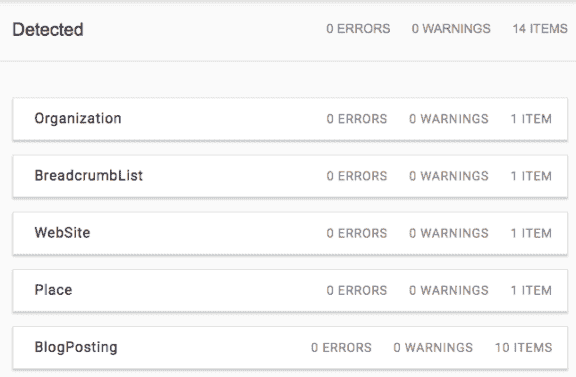
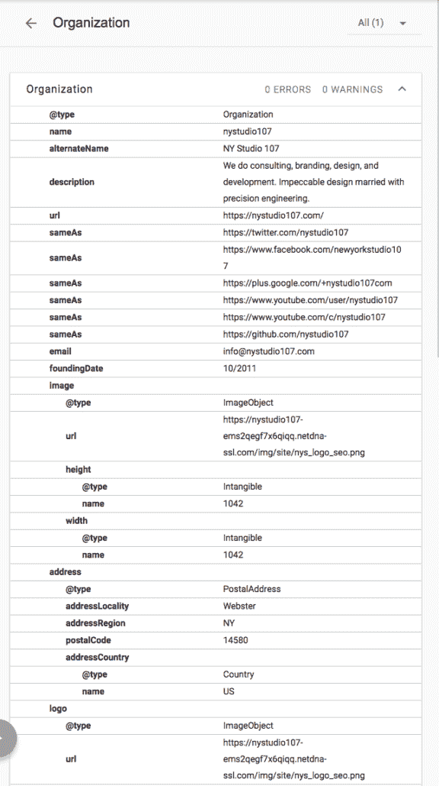
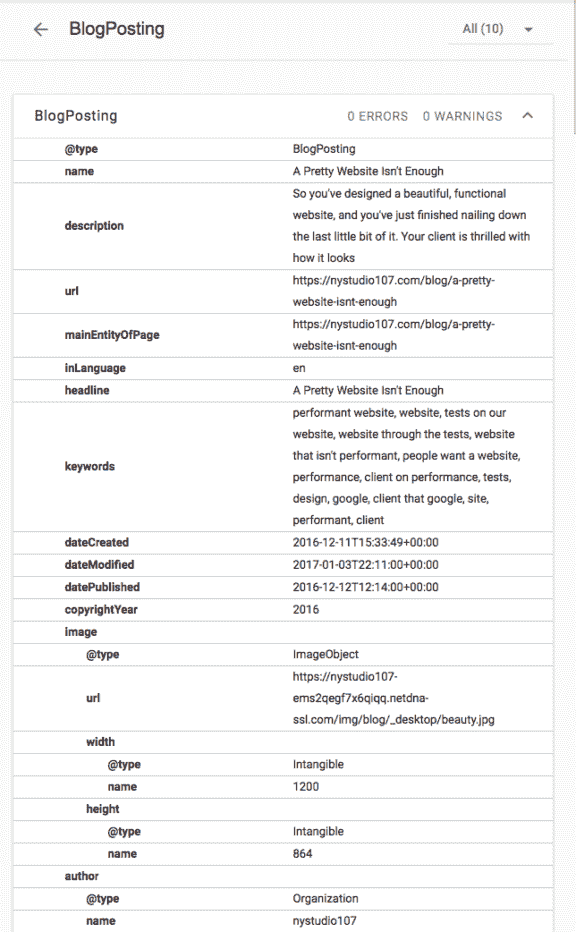
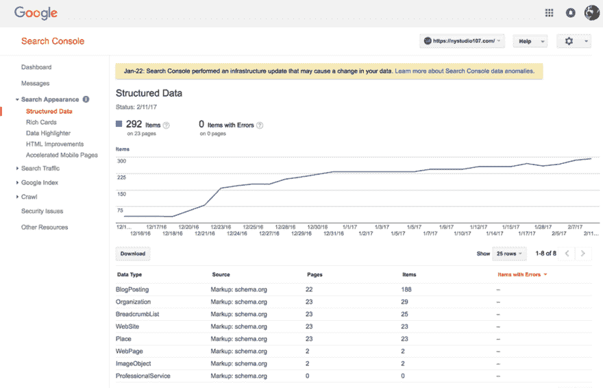
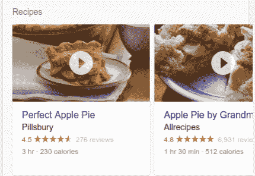
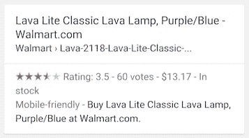
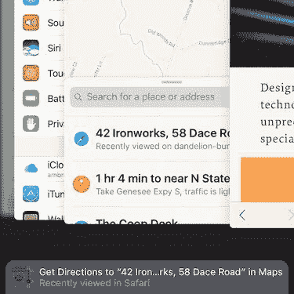

# 结构化数据和色情文学

> 原文:[https://dev . to/gaijinity/JSON-LD-structured-data-and-erotica-4 cid](https://dev.to/gaijinity/json-ld-structured-data-and-erotica-4cid)

# JSON-LD，结构化数据与情色

### JSON-LD 结构化数据对于“语义网”来说是一件大事谷歌关心它。苹果很在意。你也应该。

安德鲁·韦尔奇

[T2】](https://res.cloudinary.com/practicaldev/image/fetch/s--c5KaRMmb--/c_limit%2Cf_auto%2Cfl_progressive%2Cq_auto%2Cw_880/https://nystudio107-ems2qegf7x6qiqq.netdna-ssl.com/img/blog/_1200x675_crop_center-center_82_line/structured-data.jpg)

JSON-LD 结构化数据是一个我称之为野兽的东西。就像大学一样，许多人听说过它，但是没有人真正见过它*。*然而，这是非常真实的，将会是一件大事。

谷歌关心这件事。[苹果关心这个](https://developer.apple.com/library/prerelease/content/releasenotes/General/WhatsNewIniOS/Articles/iOS10.html#//apple_ref/doc/uid/TP40017084-DontLinkElementID_2)。本文将解释它是什么，以及为什么您也应该关心它。

过去，AltaVista 和雅虎都是搜索引擎的首选。然后谷歌出现了，把他们的大门给炸开了。

<aside>Google suc­ceed­ed because of one rea­son: it returned search results that peo­ple wanted.</aside>

所以谷歌非常擅长返回搜索结果；有几次我差点撒了谎。尽管谷歌很好，然而，有一件事是人类非常擅长的，而计算机却不擅长，这就是理解。

假设我的网页上有一行标题叫做**头像**。是因为电影《阿凡达》吗？是关于一个儿子的虚拟形象吗？还是完全是别的什么东西？

这是我们这些小宠物很容易就能解决的问题，但是电脑却很难解决。此外，理解事物之间的*关系*——例如这个虚拟形象是比尔·佩金斯的，他拥有销售这些产品的 Acme 公司——对计算机来说可能是一个挑战。

输入结构化数据。简而言之，这是一种以计算机可以理解的方式来表达这种内容和关系的方法。

<aside>Rather than hav­ing to parse a web­page and guess what it’s about, Struc­tured Data allows you to tell Google what it’s about.</aside>

但是在你能进行有意义的尼姆对话之前，你需要一种语言。在“狗”这个词有用之前，我们都需要就它所代表的空气振动的含义达成一致。

Schema .org 提供结构化数据语言。这是语义网上的一本字典，就像一本字典一样，读起来并不那么有趣。但是它非常有用。

Schema .org 定义了一个层次架构集，定义了各种对象和动作。例如，有一个[组织架构](http://schema.org/Organization)，它定义了关于组织的事情，包括组织的更多特定子类型。

这给了我们一个可以用来表达结构化数据的词汇。因此，我们可以告诉它，而不是 Google *猜测*某个特定的网页是关于某个特定的组织。我们可以告诉它更多的信息，而不仅仅是通过索引页面(可能会出错)，包括这个组织和其他附属组织之间的关系，它提供的销售产品，为它工作的人，等等。

## 给我看那个漂亮的结构化数据！

因此，要获得实际的考试示例，请查看彦俊撰写的 JSON-LD 结构化数据考试示例文章。以下是[一个公正的网站是不够的](https://dev.to/gaijinity/a-pretty-website-isn-8217-t-enough-1nbj-temp-slug-3932740)文章的内容:

[T2】](https://res.cloudinary.com/practicaldev/image/fetch/s--tNMBb3NE--/c_limit%2Cf_auto%2Cfl_progressive%2Cq_auto%2Cw_880/https://nystudio107-ems2qegf7x6qiqq.netdna-ssl.com/img/blog/_576x377_crop_center-center_100_line/structured-data-overview.png)

这基本上向我们展示了 Google 是如何解析和归纳这个网页上的结构化数据的。我们可以看到有一个`Organization`与这个网站关联，一个`BreadcumbList`的页面，一个`WebSite`本身的信息，一个`Place`，还有几个`BlogPosting`

让我们深入了解一下该网站所涉及的组织:

[T2】](https://res.cloudinary.com/practicaldev/image/fetch/s--PdIcKpJj--/c_limit%2Cf_auto%2Cfl_progressive%2Cq_auto%2Cw_880/https://nystudio107-ems2qegf7x6qiqq.netdna-ssl.com/img/blog/_576x1029_crop_center-center_100_line/structured-data-organization.png)

现在，我们都知道谷歌很聪明。但是看看我们在这里发送给谷歌的所有信息。我们让它知道所有与这个组织相同的社交媒体。

很可能谷歌可以自己解决其中的一些问题，但是我们明确地告诉它这个组织是关于什么的，以及与之相关的事情。然后，Google 可以将这些信息添加到它的[知识图表](https://www.google.com/intl/es419/insidesearch/features/search/knowledge.html)中，这样它就可以理解这个组织相关的上下文，以及它与其他事物(如社交媒体网站)之间的关系。

我们也告诉它“嘿，当你代表这个组织时，用这个图像作为标志。”我们给了它一个位置，还有很多其他有用的信息。我们甚至可以为它提供这个组织的运营时间，如何通过电话[到达不同的部门](https://developers.google.com/schemas/reference/types/ContactPoint)等等。

那是一些强大的东西。

你还会注意到页面上列出了十个`BlogPosting`。博客条目本身有一个`BlogPosting`,其他的是在页面底部列出的“最近的文章”。让我们来看看:

[T2】](https://res.cloudinary.com/practicaldev/image/fetch/s--Oj_Wpddk--/c_limit%2Cf_auto%2Cfl_progressive%2Cq_auto%2Cw_880/https://nystudio107-ems2qegf7x6qiqq.netdna-ssl.com/img/blog/_576x932_crop_center-center_100_line/structured-data-blog-posting.png)

再一次，我们可以看到一船有用的信息，我们告诉谷歌关于这个页面的实际内容。因为这个页面上列出了几个`BlogPosting`，所以`mainEntityOfPage`列出了这个`BlogPosting`是这个网页的主要内容的 URL。

<aside>Would­n’t you rather be able to tell Google what your web­site is about, instead of hav­ing it guess?</aside>

我们还可以看到文章的出版日期、标题、描述、关键词、我们希望与文章相关联的图片等等。谷歌可能会解决一些问题；它可能会出错。

除了使用[谷歌结构化数据测试工具](https://search.google.com/structured-data/testing-tool/u/0/)检查您的结构化数据的有效性，您还可以使用[谷歌搜索控制台](https://www.google.com/webmasters/tools/home)检查谷歌是如何收集您的结构化数据的:

[T2】](https://res.cloudinary.com/practicaldev/image/fetch/s--FMKiVWOw--/c_limit%2Cf_auto%2Cfl_progressive%2Cq_auto%2Cw_880/https://nystudio107-ems2qegf7x6qiqq.netdna-ssl.com/img/blog/_1200x772_crop_center-center_100_line/google-search-console.png)

在这里，您可以鸟瞰 Google 在您的网站上收集的所有结构化数据，以及检查错误等。在谷歌开始汇总你的结构化数据之前，有时需要一点时间，所以要有耐心。

## 那么……对 SEO 有帮助吗？

人们可能马上想到的一个问题是“哇，这对 SEO 有帮助吗？”答案是“不是真的撒谎。也许吧。这是机密。”

我会解释的。谷歌不希望看到糟糕的旧时代重演，粗略的搜索引擎优化公司试图通过“关键词填充”等方式来操纵系统。所以他们在如何利用网站提供的数据上采取了一种谨慎的方法。

所以谷歌对他们如何利用 JSON-LD 结构化数据作为页面排序算法的一部分守口如瓶。但是他们是聪明的人，他们会解决的。

使用结构化数据——在撰写本文时——不会直接影响你的搜索引擎结果页面(SERP) *排名*。然而，它被谷歌归纳为知识图，而且重要的是，它被用作 SERP 上的[富卡](https://developers.google.com/search/docs/guides/search-gallery)(又名“富剪宠物”又名“富结果”)。所以你的用户将会看到更丰富的体验……*，更愿意点击*。

这里有一些直接来自谷歌的[富人卡](https://developers.google.com/search/docs/guides/search-gallery)的例子:

[T2】](https://res.cloudinary.com/practicaldev/image/fetch/s--WHTjlgPs--/c_limit%2Cf_auto%2Cfl_progressive%2Cq_auto%2Cw_880/https://nystudio107-ems2qegf7x6qiqq.netdna-ssl.com/img/blog/_430x296_crop_center-center_line/search-gallery-pie.png)

[T2】](https://res.cloudinary.com/practicaldev/image/fetch/s--hmh3A-wq--/c_limit%2Cf_auto%2Cfl_progressive%2Cq_auto%2Cw_880/https://nystudio107-ems2qegf7x6qiqq.netdna-ssl.com/img/blog/_355x282_crop_center-center_line/search-gallery-events.png)

[T2】](https://res.cloudinary.com/practicaldev/image/fetch/s--INdOzYWx--/c_limit%2Cf_auto%2Cfl_progressive%2Cq_auto%2Cw_880/https://nystudio107-ems2qegf7x6qiqq.netdna-ssl.com/img/blog/_357x198_crop_center-center_line/search-gallery-products.png)

我想这有多复杂是显而易见的。同样明显的是，谷歌正在大力支持 JSON-LD 结构化数据；它将它列为结构化数据的首选格式。

所以我认为 JSON-LD 结构化数据很有可能最终会成为 SERP 的一个影响因素；谷歌已经暗示了这一点。

谷歌不是唯一一家；在 iOS 10 中，[苹果宣布](https://developer.apple.com/library/prerelease/content/releasenotes/General/WhatsNewIniOS/Articles/iOS10.html#//apple_ref/doc/uid/TP40017084-DontLinkElementID_2)它解析网页，寻找 JSON-LD 结构化数据。目前，他们只是在寻找地址信息，但他们已经明确表示，他们将在未来对此进行扩展。所以现在是上船的时候了！

[T2】](https://res.cloudinary.com/practicaldev/image/fetch/s--94L2_AwQ--/c_limit%2Cf_auto%2Cfl_progressive%2Cq_auto%2Cw_880/https://nystudio107-ems2qegf7x6qiqq.netdna-ssl.com/img/blog/_375x375_crop_center-center_line/apple-json-ld-support.jpg)

如果你看上面的图片，只有当你的网站有 JSON-LD 结构化数据并且上面有一个`postalAddress`的时候，你的网页上才会出现**的**链接。当你在应用程序之间切换时，它会出现，并且来自一个网页，上面有所说的`postalAddress` JSON-LD 结构化数据。

pretty complling 帮助那些刚刚浏览你的网站的人找到去你的商店的方向，这样他们就可以进来买东西了。

你可以在[现代搜索引擎优化:蛇油与物质](https://dev.to/gaijinity/modern-seo-snake-oil-vs-substance-4l5k-temp-slug-8632935)文章中阅读更多关于搜索引擎优化的内容。

## 那么这个 JSON-LD 是什么东西呢？

当我在 2015 年底为 [Craft CMS](https://craftcms.com/) 介绍中的[SEO mat IC plug g 时，它支持的开箱即用的东西之一是 JSON-LD 结构化数据。](https://nystudio107.com/plugins/seomatic)

<aside>Most peo­ple’s reac­tion was ​“JSON-wut?”</aside>

我们知道`JSON`是 JavaScript 对象标记，基本上是一种通过 JavaScript 以嵌套键/值对的形式传递数据的便捷方式。JSON-LD 的`LD`部分代表链接数据。因为 JSON-LD 背后的思想是，数据并不是一个孤岛；要有意义，它需要*链接*到其他数据。最初，这似乎与[谷歌知识图谱](https://www.google.com/intl/es419/insidesearch/features/search/knowledge.html)的概念非常相似。嗯……硬币信任？我觉得不是！

如果您想了解更多关于 JSON-LD 的信息，请查看视频[什么是 JSON-LD](https://www.youtube.com/watch?v=vioCbTo3C-4) ，它很好地概述了 JSON-LD，以及它的重要性。

结构化数据的概念已经存在了一段时间，它最早引起前端开发人员注意的一个实例是[微数据](https://en.wikipedia.org/wiki/Microdata_(HTML))。虽然有些人采用了它，但它从未真正起飞过。因为坦白说，很糟糕。

这里有一个取自 [Schema .org](http://schema.org/Organization) 网站的例子(记住，Schema .org 只是关于*词汇*，它不知道*实现*:

```
 WAAY is an affiliate of the ABC network and broadcasts in SD. 
```

所以在网页上的上述文本中添加微数据，你会得到这样一个结果:

```
 <div itemscope itemtype="http://schema.org/BroadcastService">
  <span itemprop="name">WAAY-TV</span>
  <span itemprop="broadcastDisplayName">ABC</span>
  <span itemprop="videoFormat">SD</span>
  <span itemprop="broadcastTimezone" content="-8:00">PST</span>
  <div itemprop="broadcastAffiliateOf" itemscope itemtype="http://schema.org/Organization">
    <span itemprop="name">ABC</span>
  </div>
</div> 
```

HTML 代码和微数据标记的这种结合使得它难以阅读，也难以使用，因为微数据需要在一个特殊的层次结构中。移动 HTML，你可能会破坏它。

有时你也会被迫在不需要的地方添加一些奇怪的结构性的东西，比如`<div>`，只是为了给微观数据提供层次结构。这也迫使做 SEO 工作的人和写 HTML 的人一样，但这种情况很少发生。由于它是如何与 HTML 代码交织在一起的，所以很难自动匹配它的代阿尔。

输入 [JSON-LD](http://json-ld.org/) 。下面是相同的 Schema .org 结构化数据，但是采用 JSON-LD 格式:

```
 <script type="application/ld+json">
{
  "@context":"http://schema.org",
  "@type":"BroadcastService",
  "name":"WAAY-TV",
  "broadcastDisplayName":"ABC",
  "videoFormat":"SD",
  "broadcastTimezone": "-8:00",
  "broadcastAffiliateOf":{
    "@type":"Organization",
    "name":"ABC"
  }
}
</script> 
```

啊啊啊啊。干净多了。并且它完全独立于 HTML 标记，所以我们可以自动匹配它的创建，并且编辑 SEO 的人可以不同于编辑 HTML 的人。

[T2】](https://res.cloudinary.com/practicaldev/image/fetch/s--bgthtnm7--/c_limit%2Cf_auto%2Cfl_progressive%2Cq_auto%2Cw_880/https://nystudio107-ems2qegf7x6qiqq.netdna-ssl.com/img/blog/_1200x675_crop_center-center_82_line/breath-of-fresh-air.jpg)

需要注意的重要一点是，这与微型数据示例完全相同。这就像手写和在键盘上打字的区别:文字是一样的，但其中一个更有效、更有用(时尚人士，请不要给我发恐吓信)。

敏锐的读者会注意到`<script type="application/ld+json">`标签。最酷的是浏览器完全忽略了这一点。当解析一个 HTML 页面时，眉毛 er 看到这个`<script>`属于`application/ld+json`类型，就忽略了它(它甚至可以在 [Lynx](http://lynx.browser.org/) 中工作！).但是谷歌没有忽视它。

JSON-id for mat 对计算机来说也很容易使用，而不必做诸如为微数据属性解析 DOM 之类的麻烦事。对于 mat 来说，很难得到令人兴奋的数据，但是 JSON-LD 非常接近，特别是对于那些通过在他们的网页上实现微数据而受益的人。

## 把乒包起来

希望这能让您了解什么是 JSON-LD 结构化数据，以及为什么它很重要。有谷歌和苹果这样的行业巨头在背后支持——因为它满足了一个明显的需求——我认为这将是一件非常重要的事情。

作为开发人员和设计人员，我们花了大量的时间来确保我们制作的网站看起来不错，并且容易被人理解。JSON-LD 结构化数据帮助我们使这些相同的网站更容易被搜索引擎理解。

当您将 JSON-LD 结构化数据的概念与客户联系起来时，您可以使用这些东西:为搜索引擎优化您的网站。如果没有人能找到，世界上最好的网站也就没有意义了。

是的，向客户的网站添加 JSON-LD 结构化数据应该收取更多费用。这份工作很适合你，你在为你的客户做尖端的工作。

用 JSON-LD 结构化数据丰富您的网站吧！

## 嘿，等等……情色杂志在哪里？

点击 bait。

## 进一步阅读

如果你想获得新文章的通知，请在 Twitter 上关注[纽约时报 107](https://twitter.com/nystudio107) 。

版权所有 2020 nystudio107。由 nystudio107 设计