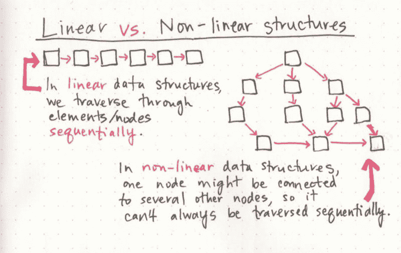
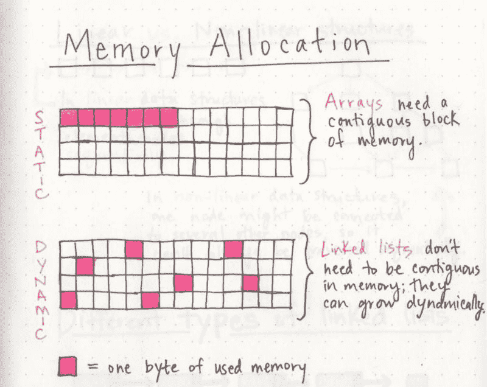
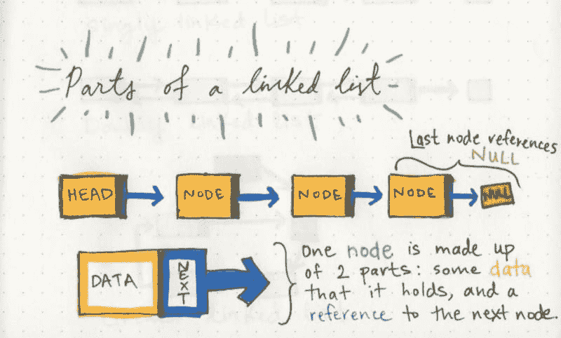
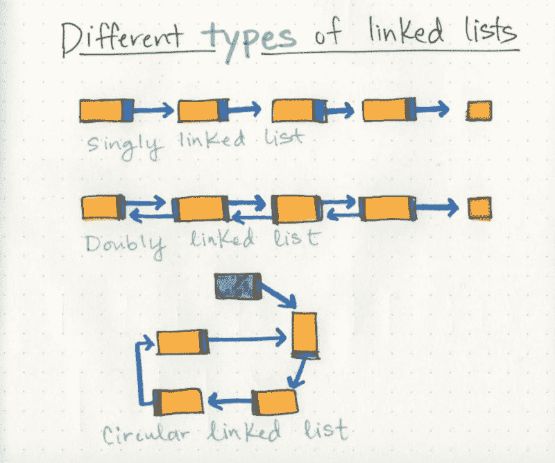

# 到底什么是链表？[第一部分]

> 原文：<https://dev.to/vaidehijoshi/whats-a-linked-list-anyway>

信息无处不在。

在软件世界中，我们选择的组织信息的方法是成功的一半。事情是这样的:解决一个问题有太多的方法。当谈到组织我们的数据时，有许多工具可以胜任这项工作。诀窍在于知道哪种工具是适合 T2 使用的。

不管我们开始用哪种语言编码，我们首先遇到的事情之一是**数据结构**，这是我们可以组织数据的不同方式；*变量*、*数组*、、*哈希、*和*对象*都是数据结构的类型。但是对于数据结构来说，这些仍然只是冰山一角；还有很多，其中一些听得越多就越复杂。

对我来说，那些复杂的事情之一就是**链表**。我知道链表已经有几年了，但是我从来没有把它们清楚地记在脑子里。我只有在准备技术面试的时候(或者有时候，在面试过程中)，有人问我这些问题的时候，才会真正想到它们。我会做一些研究，并认为我明白它们是关于什么的，但是几个星期后，我又忘记了。整个事情是相当低效的，这一切都源于我知道他们的存在，但我并没有从根本上*了解*他们！所以，是时候改变这种情况并回答这个问题了:到底什么是链表？

### 线性数据结构

如果我们真的想理解链表的基础知识，我们谈论它们是什么类型的数据结构是很重要的。

链表的一个特点是它们是**线性数据结构**，这意味着它们的构造和遍历是有顺序的。我们可以把线性数据结构想象成[跳房子游戏](http://bit.ly/2jBBcxc):为了到达列表的末尾，我们必须按顺序遍历列表中的所有条目，或者按顺序*。然而，线性结构与非线性结构相反。在**非线性数据结构**中，条目不必按顺序排列，这意味着我们可以不按顺序遍历数据结构*。**

 **[T2】](https://res.cloudinary.com/practicaldev/image/fetch/s--VF9pWdbu--/c_limit%2Cf_auto%2Cfl_progressive%2Cq_auto%2Cw_880/https://cdn-images-1.medium.com/max/800/1%2AXokk6XOjWyIGCBujkJsCzQ.jpeg)

我们可能并不总是意识到这一点，但是我们每天都在使用线性和非线性数据结构！当我们将数据组织成*散列*(有时称为*字典*)时，我们正在实现一个非线性数据结构。*树*和*图*也是我们以不同方式遍历的非线性数据结构，但我们将在今年晚些时候更深入地讨论它们。

类似地，当我们在代码中使用*数组*时，我们实现了一个线性数据结构！把数组和链表想象成我们排序数据的相似方式是很有帮助的。在这两种结构中， ***顺序关系到*** 。但是是什么让数组和链表不同呢？

### 内存管理

数组和链表最大的区别在于它们使用内存的方式。我们这些使用动态类型语言(如 Ruby、JavaScript 或 Python)的人在日常编写代码时不必考虑数组使用了多少内存，因为有几个抽象层最终使我们完全不必担心内存分配。

但是这并不意味着内存分配没有发生！抽象不是魔术，它只是隐藏你不需要一直看到或处理的东西的简单性。即使我们在编写代码时不必考虑内存分配，但如果我们想真正理解链表中发生了什么以及是什么使它如此强大，我们必须深入到最基本的层面。

我们已经学习了二进制以及数据如何被分解成比特和字节。就像字符、数字、单词、句子需要几个字节的内存来表示一样，数据结构也是如此。

当一个**数组**被创建时，它需要一定量的内存。如果我们需要在一个数组中存储 7 个字母，我们需要 7 个字节的内存来表示这个数组。但是，我们需要将所有的*内存放在一个连续的块*中。也就是说，我们的计算机需要找到 7 个字节的空闲内存，一个字节挨着一个字节，一起放在一个地方。

另一方面，当一个**链表**诞生时，它不需要 7 字节的内存都在一个地方。一个字节可以存储在某个地方，而下一个字节可以完全存储在内存中的另一个地方！链表不需要占用一个内存块；相反，他们使用*的内存可以分散在整个*中。

[T2】](https://res.cloudinary.com/practicaldev/image/fetch/s--QrbrzYSW--/c_limit%2Cf_auto%2Cfl_progressive%2Cq_auto%2Cw_880/https://cdn-images-1.medium.com/max/800/1%2AG43FVT5xJ1n1QDKVNZUxXQ.jpeg)

数组和链表的根本区别在于，数组是静态数据结构，而链表是动态数据结构。静态数据结构需要在创建时分配其所有资源；这意味着，即使这个结构在大小上增长或收缩，元素被添加或删除，它仍然*总是需要给定大小和数量的内存。*如果需要向一个静态数据结构添加更多的元素，而它没有足够的内存，那么你需要复制该数组的数据，然后用更多的内存重新创建它，这样你就可以向它添加元素。

另一方面，动态数据结构可以在内存中收缩和增长。它不需要分配一定数量的内存才能存在，它的大小和形状可以改变，它需要的内存量也可以改变。

到目前为止，我们已经开始看到数组和链表之间的一些主要区别。但是这回避了一个问题:*是什么允许一个链表把它的内存分散在各处？*要回答这个问题，我们需要看看链表的构造方式。

### 链表的组成部分

一个链表可以很小也可以很大，但是不管大小如何，组成它的部分实际上是相当简单的。一个链表由一系列的**节点**组成，这些节点是链表的元素。

列表的起点是对第一个节点的引用，它被称为**头**。几乎所有的链表都必须有一个头，因为这实际上是链表及其所有元素的唯一入口点，没有它，你就不知道从哪里开始！列表的结尾不是一个节点，而是一个指向 **null** 或空值的节点。

[T2】](https://res.cloudinary.com/practicaldev/image/fetch/s--35VFWAQr--/c_limit%2Cf_auto%2Cfl_progressive%2Cq_auto%2Cw_880/https://cdn-images-1.medium.com/max/800/1%2AK0_eV07tJtKQSVGKfP18bw.jpeg)

单个节点也非常简单。它只有两部分:**数据**，或者节点包含的信息，以及对**下一个节点**的引用。

如果我们能理解这一点，那我们就成功了一半。节点的工作方式非常重要，非常强大，可以总结为:

> 节点只知道它包含什么数据，以及它的邻居是谁。

单个节点不知道链表有多长，甚至不一定知道它在哪里开始，或者在哪里结束。一个节点所关心的只是它所包含的数据，以及它的指针所指向的节点——列表中的下一个节点。

这就是为什么链表不需要连续内存块的原因。因为单个节点有“地址”或对下一个节点的引用，所以它们不需要像数组中的元素那样相邻。相反，我们可以依赖这样一个事实，即我们可以通过依靠指向下一个节点的指针引用来遍历我们的列表，这意味着我们的机器不需要为了表示我们的列表而封锁一个单独的内存块。

这也解释了为什么链表可以在程序执行过程中动态地增长和收缩。用链表添加或删除一个节点变得像重新排列一些指针一样简单，而不是复制一个数组的元素！然而，链表也有一些缺点，我现在还没有提到——但下周会有更多的介绍。

现在，我们将沉浸在链表有多酷的荣耀中！

### 列出所有形状和尺寸

尽管链表的各个部分不会改变，但是我们构造链表的方式*可以*完全不同。像软件中的大多数东西一样，根据我们试图解决的问题，一种类型的链表可能比另一种更适合。

***单链表*** 单链表是最简单的一种链表，仅仅基于它们只往一个方向走的事实。有一个**单曲**，我们可以在里面遍历列表；我们从**头**节点开始，从根节点开始遍历，直到**最后一个**节点，该节点将以空的 **null** 值结束。

但是就像一个节点可以引用它后面的邻居节点一样，它也可以有一个指向它前面的节点的引用指针！这就是我们所说的 ***双向链表*** ，因为每个节点内包含有**两个引用**:一个引用**的下一个**节点，以及**的前一个**节点。如果我们希望不仅能够在单个轨道或方向上遍历我们的数据结构，而且还能够向后遍历，这可能是有帮助的。

例如，如果我们希望能够在一个节点和前一个节点之间跳转，而不必回到列表的最开始*，那么双向链表将是比单向链表更好的数据结构。然而，一切都需要空间和内存，所以如果我们的节点必须存储两个引用指针，而不是一个，这将是另一个需要考虑的事情。*

[T2】](https://res.cloudinary.com/practicaldev/image/fetch/s--iGOin0NF--/c_limit%2Cf_auto%2Cfl_progressive%2Cq_auto%2Cw_880/https://cdn-images-1.medium.com/max/800/1%2AAeMDLFUjR0w0J4n8CP4H6g.jpeg)

一个 ***循环链表*** 有点奇怪，因为它不以一个指向空值的节点结束。而是有一个节点作为列表的*尾*(而不是常规的头节点)，尾节点之后的节点是列表的开头。这种组织结构使得向列表末尾添加内容变得非常容易，因为您可以从 **tail** 节点开始遍历它，因为第一个元素和最后一个元素相互指向对方。循环链表会变得非常疯狂，因为我们可以把一个单向链表和一个双向链表*变成一个循环链表！*

但是不管链表有多复杂，如果我们能记住节点的基本原理，它是如何工作的，以及链表中不同的指针引用是如何构造的，那么就没有我们不能处理的链表了！

下周，在本系列的第 2 部分中，我们将深入研究链表的时空复杂性，以及它们与数组的比较。我保证这实际上比听起来有趣多了！

### 资源

如果你认为链表非常酷，看看这些有用的资源。

1.  [数组和链表的区别](http://www.necessaryandsufficient.net/2008/05/differences-between-arrays-and-linked-lists/)，Damien Wintour
2.  数据结构:数组与链表
3.  [链表:基础知识](https://people.engr.ncsu.edu/efg/210/s99/Notes/LinkedList.1.html)，爱德华·格林格博士
4.  [链表介绍](https://www.cs.cmu.edu/~adamchik/15-121/lectures/Linked%20Lists/linked%20lists.html)，Victor Adamchik 博士
5.  [数据结构&实现](http://faculty.cs.tamu.edu/welch/teaching/211.s03/lnotes1.pdf)，詹妮弗·韦尔奇博士
6.  [静态数据结构与动态数据结构](http://www.ayomaonline.com/academic/static-vs-dynamic-data-structures/)，Ayoma Gayan Wijethunga**